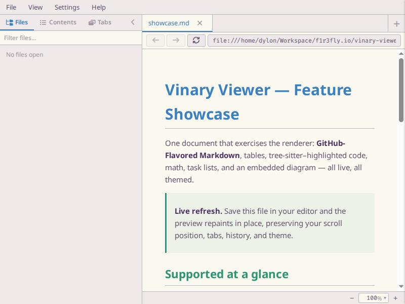
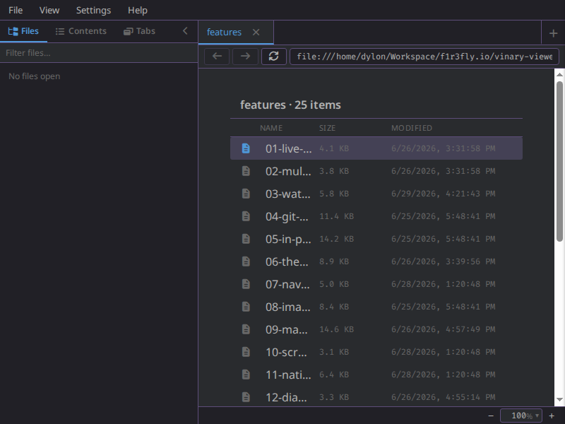
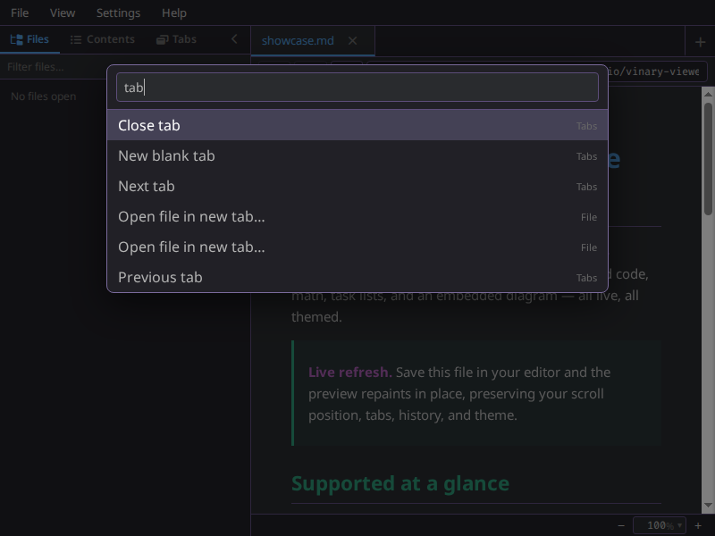
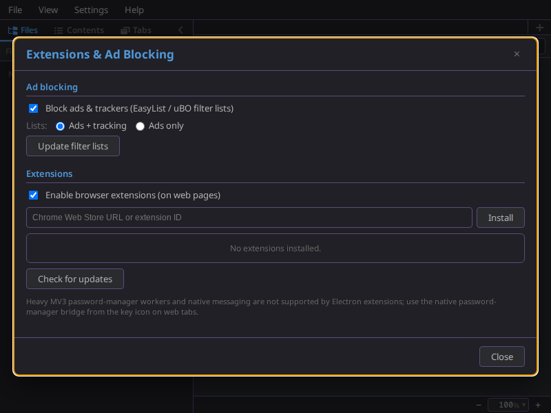

# Vinary Viewer

**A reactive desktop previewer for Github-Flavored Markdown files and related
repository resources (diagrams, source code, configuration files, HTML links,
etc.).** Have you desired to preview your Markdown documents as they would appear
on Github and been disheartened by the lack of decent tooling? I have many
times, so I created Vinary Viewer to fill that gap.

The architecture has been heavily influenced by [Lightning
Bug](https://github.com/F1R3FLY-io/lightning-bug), my reactive, embeddable
source code editor with LSP integration and native Tree-Sitter support (the core
of a web-based IDE). However, Vinary Viewer is intended to be just a previewer
and not a full-featured IDE or web browser. It should support everything you
need to preview the documents and links in your repository and is intended to be
used as a sibling tool to an editor so you can preview your changes in a
live-coding environment (i.e. document previews automatically refresh as their
sources are edited). It has a simple, functional, and clean design (minimalist
aesthetics), a responsive feel, and will never become laden with extraneous or
heavy features.

Ad blocking is supported by default (this is a documentation previewer, not a
revenue generator), and there is experimental support for scoped Chrome
extensions. Password-manager integration is handled by a native CLI bridge
instead of relying on heavyweight browser extensions. Vinary Viewer is not and
never will be intended to be used as a full-featured web browser but it must
support web browsing to cover the most common forms documentation.

Vinary Viewer has been built, from the ground up, by an engineer for engineers!

> Status: `0.3.0-dev`. A standalone ClojureScript / re-frame / Electron application
> (the v0.2 rewrite, now extended with a common document IR, bounded-memory streaming,
> a terminal previewer, Org / LaTeX / diff rendering, and remote files over SSH). The
> old v0.1.0 vmd-patching tool is preserved at git tag **`v0.1.0`**.

## What It Is

Vinary Viewer is a local-first desktop previewer for repository work. Open a
Markdown file, image, PDF, source file, or web link; keep editing in your normal
editor; the preview updates while preserving navigation, tabs, scroll position,
theme, and keybinding state.

Key terms used in this project:

- **Main process**: the Electron process that owns file IO, dialogs, clipboard,
  native PDF and web views, configuration files, and file watchers.
- **Renderer process**: the Chromium process that owns the re-frame UI,
  Markdown rendering, source previews, table-of-contents state, find, tabs, and
  keyboard interaction.
- **Retained file**: a local file still reachable from at least one open tab
  history. Retained files stay watched and cached; unreachable files are evicted.
- **Content cache**: the bounded DataScript store for loaded document content.
  Browser-like tabs and their history stacks live in re-frame `app-db`.

## Screenshots

<!-- These 800x600 PNGs are generated headlessly by `npm run screenshots`
     (scripts/screenshots.cjs). Regenerate them whenever the UI changes. -->

|  |  |
|---|---|
| <br>*GitHub-Flavored Markdown — tables, highlighted code, math, diagrams* | <br>*The same document in the light theme* |
| <br>*Read-only source view with tree-sitter highlighting* | <br>*Sidebar git file tree with live filtering* |
| <br>*PDFs render in-app via pdf.js, with a bookmarked outline* | <br>*Browse folders in-pane* |
| <br>*Fuzzy command palette* | <br>*Multiple documents, one tab each* |
| <br>*Follow HTTP links in an in-app web view* | <br>*Ad-blocking and scoped browser extensions* |

More previews — office documents, spreadsheets/CSV, logs, and archives — appear in
[Content previews](docs/features/25-content-previews.md). Every feature page under
[`docs/features/`](docs/features/README.md) opens with its own screenshot.

## Quick Start

Requirements: Node.js with `npm`/`npx`, a JDK for `shadow-cljs`, and Electron's
usual Linux desktop runtime dependencies.

```bash
./install.sh

vv README.md                 # open in the desktop GUI (one tab per file/URL) — the default
vv --cli README.md | less    # render to the terminal (one-shot, pipe-friendly)
vv --tui README.md           # page interactively in the terminal (/ find · t contents · q quit)
vv --help
```

`vv` is **one command with three modes**: the desktop GUI (default; `--gui` is an accepted no-op),
`--cli` for a one-shot terminal render, and `--tui` for an interactive terminal viewer.
`./install.sh` runs `npm install`, builds the GUI **and the terminal tools**, and installs the single
`vinary-viewer`/`vv` launcher into `~/.local/bin` by default. Override the launcher directory with
`BIN=/path/to/bin ./install.sh`. Remove the launcher with `./uninstall.sh`.

For development without installing launchers:

```bash
npm run dev
```

## Feature Map

| Area             | Current behavior                                                                                                                                                                   |
|------------------|------------------------------------------------------------------------------------------------------------------------------------------------------------------------------------|
| Markdown         | GitHub-Flavored Markdown through unified/remark/rehype, slugged headings, code highlighting, MathJax SVG math, inline Mermaid diagrams, source-position annotations, relative link/image resolution, and cached TOC metadata. |
| Org & LaTeX      | `.org` renders through the common IR via uniorg (front matter, export blocks, task lists, math, nested `#+begin_src` highlighting); `.tex` renders via unified-latex (sections, tables, auto-scaled figures, macros), with a Document↔PDF switch beside a same-stem exported PDF. |
| Diffs & patches  | `.diff` / `.patch` render as a colored unified diff (GUI HTML + terminal ANSI) plus a GUI-only side-by-side split enriched from the on-disk pre/post files; standard repo filetypes classify correctly. |
| Live refresh     | Local files are watched with `chokidar`; saved content flows back into the renderer without replacing UI state.                                                                    |
| Navigation       | Browser-like tabs with per-tab Back/Forward history, saved scroll positions, a URI bar, link hover status, and `Alt+Left` / `Alt+Right` plus mouse thumb buttons.                  |
| Embedded figures | SVG diagrams and other images embedded in Markdown are previewed in-place; local SVGs are measured and sized so diagram text matches the document font.                            |
| PDFs and images  | PDFs render **in the renderer** via pdf.js (canvas + text/link layers, outline-driven TOC, in-page find, zoom/fit/invert); images open in a focused image preview. (The old main-owned native PDF view was retired in ADR-0013.) |
| Source files     | Source files open in a read-only CodeMirror 6 view, with tree-sitter highlighting from bundled/user grammars and filename/pattern filetype mappings such as `Cargo.lock` → TOML.    |
| Web links        | HTTP and HTTPS links can open in an in-app web view whose heading outline feeds the same Contents panel model.                                                                     |
| Remote files     | `ssh://` / `sftp://` open remote files and directories through the same renderers, streaming, paging, and refresh as local paths, using `~/.ssh/config`, agent/key/keyboard-interactive auth, and known-hosts trust-on-first-use; live-refresh is opt-in polling. Secrets stay in the main process. |
| Terminal         | `vv --cli <file>` renders once to stdout (pipe-friendly ANSI + kitty/sixel graphics); `vv --tui <file>` is an interactive full-screen pager — a second renderer over the same common-IR / streaming spine as the GUI. |
| Passwords        | Web-view login forms can be filled and saved through main-process provider CLIs for 1Password, LastPass, optional Bitwarden/Proton Pass, and restricted JSON adapters.             |
| Sidebar          | Files and Contents panels provide a multi-project tree, filtering, tab mirroring, and Markdown/HTML scroll-spy outlines.                                                           |
| Keybindings      | Built-in default, vim, and emacs keymap sets; a visual keybinding editor; live switching; command palette integration; persisted user config.                                      |
| Preferences      | Live theme switching, variable/fixed font settings, and persisted user preferences under `~/.config/vinary-viewer/`.                                                               |

## Core Workflows

Open one file in the active tab:

```bash
vv path/to/document.md
```

Open several files from the app with `File > Open`; one selected file navigates
the active tab, and multiple selected files open one tab each. In Markdown
previews, left-click local links to navigate the active tab and `Ctrl+click` to
open a new tab. Back/Forward restores both the document and the scroll position
saved for that history entry.

Custom keybindings are managed from `Settings > Key Bindings`. The persisted
file is EDN:

```clojure
{:active "default"
 :order ["default" "vim" "emacs"]
 :sets {}}
```

The editor normally writes this file for you; hand-edited EDN is also read on
startup and live-reloaded.

## Architecture At A Glance

The app has **five** shadow-cljs builds from one source tree:

- `:main`: Electron main process code under `src/vinary/main`.
- `:renderer`: Chromium renderer code under `src/vinary/renderer`,
  `src/vinary/ui`, `src/vinary/app`, and `src/vinary/input`.
- `:cli` and `:tui`: the terminal previewers (`vv --cli` / `vv --tui`) under
  `src/vinary/cli`, `src/vinary/tui`, and `src/vinary/terminal` — a second renderer
  over the shared `src/vinary/ir` and `src/vinary/stream` core.
- `:test`: the DOM-free ClojureScript unit-test build.

The only renderer-to-main boundary is the `window.vv` mediator exposed by
`contextBridge`; payloads are plain JavaScript data or EDN text. The renderer
does not get direct filesystem access.


*Diagram source: [`docs/diagrams/component-content-retention.puml`](docs/diagrams/component-content-retention.puml).*

The key invariant is separation of concerns:

- `app-db` owns tabs, tab history, active UI state, preferences, command state,
  and transient interaction state.
- DataScript owns only bounded content entities such as `:doc/html`,
  `:doc/toc`, `:doc/assets`, `:doc/text`, and `:doc/error`.
- Main owns file watchers and media watchers, and releases them when the
  renderer sends the updated retained-file set.

This is why live refresh can repaint content without discarding scroll position,
history, keybindings, or other UI state.

## Configuration Files

All user configuration lives under `~/.config/vinary-viewer/`:

| Path                             | Purpose                                                                |
|----------------------------------|------------------------------------------------------------------------|
| `settings.edn`                   | Theme and font preferences managed by the Preferences dialog.          |
| `keybindings.edn`                | Active keymap set, custom keymap order, and custom keymap definitions. |
| `filetypes.edn`                  | Optional filename/pattern mappings to source grammar ids.              |
| `grammars/<lang>/grammar.wasm`   | Optional tree-sitter grammar for a source language.                    |
| `grammars/<lang>/highlights.scm` | Optional tree-sitter highlight query for that grammar.                 |

Do not commit local config files, generated grammar WASM files, compiled output,
or personal launcher paths.

## Development Commands

| Command                  | Purpose                                                                |
|--------------------------|------------------------------------------------------------------------|
| `npm run compile`        | Compile the Electron `main` + `renderer` builds (syncs assets + pdf.js first). |
| `npm run watch`          | Watch and rebuild both GUI builds during development.                  |
| `npm run dev`            | Compile, then launch Electron against the workspace.                   |
| `npm run start`          | Launch Electron against already compiled output.                       |
| `npm run release`        | Produce release builds with the configured `:simple` optimizations.    |
| `npm run compile:cli` / `release:cli` | Build the `vv --cli` terminal renderer → `dist/cli/vv-cli.js`. |
| `npm run compile:tui` / `release:tui` | Build the `vv --tui` terminal renderer → `dist/tui/vv-tui.js`. |
| `npm test`               | Compile + run the CLJS unit build, then the ssh-config / ssh-transport / content-service / git-tree / cli / tui smokes. |
| `npm run test:cli` / `test:tui` | Run the terminal CLI / TUI smoke harnesses.                    |
| `npm run test:electron` / `test:electron:release` | Run the Electron smoke against the dev / `:simple` release build. |
| `npm run test:extensions` / `test:extensions:sandbox` | Run the scoped-extension smoke.             |
| `node test/lint.js`      | Parse-check JavaScript, verify CSS braces, and verify `--vv-*` theme variables. |
| `npm run assets:sync` / `assets:check` | Vendor / verify Font Awesome + self-hosted fonts against `assets.lock.json`. |
| `npm run pdfjs:sync` / `pdfjs:check` | Vendor / verify the pdf.js worker + data against `pdfjs.lock.json`. |
| `npm run grammars:sync` / `grammars:check` | Vendor / validate the tree-sitter grammars against `grammars.lock.json`. |
| `npm run graphics:sync`  | Vendor the terminal-graphics (sixel / resvg) WASM.                     |
| `npm run screenshots`    | Regenerate the 800×600 UI screenshots headlessly (xvfb + ImageMagick). |

For validation work, capture command output to a temporary log, inspect it, and
remove the log after use.

## Project Layout

| Path                  | Role                                                                                        |
|-----------------------|---------------------------------------------------------------------------------------------|
| `src/vinary/main`     | Electron main process services: IO, dialogs, config, PDF/web views, watchers, grammars.     |
| `src/vinary/renderer` | Renderer-side document transforms, scrolling, media helpers, syntax highlighting, find.     |
| `src/vinary/ui`       | Reagent/re-frame UI components and views.                                                   |
| `src/vinary/app`      | App-db defaults, navigation, commands, events, effects, subscriptions, DataScript helpers.  |
| `src/vinary/input`    | Keymap registry, resolver logic, presets, editor events, key normalization.                 |
| `src/vinary/ir`       | The common document IR: node/semiring/transducer/WPDA core, per-format front-ends, HTML + ANSI back-ends, and the single sanitizer. |
| `src/vinary/stream`   | The bounded-memory streaming pipeline: the `feed`/`finish` protocol, credit-1 transport, idle scheduler, and append sink. |
| `src/vinary/terminal`, `cli`, `tui` | The terminal previewer — ANSI/graphics/caps support, the `vv --cli` one-shot renderer, and the `vv --tui` interactive pager. |
| `src/vinary/diff.cljs`, `grammar_catalog.cljs` | The pure unified/split diff model, and the compile-time bundled-grammar catalog. |
| `resources/`          | Runtime preload files, static browser assets, styles, generated JS output.                  |
| `test/`               | ClojureScript unit tests, JavaScript lint + smoke harnesses, and Electron smoke tests.       |
| `docs/`               | Usage, feature, theory, architecture, engineering, scientific, security, reference, ADR, and PlantUML documentation. |

## Documentation

The full documentation suite starts at [`docs/README.md`](docs/README.md). Useful
entry points:

- [`docs/usage/01-getting-started.md`](docs/usage/01-getting-started.md) for
  first-run usage.
- [`docs/architecture/01-overview.md`](docs/architecture/01-overview.md) for the
  process and state model, and
  [`docs/architecture/07-common-ir-streaming-and-terminal.md`](docs/architecture/07-common-ir-streaming-and-terminal.md)
  for the IR / streaming / terminal realization.
- [`docs/engineering/00-overview.md`](docs/engineering/00-overview.md) for the build,
  test, release, and contribution workflow; and
  [`docs/scientific/00-overview.md`](docs/scientific/00-overview.md) for the
  verification methodology (byte-parity, bounded memory, the recorded experiments).
- [`docs/design-decisions/README.md`](docs/design-decisions/README.md) for the
  ADR log, including bounded content retention in ADR-0010.
- [`docs/security/threat-model.md`](docs/security/threat-model.md) for trust
  boundaries and Electron hardening notes.
- [`docs/diagrams/README.md`](docs/diagrams/README.md) for the PlantUML diagram
  catalog and shared color theme.

## Security Model

Treat local files, external links, rendered Markdown, SVGs, user grammars, and
diagram assets as trust boundaries. The renderer runs with `nodeIntegration`
disabled and accesses privileged operations only through the `window.vv`
mediator. Keep new filesystem access in the main process, keep renderer payloads
plain data, and update [`docs/security/threat-model.md`](docs/security/threat-model.md)
when a new boundary or IPC capability is added.

## Attribution And License

Vinary Viewer is Apache-2.0 software by Vinary Tree.

The application builds on Electron, React, Reagent, re-frame, re-com,
DataScript, unified/remark/rehype, CodeMirror 6, web-tree-sitter, chokidar, and
the MathJax/Mermaid/source toolchains used by user workflows. Those projects
retain their own licenses. The Spacemacs color palette is used by value. See
[`NOTICE`](NOTICE).
