# 5 — Theming

`vinary-viewer` separates **structure** from **color**. `src/style.css` is purely structural: it lays
out the sidebar, find bar, tables, image view, etc., and refers to colors only through CSS custom
properties named `--vv-*`. A **theme** is a small file that defines those variables in `:root`. Adding or
switching a theme therefore never touches layout, and the [lint](#completeness-guarantee) guarantees no
theme can leave a variable undefined.



## The `--vv-*` palette

Every theme defines exactly these 26 variables. The "used by" column names where each one shows up.

| Variable | Role | Used by (examples) |
| --- | --- | --- |
| `--vv-bg1` | page / main background | body, page, current-tab panel |
| `--vv-bg2` | panels, `<pre>`, table zebra | sidebar, find bar, tabs, code blocks |
| `--vv-bg-code` | inline-code background; hover | `code`, tree/TOC hover, focused filter |
| `--vv-bg-quote` | blockquote background | `blockquote` |
| `--vv-fg` | base foreground | body text, tree links, table cells |
| `--vv-fg-dim` | muted foreground | `h6`, inactive tab, placeholders, folder marker |
| `--vv-fg-strong` | text on an accent background | current tree/TOC item, `::selection` |
| `--vv-fg-inverse` | dark text on a bright background | active find match |
| `--vv-border` | rules, borders, header underlines | header underline, `hr`, `pre`, table, panel edges |
| `--vv-highlight` | selection / current item | `::selection`, `a.vmd-current`, `a.vmd-toc-current` |
| `--vv-disabled` | disabled control text | disabled Contents tab |
| `--vv-head1` | primary accent (blue) | `h1`, links, keyword, active tab/hover |
| `--vv-head2` | secondary accent (green) | `h2`, blockquote rule, strings |
| `--vv-head3` | tertiary accent (green) | `h3`, diff addition |
| `--vv-head4` | quaternary accent (yellow) | `h4`, inline code |
| `--vv-meta` | meta accent (tan) | `h5`, folders, find count, code meta |
| `--vv-const` | constants / strong emphasis | `strong`, numbers, literals |
| `--vv-func` | functions / names | function & tag names |
| `--vv-em` | emphasis | `em` |
| `--vv-var` | variables / types | variables, types |
| `--vv-comment` | comments | code comments |
| `--vv-error` | errors / deletion | diff deletion |
| `--vv-code` | code-block default text | `pre code`, `.hljs` |
| `--vv-find-hit-bg` | every find match (background) | `mark.vmd-find-mark` |
| `--vv-find-hit-fg` | find match text | `mark.vmd-find-mark` |
| `--vv-find-active-bg` | current find match (background) | `mark.vmd-find-active` |

The header comment of `src/style.css` carries the same list, grouped, as an in-source reference.

## Selecting a theme

`sidebar.js`'s `injectTheme()` resolves the active theme name in this order (first match wins):

1. the **`VV_THEME`** environment variable,
2. the file **`~/.config/vinary-viewer/theme`** (its first line, a bare name),
3. the default, **`spacemacs-dark`**.

It then reads `themes/<name>.css` (relative to its own install directory) and injects it as
`<style id="vv-theme">` at the **top of `<head>`**, so the variables are defined before first paint. An
unknown name falls back to `spacemacs-dark`. A theme name must be a bare slug (`[A-Za-z0-9_-]+`).

For one launch:

```sh
VV_THEME=spacemacs-light vmd README.md
```

Persistently:

```sh
mkdir -p ~/.config/vinary-viewer
echo spacemacs-light > ~/.config/vinary-viewer/theme
```

(Re-launch `vmd` to apply; the theme is read at load.)

## Bundled themes

| Theme | Description |
| --- | --- |
| **`spacemacs-dark`** (default) | The default look, after the dark variant of the Spacemacs `spacemacs-theme`. |
| **`spacemacs-light`** | The official Spacemacs light palette — a light companion to the default. |

## Writing your own theme

1. Copy a bundled theme as a starting point:

   ```sh
   cp ~/.local/share/vinary-viewer/themes/spacemacs-dark.css \
      ~/.local/share/vinary-viewer/themes/mytheme.css
   ```

   (In the repository, work in `src/themes/` and re-run `./install.sh`.)
2. Edit the values. You only change colors — define **all 26** `--vv-*` variables.
3. Select it: `VV_THEME=mytheme vmd …` or write `mytheme` into `~/.config/vinary-viewer/theme`.

A minimal theme is just the variable block:

```css
:root {
  --vv-bg1: #1e1e1e;  --vv-bg2: #252526;  --vv-bg-code: #2d2d2d;  --vv-bg-quote: #262626;
  --vv-fg: #d4d4d4;   --vv-fg-dim: #858585; --vv-fg-strong: #ffffff; --vv-fg-inverse: #1e1e1e;
  --vv-border: #3c3c3c; --vv-highlight: #264f78; --vv-disabled: #4a4a4a;
  --vv-head1: #569cd6; --vv-head2: #4ec9b0; --vv-head3: #6a9955; --vv-head4: #d7ba7d; --vv-meta: #c586c0;
  --vv-const: #b5cea8; --vv-func: #dcdcaa; --vv-em: #ce9178; --vv-var: #9cdcfe;
  --vv-comment: #6a9955; --vv-error: #f44747; --vv-code: #d4d4d4;
  --vv-find-hit-bg: #515c6a; --vv-find-hit-fg: #ffffff; --vv-find-active-bg: #f8c555;
}
```

## Completeness guarantee

`npm run lint` (`test/lint.js`) extracts every `--vv-*` referenced by `style.css` and asserts that **every**
file in `src/themes/` defines all of them. A theme that omits a variable fails the lint, so a shipped
theme can never leave an element unstyled.

```text
✓ theme spacemacs-dark.css defines all 26 used vars
✓ theme spacemacs-light.css defines all 26 used vars
```
