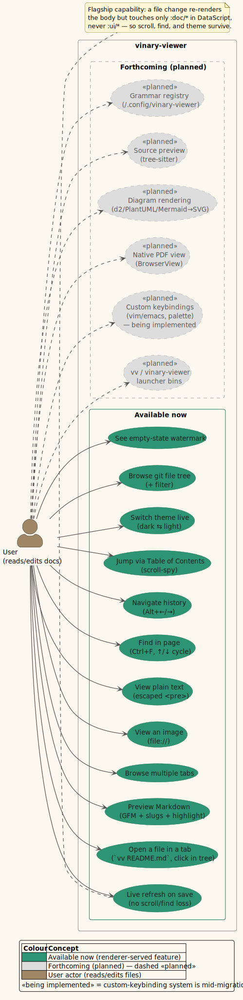

# vinary-viewer — Documentation Suite

> **vinary-viewer** is a reactive desktop **document previewer** built in
> **ClojureScript** with **re-frame** on **Electron**. You point it at a file
> (`vv README.md`), and it shows a live, always-current preview: edit the file in
> any editor and the rendered view refreshes the instant you save — **without
> losing your scroll position, your in-page search, or your theme**. It previews
> **Markdown** (GitHub-flavoured, with heading anchors, syntax highlighting, and
> embedded SVG figure sizing), **images**, **PDFs**, **Office/OpenDocument files**,
> **workbooks and delimited tables**, **large logs**, **archives**, **source files**,
> **plain text**, and **HTTP/HTTPS links**, across **multiple tabs**, with a **git
> file tree**, an **in-page find**, a **table-of-contents scroll-spy**,
> **navigation history**, live theme switching, and custom keybindings.

---

## Status banner

| Field | Value |
|-------|-------|
| Version | **`0.2.0-dev`** — ClojureScript / re-frame / Electron rewrite (`package.json`) |
| Predecessor | `0.1.0` was a *vmd-patching* tool; that codebase is **superseded** and preserved at git tag `v0.1.0` |
| Live runtime | `src/vinary/**` (ClojureScript) + `resources/**` (`preload.js`, `public/`) |
| Build | `shadow-cljs` two-build (`:main` → Electron main; `:renderer` → Chromium) |

This suite documents the **live `0.2.0-dev` application**. Capabilities are
tagged so you can distinguish current behavior from intentionally future work:

- **Available now** — implemented in `src/vinary/**` and `resources/**`.
- **Forthcoming (planned)** — designed but not built. At the time of this
  revision, source-diagram rendering from `.d2`, `.puml`, `.mmd`, and `.dot`
  files is still planned; those files currently open in the read-only source
  preview. Some older pages and diagrams keep `planned` in their filename
  because they began as design documents, but their status text is authoritative.

> Anything not explicitly tagged *Forthcoming* is **Available now**.

### What the app can do today

The use-case diagram below partitions the feature set into **Available now**
(teal) and **Forthcoming (planned)** (dashed grey). Source:
[`diagrams/usecase-features.puml`](diagrams/usecase-features.puml).



---

## How to read this suite

Pick the path that matches your goal. Each path lists the documents in the order
they build on one another.

### "I just want to use it" → start in [`usage/`](usage/)

1. [`usage/01-getting-started.md`](usage/01-getting-started.md) — first preview in
   under a minute.
2. [`usage/02-installation-and-build.md`](usage/02-installation-and-build.md) —
   `shadow-cljs` compile/watch/release and running under Electron.
3. [`usage/03-opening-files-and-tabs.md`](usage/03-opening-files-and-tabs.md) —
   command-line argument, the git tree, multi-tab browsing.
4. [`usage/04-keyboard-shortcuts.md`](usage/04-keyboard-shortcuts.md) — the
   default keys (`Ctrl+F`, `Alt+←/→`) and the vim/emacs custom-keybinding system.
5. [`usage/05-configuration.md`](usage/05-configuration.md) and
   [`usage/06-troubleshooting.md`](usage/06-troubleshooting.md).

For a feature-by-feature catalogue (one page each), see
[`features/`](features/README.md).

### "I want to understand *why* it is built this way" → [`theory/`](theory/), then [`architecture/`](architecture/)

The **theory pillar** explains the *ideas* — the patterns, the data model, the
invariants — independent of any one file. Read it in order:

1. [`theory/01-reactive-architecture.md`](theory/01-reactive-architecture.md) —
   unidirectional data flow; re-frame's six dominoes mapped onto the **Command**
   and **Observer** patterns; the single-source-of-truth equation
   $`\mathrm{view} := f(\mathrm{state})`$.
2. [`theory/02-state-model-datascript-app-db.md`](theory/02-state-model-datascript-app-db.md)
   — the **two stores** (`app-db` for tabs/history and UI; DataScript for the
   bounded content cache), the minimal schema, and the **`:ds/rev` bridge** that
   ties them together.
3. [`theory/03-live-refresh-spine.md`](theory/03-live-refresh-spine.md) — the
   **flagship spine**: editor-save → painted DOM, and the invariant that a content
   refresh mutates only `:doc/*`, never `:ui/*`.
4. [`theory/04-hexagonal-and-ipc-mediator.md`](theory/04-hexagonal-and-ipc-mediator.md)
   — ports & adapters, *effects at the edge*, and the **Mediator** `contextBridge`
   IPC seam.
5. [`theory/05-strategy-renderer-registry.md`](theory/05-strategy-renderer-registry.md)
   — the **Strategy** that picks a document body by `:doc/kind`.
6. [`theory/06-find-css-custom-highlight.md`](theory/06-find-css-custom-highlight.md)
   — painting search matches as Ranges with the **CSS Custom Highlight API**,
   without touching the DOM.
7. [`theory/07-command-history-model.md`](theory/07-command-history-model.md) —
   navigation as reified **Commands** on a `{:stack :idx}` history.
8. [`theory/08-common-document-ir.md`](theory/08-common-document-ir.md) — one
   **weighted-transducer IR** every format parses into; semiring/WPDA/transducer core.
9. [`theory/09-document-streaming-and-the-wpda.md`](theory/09-document-streaming-and-the-wpda.md)
   — treating a document as a **bounded-memory stream**; the WPDA log grammar; the
   bounded-memory property.
10. [`theory/10-terminal-rendering-second-renderer.md`](theory/10-terminal-rendering-second-renderer.md)
    — the terminal (`vv-cli` / `vv-tui`) as a **second renderer** over the same IR
    and streaming spine; ANSI back-end, kitty/sixel graphics, headless PDF reflow.

Then read the **architecture pillar** for the concrete realisation:

- [`architecture/01-overview.md`](architecture/01-overview.md),
  [`02-process-and-build-topology.md`](architecture/02-process-and-build-topology.md),
  [`03-ipc-protocol.md`](architecture/03-ipc-protocol.md),
  [`04-state-schema-reference.md`](architecture/04-state-schema-reference.md),
  [`05-data-flows.md`](architecture/05-data-flows.md),
  [`06-renderer-runtime.md`](architecture/06-renderer-runtime.md).

### "I want to contribute" → [`architecture/`](architecture/) + [`reference/`](reference/) + [`design-decisions/`](design-decisions/README.md)

- Architecture as above for the lay of the land.
- [`reference/`](reference/) — exhaustive tables you will keep open while coding:
  [`events-effects-subs.md`](reference/events-effects-subs.md),
  [`ipc-channels.md`](reference/ipc-channels.md),
  [`css-variables.md`](reference/css-variables.md),
  [`namespaces.md`](reference/namespaces.md).
- [`design-decisions/`](design-decisions/README.md) — the numbered ADR-style log
  (`0001`…`0024`) recording *why* each pivotal choice was made: rendering in the
  renderer, the hand-rolled `:ds/rev` bridge over re-posh, imperative
  `innerHTML` over VDOM, the IPC mediator, bounded content retention, the common
  document IR, and the bounded-memory streaming pipeline.
- [`security/threat-model.md`](security/threat-model.md) — the Electron security
  posture and recommended hardenings.

---

## Document map

Every document in the suite, with its pillar and one-line purpose.

| Document | Pillar | What it covers |
|----------|--------|----------------|
| [`README.md`](README.md) | entry | This index, status, reading paths, conventions |
| [`GLOSSARY.md`](GLOSSARY.md) | entry | Every term, acronym, and symbol, defined once |
| [`theory/01-reactive-architecture.md`](theory/01-reactive-architecture.md) | theory | Unidirectional flow; six dominoes; Command + Observer; $`\mathrm{view} := f(\mathrm{state})`$ |
| [`theory/02-state-model-datascript-app-db.md`](theory/02-state-model-datascript-app-db.md) | theory | Two stores; `app-db` tabs/history; DataScript content cache; `:ds/rev` bridge; nil-as-absence |
| [`theory/03-live-refresh-spine.md`](theory/03-live-refresh-spine.md) | theory | The save→render→paint spine; the `:doc/*`-only invariant; convergence/LWW |
| [`theory/04-hexagonal-and-ipc-mediator.md`](theory/04-hexagonal-and-ipc-mediator.md) | theory | Ports/adapters; effects at the edge; the Mediator `contextBridge` seam |
| [`theory/05-strategy-renderer-registry.md`](theory/05-strategy-renderer-registry.md) | theory | Strategy-by-`:doc/kind`; content-view precedence; future registry-as-data |
| [`theory/06-find-css-custom-highlight.md`](theory/06-find-css-custom-highlight.md) | theory | Painting Ranges without DOM mutation; `collect-ranges`/`paint!`/`cycle!` |
| [`theory/07-command-history-model.md`](theory/07-command-history-model.md) | theory | Navigation as Commands; `{:stack :idx}`; truncate-on-new-path |
| [`theory/08-common-document-ir.md`](theory/08-common-document-ir.md) | theory | One tagged IR per format; semiring/WPDA/tree-transducer; single sanitizer; byte-parity |
| [`theory/09-document-streaming-and-the-wpda.md`](theory/09-document-streaming-and-the-wpda.md) | theory | Document as a bounded-memory stream; WPDA log grammar; StreamParser; append sink |
| [`theory/10-terminal-rendering-second-renderer.md`](theory/10-terminal-rendering-second-renderer.md) | theory | Terminal as a second renderer over the shared IR/streaming spine; ANSI back-end; kitty/sixel |
| [`architecture/01-overview.md`](architecture/01-overview.md) | architecture | System-level component map |
| [`architecture/02-process-and-build-topology.md`](architecture/02-process-and-build-topology.md) | architecture | Two Electron processes; the two shadow-cljs builds |
| [`architecture/03-ipc-protocol.md`](architecture/03-ipc-protocol.md) | architecture | The `vv:*` channels and payload shapes |
| [`architecture/04-state-schema-reference.md`](architecture/04-state-schema-reference.md) | architecture | DataScript schema + full `app-db` shape |
| [`architecture/05-data-flows.md`](architecture/05-data-flows.md) | architecture | Open / refresh / find / history flows end-to-end |
| [`architecture/06-renderer-runtime.md`](architecture/06-renderer-runtime.md) | architecture | Renderer boot order, reagent mount, dev hooks |
| [`design-decisions/README.md`](design-decisions/README.md) + `0001`…`0024` | design | Why each pivotal choice was made |
| [`usage/01..06`](usage/) | usage | Getting started, install/build, files & tabs, shortcuts, config, troubleshooting |
| [`features/README.md`](features/README.md) + `01`…`26` | features | One page per feature (live refresh … Org-mode rendering) |
| [`reference/events-effects-subs.md`](reference/events-effects-subs.md) | reference | Every re-frame event, effect, subscription |
| [`reference/ipc-channels.md`](reference/ipc-channels.md) | reference | Every IPC channel, direction, payload |
| [`reference/css-variables.md`](reference/css-variables.md) | reference | The `--vv-*` design tokens |
| [`reference/namespaces.md`](reference/namespaces.md) | reference | Every ClojureScript namespace and its role |
| [`security/threat-model.md`](security/threat-model.md) | security | Electron isolation posture; recommended hardenings |
| [`diagrams/`](diagrams/README.md) | diagrams | All PlantUML sources + the shared theme |

---

## Conventions used throughout

These conventions are shared by every document. They exist so the suite reads as
one coherent whole.

1. **Term-before-use.** Every acronym, symbol, and domain term is defined the
   first time it appears, and again — canonically — in
   [`GLOSSARY.md`](GLOSSARY.md). When a term is first introduced, the glossary
   records *which document introduced it*.

2. **Mathematics is MathJax, delimited for GitHub-flavoured Markdown.** A formula
   is a *math span*, never an inert code span and never a string of Unicode
   glyphs. Two forms, and only these two:

   - **Inline** — a backtick span wrapped in dollar signs, e.g. the
     single-source-of-truth equation $`\mathrm{view} := f(\mathrm{state})`$, or
     the find cursor $`\mathit{idx}' := (\mathit{idx} + \mathit{dir}) \bmod n`$.
   - **Display** — a fenced block whose info-string is `math`, e.g. the history
     push:

     ```math
     \mathit{stack}' := \mathtt{(conj\ (vec\ (take\ (inc\ idx)\ stack))\ path)}
     ```

   Never write bare `$…$` or `$$…$$`. GitHub's CommonMark pass strips backslash
   escapes before MathJax ever sees them, so those delimiters corrupt an
   expression — sometimes loudly, sometimes silently. Write a literal dollar sign
   as a code span, and never let an ASCII letter abut the opening delimiter.

   The operator `:=` reads "is defined as"; a prime, as in $`\mathit{stack}'`$,
   denotes the *next* value of a binding after an update.

   Unicode remains correct for **non-mathematical** text — box-drawing,
   arrows, enumerations, and separators such as `events · subs · fx`.

3. **Diagrams are PlantUML.** Every diagram lives under
   [`diagrams/`](diagrams/README.md) as a `.puml` file that begins with
   `@startuml` and `!include _vv-theme.iuml`. Each file's header comment states
   *why PlantUML was chosen over Mermaid for that illustration*. Documents embed
   the rendered `.svg` image and cite the `.puml` source path, so the figure is
   visible in ordinary Markdown viewers while remaining one click from its source.

4. **Color legend.** Colours are **per-concept and stable across the whole
   suite** — a colour always means the same thing. The palette is defined once in
   [`diagrams/_vv-theme.iuml`](diagrams/_vv-theme.iuml) and is drawn from the
   app's own Spacemacs `--vv-*` tokens. Each concept owns one **hue**; the
   *accent* below is that hue at full saturation. The mapping:

   | Colour | Accent hex | Concept |
   |--------|-----|---------|
   | ▮ Slate | `#3A5BA0` | **Main** process (Node IO) |
   | ▮ Teal | `#2D9574` | **Renderer** / Chromium / reagent view |
   | ▮ Amber | `#B1951D` | **IPC seam** (preload, `contextBridge`, Mediator) — *all IPC arrows are amber* |
   | ▮ Purple | `#A45BAD` | **DataScript** single source of truth |
   | ▮ Blue-violet | `#7590DB` | **app-db** ephemeral UI state |
   | ▮ Blue | `#4F97D7` | **re-frame** machinery (events, fx, subs) |
   | ▮ Tan | `#9F8766` | **Filesystem / editor** (chokidar) |
   | ▮ Green | `#67B11D` | **Markdown** (unified / remark / rehype) |
   | ▮ Magenta | `#BC6EC5` | **Keymaps** (registry, key-binding editor, link hints) |
   | ▮ Orange | `#E67E22` | **Common document IR** core (semiring · transducer · WPDA) |
   | ▮ Red | `#E0211D` | **Errors / retractions** |
   | ▯ Dashed grey | `#DDDDDD` | **Forthcoming (planned)** — `«planned»` stereotype |

   **Hue names the concept; lightness names the role.** The accents are
   *foreground* colours — legible as ink or as a small swatch, overwhelming as a
   large area fill. So each concept exists at four tiers, and which one you use is
   decided by role, never by taste:

   | Macro | Tier | Used for |
   |-------|------|----------|
   | `<CONCEPT>_FILL` | palest | package / container backgrounds |
   | `<CONCEPT>_TINT` | mid | component, participant, state and object fills |
   | `<CONCEPT>_BORDER` | dark | arrow strokes for that concept |
   | `<CONCEPT>_COLOR` | accent | legend swatches only — **never** an area fill |

   `_FILL` and `_TINT` are derived from `_COLOR` by moving lightness and
   saturation in HLS space with the hue held fixed, so the whole palette is
   reconstructible from the eleven accents alone. Every `_FILL` and `_TINT`
   clears WCAG 2.x AA against the ink `#1A1A1A` by at least `10.8:1`.

   Every diagram repeats a `legend` mapping its accents to concepts, so each is
   self-contained. See [`diagrams/README.md`](diagrams/README.md) for the full
   diagram catalogue, the tier derivation, and the render-time regression gates.

5. **Citations.** Sources are cited inline with a link, and DOIs are used **only
   when they resolve** — see [`GLOSSARY.md`](GLOSSARY.md#references) and each
   document's *References* section. Foundational design-pattern claims cite
   *Design Patterns* (Gamma, Helm, Johnson & Vlissides, 1994, **ISBN
   978-0201633610** — this book has no DOI). The Model-View-Controller lineage
   cites Krasner & Pope (1988) by its **ACM Digital Library** landing page,
   [`dl.acm.org/doi/10.5555/50757.50759`](https://dl.acm.org/doi/10.5555/50757.50759).
   Despite its shape, `10.5555/50757.50759` is **not a registered DOI** —
   `10.5555` is ACM's placeholder prefix for pre-DOI material, and
   `doi.org/10.5555/50757.50759` returns HTTP 404. Cite it as a library link, not
   as a DOI. Library and platform claims cite the projects' official
   documentation.

---

## Attribution

vinary-viewer is original work licensed **Apache-2.0**, *a new application
inspired by [vmd](https://github.com/yoshuawuyts/vmd)* (MIT). The full
attribution and third-party notices live in the repository `NOTICE` file and in
[`design-decisions/README.md`](design-decisions/README.md). Author: *Vinary Tree*
&lt;dylon@vinarytree.io&gt;.
