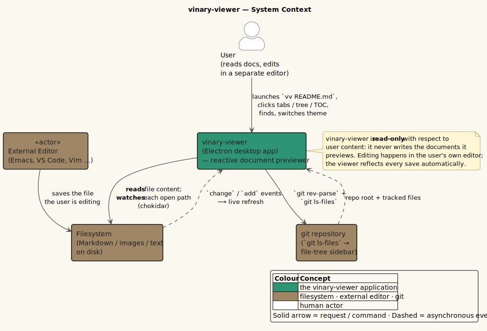

# 01. Architecture Overview

This page is the entry point for the architecture pillar. It describes the
process model, IPC seam, state ownership, renderer runtime, and current feature
status.

---

## 1. System purpose

vinary-viewer is a local-first Electron previewer for repository resources. It
opens Markdown, Org, and LaTeX documents; unified/git **diffs**; images; PDFs
(rendered in-renderer with pdf.js); office documents (docx/ODF) and
spreadsheet/delimited tables; logs; archives; source and text files; HTTP/HTTPS
links; and — new in 0.3.0 — files and directories on remote hosts over
`ssh://`/`sftp://`. It live-refreshes local files (and polls remote ones) while
preserving tabs, per-tab history, scroll positions, settings, and keybinding
state, and it streams very large documents in bounded memory rather than loading
them whole.

Key terms:

| Term | Meaning |
|------|---------|
| Main process | Electron/Node process that owns OS APIs: filesystem, dialogs, clipboard, config files, watchers, the SSH/SFTP client, the HTTP web view, and git tree queries. |
| Renderer process | Chromium process that owns the re-frame/Reagent UI; Markdown/Org/LaTeX/diff rendering; in-renderer pdf.js; source preview; tabs; search; TOC; and keybindings. |
| Preload mediator | `resources/preload.js`; exposes `window.vv` through `contextBridge`. |
| DataScript content cache | In-memory document cache keyed by `:doc/path`. |
| Retained file | A local file reachable from any open tab history entry. |

---

## 2. System context

vinary-viewer is read-only with respect to user documents. It reads and watches
files, reads git metadata for the sidebar, and writes only its own user config.

*Diagram source: [`../diagrams/system-context.puml`](../diagrams/system-context.puml).*

Primary loops:

| Loop | Behavior |
|------|----------|
| Open | Main reads/classifies a file and sends `vv:content`; renderer caches/renders and points a tab at it. |
| Live refresh | Main watcher re-sends content; renderer updates cached content and rendered metadata without resetting UI state. |
| Navigation | Renderer tab/history events change app-db, load retained local files when needed, and restore scroll. |
| Configuration | Main watches settings/keybinding/grammar files and pushes plain EDN/data over IPC. |

---

## 3. Two builds, one seam

| Build | Target | Output | Entry | Process |
|-------|--------|--------|-------|---------|
| `main` | `:node-script` | `dist/main/main.js` | `vinary.main.core/main` | Electron main |
| `renderer` | `:browser` | `resources/public/js/main.js` | `vinary.renderer.core/init` | Chromium renderer |

*Diagram source: [`../diagrams/container-two-build.puml`](../diagrams/container-two-build.puml).*

The renderer never imports `electron`, `fs`, or `ipcRenderer`. The only
renderer-to-main API is `window.vv`, exposed by the preload mediator.

> **Two more builds, no seam.** Since 0.3.0 the same source tree also compiles to
> two **headless** Node targets — `vv-cli` and `vv-tui`, the terminal previewers —
> for **five** shadow-cljs builds in total (`main`, `renderer`, `test`, `cli`,
> `tui`). The terminal builds are single-process (no main/renderer seam) and reuse
> the shared document engine as a *second renderer*. See
> [02 · Build Topology](02-process-and-build-topology.md) and
> [07 · Common IR, Streaming & Terminal](07-common-ir-streaming-and-terminal.md).

---

## 4. State ownership

| State | Owner | Examples |
|-------|-------|----------|
| UI and navigation | re-frame `app-db` | Tabs, active tab id, tab histories, saved scroll entries, sidebar state, find state, settings UI, keybinding UI. |
| Loaded content | DataScript | `:doc/path`, `:doc/kind`, `:doc/text`, `:doc/html`, `:doc/toc`, `:doc/assets`, `:doc/entries`, `:doc/error`, `:doc/stamp`, plus representation-switch / reflow / streaming fields (`:doc/pdf-sibling`, `:doc/source-sibling`, `:doc/reflow-html`, `:doc/diff-split-html`, `:doc/streaming?`, …). |
| OS/native resources | Main process | Chokidar watchers, asset watchers, the HTTP web view, the SSH/SFTP connection pool and remote pollers, config file watchers. (The native PDF `WebContentsView` is retired — PDFs render in-renderer via pdf.js; ADR-0013.) |

The `:ds/rev` bridge connects DataScript to re-frame subscriptions. Each
DataScript transaction dispatches `[:ds/changed]`, increments `:ds/rev`, and
causes content-reading subscriptions to re-read the current DataScript snapshot.

---

## 5. Main process responsibilities

Main owns privileged operations:

| Namespace | Responsibility |
|-----------|----------------|
| `vinary.main.core` / `vinary.main.startup` / `vinary.main.window` | App/window lifecycle and initial (multi-arg) file handling. |
| `vinary.main.service` (+ `service_util`, `file_kind`) | File reading, kind classification, retained watcher reconciliation, git tree, embedded asset watchers, remote polling. |
| `vinary.main.content_service` (JS) | The Electron-free file reader / bounded-preview pager / stream-session registry, shared with the CLI/TUI. |
| `vinary.main.ssh` (+ `ssh_config`, `ssh_transport`, `ssh_agent` JS) | SSH/SFTP connection pool, auth chain, host-key trust, and the `vv:ssh-*` seam (ADR-0027). |
| `vinary.main.connections` | `connections.edn` — non-secret SSH host metadata. |
| `vinary.main.pdf` | **Retired** native PDF `WebContentsView` (kept commented; PDFs now render in-renderer via pdf.js — ADR-0013). |
| `vinary.main.web` | In-app HTTP/HTTPS web view (browserized). |
| `vinary.main.passwords` (+ adapters/config/util) | Native password-manager bridge (metadata-only over IPC). |
| `vinary.main.extensions` / `ext_config` / `ext_popup` / `adblock` | Scoped Chrome-extension runtime and Ghostery ad-blocking (ADR-0014/0015). |
| `vinary.main.config` / `settings` / `recent` / `grammars` | `keybindings.edn` / `settings.edn` / `recent.edn` load-save-watch; bundled and user grammar registry. |

Main does not parse Markdown, own tabs, or render ordinary UI.

---

## 6. Renderer responsibilities

Renderer owns reactive application behavior:

| Namespace family | Responsibility |
|------------------|----------------|
| `vinary.app.*` | app-db defaults, events, effects, subscriptions, navigation helpers, DataScript helpers, command registry. |
| `vinary.renderer.*` | Markdown/Org/LaTeX/diff rendering, in-renderer pdf.js, source highlighting, TOC offset cache, figure sizing, scroll restore, media helpers, find. |
| `vinary.ir.*` | The common document IR: one tagged-tree intermediate representation every format parses into (front-ends), transformed by a weighted-transducer / WPDA core, and lowered by HTML/ANSI back-ends (ADR-0017; see [07](07-common-ir-streaming-and-terminal.md)). |
| `vinary.stream.*` | Bounded-memory incremental document streaming (flag, StreamParser protocol, credit-1 transport, append sink, idle scheduler; ADR-0018). |
| `vinary.ui.*` | Reagent/Re-frame views, tabs, tree, menu bar, settings, keybinding editor. |
| `vinary.input.*` | Key tokenization, keymap presets, keymap registry, modal/chord resolver, input effects. |
| `vinary.terminal.*` / `vinary.cli.*` / `vinary.tui.*` | The **second renderer** — a headless ANSI backend, terminal capabilities/graphics/PDF/stream, and the `vv-cli` / `vv-tui` drivers. Shares the IR/streaming spine; requires no `renderer`/`main` namespace (ADR-0019; see [07](07-common-ir-streaming-and-terminal.md)). |

The renderer uses React 19 through Reagent and renders the shell declaratively.
Rendered document bodies are inserted through an imperative lifecycle component
because the HTML comes from the IR/Markdown pipeline rather than React children.

---

## 7. Current status

Available now:

| Area | Status |
|------|--------|
| Launchers | `./install.sh` installs `vinary-viewer`, `vv`, `vv-cli`, and `vv-tui`. |
| Markdown | GFM render, slugged headings, code highlighting, MathJax, TOC metadata, asset tracking, sanitized raw HTML. |
| Org / LaTeX | `.org` via uniorg and `.tex`/`.latex`/`.ltx` via unified-latex, rendered through the common IR like Markdown (ADR-0020/0024/0025). |
| Diffs | `.diff` / `.patch` colored unified view plus on-demand side-by-side (split) and a multi-file Contents (ADR-0026). |
| Office / tables | docx/ODF office documents and spreadsheet/delimited tables (`.xlsx`, `.ods`, `.csv`, …) as sanitized HTML / paged tables. |
| Logs / archives | Bounded log/table paging and in-place archive browsing (virtual `vv-archive://` URIs, never extracted to disk). |
| Live refresh | Retained-path watcher reconciliation, bounded DataScript cache eviction, and opt-in remote polling. |
| Tabs/history | Browser-like tabs, per-tab history, scroll restore, tab reorder, tab context menus, View Source. |
| PDF | In-renderer **pdf.js** — windowed canvas + text/link layers inside `.vv-content`, with app find/selection/zoom/invert and an outline Contents (ADR-0013). |
| Source preview | Read-only CodeMirror 6 with web-tree-sitter highlighting when a grammar or filetype mapping is available. |
| Grammar registry | Bundled grammars plus user grammars under `~/.config/vinary-viewer/grammars/` and filename/pattern mappings from `filetypes.edn`. |
| Mermaid rendering | Mermaid fences in Markdown and direct `.mmd` / `.mermaid` files render to SVG in the renderer. |
| Remote files (SSH) | Open files and directories over `ssh://` / `sftp://` through the same pipeline as local paths (ADR-0027). |
| Document streaming | Very large logs/Markdown/Org/PDF-reflow stream in bounded memory, default-on above a per-kind size threshold (ADR-0018). |
| Terminal preview | `vv --cli` (pipe-friendly) and `vv --tui` (full-screen) render the same documents to ANSI, with kitty/sixel graphics where supported (ADR-0019). |
| Keybindings | Standard/Vim/Emacs presets, command registry, resolver, visual editor, persisted `keybindings.edn`. |
| Settings | Persisted theme and font settings in `settings.edn`. |
| HTTP links | Browserized in-app web view with heading outline integration, ad-blocking, and a password-manager bridge. |
| Security | Applied Content-Security-Policy (`<meta>` in `index.html`; no `'unsafe-inline'` script) backing the `rehype-sanitize` allowlist. |

Still planned:

| Area | Current behavior |
|------|------------------|
| External diagram engines | `.d2`, `.puml`, `.dot`, and related non-Mermaid diagram sources open as source code; generated SVGs from those tools can be embedded in Markdown. |
| Additional security hardening | The CSP is **applied** (see the Security row above); full renderer sandboxing remains tracked in the threat model. |

---

## 8. Architecture map

| Topic | Document |
|-------|----------|
| Build topology | [02-process-and-build-topology.md](02-process-and-build-topology.md) |
| IPC protocol | [03-ipc-protocol.md](03-ipc-protocol.md) |
| State schema | [04-state-schema-reference.md](04-state-schema-reference.md) |
| Data flows | [05-data-flows.md](05-data-flows.md) |
| Renderer runtime | [06-renderer-runtime.md](06-renderer-runtime.md) |
| Security model | [../security/threat-model.md](../security/threat-model.md) |
