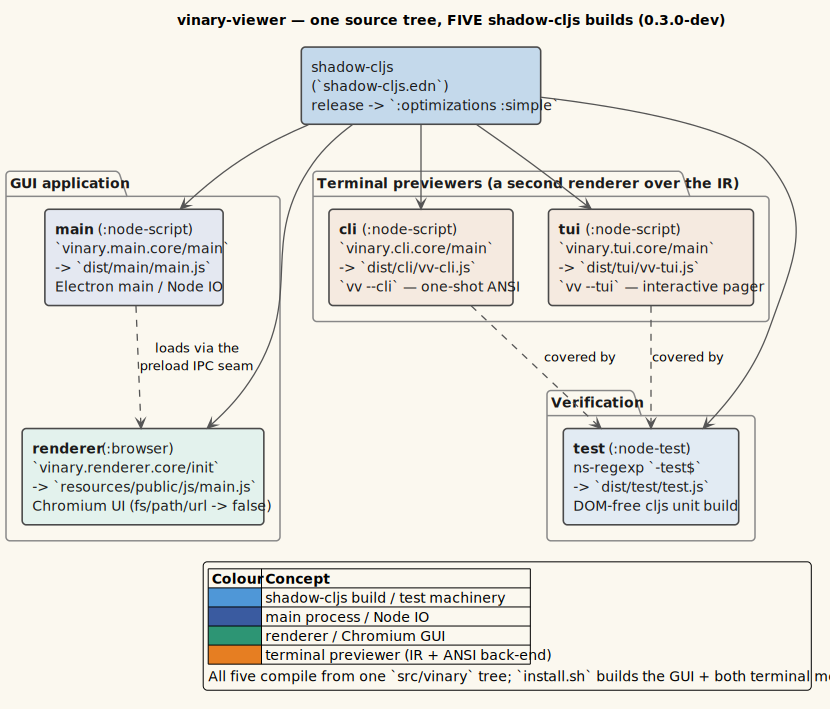

# 02 · Process & Build Topology

> **Scope.** How vinary-viewer is *built and laid out across processes*: the **five** **shadow-cljs**
> builds (targets, outputs, init functions, devtools, and the renderer's deliberate Node stubbing),
> the **deps.edn** library stack, the **package.json** scripts and JS dependencies, *why* main uses
> runtime `require` while the renderer stubs Node, and the **dev hot-reload** loop. Read
> [01 · Overview](./01-overview.md) first for the thesis.

---

## 1. Deployment shape

vinary-viewer ships as a standard Electron app: one **MAIN** (Node) process and one **RENDERER**
(Chromium) process per window, with a **preload** script injected across the trust boundary.


*Source: [`../diagrams/deploy-electron-processes.puml`](../diagrams/deploy-electron-processes.puml).*

`package.json` `"main": "dist/main/main.js"` tells Electron which file is the main entry; `electron .`
(the `start` script) launches it.

---

## 2. The five shadow-cljs builds

`shadow-cljs.edn` defines **five** builds under `:builds`: the two app processes (`:main`, `:renderer`),
a DOM-free unit-test build (`:test`), and the two headless terminal previewers (`:cli`, `:tui`). They
share the source paths from `deps.edn` (`["src" "resources" "test"]`) but compile to different targets.



*Diagram source: [`../diagrams/container-five-builds.puml`](../diagrams/container-five-builds.puml).*

```clojure
;; shadow-cljs.edn — the current shape (comments abridged)
{:deps {:aliases []}
 ;; Java 26 needs this for some deps that touch sun.misc.Unsafe (matches LightningBug).
 :jvm-opts ["--sun-misc-unsafe-memory-access=allow"]
 :builds
 {:main {:target    :node-script
         :main      vinary.main.core/main
         :output-to "dist/main/main.js"
         ;; :simple (not the :node-script default :advanced) — advanced property-renaming silently
         ;; renames un-^js-hinted Electron interop and crashes main (ADR-0016). :simple still minifies.
         :release   {:compiler-options {:optimizations :simple}}}
  :renderer {:target     :browser
             :output-dir "resources/public/js"
             :asset-path "js"
             :modules    {:main {:init-fn vinary.renderer.core/init}}
             :devtools   {:after-load vinary.renderer.core/reload
                          :preloads   [devtools.preload
                                       day8.re-frame-10x.preload.react-18]}
             ;; trace is a dev-only re-frame-10x feature; in :release it defaults to goog.DEBUG (false)
             :dev {:compiler-options {:closure-defines {"re_frame.trace.trace_enabled_QMARK_" true}}}
             :release {:compiler-options {:optimizations :simple}}
             ;; MathJax 4's SVG output statically imports its DEFAULT font via Node's #default-font/*
             ;; subpath import, which shadow's bundler can't resolve; point it at the Modern font we render
             ;; with so the browser bundle resolves AND the default matches the :fontData we pass.
             :js-options {:resolve {"fs" false "fs/promises" false "path" false "url" false
                                    "#default-font/svg/default.js"
                                    {:target :npm :require "@mathjax/mathjax-modern-font/cjs/svg/default.js"}}}}
  ;; Unit tests for the pure, DOM-free logic (node). Run: shadow-cljs compile test && node dist/test/test.js
  :test {:target :node-test :output-to "dist/test/test.js" :ns-regexp "-test$"}
  ;; vv-cli — headless terminal document renderer (Node). Reuses the IR front-ends + WPDA/streaming core +
  ;; content_service.js reader (all Electron-free), lowering to ANSI via ir.backend.ansi. :simple like :main.
  :cli {:target :node-script :main vinary.cli.core/main :output-to "dist/cli/vv-cli.js"
        :release {:compiler-options {:optimizations :simple}}}
  ;; vv-tui — interactive raw-ANSI terminal viewer (Node); streams huge docs via the same WPDA core.
  :tui {:target :node-script :main vinary.tui.core/main :output-to "dist/tui/vv-tui.js"
        :release {:compiler-options {:optimizations :simple}}}}}
```

### 2.1 `:main` — the Electron main process

| Key | Value | Meaning |
| --- | --- | --- |
| `:target` | `:node-script` | Emit a Node-runnable script. shadow-cljs uses **`:js-provider :require`** for this target, so `require("electron")` and Node built-ins stay **runtime requires** resolved by the Electron runtime — they are *not* bundled. |
| `:main` | `vinary.main.core/main` | The function invoked when the script runs. |
| `:output-to` | `dist/main/main.js` | The single emitted file; also `package.json`'s `"main"`. |
| `:release` | `{:compiler-options {:optimizations :simple}}` | **Not** the `:node-script` default `:advanced`. Advanced property-renaming silently renames un-`^js`-hinted Electron interop (e.g. `.toggleDevTools`) and crashes the main process in a *release* build only ([ADR-0016](../design-decisions/0016-main-process-simple-optimization.md)); `:simple` still minifies and dead-code-eliminates. |

There is **no `:devtools`** block on `:main` (a Node script needs no hot-reload-after-load hook for
the page). The main build is intentionally minimal.

### 2.2 `:renderer` — the Electron renderer (Chromium)

| Key | Value | Meaning |
| --- | --- | --- |
| `:target` | `:browser` | Emit a browser bundle (DOM, ESM JS deps bundled in). |
| `:output-dir` | `resources/public/js` | Where the bundle and its `cljs-runtime` land. |
| `:asset-path` | `js` | URL prefix the bundle uses to load its own split modules. |
| `:modules {:main {:init-fn vinary.renderer.core/init}}` | — | One module named `main` → `resources/public/js/main.js`; `init` runs on load. |
| `:devtools {:after-load … :preloads …}` | — | Hot-reload calls `vinary.renderer.core/reload` after each recompile; the preloads install `binaryage/devtools` and **re-frame-10x** (React-18 preload). (`re-frisk.preload` was **dropped**.) |
| `:dev {:compiler-options {:closure-defines …}}` | `re_frame.trace…/trace_enabled? = true` | Enables re-frame tracing (required by re-frame-10x) **only in dev**; in `:release` it defaults to `goog.DEBUG` (false). |
| `:release {:compiler-options {:optimizations :simple}}` | — | Same rationale as `:main` (advanced property-renaming breaks the re-frame / DataScript / unified-remark interop); `:simple` still minifies and strips devtools. |
| **`:js-options {:resolve {"fs" false "fs/promises" false "path" false "url" false, "#default-font/svg/default.js" {…}}}`** | — | **The renderer is denied Node** — `fs`/`path`/`url` resolve to `false` so the bundle cannot reach the filesystem (all IO crosses the preload seam). The extra `#default-font/svg/default.js` entry re-points MathJax 4's default-font subpath import — which shadow's bundler cannot resolve — at `@mathjax/mathjax-modern-font`, the font the renderer actually typesets with. |

> **Why stub `fs`/`path`/`url` in the renderer?** Two reasons. (1) **Security**: with
> `nodeIntegration: false` the renderer has no `require` anyway; the stubs ensure that even a
> transitive dependency that *imports* `fs` compiles to a no-op instead of a build error or a
> privilege leak. (2) **Bundling**: the browser target should not try to bundle Node built-ins.
> Together they enforce the [thin-main/smart-renderer](./01-overview.md#4-the-thesis-thin-main-smart-renderer)
> boundary at build time.

### 2.3 The `test`, `cli`, and `tui` builds

Three further Node builds share the same `src`/`resources`/`test` roots:

| Build | Target | Output | Entry | Purpose |
| --- | --- | --- | --- | --- |
| `:test` | `:node-test` | `dist/test/test.js` | (ns-regexp `-test$`) | Runs the pure, DOM-free unit tests (IR, streaming, WPDA, nav, diff, file-kind, …) under Node. |
| `:cli` | `:node-script` | `dist/cli/vv-cli.js` | `vinary.cli.core/main` | `vv-cli` — a headless one-shot terminal renderer (pipe-friendly). |
| `:tui` | `:node-script` | `dist/tui/vv-tui.js` | `vinary.tui.core/main` | `vv-tui` — a full-screen interactive raw-ANSI viewer. |

`:cli` and `:tui` are the **second renderer** (ADR-0019): they reuse the IR front-ends, the WPDA/streaming
core, and the Electron-free `content_service.js` reader, lowering to ANSI via `ir.backend.ansi` instead of to
HTML. Both take `:simple` release optimization for the same interop-preservation reason as `:main`
([ADR-0016](../design-decisions/0016-main-process-simple-optimization.md)). They require **no** `renderer`/`main`
namespace, so the GUI is untouched. The realization of these layers is documented in
[07 · Common IR, Streaming & Terminal](./07-common-ir-streaming-and-terminal.md).

### 2.4 Why main uses runtime `require` but the renderer does not

| Build | Module strategy | Effect |
| --- | --- | --- |
| `:main` (`:node-script`) | `:js-provider :require` (implicit) | `electron`, `fs`, `path`, `child_process`, `chokidar` are emitted as `require("…")` and resolved by the **Node/Electron runtime** at launch. The watcher library `chokidar` is a real `node_modules` runtime dependency. |
| `:renderer` (`:browser`) | bundle ESM, **stub Node** | The all-ESM unified/remark/rehype stack is **bundled into** `main.js`; Node built-ins are stubbed to `false`. The renderer has zero `require`. |

This asymmetry is the build-level expression of the architecture: **Node lives in main; the DOM and
the markdown pipeline live in the renderer.**

---

## 3. The ClojureScript dependency stack (`deps.edn`)

`deps.edn` paths: `["src" "resources" "test"]`. `core.async` arrives transitively via shadow-cljs. The
`:jvm-opts ["--sun-misc-unsafe-memory-access=allow"]` accommodates Java 26 (matching the sibling
LightningBug tooling baseline).

| Dependency | Role | Version |
| --- | --- | --- |
| `org.clojure/clojure` | Clojure (build/macros) | `1.12.2` |
| `org.clojure/clojurescript` | ClojureScript compiler | `1.12.42` |
| `thheller/shadow-cljs` | Build tool (compiles both builds) | `3.2.0` |
| `reagent/reagent` | React wrapper (hiccup → React 19) | `2.0.1` |
| `re-frame/re-frame` | Event/effect/state/view loop | `1.4.3` |
| `re-com/re-com` | UI component library | `2.27.1` |
| `com.andrewmcveigh/cljs-time` | Time utilities (**required by re-com**) | `0.5.2` |
| `datascript/datascript` | In-memory Datalog DB (document/tab SSOT) | `1.7.5` |
| `re-posh/re-posh` | re-frame ⇄ DataScript bridge **(declared but UNUSED)** | `0.3.3` |
| `day8.re-frame/re-frame-10x` | Time-travel/inspector devtool | `1.10.1` |
| `re-frisk/re-frisk` | app-db inspector devtool | `1.7.1` |
| `binaryage/devtools` | Chrome DevTools cljs formatters | `1.0.7` |
| `com.taoensso/timbre` | Logging | `6.8.0` |
| `org.slf4j/slf4j-api` + `org.slf4j/slf4j-nop` | SLF4J facade + no-op backend | `2.0.17` |
| `org.clojure/test.check` | Generative testing | `1.1.1` |

> **`re-posh` is declared but not used.** The conventional re-frame ⇄ DataScript integration is
> re-posh, and it appears in `deps.edn`, but vinary-viewer does **not** wire it. The real reactivity
> is the hand-rolled **`:ds/rev` bridge** (`ds/install-bridge!` → `d/listen!` → `[:ds/changed]` →
> `(update db :ds/rev inc)`), which is explicit and does not depend on re-posh subscription
> internals. See [04 · State Schema](./04-state-schema-reference.md#5-the-dsrev-reactivity-bridge).
> The dependency may be retained for a future migration but carries no runtime behaviour today.

---

## 4. JavaScript dependencies & scripts (`package.json`)

`name: "vinary-viewer"`, `version: "0.3.0-dev"`, `license: "Apache-2.0"`, `"main": "dist/main/main.js"`.

### 4.1 Scripts

The `~26` scripts fall into build, asset-sync, launch, and test groups. Each app build is prefixed by
**asset-sync** steps that vendor local copies of fonts, pdf.js, tree-sitter grammars, and graphics WASM
(no CDN); the terminal builds sync grammars + graphics WASM instead of pdf.js + fonts.

| Group | Script → Command | Purpose |
| --- | --- | --- |
| Build (GUI) | `compile` → `assets:sync && pdfjs:sync && shadow-cljs compile main renderer` | One-shot compile of the two app builds. |
| | `watch` → `… && shadow-cljs watch main renderer` | Recompile-on-save (hot reload). |
| | `release` → `… && shadow-cljs release main renderer` | Optimized (`:simple`) production build. |
| | `dev` → `… && shadow-cljs compile main renderer && electron .` | Compile once, then launch. |
| Build (terminal) | `compile:cli` / `release:cli` → `grammars:sync && graphics:sync && shadow-cljs {compile,release} cli` | Build `vv-cli`. |
| | `compile:tui` / `release:tui` → `… shadow-cljs {compile,release} tui` | Build `vv-tui`. |
| Assets | `assets:sync` / `assets:check` | Vendor + verify self-hosted fonts and Font Awesome (`scripts/sync-assets.mjs`). |
| | `pdfjs:sync` / `pdfjs:check` | Vendor + verify the pdf.js legacy build + cmaps/fonts/wasm. |
| | `grammars:sync` / `grammars:check` | Vendor + verify bundled tree-sitter grammars. |
| | `graphics:sync` | Vendor the terminal graphics WASM (resvg). |
| Launch | `start` → `electron .` | Launch Electron against `dist/main/main.js`. |
| | `screenshots` / `screenshots:display` | Headless (xvfb) / on-display screenshot capture. |
| Test | `test` | Compile+run the node unit tests, the SSH/content-service/git-tree smokes, then `test:cli` + `test:tui`. |
| | `test:cli` / `test:tui` | Build the terminal targets and run their smokes (+ `graphics-smoke`). |
| | `test:electron` / `test:electron:release` | Electron smoke against a dev / a **release** build (the release gate catches `:advanced`-only crashes). |
| | `test:extensions` / `test:extensions:sandbox` | Extension-runtime smokes. |

### 4.2 Runtime dependencies (`dependencies`)

Grouped by concern. "Bundled" = compiled into `main.js` by shadow; "require" = external runtime `require`
in a Node build; "vendored" = shipped as a file and loaded off the Closure path at runtime (dynamic
`import()` / `fetch`), never bundled.

| Package | Version | Role | Where |
| --- | --- | --- | --- |
| `react`, `react-dom` | `^19.2.7` | React 19 runtime (reagent renders onto it) | RENDERER (bundled) |
| `unified` | `^11.0.5` | Pluggable text-processing engine (the IR/Markdown pipeline) | RENDERER (bundled) |
| `remark-parse` / `remark-gfm` / `remark-rehype` | `^11` / `^4.0.1` / `^11.1.2` | Markdown → mdast → hast (GFM tables/tasklists) | RENDERER |
| `remark-math` | `^6.0.0` | `$…$` / `$$…$$` math nodes for MathJax | RENDERER |
| `rehype-raw` / `rehype-sanitize` | `^7.0.0` / `^6.0.0` | Parse raw HTML in Markdown, then apply the GitHub sanitize allowlist | RENDERER |
| `rehype-slug` / `rehype-highlight` / `rehype-stringify` | `^6` / `^7.0.2` / `^10.0.1` | Stable heading ids, code highlighting, hast → HTML string | RENDERER |
| `uniorg-parse` / `uniorg-rehype` | `^3.2.2` / `^2.2.0` | Org (`.org`) → hast, reused through the common IR (ADR-0020) | RENDERER |
| `@unified-latex/unified-latex-{to-hast,util-macros,util-parse}` | `^1.8.4` | LaTeX (`.tex`) → hast + macro preprocessing (ADR-0025) | RENDERER |
| `@mathjax/src` / `@mathjax/mathjax-modern-font` | `^4.1.3` | MathJax 4 SVG typesetting + its Modern font (see the `#default-font` resolve, §2.2) | RENDERER |
| `mermaid` | `^11.16.0` | Mermaid diagrams (fences + `.mmd`/`.mermaid`) → SVG | RENDERER |
| `@codemirror/{state,view,language,commands}` | `^6` | Read-only source preview editor | RENDERER |
| `pdfjs-dist` | `5.4.149` | In-renderer PDF rendering **and** headless terminal text extraction | RENDERER + terminal (**vendored** legacy build, ADR-0013/0019) |
| `web-tree-sitter` | `0.25.9` | Tree-sitter runtime for source highlighting + code outlines | RENDERER + terminal (grammars **vendored**) |
| `@f1r3fly-io/tree-sitter-rholang-js-with-comments` | `1.1.9` | Bundled Rholang grammar | RENDERER + terminal |
| `@resvg/resvg-wasm` | `^2.6.2` | SVG → RGBA (terminal graphics; figure sizing) | RENDERER + terminal (**vendored** WASM) |
| `sixel` | `^0.16.0` | Sixel image encoding for the terminal | terminal (`vv-cli`/`vv-tui`) |
| `chokidar` | `^5.0.0` | Filesystem watcher for retained local files and Markdown assets | MAIN (require) |
| `ssh2` | `^1.17.0` | SSH/SFTP remote-file client, main-process only (ADR-0027) | MAIN + terminal (require) |
| `mammoth` / `papaparse` / `fast-xml-parser` | `^1.12.0` / `^5.5.4` / `^5.9.3` | docx → HTML, delimited-table parse, ODF/XML parse | MAIN + terminal (`content_service.js`) |
| `tar-stream` / `yauzl` | `^3.2.0` / `^3.4.0` | tar / zip archive readers (virtual `vv-archive://`) | MAIN + terminal |
| `pngjs` / `jpeg-js` / `omggif` | `^7.0.0` / `^0.4.4` / `^1.0.10` | Raster image decoders (terminal graphics; asset probing) | MAIN + terminal |
| `@ghostery/adblocker-electron` | `2.18.0` | Native ad-blocking for the web view (ADR-0014) | MAIN (require) |
| `electron-chrome-web-store` | `0.13.0` | Scoped Chrome-extension runtime (ADR-0015) | MAIN (require) |
| `rxjs` | `^7.8.2` | Reactive streams (available; auxiliary) | RENDERER |

> **Note: sanitized raw HTML.** The unified chain runs `rehype-raw` + `rehype-sanitize` (GitHub's
> allowlist), so **raw HTML embedded inside Markdown is parsed and then sanitized** before the output tree
> — safe tags (img, tables, details, …) render; script/`on*`/`javascript:`/iframe/style are stripped.
> This is the primary injection control; see
> [03 · IPC Protocol](./03-ipc-protocol.md#7-security-seam) and
> [security/threat-model.md](../security/threat-model.md).

### 4.3 Dev dependencies (`devDependencies`)

| Package | Version | Role |
| --- | --- | --- |
| `electron` | `^42.5.0` | The Electron runtime. |
| `shadow-cljs` | `3.2.0` | The JS-side shadow-cljs CLI (mirrors the Clojure dep). |
| `@fontsource-variable/fira-code` | `^5.2.7` | Self-hosted monospace font, vendored into `resources` by `assets:sync`. |
| `@fontsource-variable/noto-sans` | `^5.2.10` | Self-hosted UI font, vendored by `assets:sync`. |
| `@fortawesome/fontawesome-free` | `^7.3.0` | Self-hosted icon set (no CDN; ADR-0011), vendored by `assets:sync`. |

---

## 5. Process / artifact / source map

| Process | Build | Source roots | Emitted artifact | Loaded by |
| --- | --- | --- | --- | --- |
| MAIN | `:main` `:node-script` | `vinary.main.*` (+ `content_service.js`, `ssh_*.js`) | `dist/main/main.js` | Electron (`package.json` main) |
| preload | (plain JS, not a shadow build) | `resources/preload.js` | itself | `webPreferences.preload` |
| RENDERER | `:renderer` `:browser` | `vinary.renderer.*`, `vinary.app.*`, `vinary.ui.*`, `vinary.ir.*`, `vinary.stream.*`, `vinary.input.*` | `resources/public/js/main.js` (+ `cljs-runtime/`) | `resources/public/index.html` `<script src="js/main.js">` |
| CLI | `:cli` `:node-script` | `vinary.cli.*`, `vinary.terminal.*`, `vinary.ir.*` (+ `content_service.js`) | `dist/cli/vv-cli.js` | `vv-cli` launcher / `node dist/cli/vv-cli.js` |
| TUI | `:tui` `:node-script` | `vinary.tui.*`, `vinary.terminal.*`, `vinary.ir.*` (+ `content_service.js`) | `dist/tui/vv-tui.js` | `vv-tui` launcher / `node dist/tui/vv-tui.js` |
| (tests) | `:test` `:node-test` | `*-test` namespaces | `dist/test/test.js` | `node dist/test/test.js` |

`resources/public/index.html` loads the renderer:

```html
<link id="vv-theme-link" rel="stylesheet" href="css/themes/spacemacs-dark.css">  <!-- defines --vv-* -->
<link rel="stylesheet" href="css/app.css">                                       <!-- structural, var(--vv-*) -->
<div id="app"></div>
<script src="js/main.js"></script>
```

The theme stylesheet is loaded **first** (so `--vv-*` tokens exist), then the structural `app.css`
that references them. The `#vv-theme-link` `id` is the swap target for live theme switching
([05 · Data Flows §6](./05-data-flows.md#6-switch-theme)).

---

## 6. The development hot-reload loop

```text
┌───────────────────────────────────────────────────────────────────────────────┐
│  shadow-cljs watch main renderer                                                │
│                                                                                 │
│   edit src/vinary/**.cljs ──▶ shadow-cljs recompiles the affected build         │
│        │                                                                        │
│        ├─ :main      ──▶ dist/main/main.js              (restart Electron to    │
│        │                                                 pick up main changes)  │
│        └─ :renderer  ──▶ resources/public/js/main.js                            │
│                              │                                                  │
│                              ▼  hot module reload (no full reload)              │
│                       :devtools :after-load  ──▶ vinary.renderer.core/reload    │
│                              │                                                  │
│                              ▼  re-mount the reagent root (state preserved in   │
│                       (re-render [views/root])      app-db + DataScript conn)   │
└───────────────────────────────────────────────────────────────────────────────┘
```

- **Renderer changes** hot-reload: shadow-cljs swaps the changed modules and calls
  `vinary.renderer.core/reload`, which simply re-runs `mount!` (`rdomc/render @root [views/root]`).
  Because `app-db` and the DataScript `conn` are `defonce`/`defonce`-held atoms, **open documents,
  the active tab, theme, and find state survive the reload**.
- **Main changes** require restarting Electron (a Node process is not hot-swapped). In practice you
  run `watch` for the fast renderer loop and restart `electron .` when you touch `vinary.main.*`.
- **Dev inspection hooks** (installed in `init`): `window.__vvdb()` returns the current `app-db`
  (clj→js), and `window.__vvds()` returns the open docs from DataScript — handy from the Chromium
  console. re-frame-10x and re-frisk provide richer inspectors.

---

## 7. See also

- [01 · Overview](./01-overview.md) — the thesis and concern→namespace map.
- [06 · Renderer Runtime](./06-renderer-runtime.md) — what `init`/`reload`/`mount!` actually do.
- [reference/namespaces.md](../reference/namespaces.md) — per-namespace responsibilities.
- [usage/02-installation-and-build.md](../usage/02-installation-and-build.md) — running the scripts.
