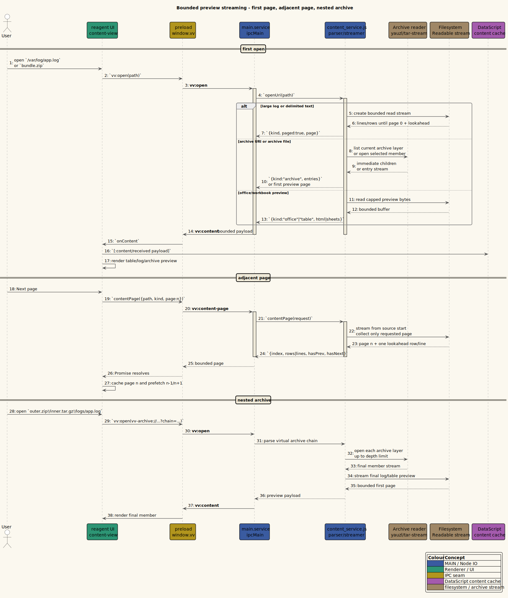

# 03. IPC Protocol

This page specifies the Electron main/renderer IPC seam exposed as `window.vv`.
The flat channel lookup is in [../reference/ipc-channels.md](../reference/ipc-channels.md).

---

## 1. Mediator rule

All cross-process traffic passes through `resources/preload.js`:

```text
renderer re-frame effect
  -> window.vv.method(...)
  -> ipcRenderer.send("vv:*", payload)
  -> ipcMain handler in main
```

and:

```text
main webContents.send("vv:*", payload)
  -> preload on* wrapper
  -> renderer callback
  -> rf/dispatch [...]
```

The renderer never receives `ipcRenderer` or `fs`.

The sequence below shows the bounded-preview protocol for large logs, delimited files,
and archive members. A *page* is a finite row or line window; a *virtual archive URI*
is an address for an archive member that has not been extracted to disk.



*Figure - source: [`docs/diagrams/seq-content-page-streaming.puml`](../diagrams/seq-content-page-streaming.puml).*

---

## 2. Renderer to main

Two transport shapes cross the seam. A **send** channel is fire-and-forget
(`ipcRenderer.send`); an **invoke** channel is a request/response Promise
(`ipcRenderer.invoke`) and is marked *(invoke)* below. The tables enumerate every
channel exposed by `resources/preload.js` (this list is authoritative and complete).

### 2.1 Content, open, and paging

| Channel | `window.vv` API | Payload | Main owner | Purpose |
|---------|-----------------|---------|------------|---------|
| `vv:open` | `open(path)` | string path/URI | `vinary.main.service` | Read, classify, send content, send tree, ensure watcher/poller. Accepts local, `ssh://`/`sftp://`, and `vv-archive://` paths. |
| `vv:close` | `close(path)` | string path | `vinary.main.service` | Close an individual watcher path. Kept for compatibility; retained sync is authoritative. |
| `vv:retained-files` | `syncRetainedFiles(paths)` | path vector | `vinary.main.service` | Reconcile main watchers to the renderer's retained path set. |
| `vv:watch-assets` | `watchAssets(docPath, paths)` | `{docPath, paths}` | `vinary.main.service` | Watch embedded local assets referenced by a document. |
| `vv:content-page` *(invoke)* | `contentPage(request)` | page request map | `content_service` | Fetch one bounded page of a large log/table preview. Accepts `ssh://` paths. |
| `vv:complete-path` *(invoke)* | `completePath(input)` | string prefix | `vinary.main.service` | Address-bar path completion (local + async remote-directory branch). |
| `vv:load-pdf-bytes` *(invoke)* | `loadPdfBytes(path)` | string path | `content_service` | Load a collocated sibling PDF's bytes into the renderer's pdf-cache (Document↔PDF switch; no new tab). |
| `vv:load-diff-sources` *(invoke)* | `loadDiffSources(req)` | request map | `content_service` | Resolve a diff's referenced source files from disk/SFTP for the enriched side-by-side view. |
| `vv:load-remote-asset` *(invoke)* | `loadRemoteAsset(req)` | `{uri, relativeTo}` | `content_service` | Fetch a remote asset's bytes over SFTP → a `data:` URL (remote Markdown/Office relative images). |

### 2.2 Document streaming (credit-1 pull cursor)

| Channel | `window.vv` API | Payload | Main owner | Purpose |
|---------|-----------------|---------|------------|---------|
| `vv:stream-open` *(invoke)* | `streamOpen(req)` | `{path, kind, …}` | `content_service` | Open a bounded-memory stream session (creates a read cursor); returns a session id + first batch. |
| `vv:stream-pull` *(invoke)* | `streamPull(req)` | `{id}` | `content_service` | Pull the next batch (credit-1 backpressure); returns `{batch, done, error, partial}`. |
| `vv:stream-close` *(invoke)* | `streamClose(req)` | `{id}` | `content_service` | Close the session and release its fd. |

### 2.3 Web view (browserized HTTP/HTTPS)

| Channel | `window.vv` API | Payload | Main owner | Purpose |
|---------|-----------------|---------|------------|---------|
| `vv:http-show` | `httpShow(url, bounds, tabId)` | `{url, bounds, tabId}` | `vinary.main.web` | Show the HTTP/HTTPS web view for a tab. |
| `vv:http-hide` | `httpHide()` | none | `vinary.main.web` | Hide the web view. |
| `vv:http-bounds` | `httpBounds(bounds)` | `{bounds}` | `vinary.main.web` | Reposition the web view. |
| `vv:http-snapshot` *(invoke)* | `httpSnapshot()` | none | `vinary.main.web` | Capture a page snapshot (paired with `vv:http-snapshot-ready`). |
| `vv:http-toc-goto` | `httpTocGoto(id)` | heading id | `vinary.main.web` | Ask the web preload to scroll to a heading. |
| `vv:http-scroll` | `httpScroll(kind)` | page/edge key | `vinary.main.web` | Forward page/edge scroll keys to the native web view when visible. |
| `vv:http-zoom` / `vv:http-zoom-set` | `httpZoom(dir)` / `httpZoomSet(f)` | dir / factor | `vinary.main.web` | Adjust / set the web view's zoom factor. |

### 2.4 SSH/SFTP remote files and connections

| Channel | `window.vv` API | Payload | Main owner | Purpose |
|---------|-----------------|---------|------------|---------|
| `vv:ssh-prompt-reply` | `sshPromptReply(promptId, secret)` | `{promptId, secret}` | `vinary.main.ssh` | The typed SSH secret — the **only** secret-bearing channel; one-shot, never persisted. |
| `vv:ssh-close-connection` | `sshCloseConnection(connKey)` | connKey string | `vinary.main.ssh` | Close a pooled SSH connection. |
| `vv:connections-request` | `requestConnections()` | none | `vinary.main.connections` | Push current `connections.edn`. |
| `vv:connections-save` | `saveConnections(edn)` | EDN string | `vinary.main.connections` | Persist non-secret SSH connection metadata. |

### 2.5 Configuration and persistence

| Channel | `window.vv` API | Payload | Main owner | Purpose |
|---------|-----------------|---------|------------|---------|
| `vv:keymap-request` / `vv:keymap-save` | `requestKeymap()` / `saveKeymap(edn)` | none / EDN | `vinary.main.config` | Push / persist `keybindings.edn`. |
| `vv:settings-request` / `vv:settings-save` | `requestSettings()` / `saveSettings(edn)` | none / EDN | `vinary.main.settings` | Push / persist `settings.edn`. |
| `vv:recent-request` / `vv:recent-save` | `requestRecent()` / `saveRecent(edn)` | none / EDN | `vinary.main.recent` | Push / persist `recent.edn` (trail + MRU). |
| `vv:grammars-request` | `requestGrammars()` | none | `vinary.main.grammars` | Push grammar registry. |

### 2.6 Extensions and ad-blocking

| Channel | `window.vv` API | Payload | Main owner | Purpose |
|---------|-----------------|---------|------------|---------|
| `vv:ext-config-request` / `vv:ext-config-save` | `requestExtConfig()` / `saveExtConfig(edn)` | none / EDN | `vinary.main.ext-config` | Push / persist `extensions.edn`. |
| `vv:ext-state-request` | `extState()` | none | `vinary.main.extensions` | Push extension runtime state. |
| `vv:ext-install` / `vv:ext-remove` / `vv:ext-set-enabled` | `extInstall(id)` / `extRemove(id)` / `extSetEnabled(id, on)` | id / `{id,on}` | `vinary.main.extensions` | Install / remove / toggle an extension. |
| `vv:ext-check-updates` | `extCheckUpdates()` | none | `vinary.main.extensions` | Check for extension updates. |
| `vv:ext-action-clicked` / `vv:ext-popup-close` | `extActionClicked(id,popup,bounds)` / `extPopupClose()` | `{id,popup,bounds}` / none | `vinary.main.ext-popup` | Open / close an extension action popup. |
| `vv:adblock-set-enabled` / `vv:adblock-set-lists` / `vv:adblock-refresh` | `adblockSetEnabled(on)` / `adblockSetLists(kw)` / `adblockRefresh()` | on / kw / none | `vinary.main.adblock` | Toggle, choose lists, or refresh ad-block filters. |

### 2.7 Password-manager bridge

| Channel | `window.vv` API | Payload | Main owner | Purpose |
|---------|-----------------|---------|------------|---------|
| `vv:password-state-request` | `passwordState()` | none | `vinary.main.passwords` | Push provider/status metadata (never revealed secrets). |
| `vv:password-search` | `passwordSearch(url)` | url | `vinary.main.passwords` | Search saved logins for a URL. |
| `vv:password-fill` | `passwordFill(item)` | item metadata | `vinary.main.passwords` | Fill the selected login into the web view. |
| `vv:password-save` / `vv:password-dismiss-save` | `passwordSave(payload)` / `passwordDismissSave(token)` | payload / token | `vinary.main.passwords` | Save a new login / dismiss a save prompt. |

### 2.8 Shell, window, and app lifecycle

| Channel | `window.vv` API | Payload | Main owner | Purpose |
|---------|-----------------|---------|------------|---------|
| `vv:open-dialog` | `openDialog(defaultPaths)` | candidate paths (`string[]`) | `vinary.main.shell` | Show the native Open dialog, seeded to the active file's / active directory's / most-recent file's folder. The renderer sends an ordered candidate chain — the active tab's local path (`nav/dialog-seed-path`) then the recent-files MRU, deduped; main's `seeds->dir` opens in the first candidate that still resolves (a file → its parent dir, a directory → itself), falling back to the OS home dir. Chosen paths return via `vv:open-files`. |
| `vv:clipboard-write` | `copyText(text)` | string | `vinary.main.shell` | Write clipboard text. |
| `vv:open-path` / `vv:open-external` | `openPath(path)` / `openExternal(url)` | string | `vinary.main.shell` | Open a local path / external URL via the OS. |
| `vv:app-info-request` | `requestAppInfo()` | none | main app info | Push app metadata. |
| `vv:quit` | `quit()` | none | main app lifecycle | Quit application. |
| `vv:devtools` | `toggleDevtools()` | none | `vinary.main.shell` | Toggle DevTools. |
| `vv:zoom` / `vv:zoom-set` | `zoom(dir)` / `zoomSet(f)` | dir / factor | `vinary.main.window` | Adjust / set the app-renderer (DOM) zoom. |

> **Retired PDF shims.** `pdfShow` / `pdfHide` / `pdfBounds` (channels `vv:pdf-show`,
> `vv:pdf-hide`, `vv:pdf-bounds`) remain exposed by the preload as **no-ops with no
> main-process listener** — the native PDF `WebContentsView` was retired for
> in-renderer pdf.js ([ADR-0013](../design-decisions/0013-in-renderer-pdfjs.md)). They
> are kept only for recoverability and carry no runtime behavior.

---

## 3. Main to renderer

Every `on*` API returns an unsubscribe function.

| Channel | `window.vv` API | Payload | Renderer event |
|---------|-----------------|---------|----------------|
| `vv:content` | `onContent(cb)` | `{path, kind, text?, html?, entries?, sheets?, page?, meta?, stamp?}` | `[:content/received payload]` |
| `vv:error` | `onError(cb)` | `{path, message, stamp?}` | `[:content/error payload]` |
| `vv:tree` | `onTree(cb)` | `{root, files, synthetic?}` | `[:tree/received payload]` |
| `vv:keymap` | `onKeymap(cb)` | EDN string or parsed payload | `[:keymap/config-received payload]` |
| `vv:grammars` | `onGrammars(cb)` | grammar registry | grammar registry event |
| `vv:http-navigated` | `onHttpNavigated(cb)` | `{url}` | `[:http/navigated payload]` |
| `vv:web-toc` | `onWebToc(cb)` | heading vector | `[:web/toc headings]` |
| `vv:web-active-heading` | `onWebActiveHeading(cb)` | id or nil | `[:web/active-heading id]` |
| `vv:history-nav` | `onHistoryNav(cb)` | direction | history event |
| `vv:open-files` | `onOpenFiles(cb)` | `{paths}` | `[:files/opened payload]` |
| `vv:settings` | `onSettings(cb)` | EDN string | `[:settings/received text]` |
| `vv:ssh-prompt` | `onSshPrompt(cb)` | `{promptId, kind, host, user, attempt, keyPath?, prompt?}` (non-secret request) | `[:ssh/prompt req]` |
| `vv:ssh-error` | `onSshError(cb)` | `{connKey, host, kind, message}` | `[:ssh/error info]` |
| `vv:ssh-status` | `onSshStatus(cb)` | `{connKey, host, state}` | `[:ssh/status info]` |
| `vv:connections` | `onConnections(cb)` | EDN string | `[:connections/received text]` |
| `vv:recent` | `onRecent(cb)` | EDN string | `[:recent/received text]` |
| `vv:app-info` | `onAppInfo(cb)` | app metadata | `[:app-info/received info]` |

---

## 4. Payload discipline

Most payloads are structured-clonable JavaScript values. Settings and keybinding
config intentionally cross as EDN text so Clojure keywords survive the round trip.

Main-to-renderer content payloads:

```clojure
{:path "/abs/path/doc.md"
 :kind "markdown"
 :text "# Title"
 :stamp 1780000000000}
```

Large logs and large delimited files use a two-step protocol. The initial
`vv:content` message is a manifest plus the first page. The main process reads
the source through a stream and stops after the requested page plus one lookahead
line or row, so the renderer never receives an unbounded text blob for these
formats:

```clojure
{:path "/abs/path/app.log"
 :kind "log"
 :paged true
 :page {:index 0 :lines ["..."] :hasPrev false :hasNext true}
 :meta {:size 81234567 :pageSize 2000}
 :stamp 1780000000000}
```

The renderer asks for adjacent pages through `vv:content-page`:

```clojure
{:path "/abs/path/app.log" :kind "log" :stamp 1780000000000 :page 1}
```

and receives only that bounded page. Delimited files use the same shape with
`:kind "table"` and `:rows` instead of `:lines`. The renderer keeps a finite
nearby-page cache and prefetches the previous and next page when possible; main
keeps a bounded request cache keyed by `path`, `stamp`, `kind`, `page`, and
`sheet`.

Supported tabular preview formats are `.csv`, `.tsv`, `.tab`, `.psv`, `.dsv`,
`.xlsx`, `.xlsm`, `.ods`, and `.fods`. Delimited files are stream-paged when
large; workbook formats are parsed from capped preview bytes because their ZIP/XML
metadata must be read together. Supported office-style document previews are
`.docx`, `.odt`, `.odp`, and `.odf`; they produce sanitized HTML plus extracted
text where available.

**Directories reuse `vv:content`** — no dedicated channel. When the opened path is a
directory, `vinary.main.service/send-content!` sends a listing instead of file text:

```clojure
{:path "/abs/path/dir"
 :kind "directory"
 :entries [{:name "report.md" :path "/abs/path/dir/report.md"
            :dir? false :size 8421 :mtime 1780000000000 :symlink false}
           …]
 :stamp 1780000000000}
```

The renderer stores `:entries` on the document entity as `:doc/entries` and renders
the in-pane directory browser. A depth-0 watcher re-sends the listing as children
change, exactly like a file's live refresh.

Archives also reuse `vv:content`: opening an archive returns `:kind "archive"` with
directory-browser-compatible `:entries`. Entry paths are virtual archive URIs rather
than extracted temporary files. Archive directories are represented as URI-chain
entries ending in `/`; archive members retain their full path within the current
archive layer:

```text
vv-archive://open?chain=%5B%22%2Fabs%2Fbundle.zip%22%2C%22logs%2Fapp.log%22%5D
```

The URI-bar display form is `file:///abs/bundle.zip!/logs/app.log`. Nested archives
append archive entry names to the encoded chain, for example:

```text
vv-archive://open?chain=%5B%22%2Fabs%2Fouter.zip%22%2C%22inner.tar.gz%22%2C%22logs%2Fapp.log%22%5D
```

The main process resolves the chain one archive layer at a time, never writes an
extracted entry to disk, and enforces bounded nested-archive depth and entry-size
limits before streaming the final entry to its preview.

Markdown render output is not sent by main; it is produced in the renderer and
committed as:

```clojure
{:html "<h1 id=\"title\">Title</h1>"
 :toc [{:level 1 :text "Title" :id "title"}]
 :assets ["/abs/path/diagram.svg"]}
```

---

## 5. Security posture

| Control | Current setting |
|---------|-----------------|
| `contextIsolation` | enabled |
| `nodeIntegration` | disabled |
| Renderer filesystem access | none; only `window.vv` methods |
| Raw Markdown HTML | sanitized — `rehype-raw` + `rehype-sanitize` (GitHub allowlist) |
| Renderer sandbox | tracked as a hardening item |
| Strict CSP | applied — `<meta>` in `index.html` |

The seam is intentionally broad enough for current app features but narrow
enough to audit. New privileged capabilities should be added in main, exposed as
small `window.vv` methods, and documented here and in the threat model.
