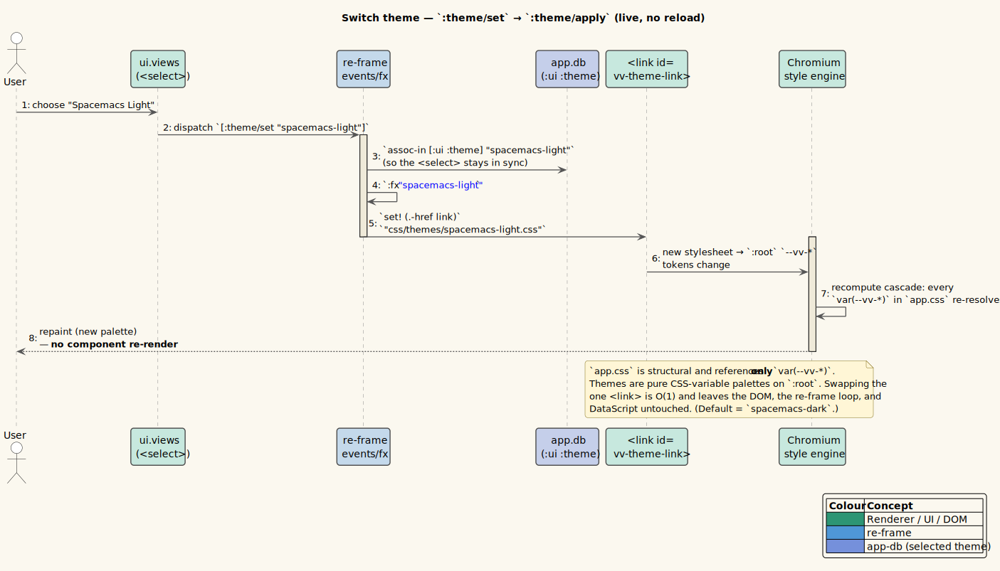

# 05 · Data Flows

> **Scope.** One subsection per user-facing flow, each with a **literate trace** (numbered steps that
> read end-to-end) and a **sequence diagram**. Flows: open a file, live edit, open via tree, activate
> tab, close tab, theme switch, find, history, error arrival/retraction. The event/effect/sub details
> are catalogued in [reference/events-effects-subs.md](../reference/events-effects-subs.md); the IPC
> channels in [03 · IPC Protocol](./03-ipc-protocol.md).

**Diagram ownership.** This page owns and embeds [`seq-tab-close`](../diagrams/seq-tab-close.puml),
[`seq-theme-switch`](../diagrams/seq-theme-switch.puml), [`seq-markdown-render`](../diagrams/seq-markdown-render.puml),
and [`seq-tree`](../diagrams/seq-tree.puml). It also references diagrams owned by other writers —
[`seq-open-file`](../diagrams/seq-open-file.puml), `seq-live-refresh.puml`, `seq-find.puml`,
`seq-history.puml` — by path.

---

## 1. Open a file

**Trigger:** `vv README.md` on the command line (or macOS `activate`).

*Source: [`../diagrams/seq-open-file.puml`](../diagrams/seq-open-file.puml).*

1. `vinary.main.core/main` runs: `service/init!` registers `ipcMain` handlers; `.whenReady` →
   `create-window!`.
2. `create-window!` builds the `BrowserWindow` (`contextIsolation`, `nodeIntegration:false`,
   `preload`), then `loadFile index.html`.
3. The renderer page loads → `vinary.renderer.core/init`: `dispatch-sync [:db/init]`,
   `ds/install-bridge!`, dev hooks, **`bridge!`** (wires `window.vv.onContent/onError/onTree` →
   re-frame), `keybindings!`, `mount!`.
4. On the window's **`did-finish-load`**, main calls `service/open! wc (initial-file)` for the argv
   path (timing guarantees the renderer's listeners exist).
5. `service/open!` → `send-content!`: `kind-of` = `"markdown"` → `readFileSync` (utf8) →
   `webContents.send "vv:content" {:path :kind "markdown" :text}`.
6. Renderer `bridge!`'s `onContent` → `js->clj` (keywordize) → `dispatch [:content/received {…}]`.
7. `:content/received` (an `-fx` handler): reads the DataScript snapshot, computes `order` (new doc →
   `next-order`), builds `base` `{:doc/path :doc/kind :doc/open? true :doc/order (:doc/text)}`, sets
   `:db (nav-to db path)` (active-path + history), and emits effects:
   - `[:ds/transact [base]]` — the doc lands in DataScript;
   - because `kind = "markdown"`: `[:markdown/render {:text :path :on-done [:content/rendered path]}]`.
8. `:markdown/render` fx runs the unified pipeline (see [§ Markdown render](#markdown-render-shared-sub-flow));
   on success it dispatches `[:content/rendered path html]`.
9. `:content/rendered` → `[:ds/transact [{:doc/path path :doc/html html}]]` — the HTML upserts onto
   the same entity (keyed by `:doc/path`).
10. Each transaction fires `d/listen!` → `[:ds/changed]` → `:ds/rev` ++. The `:tabs` and `:doc/active`
    subscriptions recompute; `content-view` shows `markdown-body`, which **imperatively** sets
    `innerHTML` to the HTML (see [06 §3](./06-renderer-runtime.md#3-the-imperative-innerhtml-body)).
11. In parallel, `open!` → `send-tree!`: if the file is in a git repo, `webContents.send "vv:tree"
    {:root :files}` → `[:tree/received]` → the file-tree sidebar renders (see [§3](#3-open-via-tree)).
12. Finally `open!` registers a chokidar watcher for the path (kept live; see [§2](#2-live-edit-refresh)).

---

## 2. Live edit (refresh)

**Trigger:** the user saves `README.md` in their editor; chokidar fires `change` (or `add` for atomic
saves that re-create the file).

*Diagram: `seq-live-refresh.puml` (theory-owned) — referenced by path.*

1. The per-path chokidar watcher (registered in `open!`, with `ignoreInitial:true` and
   `awaitWriteFinish {stabilityThreshold 80 pollInterval 20}` to coalesce partial writes) fires
   `change`/`add`.
2. The watcher callback calls `send-content!` again for the same path → `vv:content` with the new
   text.
3. Renderer → `[:content/received {…}]`. This time `eid-for-path` finds the **existing** entity and
   `order-for-path` returns its **existing** order — so the tab does not move.
4. `base` is rebuilt (`cond->` adds `:doc/text` only when truthy). If the doc currently has a
   `:doc/error` (`cur-err`), the tx **appends** `[:db/retract eid :doc/error cur-err]` so a previously
   broken file that now reads cleanly clears its error.
5. `:db (nav-to db path)` — but if the path is already the active entry, `record-nav` is a **no-op**
   (it checks `(= path (get stack idx))`), so re-saving the open file does not pollute history.
6. The markdown re-renders → `:content/rendered` upserts new `:doc/html`.
7. `:ds/rev` ++ → `:doc/active` recomputes → `markdown-body`'s `component-did-update` runs
   `set! innerHTML`. **Crucially, nothing wrote `:ui …`**, so the `.vv-content` scroll position and
   the active tab are untouched — the preview updates *in place*.

> **The whole point.** Step 7 is the live-refresh guarantee: content flows into DataScript, the
> reactive spine repaints the body, and because UI/scroll state lives in a *separate* store that the
> content path never touches, you keep your place. See
> [theory/03-live-refresh-spine.md](../theory/03-live-refresh-spine.md).

---

## 3. Open via tree

**Trigger:** click a file in the git file-tree sidebar.

*Source: [`../diagrams/seq-tree.puml`](../diagrams/seq-tree.puml).*

**Delivery (how the tree got there):**

1. On `open!`, `send-tree!` → `repo-tree`: `git rev-parse --show-toplevel` (cwd = the file's
   directory) then `git ls-files` from the root. Result `{:root :files}` (repo-relative paths). If not
   a repo / git missing, `repo-tree` returns `nil` and **no `vv:tree` is sent** (the sidebar simply
   doesn't appear).
2. `vv:tree` → `[:tree/received {:root :files}]` → `assoc-in [:ui :tree]`.
3. `:ui/tree` fires → `ui.tree/file-tree`: `build-tree` folds flat paths into a nested map; renders
   collapsible `
`/`
` folders and `<a>` file links.

**Opening a file from it:**

4. Click a file `<a>` → `dispatch [:doc/open full-path]` (the full path = `root "/" relative`).
5. `:doc/open` → `[:vv/open path]` fx → `window.vv.open(path)` → `vv:open` → main `service/open!`.
6. From here it is exactly the [open-a-file](#1-open-a-file) flow (content + render + a fresh watcher).

**Filtering:**

7. Typing in "Filter files…" → `[:tree/filter q]` → `assoc-in [:ui :tree-filter]`. `file-tree` keeps
   files whose lower-cased path `includes?` the lower-cased query; when a filter is active, matching
   folders are force-expanded (`:open true`). No round trip to main — pure `app-db` view recompute.

---

## 4. Activate tab

**Trigger:** click a tab in the strip (or a tree file that is already open).

1. `ui.tabs/tab-strip` renders one `.vv-tab` per `@(subscribe [:tabs])`; click →
   `dispatch [:tab/activate path]`.
2. `:tab/activate` (an `-db` handler) → `(nav-to db path)` = `assoc-in [:ui :active-path] path` +
   `record-nav` (push onto history unless it's already the current entry).
3. `:ui/active-path` changes → `:doc/active` recomputes (it lists `:<- [:ui/active-path]`) →
   `content-view` swaps to the now-active document's HTML/image/error.
4. The tab strip re-renders with the new `.vv-tab-active`. No IPC, no DataScript write — activation is
   pure UI state.

---

## 5. Close tab

**Trigger:** click the `×` on a tab.

*Source: [`../diagrams/seq-tab-close.puml`](../diagrams/seq-tab-close.puml).*

1. `.vv-tab-close` `×` → `(.stopPropagation e)` (so it doesn't also activate the tab) →
   `dispatch [:tab/close path]`.
2. `:tab/close` (an `-fx` handler) reads the DataScript snapshot **before** mutating:
   - `eid` = `eid-for-path snap path`;
   - `remaining` = `open-docs` minus the closed path (preserving order);
   - `active` = current `(:ui :active-path)`;
   - `new-active` = `(if (= active path) (:path (last remaining)) active)` — i.e. if you closed the
     active tab, fall to the **last** remaining tab (or `nil` if none remain).
3. `:db` = `assoc-in [:ui :active-path] new-active`.
4. Effects: when `eid` exists, `[:ds/transact [[:db/retractEntity eid]]]` (drops the whole doc entity
   — its cached HTML/text included); **always** `[:vv/close path]`.
5. `:vv/close` → `window.vv.close(path)` → `vv:close` → main `service/close!` stops that path's
   chokidar watcher and `dissoc`s it from the `watchers` atom (so a closed file no longer streams).
6. The `retractEntity` bumps `:ds/rev` → `:tabs` recomputes (one fewer tab) and `:doc/active`
   recomputes against the new `active-path`. If no tabs remain, `content-view`'s
   `(empty? tabs)` branch shows the **watermark**.

> **Re-opening a closed tab re-reads from disk.** Closing fully retracts the entity, so the cached
> render is gone; navigating back to that path re-opens it via the normal open flow.

---

## 6. Switch theme

**Trigger:** choose a theme in the toolbar `<select>`.

*Source: [`../diagrams/seq-theme-switch.puml`](../diagrams/seq-theme-switch.puml).*

1. The `<select.vv-theme-select>` `:on-change` → `dispatch [:theme/set value]` (value ∈
   `"spacemacs-dark"` / `"spacemacs-light"`).
2. `:theme/set` (an `-fx` handler): `:db` = `assoc-in [:ui :theme] value` (keeps the `<select>` in
   sync, since it reads `@(subscribe [:ui/theme])`); `:fx` = `[[:theme/apply value]]`.
3. `:theme/apply` fx finds `#vv-theme-link` (the `<link>` in `index.html`) and
   `set! (.-href link) "css/themes/<value>.css"`.
4. The browser loads the new stylesheet; its `:root` redefines the `--vv-*` tokens. Because `app.css`
   is **structural** and references **only** `var(--vv-*)`, the whole cascade re-resolves and the UI
   repaints — **with no component re-render, no DataScript read, and no re-frame work** beyond the one
   `assoc`.

> **Why this is O(1).** Themes are pure CSS-variable palettes; switching is a single DOM attribute
> mutation. There is no per-element restyle in JS, no re-mount, and no content reload. The default is
> `spacemacs-dark` (set both in `index.html` and `default-db`). The CSS-variable indirection is the
> whole mechanism — see [theory/05-strategy-renderer-registry.md](../theory/05-strategy-renderer-registry.md)
> and [reference/css-variables.md](../reference/css-variables.md).

---

## 7. Find (in-page search)

**Trigger:** `Ctrl+F` (toggles the find bar), then typing; `Enter`/`Shift+Enter` to cycle; `Escape`
to close.

*Diagram: `seq-find.puml` (theory-owned) — referenced by path.*

1. `Ctrl+F` is resolved by the keymap resolver (`vinary.input.resolver`): the `:default` preset binds
   `"C-f"` → the `:search/start` command → `dispatch [:find/toggle]`. `:find/toggle` flips
   `(:ui :find :visible?)`; when hiding, it also emits `[:find/clear]`. (In the `:vim` preset find is
   `/`; `n`/`N` cycle.)
2. The find bar (`find-bar`, shown when `:visible?`) `:on-change` → `[:find/set-query q]`:
   `assoc-in [:ui :find :query]` + `:fx [[:find/run q]]`.
3. `:find/run` fx calls `finder/search! q`, then dispatches `[:find/count n]` with the result.
4. `finder/search!`:
   - blank query → `clear!` → `0`;
   - else `collect-ranges` over `.vv-content` via a `TreeWalker(SHOW_TEXT)`, doing a case-insensitive
     `indexOf` within **single text nodes**, producing DOM `Range`s;
   - `paint!` registers a `Highlight` of all ranges as `CSS.highlights["vv-find"]` and a second
     `Highlight` of the focused range as `CSS.highlights["vv-find-current"]` (styled via
     `::highlight(vv-find)` / `::highlight(vv-find-current)` in `app.css`); a `supported?` guard
     no-ops where the API is unavailable;
   - `scroll-to!` `scrollIntoView {block:"center" behavior:"smooth"}` on the focused match's parent;
   - returns the match **count**.
5. `:find/count n` → sets `(:ui :find :count) n` and `(:ui :find :idx) (if (pos? n) 1 0)` (1-based
   display).
6. `Enter`/`Shift+Enter` (or the ↑/↓ buttons) → `[:find/cycle dir]` → `:find/cycle` fx →
   `finder/cycle! dir`, which advances `idx ≔ (idx + dir) mod n`, repaints the current highlight,
   re-scrolls, and returns the new 1-based index → `[:find/idx i]`.
7. `Escape` (or `×`) → `[:find/close]` → `:visible? false` + `[:find/clear]` (deletes both highlight
   registrations and resets the finder's internal state).

> **Why the CSS Custom Highlight API.** It paints `Range`s **without mutating the document DOM**, so
> it composes cleanly with the imperative `innerHTML` body (no wrapping `<mark>` elements that would
> fight the `set! innerHTML`). See [theory/06-find-css-custom-highlight.md](../theory/06-find-css-custom-highlight.md)
> and the [W3C CSS Custom Highlight API](https://www.w3.org/TR/css-highlight-api-1/).

---

## 8. History (back / forward)

**Trigger:** the toolbar ← / → buttons, or `Alt+←` / `Alt+→` (the `:default` preset binds
`"M-left"`/`"M-right"` to `:history/back`/`:history/forward`; `:vim` adds `C-o`/`C-i` and `H`/`L`).

*Diagram: `seq-history.puml` (theory-owned) — referenced by path.*

The history is a **Command/Memento** model: each navigation reifies a path onto a stack with a cursor.

1. **Recording.** Every `nav-to` (called by `:tab/activate` and `:content/received`) runs `record-nav`:
   if `path` equals the current entry it is a no-op; otherwise it **truncates the forward branch** and
   appends — `stack' ≔ (conj (vec (take (inc idx) stack)) path)`, `idx ≔ (dec (count stack'))`. This
   is the classic "navigating somewhere new discards the redo history" behaviour.
2. **Back.** `Alt+←` → `[:history/back]`: if `(pos? idx)`, decrement `idx` and set `active-path` to
   `(get stack (dec idx))`. Otherwise no-op.
3. **Forward.** `Alt+→` → `[:history/forward]`: if `idx < (dec (count stack))`, increment `idx` and
   set `active-path` accordingly. Otherwise no-op.
4. **Button enablement.** `:history/can-back?` = `(and idx (pos? idx))`; `:history/can-forward?` =
   `(and idx (< idx (dec (count stack))))`. The toolbar `←`/`→` buttons are `:disabled` when these are
   false.

> Note that back/forward set `active-path` **directly** (they do not call `nav-to`/`record-nav`), so
> traversing history does not itself rewrite history — only *new* navigations do. See
> [theory/07-command-history-model.md](../theory/07-command-history-model.md).

---

## 9. Error arrival & retraction

**Trigger (arrival):** main fails to read a file, or the markdown pipeline rejects.

1. **Read error.** `send-content!`'s `catch` → `vv:error {:path :message}` → `[:content/error {…}]` →
   (when `path`) `[:ds/transact [{:doc/path path :doc/error message}]]`.
2. **Render error.** The `:markdown/render` fx `.catch` → `[:content/error {:path :message "render
   error: …"}]` → the same `:doc/error` transaction.
3. `:ds/rev` ++ → `:doc/active` recomputes → `content-view`'s **`(:doc/error doc)`** branch (which
   precedes the image/html branches) renders `[:div.vv-error "Error: " message]`.

**Trigger (retraction):** the file is fixed and saved.

4. The watcher fires → `send-content!` succeeds → `vv:content` → `[:content/received {…}]`.
5. `:content/received` reads the current error via `doc-attr … :doc/error` into `cur-err`; because the
   new `base` map omits `:doc/error`, the tx **appends** `[:db/retract eid :doc/error cur-err]` to
   actively clear it (you cannot transact `:doc/error nil`).
6. `:ds/rev` ++ → `:doc/active` no longer has `:doc/error` → `content-view` falls through to the
   markdown body. The error view vanishes automatically.

> **Content-view strategy precedence** (highest first): empty tabs → **watermark**; else `:doc/error`
> → **error div**; else `kind = "image"` → **``**; else `:doc/html` → **markdown-body**;
> else → **"Rendering…"**. This ordering is why an error always wins over a stale render until it is
> retracted.

---

## Markdown render (shared sub-flow)

Referenced by [§1](#1-open-a-file), [§2](#2-live-edit-refresh), and [§9](#9-error-arrival--retraction).

*Source: [`../diagrams/seq-markdown-render.puml`](../diagrams/seq-markdown-render.puml).*

1. `:markdown/render {:text :path :on-done}` fx calls `renderer.markdown/render text`.
2. `render` builds a `unified` processor and `.use`s the chain **in order**:
   `remark-parse` → `remark-gfm` → `remark-rehype` → `rehype-slug` → `rehype-highlight` →
   `rehype-stringify`, then `.process md` → `Promise<string>`.
3. **Fulfilled:** the fx's `.then` dispatches `(conj on-done html)` = `[:content/rendered path html]`
   → `[:ds/transact {:doc/path path :doc/html html}]`.
4. **Rejected:** the fx's `.catch` dispatches `[:content/error {:path :message "render error: …"}]`.
5. For `kind = "text"` there is **no** pipeline: `:content/received` directly transacts
   `{:doc/html (plain-html text)}` where `plain-html` wraps the **HTML-escaped** text
   (`goog.string/htmlEscape`) in `<pre class="vv-plain">`.

> **No `rehype-raw`** in the chain ⇒ raw HTML embedded in the Markdown source is not re-parsed or
> injected (see [03 §7](./03-ipc-protocol.md#7-security-seam)). `rehype-slug` runs *before* the
> output is stringified, so the heading `id`s it adds are available to both in-page find and the TOC.

---

## See also

- [reference/events-effects-subs.md](../reference/events-effects-subs.md) — exhaustive event/effect/sub tables.
- [03 · IPC Protocol](./03-ipc-protocol.md) · [04 · State Schema](./04-state-schema-reference.md).
- [06 · Renderer Runtime](./06-renderer-runtime.md) — the boot sequence and the imperative body.
