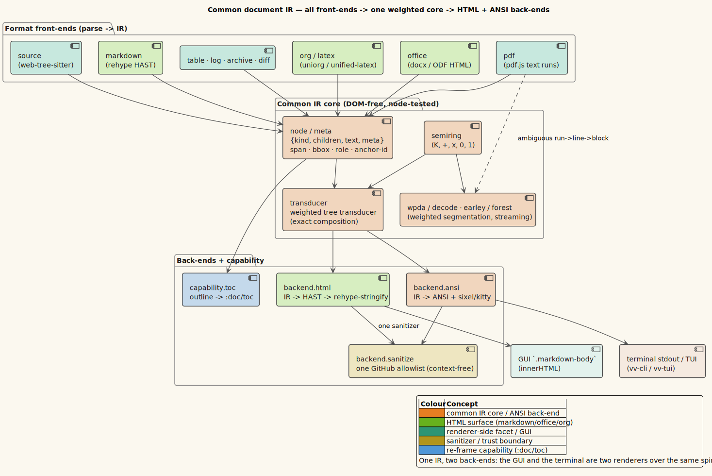
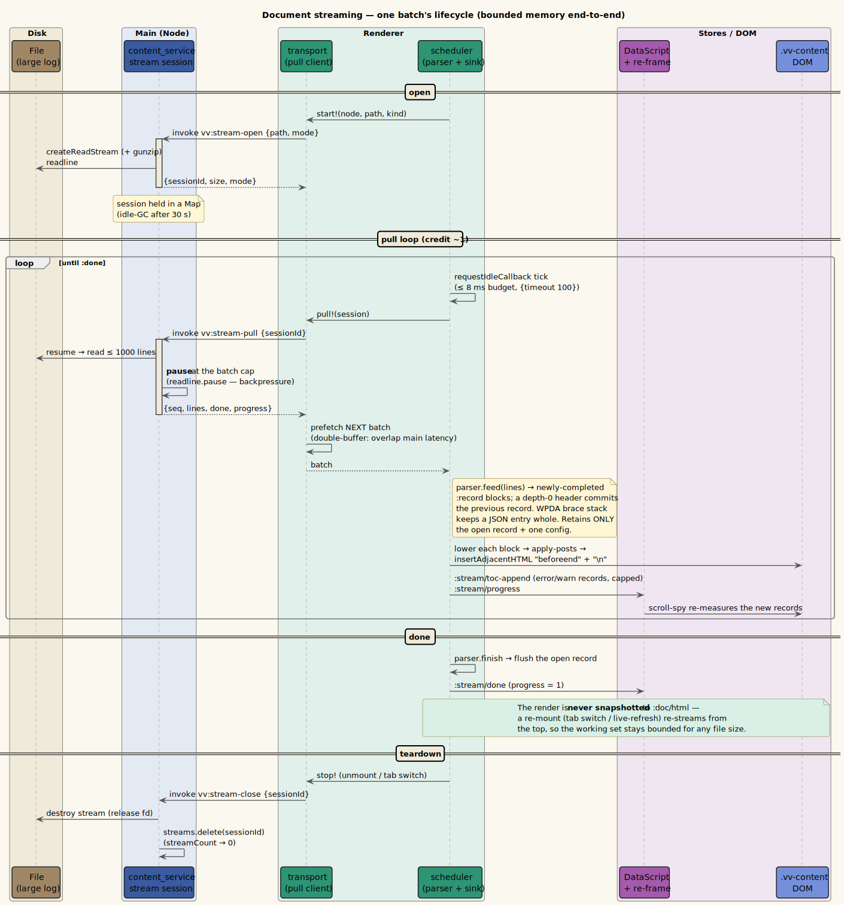
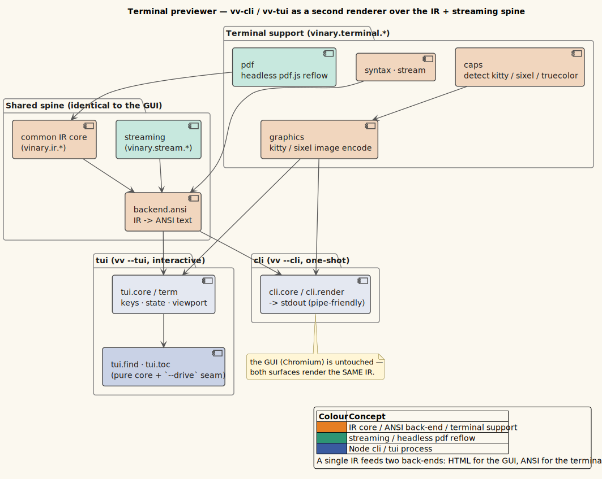

# 07 — The common IR, streaming, and terminal layers

Architecture pages [01](01-overview.md)–[06](06-renderer-runtime.md) describe the process/build topology, the
IPC protocol, the state schema, the data flows, and the renderer runtime — the shape the app had before the
`0.3.0` cycle. This page documents the **concrete component realization** of the five namespace layers that
cycle added: the common document IR (`ir.*`), the streaming pipeline (`stream.*`), and the terminal renderer
(`terminal.*`, `cli.*`, `tui.*`). Where [theory/08–10](../theory/08-common-document-ir.md) explain *why* these
exist, this page is the *what and where* — the namespaces, their roles, and how they compose.

> **Reading order.** This page presumes the theory pillar for the ideas
> ([08 — common IR](../theory/08-common-document-ir.md), [09 — streaming/WPDA](../theory/09-document-streaming-and-the-wpda.md),
> [10 — terminal as a second renderer](../theory/10-terminal-rendering-second-renderer.md)) and
> [ADR-0017](../design-decisions/0017-common-document-ir.md)/[0018](../design-decisions/0018-document-streaming-pipeline.md)/[0019](../design-decisions/0019-terminal-preview-layer.md)
> for the decisions. It presumes [02 — process and build topology](02-process-and-build-topology.md) for the
> five builds these layers compile into.

---

## 1. The pipeline at a glance

Every supported format parses into **one** tagged, weighted-transducer IR, which lowers to **two** back-ends —
HTML for the GUI and ANSI for the terminal — through **one** sanitizer.



*Diagram source: [`../diagrams/component-ir-pipeline.puml`](../diagrams/component-ir-pipeline.puml).*

The organizing principle is **one core, many edges**: adding a format is a new front-end into the core; adding
a rendering surface (the terminal) is a new back-end out of it. Neither touches the other, which is why the
GUI was untouched when the terminal renderer was added ([ADR-0019](../design-decisions/0019-terminal-preview-layer.md)).

---

## 2. `vinary.ir.*` — the common document IR

The IR is **DOM-free and node-tested**: it depends on neither Electron nor the browser, so it runs identically
in the renderer, in the terminal tools, and under `:node-test`.

| Concern | Namespaces | Role |
|---------|-----------|------|
| **Core datatype** | `ir.node`, `ir.meta` | the tagged node `{kind, children, text, meta}`; span / bbox / role / stable `anchor-id` |
| **Weighted algebra** | `ir.semiring`, `ir.transducer`, `ir.lattice` | the semiring `$`(K, \oplus, \otimes, \bar0, \bar1)`$`; the weighted tree transducer with exact composition; the lattice the parser scores over |
| **Parsing / segmentation** | `ir.wpda`, `ir.decode`, `ir.earley`, `ir.forest` | the weighted pushdown automaton and its streaming decoder (`advance-step`/`decode`); Earley-over-lattice with a packed parse forest and Viterbi best-parse |
| **Front-ends** (parse → IR) | `ir.frontend.{markdown, office, source, pdf, table, log, log-stream, diff, archive}` | one per format family; each mirrors its native tree into the IR |
| **Back-ends** (IR → output) | `ir.backend.{html, ansi, sanitize}` | HTML for the GUI, ANSI for the terminal, and the single context-free GitHub-allowlist sanitizer both share |
| **Capabilities** | `ir.capability.toc`, `ir.layer` | cross-cutting derivations over any IR, e.g. the Contents outline → `:doc/toc` |
| **Grammar** | `ir.grammar.log` | the WPDA brace grammar that keeps a multi-line JSON log entry one record |

The theory of this layer — the semiring laws, transducer composition, and WPDA — is in
[theory/08](../theory/08-common-document-ir.md); its correctness evidence is in
[scientific/03](../scientific/03-semiring-algebraic-laws.md) and [04](../scientific/04-sanitizer-context-freedom.md).

---

## 3. `vinary.stream.*` — the streaming pipeline

Streaming turns a large document into a bounded-memory incremental render. It is a thin, pure protocol plus a
renderer-side driver; the main-process half lives in `content_service.js` (the session registry).



*Diagram source: [`../diagrams/seq-document-streaming.puml`](../diagrams/seq-document-streaming.puml).*

| Namespace | Role |
|-----------|------|
| `stream.protocol` | the pure `feed`/`finish` StreamParser contract + `drain` (fully node-testable) |
| `stream.transport` | the double-buffered, credit-1 pull client over the `vv:stream-*` channels |
| `stream.scheduler` | the idle-budget driver (`requestIdleCallback`, rAF fallback) + backpressure + teardown |
| `stream.sink` | the append-mode render sink (`insertAdjacentHTML`, cancel-aware, per-controller queue) |
| `stream.flag` | the per-kind size gate (`enabled?`: `$`(:size\ \text{meta}) \ge \text{threshold}`$`) |

Two engines share this spine: a bounded **byte-stream** for logs/text, and a byte-parity **progressive
block-commit** for Markdown/Org/PDF-reflow. The distinction, the bounded-memory proof, and the byte-parity
argument are in [theory/09](../theory/09-document-streaming-and-the-wpda.md); the validation is in
[scientific/01–02](../scientific/01-byte-parity-verification.md). The main-process channels
(`vv:stream-open`/`-pull`/`-close`) are catalogued in [03 — IPC protocol](03-ipc-protocol.md).

---

## 4. `vinary.terminal.*` / `cli.*` / `tui.*` — the second renderer

The terminal previewer is a **second renderer over the same IR and streaming spine** — it shares the core with
the GUI and differs only at the back-end (`ir.backend.ansi`) and the surface (a tty instead of a DOM).



*Diagram source: [`../diagrams/component-terminal-renderer.puml`](../diagrams/component-terminal-renderer.puml).*

| Layer | Namespaces | Role |
|-------|-----------|------|
| **Terminal support** | `terminal.caps`, `terminal.graphics`, `terminal.pdf`, `terminal.stream`, `terminal.syntax` | capability detection (truecolor / sixel / kitty); image encoding; headless pdf.js reflow; streaming + syntax over the tty |
| **CLI** (`vv --cli`) | `cli.core`, `cli.render` | one-shot render to stdout (pipe-friendly ANSI + graphics) |
| **TUI** (`vv --tui`) | `tui.core`, `tui.term`, `tui.keys`, `tui.state`, `tui.viewport`, `tui.find`, `tui.toc` | an interactive full-screen pager: in-page find, Contents outline, scrolling; a pure core with a `--drive` test seam |
| **Top-level** | `vinary.diff`, `vinary.grammar-catalog` | the pure unified/split diff model; the compile-time bundled-grammar catalog |

The `vv` launcher mode-dispatches to these builds (`vv [files]` → GUI, `--cli`, `--tui`, `--help`,
`--version`); the launch mechanics are in [engineering/05](../engineering/05-terminal-build-and-launch.md), and
the theory of "a second renderer" is in [theory/10](../theory/10-terminal-rendering-second-renderer.md).

---

## 5. How the layers compose

```text
bytes ─▶ ir.frontend.<fmt> ─▶ ir.node (core: semiring · transducer · wpda) ─┬─▶ ir.backend.html ─▶ GUI DOM
                                     ▲                                        └─▶ ir.backend.ansi ─▶ tty (cli/tui)
                                     │                                            (both ▶ ir.backend.sanitize)
   large doc ▶ stream.protocol ◀── stream.scheduler ◀── stream.transport ◀── vv:stream-* ◀── content_service session
```

The single load-bearing invariant: **the core knows nothing about its edges.** A front-end supplies IR; a
back-end consumes IR; the streaming driver commits IR *children*, format-agnostically. This is what lets a new
format (diff, in [ADR-0026](../design-decisions/0026-diff-rendering-side-by-side-and-repo-filetypes.md)) or a
new surface (the terminal) be added without touching the others.

## 6. See also

- Theory: [08 — common IR](../theory/08-common-document-ir.md), [09 — streaming/WPDA](../theory/09-document-streaming-and-the-wpda.md), [10 — terminal](../theory/10-terminal-rendering-second-renderer.md).
- Reference: [`namespaces.md`](../reference/namespaces.md) (every namespace), [`ipc-channels.md`](../reference/ipc-channels.md) (the `vv:stream-*` channels).
- Scientific: [01 byte-parity](../scientific/01-byte-parity-verification.md), [02 bounded memory](../scientific/02-bounded-memory-streaming-validation.md), [03 semiring laws](../scientific/03-semiring-algebraic-laws.md).
- Design: [ADR-0017](../design-decisions/0017-common-document-ir.md), [0018](../design-decisions/0018-document-streaming-pipeline.md), [0019](../design-decisions/0019-terminal-preview-layer.md).
