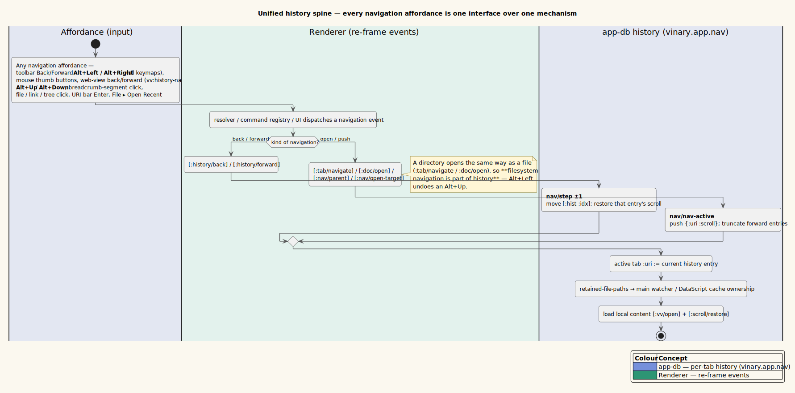
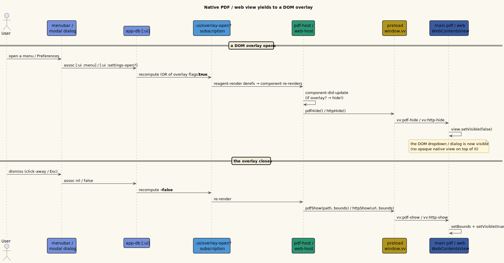

# 0012 — One history spine, an in-pane directory browser, and persisted Up/Down trail memory

- **Status:** Accepted
- **Date:** 2026-06-27
- **Deciders:** vinary-viewer maintainers

## Context

A cluster of navigation and preview-chrome requests arrived together, and they share one organizing
idea the user stated explicitly: **all the ways to navigate are interfaces to a single history
mechanism, and filesystem navigation is part of that history.** The forces:

- **`Alt+Left`/`Alt+Right` history navigation kept breaking.** They were bound to
  `:history/back`/`:history/forward` **only** in `resources/keymaps/default.edn`. `vim.edn` and
  `emacs.edn` did not bind `M-left`/`M-right` in their `:all` block, and the resolver's modal rule
  *consumes* an unbound key in Vim `:normal` (`vinary.input.resolver/step`). Because the active keymap
  set persists to `~/.config/vinary-viewer/keybindings.edn` and is re-applied at boot, a user on
  Vim/Emacs lost Alt+Arrow **and it stayed lost across restarts** — the recurring "not working, again."
- **Directories had no in-app view.** A `file://` directory classified as `{:kind :dir}`
  (`vinary.app.link`) and was shelled out to the OS file manager (`:shell/open-path`); if a directory
  path ever reached a tab, main `readFileSync`'d it and replied `vv:error` (EISDIR).
- **Native overlays hid the chrome.** The PDF (`vinary.main.pdf`) and HTTP (`vinary.main.web`) previews
  are main-owned `WebContentsView`s positioned over the renderer; a `WebContentsView` **always paints
  above the DOM**, so it obscured menu dropdowns and modal dialogs.
- **No memory of where you were.** There was no recent-files list and no notion of "the folder I just
  came up from," so a directory-tree walk could not retrace itself.
- **UI state was forgotten on quit:** window geometry and sidebar size/visibility reset every launch.

The pre-existing spine these build on: a per-tab history model in `vinary.app.nav` — `nav-active` pushes
a new `{:uri :scroll}` entry (truncating any forward entries), `step` moves the index for back/forward,
and `retained-file-paths` defines watcher/cache ownership (ADR-0010). DataScript caches content by
`:doc/path`; the renderer Strategy registry (`content-view`, ADR-0002/0003) dispatches the body by
`:doc/kind`.

## Decision

### 1 — Make every navigation affordance a thin interface over one history mechanism

Toolbar Back/Forward, `Alt+Left/Right`, the mouse thumb buttons, the embedded web view's back/forward
(`vv:history-nav` → `dispatch-history-nav!`), the new `Alt+Up`/`Alt+Down`, and breadcrumb clicks **all
dispatch into `nav/step` (±1) or `nav/nav-active` (push)** — never a parallel code path. Filesystem
navigation is ordinary navigation: opening a directory goes through `:tab/navigate`/`:doc/open`, so it
pushes the per-tab history exactly like opening a file, and `Alt+Left` undoes an `Alt+Up`.

*Diagram source: [`../diagrams/activity-unified-history.puml`](../diagrams/activity-unified-history.puml).*

**Fix the regression at its root:** bind `M-left`/`M-right`/`M-up`/`M-down` in the **`:all`** block of
*all three* keymaps (`default`, `vim`, `emacs`) — `:all`, not `:normal`, so Vim's normal mode cannot
consume them. New commands `:nav/parent` and `:nav/open-target` join `vinary.app.commands/registry`
(modeled on `:tree/up`/`:tree/open`); they carry no `:when` gate, so their event handlers — not the
resolver's gating — decide applicability (avoiding the very "silently inert" trap that hid the keys).

### 2 — Render directories in the preview pane (grid + list), piggybacking the content spine

Main (`vinary.main.service`) gains `directory?`, `entry->map`, and `list-dir`; `send-content!` sends
`{:path path :kind "directory" :entries [...] :stamp}` over the **existing** `vv:open`→`vv:content`
channel, and `open!` watches the directory with `{:ignoreInitial true :depth 0}` (immediate children
only — a bounded extension of ADR-0006, *not* the recursive watch it rejects). Each entry is plain data:
`{:name :path :dir? :size :mtime :symlink}`.

Because it rides the content spine, **tabs, per-tab history, retention, and live-refresh all work for
free, and no new IPC channel is needed.** In the renderer, `:doc/entries` is added to the
`vinary.app.ds/active-doc` pull and to `:content/received`; a new **pure-Reagent** `dir-view` component
(interactive rows belong in the React model, unlike the imperative innerHTML body of ADR-0003) and a
`(= "directory" (:doc/kind doc))` branch in `content-view` complete it. The `:dir` link kind is rerouted
from `:shell/open-path` to in-tab open (`preview-navigation`, `fx` hints, `context-menu`); "Open in file
manager" survives only as a *secondary*, directory-only context-menu item.

*Diagram source: [`../diagrams/activity-directory-open.puml`](../diagrams/activity-directory-open.puml).*

The browser is a **detailed list** (name · size · modified). **Opening follows the host OS** — a single
click opens on Linux, a double click on Windows/macOS (`vinary.ui.platform/single-click-open?`, applied
to the git file tree too) — while `Ctrl`+click always opens in a new tab, `Enter` / `Alt+Down` open the
highlighted entry, and arrow keys move the highlight (`:dir/move`). Icons reuse
`vinary.ui.icons/file-icon`. (To avoid colliding with the git tree's `details.vv-dir` / `summary.vv-dir-name`
classes, the browser uses a `.vv-fb-*` class family.)

### 3 — `Alt+Up`/`Alt+Down` over a persisted directory→child trail

`:nav/parent` navigates to `uri/dirname` of the current path and pre-highlights the came-from child;
`:nav/open-target` opens the highlighted entry (`nav/effective-selected`: the explicit selection if it
is a current child, else the remembered trail child, else the first listed entry). The memory is a
`dir → last-child` map: on every forward navigation to a path `p`, `record-recent` writes
`parent → child` for each step from the root to `p`. So after opening `/a/b/c.md`, the listing of
`/a/b` highlights `c.md`; `Alt+Up` then `Alt+Down` returns to it.

This memory **persists across sessions** in a new `recent.edn`, owned by a new `vinary.main.recent`
namespace that mirrors `vinary.main.settings` exactly (chokidar re-push + a renderer→main write). New
channels `vv:recent` / `vv:recent-request` / `vv:recent-save`; app-db slice `[:ui :recent]`
`{:trail {} :recent-files []}`; renderer fx `:vv/save-recent` (debounced 300 ms).

*Diagram source: [`../diagrams/state-dir-trail-memory.puml`](../diagrams/state-dir-trail-memory.puml).*

The same `recent.edn` carries a **recent-files MRU** (the last 10 opened *files* — not directories or
URLs), surfaced as **File ▸ Open Recent** (`vinary.ui.menubar`, a `:sub/recent` flyout source).

### 4 — Native overlays yield to DOM overlays

A single `:ui/overlay-open?` subscription ORs the blocking-overlay signals (`:ui/menu`,
`:ui/context-menu`, `:ui/settings-open?`, `:ui/about-open?`, `:kbedit/open?`, `[:ui :palette :open?]`).
`pdf-host`/`web-host` deref it and, on each update, call `pdfHide`/`httpHide` while it is true and
re-`show!` (with bounds) when it clears — reusing the existing show/hide IPC, **no new channel**.

*Diagram source: [`../diagrams/seq-overlay-hide.puml`](../diagrams/seq-overlay-hide.puml).*

### 5 — Remember the chrome: window + sidebar (+ the tab drop indicator)

Window position/size + maximized state persist to `window.edn` via a new main-only
`vinary.main.window` (it clamps a saved rect onto a connected display via `screen.getDisplayMatching`
so the window cannot reopen off-screen, and stores the *normal* bounds + a maximized flag). Sidebar
width and open/closed state persist through the existing `settings.edn` path. Tab drag-and-drop now
draws a CSS insertion line (`.vv-tab-drop-before/after`, driven by `[:ui :tab-drop]`) on the side the
drop would land — the indicator and the actual `:tab/reorder` share one midpoint test, so they always
agree. (Theme and the active keymap set already persisted — to `settings.edn` and `keybindings.edn`
respectively; `registry/->edn` serializes the `:active` selection.)

## Consequences

- Alt+Arrow navigation is keymap-independent and survives restarts; `Alt+Up`/`Alt+Down` extend the same
  spine, and the web view's history is unified into it.
- Directories are first-class previews (a detailed list); the feature inherits history/retention/
  live-refresh and added **no** new IPC for content (only the `recent.edn` channels).
- `Alt+Up` then `Alt+Down` deterministically returns to the most-recently-opened full path, across
  restarts; the last 10 files are one click away in File ▸ Open Recent.
- Menus and dialogs are never hidden behind a PDF or web view.
- The window reopens where it was (and on-screen), and the sidebar keeps its size/visibility.
- New persisted artifact `recent.edn` joins `settings.edn` / `keybindings.edn` (see
  [usage/05-configuration.md](../usage/05-configuration.md)); new app-db `[:ui]` keys and the
  `:doc/entries` attribute are documented in
  [architecture/04-state-schema-reference.md](../architecture/04-state-schema-reference.md).

## Alternatives considered

- **A sidebar-only directory browser** (drive the existing git tree from breadcrumb clicks). Rejected:
  the request is explicitly a grid/detailed-list browser *in the preview pane* over the real filesystem,
  not the git-tracked tree.
- **A dedicated `vv:list-dir` IPC channel.** Rejected for v1: piggybacking `vv:open`/`vv:content` gives
  tabs/history/retention/live-refresh for free. (A pull-style refresh channel remains a clean future
  addition.)
- **An imperative innerHTML directory body** (like the Markdown body, ADR-0003). Rejected: the listing
  is interactive (select / open / context menu / keyboard), which is exactly what the React/Reagent
  model is for — `dir-view` is pure Reagent like `image-view`.
- **Repositioning the native view instead of hiding it** when an overlay opens. Rejected: a
  `WebContentsView` is opaque and always on top; only hiding reliably reveals a DOM overlay.
- **`electron-window-state` (npm).** Rejected: a ~30-line hand-rolled `window.cljs` mirrors the existing
  `settings.cljs` pattern with no new dependency.

## Trade-offs

The directory watcher slightly extends ADR-0006 (a `depth:0` watch of an explicitly-opened directory
tab — still never a recursive tree). The `recent.edn` trail is bounded (≤ 200 dirs, ≤ 10 files) with a
deterministic cap rather than a true LRU eviction, and its save is debounced (a single open-then-quit
within 300 ms may not flush — acceptable for a best-effort MRU). In return: one coherent history spine,
filesystem navigation that retraces itself across sessions, first-class directory previews, and chrome
that is never obscured — at the cost of one new persisted file and a handful of bounded app-db slices.
