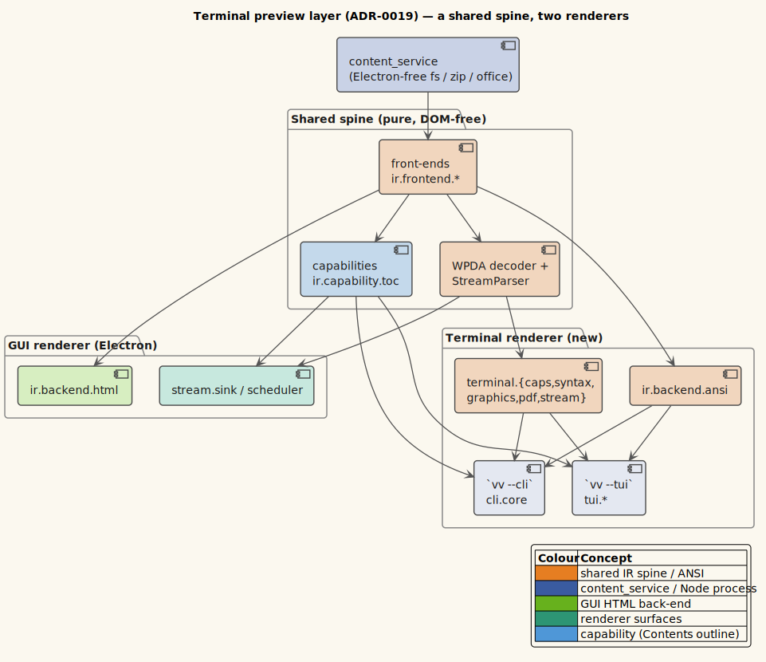

# 0019 — A terminal preview layer (CLI + TUI) as a second renderer over the shared IR/streaming spine

- **Status:** Accepted
- **Date:** 2026-07-08
- **Deciders:** Vinary Tree (maintainer)

## Context

vinary-viewer's document model — the **common document IR** ([ADR-0017](0017-common-document-ir.md),
`vinary.ir.*`) and the **WPDA streaming core** ([ADR-0018](0018-document-streaming-pipeline.md),
`vinary.ir.decode` / `vinary.ir.grammar.log` / `vinary.ir.frontend.log-stream` / `vinary.stream.protocol`) — is
**pure, DOM-free, and format-agnostic**: every format parses into one tagged tree, and the streaming decoder
segments records in bounded memory. Until now only the **Electron GUI** consumed it: `ir.backend.html` lowers IR →
HTML, `stream.sink` writes it into the DOM, `stream.scheduler` paces on `requestIdleCallback`, and
`stream.transport` pulls bytes over Electron IPC.

We wanted to **preview documents from the command line** — a one-shot `vv --cli file` (pipe-friendly, `| less`) and
an interactive full-screen `vv --tui file` — reusing that same spine rather than forking a second document engine.
The question was *how* to add a terminal front-end without (a) duplicating the front-ends/decoder, (b) dragging in
Electron or a browser, or (c) pulling in a heavy TUI toolkit.

## Decision

Add the terminal as a **second renderer over the shared spine** — the exact structural mirror of the GUI. Only the
*output-facing* layers are new; the front-ends, the WPDA decoder, the `StreamParser`, and the TOC/find
capabilities are reused **verbatim**.

| Layer | GUI (Electron) | Terminal (new) | Shared? |
|---|---|---|---|
| Front-ends (format → IR) | `ir.frontend.{markdown,office,pdf,log-stream,source,table,archive}` | same | ✅ |
| WPDA decoder / `StreamParser` | `ir.decode`, `ir.grammar.log`, `ir.frontend.log-stream`, `stream.protocol` | same | ✅ |
| TOC / find capability | `ir.capability.toc` (+ DOM finder) | `ir.capability.toc` (+ pure `tui.find`) | ✅ (capability) |
| Backend (IR → output) | `ir.backend.html` → HTML | **`ir.backend.ansi` → styled ANSI** | — |
| File reader | `content_service` over IPC | **`content_service` in-process** | ✅ (reader) |
| Streaming engine | `stream.scheduler` (rIC + re-frame) | **`terminal.stream/stream-records!`** (setImmediate) | — |
| Sink / driver | `stream.sink` (`insertAdjacentHTML`) | **`tui.term` + `tui.core`** (raw ANSI) | — |

*Diagram source: [`../diagrams/component-terminal-layer.puml`](../diagrams/component-terminal-layer.puml).*

The layer decomposes into sub-decisions, each embodied in code:

1. **`ir.backend.ansi` — a pure IR → ANSI layout engine** (the terminal analog of `ir.backend.html`). A
   width-aware terminal formatter maps every IR `:kind`: headings (bold + level colour), word-wrapped paragraphs,
   bulleted/numbered lists, `│`-guttered blockquotes, `▏`-guttered code blocks (tree-sitter → SGR), unicode
   box-drawing tables, OSC-8 hyperlinks, severity-coloured log records, and images (via an injected port). It is
   deterministic given a width, so it is **golden-file unit-tested** and shares the exact IR that
   `ir.backend.html` consumes. `render-lines` additionally returns `{:lines :anchors}` — the flat visual lines
   plus a heading-id → line-index map — which is the TUI's authoritative source for TOC jump (not fragile text
   matching).

2. **Terminal capabilities + graphics, with first-class degradation.** `terminal.caps/detect` resolves
   width/colour/truecolor/OSC-8 and the image protocol (`:kitty` | `:sixel` | `nil`) from `process.stdout` + env,
   honouring `NO_COLOR` and `isatty` so output degrades cleanly when piped. `terminal.graphics` decodes
   PNG/JPEG/GIF/SVG → RGBA and encodes a **kitty** (raw-RGBA `f=32`, `C=1` cursor-fixed) or **sixel** escape sized
   to the column budget; where the terminal has no graphics, the format is undecodable, or `--no-graphics` is set,
   it renders a labelled `🖼 name` placeholder. **Math** renders as its LaTeX source (a terminal cannot typeset
   MathJax); **mermaid diagrams** render as their source code block (see *Alternatives*).

3. **The TUI is raw ANSI — no ncurses/blessed — split into a pure core + a thin driver.** The pure core
   (`tui.{keys,viewport,find,toc,state}`) is terminal-free and unit-tested: byte → key events (CSI + SS3 +
   bracketed paste, with split-escape retention); a windowed line buffer that paints only an `:h`-row window; find
   over ANSI-stripped text with reverse-video highlighting; a TOC overlay; and a key → command reducer across
   normal/find/toc modes. The impure driver (`tui.term`, `tui.core`) owns raw mode, the alternate screen, and an
   idempotent teardown on *every* exit path so a crash / SIGINT / SSH-drop / Ctrl-Z never wedges the terminal.

4. **One cancellable streaming engine, shared with the CLI.** `terminal.stream/stream-records!` is the
   sink-agnostic open → pull → feed → emit → finish → close loop over `content_service`'s pull-cursor + the
   `log-stream` `StreamParser`; `vv --cli` supplies a stdout sink, the TUI a viewport-append sink. A huge log streams
   into a **bounded viewport ring** (`tui.viewport` `:cap`) so RSS stays flat regardless of log length.

5. **Headless PDF text extraction.** `terminal.pdf` runs pdf.js's legacy build (pure JS, no canvas) to extract
   text items → the shared `ir.frontend.pdf` (`doc->ir` → `reflow-ir`) → paragraphs + font-size headings. pdf.js
   v5 is ESM-only and shadow-cljs's CommonJS `:node-script` cannot dynamic-import it directly, so
   `resources/public/js/pdf-loader.js` (a plain CommonJS file, required at runtime via a computed path so shadow
   neither bundles nor Closure-analyses it) performs the `import()`.

6. **A `--drive <keyfile>` test seam.** `vv --tui --drive` replays key bytes through the same
   keys → state → frame pipeline and dumps the final frame deterministically, so the interactive behaviour is
   testable **without a pseudo-tty**; a small Linux/python-pty check covers only the teardown invariants `--drive`
   cannot see.

Everything is additive behind new `:node-script` build targets (`shadow-cljs.edn` `:cli` / `:tui`, `:simple`
release like `:main` — see [ADR-0016](0016-main-process-simple-optimization.md)); no `renderer`/`main` namespace
requires the terminal layer, so the GUI is untouched.

## Consequences

- **Positive.** One document engine serves three surfaces (GUI, CLI, TUI). Bounded-memory streaming (the hard
  part) carries straight over: `vv --cli huge.log | less` and a TUI streaming a growing log both fall out of the
  existing WPDA core. The pure ANSI backend + pure TUI core are fully unit-tested; the CLI/TUI wiring is
  smoke-tested end-to-end (`test/{cli,graphics,tui}-smoke.js`). A latent unbounded-memory bug in the shared
  log-stream parser (an accumulating slug map) was found and fixed while proving the CLI streaming path headless,
  benefiting the GUI too.
- **Negative / limits.** The terminal has no canvas: fixed-layout PDF figures degrade to their extracted text,
  mermaid to its source, and math to LaTeX source. The TUI forces graphics **off** (images → placeholders) so the
  scrolling viewport is line-exact; `vv --cli` in the same terminal *does* draw images. A streamed log's viewport is
  a bounded ring — the absolute top of a multi-GB log is not retained (a `less`-with-scrollback-limit model). The
  pdf.js runtime-require depends on `resources/public/` shipping alongside the compiled script.

## Alternatives considered

- **A TUI toolkit (ncurses / blessed / ink).** Rejected: a heavy dependency for what is a thin raw-ANSI driver over
  an already-pure view/scroll/find/stream core. Raw ANSI keeps the TUI logic pure and unit-testable and the
  dependency surface minimal.
- **Fork a terminal-specific document engine.** Rejected: it would duplicate the front-ends + WPDA decoder and
  drift from the GUI. The second-renderer approach shares the spine and inherits every future front-end for free.
- **Render mermaid with a headless browser (Puppeteer / `@mermaid-js/mermaid-cli`).** Rejected: mermaid needs a
  real DOM (verified: it throws *"document is not defined"* under plain Node), and Puppeteer bundles Chromium — the
  heavy dependency the project deliberately avoids. Mermaid degrades to its (informative) source; **SVG** diagrams
  still render via the `@resvg/resvg-wasm` path.
- **Retain every rendered line in the viewport (unbounded).** Rejected for the streaming path: it grows RSS with
  the log and fails the bounded-memory guarantee. A `:cap`-ed ring keeps memory flat (batch docs stay uncapped and
  fully scrollable).

## Trade-offs

We traded **display fidelity** (no rasterised PDF pages, no rendered mermaid, no typeset math in the terminal) and
**unbounded scrollback on multi-GB logs** for a **dependency-light, pure-core, fully-testable** terminal layer that
reuses the entire document engine and never touches Electron or a browser. Degradation is a designed, labelled
outcome — not a failure — matching the "graphics where supported, degrade elsewhere" and no-heavy-deps constraints.

## Related

- [ADR-0017 — Common document IR](0017-common-document-ir.md) · [ADR-0018 — Document-streaming pipeline](0018-document-streaming-pipeline.md)
- [ADR-0016 — `:simple` optimization for `:node-script`](0016-main-process-simple-optimization.md)
- Theory: [10 — Terminal rendering: a second renderer over the shared spine](../theory/10-terminal-rendering-second-renderer.md)
