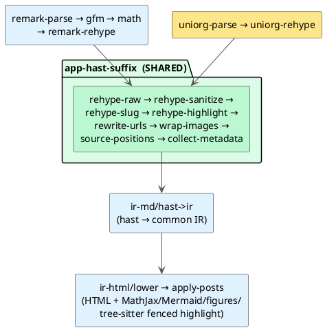

# 0020 — Org-mode (.org) support via uniorg, reusing the common IR

- **Status:** Accepted
- **Date:** 2026-07-08
- **Deciders:** Vinary Tree (maintainer)

## Context

Users wanted Emacs **Org-mode** (`.org`) documents rendered like GitHub renders them — GFM-like behavior plus
in-document syntax highlighting for arbitrary nested `#+begin_src <lang>` blocks (Org is a literate format).

The common document IR ([ADR-0017](0017-common-document-ir.md)) already unifies every format: Markdown, Office,
PDF, source, tables, logs all parse into one tagged tree, and the office frontend showed the template — parse a
format to **hast**, then reuse the Markdown frontend's `hast->ir` verbatim, inheriting the heading TOC, figure
pre-sizing, scroll-spy, streaming, and (for positioned formats) the source⇄preview jump for free.

## Decision

Add an **Org input frontend** that parses `.org` → hast via **uniorg** (`uniorg-parse` → `uniorg-rehype`), then
runs the **exact same** post-parse suffix as the Markdown pipeline and the **same** `hast->ir`. Org is a new
*front-end* over the existing spine — no new document engine.

- **`renderer/markdown_pipeline.cljs`**: the shared 8-plugin hast suffix is factored into `app-hast-suffix`,
  reused by both `base-pipeline` (Markdown) and the new **`org-pipeline`** (`uniorg-parse` → `uniorg-rehype` →
  `app-hast-suffix`). Sanitize runs before the app's trusted plugins so their post-sanitize additions survive.
- **`renderer/markdown.cljs`** `render-org-ir` mirrors `render-ir` (async — uniorg-parse is a real Parser),
  producing `{:html :ir :toc :assets}`. Nested `#+begin_src` blocks emit `<pre><code class="language-X">`, so
  they highlight for free via `apply-posts` → `syntax/highlight-html-code-blocks` (tree-sitter) with the
  `rehype-highlight` fallback. Added `emacs-lisp`/`el` → the bundled `elisp` grammar alias.
- **Detection/dispatch:** `file_kind/kind-of` classifies `.org` → `"org"`; the main service reads it as UTF-8
  text (no edit — the `:text` route forwards the kind); `:content/received` dispatches `:org/render` and treats
  Org like Markdown/Office for the TOC (its IR-derived `:doc/toc` survives live-refresh); `content-view` renders
  Org's preview through the generic `markdown-body` branch and adds `"org"` to the View-Source gate.
- **View Source** highlights the raw `.org` via a bundled **tree-sitter-org** grammar
  (nvim-orgmode/tree-sitter-org) with a repo-local `highlights.scm` authored in the app's capture-name
  vocabulary (the upstream query uses neovim-specific names the app's `style-map` does not recognise).

## Consequences

- Org inherits the full spine: GitHub-style render, heading TOC + scroll-spy, figure pre-sizing
  ([ADR-0022](0022-pre-dom-figure-sizing.md)), nested-language highlighting, and a highlighted View Source.
- **Source-position caveat:** `uniorg-parse` can track positions (`trackPosition`), but **`uniorg-rehype` does
  not project them onto the hast** (verified: 0 of N hast elements carry `position`). Carrying them would mean
  reimplementing the org→hast projection (a fragile fork), so the fine-grained right-click source⇄preview jump
  ([ADR-0021](0021-bidirectional-source-preview-jump.md)) is **Markdown-only**; Org degrades gracefully to
  heading-level navigation via the Contents outline. Documented, not hidden — if uniorg gains hast positions,
  the jump works for Org with a one-line pipeline change.
- **Streaming:** Org rendered batch-only initially (`stream/flag` `implemented-kinds` excluded `"org"`) — Org
  documents are typically small and CommonMark-style document-global constructs make a byte-parity bounded parse
  a separate effort. Additive when wanted. **Superseded by [ADR-0024](0024-org-export-blocks-front-matter-and-math.md):**
  Org now shares the progressive block-commit engine at the same 256 KiB threshold as Markdown. The engine commits
  IR *children*, so it was already format-agnostic; Org needed only its own block provider.
- **Files:** `package.json` (uniorg-parse/uniorg-rehype), `renderer/markdown_pipeline.cljs`,
  `renderer/markdown.cljs`, `main/file_kind.cljs`, `app/events.cljs`, `app/fx.cljs`, `ui/views.cljs`,
  `grammar_catalog.cljs`, `resources/public/grammars/org/`, `scripts/grammars.lock.json`. Tests:
  `test/vinary/main/file_kind_test.cljs`, `test/vinary/ir/frontend/org_test.cljs`, `test/electron-smoke.js`.

## Amendment (2026-07-09) — "inherits the spine" was true of the pipeline, not of its selectors

This ADR's central claim — Org is a semantic superset of GFM, so everything downstream of parsing is shared — is
correct, and the diagram above is the right architecture. But *reusing a pipeline is not reusing its selectors*.
Several shared post-passes match a specific hast shape, and uniorg emits a different one, so they silently did
nothing: **math** (the pass selects `code.math-*`; uniorg emits `span.math`/`div.math`), **task lists** (the
checkbox was discarded), **footnotes** (a bare `<h1>`), and **TODO keywords** (an unbounded class the sanitizer
stripped). Worse, uniorg drops every `#+KEYWORD` *and* every non-`html` `#+BEGIN_EXPORT` block, so a document
made only of those lowered to `""` — which is **truthy** in ClojureScript — and rendered as a silent blank pane.

Two omissions also survived: `content_service.js`'s `classifyName` (the JavaScript twin of `file_kind/kind-of`)
never got an `org` arm, so `vv --cli`/`vv --tui` printed Org as highlighted *source*; and the electron smoke
stubbed `{kind:'org'}` straight into its fake content service, so no test ever exercised the real classifier.

[ADR-0024](0024-org-export-blocks-front-matter-and-math.md) fixes all of it by **normalizing Org's hast into the
GFM shapes upstream of the shared passes** — the same principle this ADR set out, applied one layer lower.
