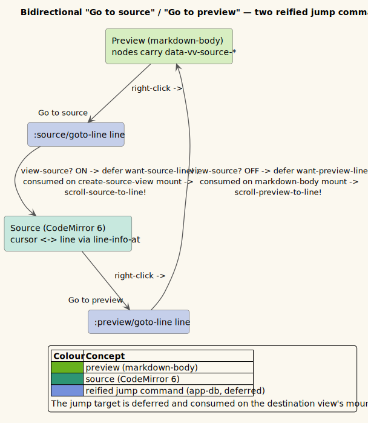

# 0021 — Bidirectional "Go to source" / "Go to preview" jump

- **Status:** Accepted
- **Date:** 2026-07-08
- **Deciders:** Vinary Tree (maintainer)

## Context

Every rendered preview node already carries its source coordinates: the `source-positions` rehype plugin stamps
`data-vv-source-start-{line,column,offset}` / `-end-*` / `-kind` onto every element and wraps each non-blank
text run in a ``. Until now this powered only **"Copy source location"** — a
right-click item that formats `path:line:column` to the clipboard. The `:line` integer was computed and then
thrown away.

Users wanted to *navigate*, not just copy: right-click a preview object → **jump** to that line in the source;
right-click a source line → **jump** to the matching object in the preview.

Architectural constraint: source and preview are **not** shown side-by-side — they **toggle within one pane**
per tab (`:view-source?`). Toggling remounts the pane (the source-view and markdown-body are different React
components), so a jump that switches views must defer its scroll until the destination view mounts.

## Decision

Reuse the existing source positions bidirectionally, plus the existing deferred-scroll pattern
(`renderer.scroll` `want!`→`apply!`), so a jump that toggles the pane lands after the destination remounts.

*Diagram source: [`../diagrams/flow-source-preview-jump.puml`](../diagrams/flow-source-preview-jump.puml).*

- **`renderer/source_nav.cljs`** (new, content-agnostic — works for Markdown, Org, and any format that stamps
  `data-vv-source-*`): the pure `nearest-line-index` (a binary search — the *reverse* of `toc/active-heading`)
  maps a source line to the nearest anchored preview element; `scroll-preview-to-line!` confine-scrolls
  `.vv-content` to it using the SAME offset math as the `:toc/scroll` fx (so chrome outside the scroller never
  moves). A pending-line atom carries the jump across the toggle remount. No re-frame, no per-content-type
  selectors (the shared-subsystem rule that once broke the PDF scroll-spy).
- **The `:line` integer is now exposed** on the context targets (`source-lc` returns the `{:line :column}` map
  that both the clipboard string and the jump consume) — `:source-line` on `:preview-link`/`:preview-body` and,
  from the CodeMirror cursor, on `:source-body`.
- **Events** `:source/goto-line` / `:preview/goto-line` decide toggle-vs-scroll (they know the current view);
  **fx** `:source/scroll-line` / `:source/want-line` / `:preview/scroll-line` / `:preview/want-line` either
  scroll the already-mounted view now or stash the target for the view about to mount.
- **Context-menu items** "Go to source" (preview) and "Go to preview" (source, gated to previewable
  markdown/org docs via `:doc/kind`).
- **Keyboard / command palette:** `:jump/to-source` and `:jump/to-preview` commands dispatch self-gating events
  that derive the "current" line from the DOM (the preview element nearest the viewport top / the CodeMirror
  cursor), so the jump works with no click target.

## Consequences

- Fine-grained, element-level jumping both directions for Markdown (and any format with source positions).
- **Org caveat:** uniorg-rehype does not project source positions onto its hast (see
  [ADR-0020](0020-org-mode-via-uniorg.md)), so Org preview nodes carry no `data-vv-source-*`; the jump items
  auto-hide for Org, which instead navigates by heading through the Contents outline. If uniorg gains
  hast-position support the jump works for Org with no other change.
- **Files:** `renderer/source_nav.cljs` (new), `renderer/syntax.cljs` (`want-source-line!`,
  `current-source-line`, mount consume), `ui/views.cljs` (`source-lc`, `:source-line` targets, mount consumes),
  `ui/context_menu.cljs`, `app/events.cljs`, `app/fx.cljs`, `app/commands.cljs`, `app/subs.cljs` (`:doc/kind`).
  Tests: `test/vinary/renderer/source_nav_test.cljs`, `test/vinary/core_test.cljs`, `test/electron-smoke.js`.
