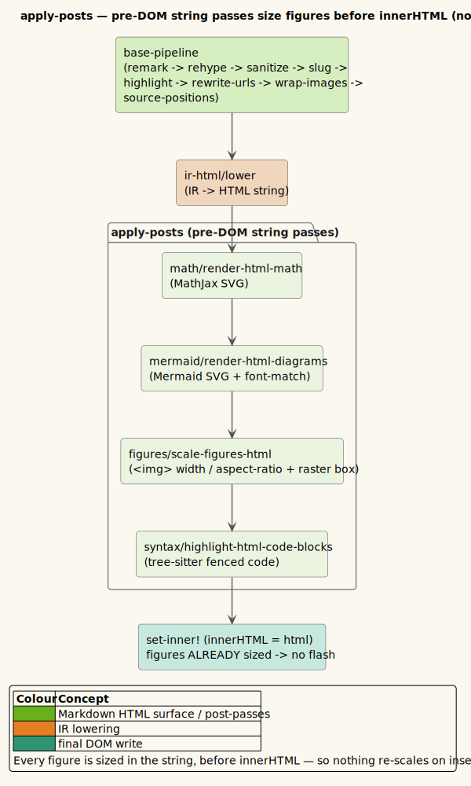

# 0022 — Pre-DOM figure & inline-Mermaid sizing (no post-insert re-scale)

- **Status:** Accepted
- **Date:** 2026-07-08
- **Deciders:** Vinary Tree (maintainer)

## Context

A rendered Markdown/Org/Office document has three sources of visual (non-text) output:

| Output | Produced by | When sized (before this change) |
|---|---|---|
| **MathJax** (`$…$`, `$$…$$`) | `math/render-html-math` — string post-pass | at convert time (self-sizing SVG, `ex` units) — **pre-DOM** |
| **Mermaid** (```` ```mermaid ````) | `mermaid/render-html-diagrams` — string post-pass | Mermaid's own dimensions, `max-width:100%` — **pre-DOM but NOT font-matched** |
| **`` figures** (svgbob/d2/PlantUML `.svg`, raster) | `figures/scale-figures!` on the **live DOM node** | **AFTER `innerHTML` was set** |

The `` path was the outlier. Because a d2/PlantUML/svgbob SVG carries only a `viewBox` (no intrinsic
`width`/`height`), the browser stretched it to the full column at `set-inner!` time; then, asynchronously,
`scale-figures!` fetched the SVG, computed the font-matched width, and rewrote `style.width` — so the figure
**visibly shrank after the document appeared** (the "scaling effect"). Worse, that live-DOM sizing re-ran on
every window resize (`ResizeObserver`), every live-refresh (`component-did-update`), and every streamed block
(`refresh-view!`) — repeatedly mutating the DOM after paint.

Inline Mermaid was pre-DOM but used Mermaid's own size, so it never matched the document's font like the SVG
figures did (the user asked for Mermaid to auto-scale "too").

## Decision

Move **all** figure geometry into the shared pre-DOM string post-pass `apply-posts`, alongside MathJax and
Mermaid, so sizes are **baked into the HTML string before it is inserted**. Figures render at their final size
on first paint — no post-insert mutation, no flash — and re-renders/streaming reuse the memoized geometry.



*Diagram source: [`../diagrams/component-apply-posts.puml`](../diagrams/component-apply-posts.puml).*

The enabling insight: **the runtime container width (`avail`) is only a cap, and CSS `max-width:100%` already
enforces the column cap.** So the font-matched width `D = docFont · viewBoxWidth / dominantFontSize` can be
computed with no live layout — off an off-DOM `DOMParser` document — and stamped as inline `width` +
`aspect-ratio` (no explicit px `height`, so a wide figure capped to a narrow column keeps its ratio). The SVG
`viewBox`/font are read from the file via the same memoized `fetch-meta`; `` `src`s are already absolute
`file://` URLs by `apply-posts` time (via `wrap-images`/`rewrite-urls`), so the fetch runs in the string domain.

- **`figures/scale-figures-html`** (new) is the pre-DOM twin of `render-html-math`/`render-html-diagrams`:
  DOMParser-guarded (pass-through in `:node-test`), a no-op returning the original bytes when a fragment has no
  ``. It sizes local `.svg` figures (font-matched `width` + `aspect-ratio`) and raster/remote images
  (intrinsic `width`/`height` **attributes** → box reservation, no decode reflow).
- **Inline Mermaid** is font-matched with the same policy: `mermaid/size-mermaid-svg!` strips Mermaid's inline
  `max-width` (which otherwise clamps to its natural width and blocks up-scaling) and stamps `width` +
  `aspect-ratio` from the SVG's `viewBox` + dominant font. The standalone Mermaid view sizes its string before
  insertion (`size-mermaid-svg-string`) — no flash there either.
- The live-DOM `scale-figures!` and its post-insert call sites (`after-render!`, `on-resize`, streaming
  `refresh-view!`) are **retired** (the old functions are `#_`-disabled for reference, not deleted). The one
  place figure sizing still runs post-DOM is `figures/refit-all!` + `mermaid/refit-all!`, invoked **only** from
  the font-size preference effect (`:fonts/apply`), because that changes the document font with no re-render.

### Which `font-size` declarations count

The font-matched width $`D = f_{doc} \cdot w_{vb} / f_{svg}`$ is only as good as $`f_{svg}`$, the figure's
**dominant font size**. `parse-svg-meta` derives it by counting `font-size` occurrences across the SVG source
and taking the most frequent — but a size is a candidate **only when it is absolute**.

A relative unit (`em`, `rem`, `%`, `ex`, `ch`, `vw`, `vh`, `vmin`, `vmax`) scales an *inherited* size: it is a
multiplier, not a size, and it carries no information about how large the glyphs actually are. Absolute units
are normalised to px through the CSS Values 4 §6.2 table
(`px 1 · pt 96/72 · pc 16 · in 96 · cm 96/2.54 · mm 96/25.4 · Q 96/101.6`).

One asymmetry matters, because SVG spells `font-size` two ways and the two disagree about bare numbers:

| Form | Syntax | Bare number means | Counted? |
|------|--------|-------------------|----------|
| SVG presentation attribute | `<text font-size="14">` | 14 **user units** | yes |
| CSS declaration | `style="font-size:14"` or a `<style>` rule | *invalid* — the browser drops it | no |

`parse-svg-meta` therefore captures the separator (`=` vs `:`) and applies the unitless rule accordingly.
Two further guards: candidates below `2` px-equivalent are ignored (a sub-2-unit "font" cannot draw a glyph,
and it is the direction that explodes the figure, since $`f_{svg} \to 0 \Rightarrow D \to \infty`$), and ties
break toward the **smaller** size, which is both deterministic — ClojureScript map order is unspecified above
eight keys — and the right default, since body labels are smaller and more numerous than titles.

When no absolute size survives, $`f_{svg} = 0`$ and `target-width` falls back to the natural viewBox width,
CSS-capped to the column.

### Byte-parity

Every `apply-posts` pass operates on **self-contained elements**, so it distributes over block concatenation:
`concat(map scale-figures-html blocks) == scale-figures-html(whole)`. This is why streamed-vs-batch Markdown
stays byte-identical (proven by `test/electron-smoke.js`). Figures were kept OUT of the byte-parity *fixture*
only because local image URLs carry a per-render `?vv-cache=<timestamp>` cache-buster (like MathJax's monotonic
ids); the sizing itself is deterministic — the electron smoke asserts identical `style.width`/`aspect-ratio`
across renders and **zero style/attribute mutations after first paint** (the direct no-flash proof).

## Consequences

- **No visible re-scale** on open, live-refresh, window resize, or per streamed block. Figure width is now
  resize-independent (font-matched, CSS-capped) — arguably more stable than the old `avail`-dependent behavior.
- Office and PDF-reflow inherit pre-sizing for free (they share `apply-posts`).
- The one behavioral delta: for a narrow column + small-natural-width + small-native-font SVG, the old code fell
  back to natural width while the new scheme fills the column (CSS-capped). Acceptable / arguably better.
- **The column cap hides sizing bugs.** Because `max-width:100%` silently clamps any over-wide figure, a bad
  $`f_{svg}`$ does not overflow — it renders as "full column, magnified text", which reads as intentional. The
  first instance: `parse-svg-meta` originally counted `font-size` values unit-blind, so d2's markdown-label
  stylesheet (`1em`, `1.25em`, `0.875em`, `0.85em` — all rounding to `1`) outvoted the real `16px` text labels
  and drove $`D = 15 \cdot 671 / 1 = 10065\text{px}`$ on a 671-unit viewBox. Sizing must be validated against the
  *pre-clamp* width, which is what `figures_test`'s `svg-style` assertions do. A sweep of 173 project SVGs
  showed exactly one file affected.
- **Files:** `src/vinary/renderer/figures.cljs` (`target-width`, `svg-style`, `doc-font-px`, `stamp-svg!`,
  `stamp-raster!`, `scale-figures-html`, `refit-all!`), `renderer/markdown.cljs` (`apply-posts`),
  `renderer/mermaid.cljs` (`size-mermaid-svg!`, `size-mermaid-svg-string`, `refit-all!`), `ui/views.cljs`
  (neutered post-DOM call sites), `app/fx.cljs` (`:fonts/apply` re-fit). Tests: `test/vinary/renderer/figures_test.cljs`,
  `test/electron-smoke.js`.
