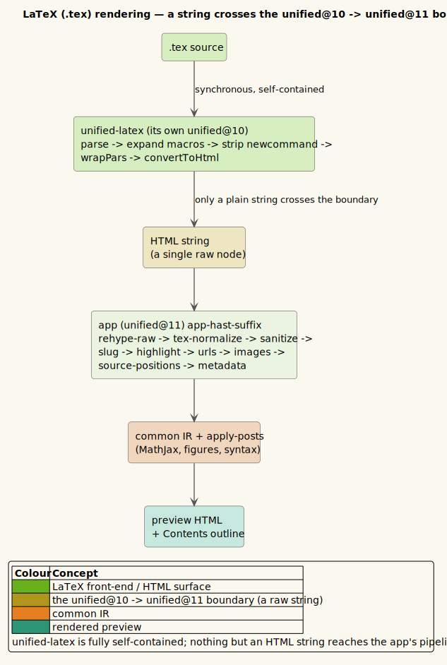
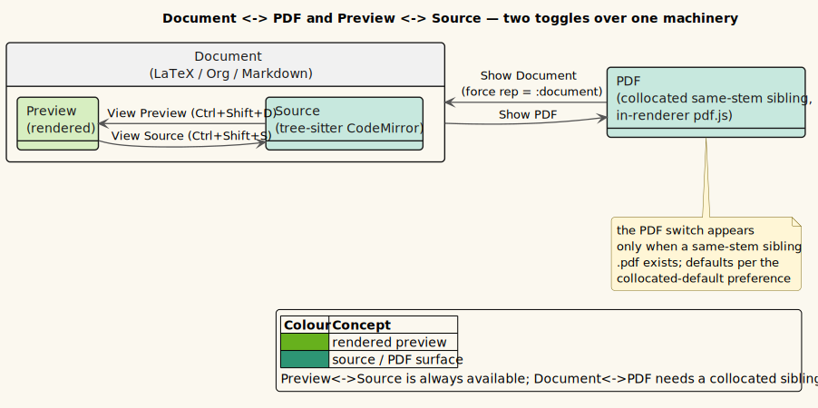

# 0025 — LaTeX (.tex) rendering via unified-latex, and the Document↔PDF switch

- **Status:** Accepted
- **Date:** 2026-07-10
- **Deciders:** Vinary Tree (maintainer)

## Context

[ADR-0020](0020-org-mode-via-uniorg.md) and [ADR-0024](0024-org-export-blocks-front-matter-and-math.md) established
the pattern: a new text format becomes an **input frontend** over the [common document IR](0017-common-document-ir.md)
by parsing to **HAST** and reusing the one shared post-parse pipeline (`app-hast-suffix`) and the shared string
post-passes (`apply-posts`: MathJax → Mermaid → figures → tree-sitter). Nothing downstream is duplicated.

LaTeX was the natural next format, for two reasons:

1. **Standalone `.tex` files.** Like Org, most of the machinery a comprehensible LaTeX render needs already
   exists — MathJax for math, sectioning/paragraphs/font styling, tables, figures with auto-scaling, and
   syntax-highlighted code. The goal is **comprehensible rendering, not a LaTeX compiler**: render most documents
   legibly, not typeset them to publication fidelity.
2. **LaTeX embedded in Org.** ADR-0024 rendered a non-math `#+BEGIN_EXPORT latex` block (an invoice's
   `center`/`tabular`/`textbf` layout) as a **highlighted code block** — the honest fallback when there was no
   LaTeX renderer. Now there is one, so those invoices can render as real layout. The user's 14 `.org` invoices
   are each collocated with an exported `.pdf`, which motivated a third capability: a **Document↔PDF switch**.

Two pre-existing traps had to be handled, both the same shape Org hit:

- **`.tex` classified as `"source"`.** A tree-sitter-latex grammar is bundled, so `file-kind/kind-of`'s
  `source?` arm claimed `.tex` before any document arm — exactly as `.org` was shadowed before ADR-0020.
- **The classifier twin.** `content_service.js` (the `vv --cli`/`vv --tui` reader) must stay in sync or the
  terminal upgrades `.tex` to highlighted source (ADR-0024 §4 exists because this drifted for Org).

## Decision

### 1. Parse LaTeX with `@unified-latex/*`, cross the version boundary as an HTML string

The [`@unified-latex/*`](https://github.com/siefkenj/unified-latex) toolchain (v1.8.4, MIT) parses LaTeX → a
LaTeX AST → **HAST**, and ships a macro-expansion utility — a clean fit for "reuse the HAST spine" **and** the
requested macro preprocessor.

**The one risk, and the mitigation.** `@unified-latex/*` pins `unified@^10`; the app is on `unified@11`. Its
packages carry their own nested `unified@10.1.2`, so the two must not share a processor. The frontend
(`vinary.renderer.latex/latex->html`) therefore runs unified-latex's **`convertToHtml`** — a fully self-contained,
synchronous call inside its own `unified@10` — and returns a **plain HTML string**. Only that string crosses into
the app's `unified@11` world, wrapped as a single `raw` node that `app-hast-suffix`'s existing `rehype-raw` parses
— the *exact* seam the office frontend already uses (`ir.frontend.office/html->hast`). HAST/strings are inert
data; no plugin, processor, or `unified` instance is shared across the boundary.

*Diagram source: [`../diagrams/flow-latex-pipeline.puml`](../diagrams/flow-latex-pipeline.puml).*

A spike confirmed a coupled single processor is unnecessary and riskier; the decoupled string path is the design.

### 2. `tex-normalize` — the small hast rewrite unified-latex needs

unified-latex's HTML is *almost* the shape the shared passes match. One rewrite pass (`tex-normalize`, installed
as `app-hast-suffix`'s new **post-raw hook**, running after `rehype-raw` and before sanitize — mirroring
`org-normalize`) closes the gaps:

| unified-latex emits | shared pass needs | rewrite |
|---|---|---|
| `span.inline-math` (raw TeX inside) | `code.math-inline` | rewrite to `code` |
| `div.display-math` (raw TeX, incl. `\begin{align}…`) | `pre > code.math-display` | rewrite to `pre > code` |
| `
` (deprecated, not in the allowlist) | a block element | rewrite to `
` |

Because math is preserved **verbatim** as TeX (even `align`/`equation` environments), the existing
`render-html-math` MathJax pass typesets it unchanged — no second math engine. The class names are chosen so
`tex-normalize` and `org-normalize` never collide: unified-latex uses `inline-math`/`display-math`; uniorg uses
`math-inline`/`math-display` (the word order is *reversed*).

### 3. The macro preprocessor — and the `\html-tag:` leak sweep

`latex->html` discovers `\newcommand`/`\NewDocumentCommand`-family definitions (in the document body **and** an
optional preamble — Org `#+LATEX_HEADER:` lines), reparses with those signatures attached so **argument-bearing**
macros expand (`\newcommand{\tri}[3]{#1-#2-#3}` → `\tri{a}{b}{c}` → `a-b-c`), expands them, then drops the spent
definitions. The preamble is parsed **only** for its macro definitions — never rendered — so `\usepackage`,
`\setmainfont`, and watermark `\backgroundsetup{…}` inject no spurious output.

One rough edge in unified-latex: a **known-but-unhandled** class macro (`\title`, `\author`, `\address`,
`\href` from a custom document class like `entcs`) grabs its brace argument and **stringifies** it, leaking
unified-latex's internal `\html-tag:TAG{\html-attr:NAME{"VAL"}…}` intermediate syntax as literal text (a `\\`
became `\html-tag:br`). `sweep-html-like` rewrites any such leak back into real tags, innermost-first to a
fixpoint, so custom-class frontmatter renders cleanly instead of showing raw internals. It is a no-op on the
common case (standard macros never leak), and the reconstructed tags are still sanitized downstream.

### 4. LaTeX embedded in Org: render non-math, keep math on MathJax

The Org handlers (`markdown_pipeline/org-handlers`) route embedded LaTeX through `latex->html` **only when it is
not math**, so the proven uniorg→MathJax path is never disturbed. The math-vs-layout screen is the **existing**
`math/tex-block-math?` (a positive math signal **and** no document-structure macro), reused verbatim:

| Org node | Math case (unchanged) | Non-math case (new) |
|---|---|---|
| `#+BEGIN_EXPORT latex` (invoices) | `vv-tex-attempt` marker → MathJax | splice `latex->html` as a `raw` node |
| `latex-environment` (`\begin{…}`) | `equation`/`align`/… → uniorg `div.math-display` → MathJax | `tabular`/`center`/… → `latex->html` |
| `latex-fragment` (inline) | `$…$` / `\(…\)` / bare `\alpha` → uniorg `span.math-inline` → MathJax | `\textbf{…}`/`\emph{…}` (allowlisted) → `latex->html` |
| `#+LATEX_HEADER:` / `#+LATEX:` | *(dropped)* | captured into a per-call preamble atom for the macro expander |

The `latex-fragment` handler is deliberately conservative — only an allowlist of text-formatting macros is
rerouted, so inline math (including bare `\alpha`) can never regress. All rerouting happens **in the pipeline
(pre-sanitize)** as `raw` nodes: `app-hast-suffix`'s `rehype-raw` parses them, `tex-normalize` normalizes them,
and the shared sanitizer cleans them — never a post-sanitize bypass. Byte-parity with streamed Org holds by
construction (the whole document is parsed once; `latex->html` is deterministic), and is guarded by the streaming
smoke.

### 5. Classification, streaming, and the terminal — same checklist as Org

`file-kind/kind-of` gains a `latex-exts` (`.tex`/`.latex`/`.ltx`) arm **before** the `source?` arm (not
`.sty`/`.cls`/`.bib` — those stay source). `content_service.js` mirrors it (a `latexExts` set, a `classifyName`
arm, and an `openLocal` short-circuit before the delimited-CSV sniff, since a `tabular`'s `&`/`\\` would trip it).
`fx`/`events`/`subs`/`views`/`icons` gain a `latex` arm exactly where Org has one; the `(:doc/html …)` catch-all
view mounts it with no new branch. `cli/render` gains `latex->ir`, and `cli`/`tui` add `"latex"` to `text-kinds`.

**Streaming** rides the same progressive engine as Markdown/Org. A subtlety worth stating: unified-latex is a
*whole-document* PEG parse, so LaTeX cannot do *bounded-parse* streaming (parsing block-by-block) — but the app's
prose streaming is not bounded-parse. It is **whole-parse + progressive paint** (ADR-0018): the pipeline parses
the whole document once, then the scheduler commits the IR children across idle/animation frames so the DOM never
holds the whole HTML string at once. That is exactly what `.tex` needs, and it is byte-parity-safe by
construction (`concat(map lower children) == lower(document)`; the win is the non-blocking paint, not bounded
memory). `latex-stream-blocks` supplies the block provider (parse once via `tex-processor.runSync`, return the IR
children); `"latex"` joins `stream.flag` (256 KiB threshold), `scheduler`'s `posts-for`/`sep-for`, and
`ir-stream-body` — exactly where Org does. Byte-parity is guarded by a unit test and by a batch-vs-stream
electron-smoke assertion on a 300 KiB `.tex`.

### 6. The Document↔PDF representation switch (kind-agnostic) and the Preview↔Source toggle

A previewable document (LaTeX, Org, or Markdown) collocated with a same-stem exported `.pdf` can be viewed as
**either** its rendered self **or** the faithful compiler-produced PDF. This is orthogonal to the existing
Preview↔Source toggle, giving each document up to three views:

*Diagram source: [`../diagrams/state-doc-pdf-switch.puml`](../diagrams/state-doc-pdf-switch.puml).*

- **Sibling detection is main-side** (`service.cljs/sibling-pdf`, `fs.existsSync` on `dirname+stem+".pdf"`),
  because the renderer has no filesystem access. When kind ∈ {latex, org, markdown} it attaches `:pdfSibling`
  to the `vv:content` payload; the renderer stores `:doc/pdf-sibling`.
- **Representation is per-tab UI state** (`nav/representation` / `set-representation`), modeled on `:view-source?`.
  The *effective* representation is resolved by the pure `nav/effective-representation`: `:pdf` only when a
  sibling exists **and** either the tab chose it or the persisted `collocated-default` preference is `:pdf`
  (**default `:pdf`** — the faithful PDF — user-configurable).
- **The sibling PDF loads byte-only.** A new `vv:load-pdf-bytes` invoke channel reads the file into `pdf-cache`
  **without opening a tab**; `content-view` then mounts the existing `pdf-view` for it in place. It renders
  through the same in-renderer pdf.js viewer as any PDF tab, with that viewer's existing view-state: fit /
  dark-invert / reflow are **persisted user preferences** (`:pdf-fit` / `:pdf-invert?` / `:pdf-reflow?` in
  settings.edn — intentionally global, so one setting applies to every PDF), and transient zoom is shared across
  PDF tabs exactly as opening two `.pdf` files already shares it. This is the intended PDF-viewer design, not
  specific to the switch.
- **Discoverable controls.** The Preview↔Source toggle previously existed only in the tab right-click menu. It
  now has a visible toolbar segmented control (`[Preview | Source]`), a `[Document | PDF]` control beside it,
  command-palette entries (`View ▸ Toggle preview / source`, `View ▸ Toggle document / PDF`), and default
  keybindings (`C-S-s`, `C-S-d`) — all self-gating. This benefits Markdown and Org too.

## Consequences

**Good.** Standalone `.tex` documents render legibly (sections, styling, lists, tables, figures, math, code,
custom macros), and large ones stream progressively like Markdown/Org. The Org invoices render as real tables
instead of code blocks, with `#+LATEX_HEADER` macros expanded. Any previewable document with an exported PDF
gains a one-click switch to the faithful rendering. The Preview↔Source toggle is finally discoverable for every
format. `vv --cli`/`vv --tui` render `.tex` through the same frontend. The MathJax engine, the streaming engine,
and the sanitize policy are all reused unchanged, and their byte-parity is re-verified.

**Costs and risks.**

- **Comprehensible, not faithful.** TikZ/PGF pictures, exact page geometry, fonts, and non-raster
  `\includegraphics` (e.g. a `logo.pdf` watermark) are not reproduced; the collocated-PDF switch is the escape
  hatch when fidelity matters. Unknown class macros with no HTML mapping degrade to visible-but-plain output
  (`\thanksref{ALL}` shows raw).
- **A transitive JSDoc parse warning.** `@unified-latex/unified-latex-to-hast` pulls `unified-latex-lint`, whose
  newer `[Tree=Node]` default-type-param JSDoc the Closure JS parser flags (4 non-fatal warnings, not counted in
  shadow's tally; `:simple` never escalates them to errors).
- **A bare `latex-fragment` custom text macro stays on MathJax.** The fragment handler reroutes the *complete*
  set of standard LaTeX text-formatting macros (`\text**` family, `\emph`, the ulem underline/strike family) to
  unified-latex; a *custom* macro is left on the MathJax path because it is undecidable from its name alone — a
  custom macro can expand to math (`\newcommand{\R}{\mathbb{R}}`) just as easily as to text, and routing all
  custom macros through unified-latex would break the math ones. This is correct handling of an undecidable
  case, not a coverage gap. (Standard text macros — the common case — are fully covered.)

**Verification.** Node tests (`renderer/latex-test` — converter, macro preprocessor, `\html-tag:` leak sweep, and
streamed-vs-batch byte-parity; `ir.frontend/org-test` — embedded-invoice render + math no-regression;
`main/file-kind-test` — classification ordering; `app/nav-test` — representation resolution; `stream/flag-test` —
`.tex` streams above 256 KiB). Real-document CLI renders of an invoice (a real amount table) and
`rho4u/common/example.tex` (clean, zero `\html-tag:` leaks). A dedicated GUI smoke drives the full switch
end-to-end (sibling → PDF-first default → switch to Document renders the table → Source mounts CodeMirror → back
to PDF). The electron smoke's Org assertions were updated to the render-instead-of-code-block behavior, and a new
section proves a 300 KiB `.tex` streams **byte-identically** to its batch render (248 sections, math + tables in
each).
