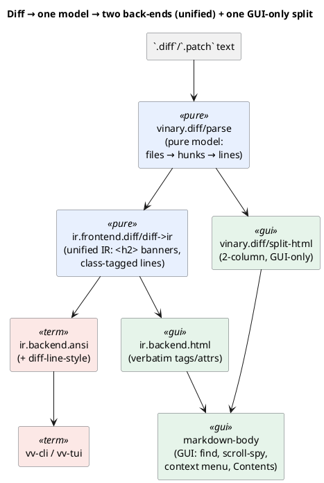
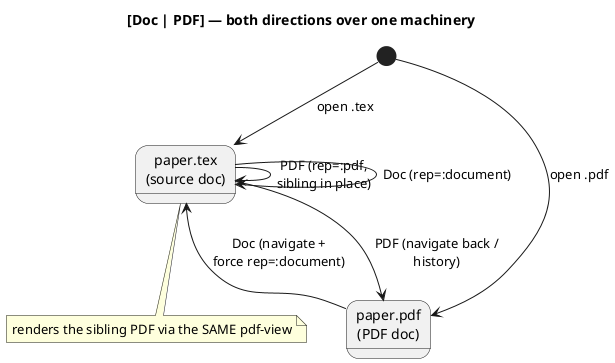

# 0026 — Diff (`.diff`/`.patch`) rendering + side-by-side, standard repo filetypes, and the reverse PDF↔source switch

- **Status:** Accepted
- **Date:** 2026-07-10
- **Deciders:** Vinary Tree (maintainer)

## Context

Four related capabilities are added here. The first is the headline feature; the rest are close neighbors that
share its plumbing or fix defects it surfaced.

1. **Diff rendering.** `.diff` and `.patch` files rendered as escaped plain text — no colour, no structure. They
   should render like a modern diff viewer: a colored **unified** view (added/removed/hunk/file headers) and, on
   demand, a **side-by-side (split)** view, with **multi-file** support.
2. **Standard repo filetypes.** A GNU **Makefile** opened as a *delimited table*: with no extension it classified
   as `"text"`, routed through the parser's content sniffer, and its `target:` lines + tab-indented recipes
   tripped the CSV/TSV heuristic. More broadly, the viewer had no knowledge of the extensionless/dot-prefixed
   files every repo carries (`LICENSE`, `.gitignore`, git config, `Dockerfile`, `Gemfile`, …).
3. **Reverse PDF↔source switch.** [ADR-0025](0025-latex-rendering-via-unified-latex.md) let a *source* document
   collocated with an exported `.pdf` switch to that PDF (`[Doc | PDF]`). The reverse was missing: opening the
   **`.pdf`** offered no way back to its rendered source.
4. **LaTeX-PDF sizing bug.** When a `.tex` showed its sibling PDF, the pages rendered ~45 px right and ~32 px
   down — outside the visible bounds.

The governing constraint, restated from ADR-0017/0020/0025 and reinforced by the maintainer: **reuse existing
subsystems; do not rebuild.** Every capability below is layered onto machinery that already exists.

## Decision

### 1. Diff is an input frontend over the common IR — unified view for GUI *and* terminal

A diff is parsed by a **pure, DOM-free parser** (`vinary.diff/parse`) into a structured model, then lowered to
the [common document IR](0017-common-document-ir.md) by a frontend (`vinary.ir.frontend.diff/diff->ir`), exactly
as Markdown/Org/LaTeX are. The IR is rendered by the **two existing back-ends with no bespoke rendering code**:

- **HTML back-end** (`ir.backend.html`) — unchanged. It already serializes each node's `:meta :tag`/`:attrs`
  **verbatim**, so the frontend emits its own classes (`vv-diff-insert`, …) and the exact HTML falls out. The
  diff HTML is *fixed structure + escaped text nodes*, so it needs no runtime sanitizer — there is no raw-HTML
  vector; untrusted content is only ever a text node (see §6).
- **ANSI back-end** (`ir.backend.ansi`) — one small addition: `diff-line-style`, which reads a node's existing
  `classes` and maps `vv-diff-insert → green`, `vv-diff-delete → red`, `vv-diff-hunk → bold cyan`,
  `vv-diff-note → dim`. This is the terminal analog of the GUI's CSS line colouring, mirroring how `:record` +
  `level-color` were added for logs. The result: `vv-cli`/`vv-tui` render a **colored unified diff for free**.



**Why a dedicated parser rather than a tree-sitter-diff grammar?** The unified diff format is small and fully
specified, and — critically — the **side-by-side view requires the structured model anyway** (hunks, per-side
line numbers, delete/insert pairing). A grammar would give the unified view highlighting but nothing for split,
and would add a WASM to the network-flaky grammar-sync treadmill. One pure parser serves both views and both
back-ends, and is exhaustively node-testable.

**The parser** (`vinary.diff/parse [text] → {:preamble :files}`) handles `diff --git`, plain `diff -u`
(`--- /+++` with trailing-timestamp stripping), `@@ -a,b +c,d @@` (counts default to 1), renames, new/deleted
files, `Binary files … differ`, `\ No newline at end of file`, combined/merge `@@@` (degraded to a heading), and
a **git-format-patch preamble** (the email header + commit message + diffstat, captured as `:preamble`).

The one subtlety worth recording: a hunk is **bounded to its declared old/new line budget**. A hunk header
`@@ -1,C +1,D @@` promises `C` old-side and `D` new-side lines; the parser consumes exactly that many and then
closes the hunk. Without this, a `git format-patch` trailer —

```
-- ⏎
2.39.0
```

— would be swallowed into the final hunk, its leading `-` misread as a deletion. The `\ No newline` marker is the
one line that may legitimately arrive *after* the budget is spent (it annotates the hunk's last line), so it is
handled by a dedicated arm ahead of the budget gate.

### 2. Side-by-side (split) — always from the hunks, enriched by the real files

Split is **GUI-only** (a wide 2-column layout has no terminal analog) and produced by `vinary.diff/split-html`.
It is layered in two tiers:

- **Baseline — always available.** `split-rows` aligns a file's hunks with no external input: a context line →
  both sides; a run of deletes paired with the following run of inserts → *changed* rows (delete left / insert
  right); leftovers → one-sided rows. A unified diff fully determines both sides *within* its hunks, so this
  needs no source files and renders instantly.
- **Enriched — "when the respective source files are accessible."** When the diff's referenced file is found on
  disk, the real file's unchanged regions are spliced around the hunks so the **whole file** shows side-by-side.
  Long unchanged runs collapse into native `<details>` gaps (no JavaScript). Resolution is main-side (the
  renderer has no `fs`): `vv:load-diff-sources` walks the diff's directory and its ancestors for each referenced
  path. The fetch is **lazy** — only when Split is first selected — and asynchronous: the baseline renders
  immediately, then the enriched HTML replaces it when the sources arrive (the same pattern as PDF reflow's
  `:doc/reflow-html`).

Both views render through the **existing `markdown-body`** component, so a diff inherits in-page find,
scroll-spy, the themed context menu, and — because each file is an `<h2>` banner — a multi-file **Contents
outline** with zero extra code.

### 3. The Unified⇄Split toggle reuses the representation-switch pattern

A per-tab `:diff-view` (`:unified` | `:split`, default `:unified` — split is opt-in so opening a diff never
triggers a disk fetch) mirrors ADR-0025's per-tab `:representation`. It surfaces as a segmented
`[Unified | Split]` control in `view-switch-toolbar` beside the existing `[Preview | Source]`, plus a command
(`:view/toggle-diff-split`) and a self-gating key (`C-S-b`) — the same three-surface pattern (toolbar + palette +
keymap) as the other view switches.

### 4. Standard repo filetypes — two decoupled layers

Classification and highlighting are separated so a file is **correctly classified even when no grammar is
bundled for it**:

- **Layer A — deterministic classification** (`file-kind/well-known-kind`, mirrored in
  `content_service.js/wellKnownKind`). A basename/path table maps `Makefile`/`GNUmakefile`/`*.mk`/`Dockerfile`/
  `CMakeLists.txt`/`Gemfile`/`.gitignore`/git config/`.bashrc`/… → `"source"`, and `LICENSE`/`COPYING`/`AUTHORS`/
  `README`/… → `"text"`. Consulted **before** the grammar-driven `source?` arm, so a Makefile is `"source"`
  regardless of grammar availability. On the parser side, `openLocal` short-circuits `source`/`diff`/known-text
  before the delimited/log sniff — the same guard `org`/`latex` already use. **This is the Makefile-as-table
  fix.**
- **Layer B — highlighting** (`grammar-catalog/built-in-filetypes`). The existing filename/pattern → grammar map
  (previously just `Cargo.lock → toml`) is extended so repo files light up: `Gemfile`/`Rakefile` → the bundled
  **ruby** grammar, `CMakeLists.txt` → **cmake**, `Jenkinsfile` → **groovy**, git config → **ini**,
  `.bashrc` → **bash**. Only two grammars needed bundling — **make** and **gitignore** — added through the
  standard `grammars.lock.json` → `sync-grammars.mjs` pipeline. If either fails to bundle (the sync is
  network-flaky), Layer A still opens the file as plain source: the delimited bug stays fixed; only colour
  degrades.

Because `grammar-catalog/grammar-for-path` already consults `built-in-filetypes`, Layer B lights up **both** the
GUI source view (`syntax/grammar-for`) and the CLI (`cli/render`) from the one table.

### 5. Reverse PDF↔source switch — navigate, don't re-render in place

The forward switch (source→PDF) renders the sibling PDF *in place* because the tab's document is the source. The
reverse is different: the tab's document is the PDF, and rendering its source in place would mean a second,
parallel content-load pipeline. Instead, the `[Doc | PDF]` control's **"Doc" navigates the tab to the source
file** (`:tab/open-representation-source`) and forces `:representation :document` (otherwise the
`collocated-default :pdf` preference would bounce straight back to the PDF). The source document already knows its
own PDF sibling (ADR-0025), so "PDF" returns — a symmetric three-view experience that **reuses the entire
Document↔PDF machinery** and adds no rendering code. Detection is main-side (`service.cljs/sibling-source`, from
the pure, node-tested `file-kind/source-sibling-paths`), attaching `:sourceSibling` to the `:pdf` payload.



### 6. The LaTeX-PDF sizing bug — a one-line CSS-gate fix

`content-view` applied the flush class (`vv-content-pdf-flush`, which zeroes the `.vv-content` 32×45 px reading
gutter) only when `(:doc/kind doc)` was `"pdf"`. A `.tex` showing its sibling PDF has kind `"latex"`, so it kept
the prose gutter and offset the canvas. The fix gates the class on the rendered surface, not the doc kind:
`(or (= "pdf" kind) (and (= :pdf rep) (:doc/pdf-sibling doc)))`. The LaTeX PDF preview already **reused the
standard `pdf-view`**; only the CSS wrapper differed.

## Security

The diff HTML never passes through `rehype-sanitize`, unlike Markdown. This is safe **by construction**, not by
omission: the unified HTML is produced by `ir.backend.html` (whose `rehype-stringify` escapes every text node)
and the split HTML by `vinary.diff/split-html` (which escapes every interpolated value). All tags, classes, and
`data-*` attributes are fixed literals under our control; the only untrusted data — the diff's own bytes and the
referenced files' bytes — becomes **text-node content only**, which cannot open an injection vector. Markdown
needs the sanitizer because it renders untrusted *markup*; a diff has no such surface.

## Consequences

- **Reuse maximised.** No new rendering component: unified and split both render through `markdown-body`; the
  unified terminal view reuses the ANSI back-end; the PDF↔source switch reuses the representation machinery; the
  split-source fetch reuses the `vv:load-pdf-bytes` IPC pattern; the async split HTML reuses the reflow pattern.
- **The gutter trick.** Unified line numbers are `data-old`/`data-new` attributes drawn by CSS `::before`/`::after`
  (grid-ordered ahead of a `.vv-diff-code` span). They appear in the GUI yet, being pseudo-content rather than
  text nodes, stay **invisible to the terminal's text-reading ANSI back-end** — one IR, correct in both media.
- **Classification is grammar-independent.** Repo files classify correctly whether or not their grammar bundles;
  highlighting is a separable enhancement.
- **Theme variable added.** `--vv-accent` (used by the segmented controls' active state with a `--vv-head1`
  fallback) was referenced but undefined; it is now defined in every theme (the lint had been red on it).

## Testing

- **Unit (DOM-free, `npm test`):** `vinary.diff-test` covers the parser (git/plain/rename/new/deleted/binary/
  no-newline/multi-file, and the format-patch preamble + `-- ` signature boundary), `split-rows` alignment,
  split-HTML enrichment, and the unified IR lowered through **both** back-ends (HTML classes + `data-*` gutters,
  and green/red/cyan SGR). `file-kind-test` and `grammar-catalog-test` cover `well-known-kind`,
  `source-sibling-paths`, `diff-exts`, and the `built-in-filetypes` resolutions.
- **Integration:** `content-service-smoke` opens a real Makefile (→ `source`, not a sniffed table), a LICENSE
  (→ text), a `.gitignore`/`.git/config` (→ source), and a diff (→ `diff`). `cli-smoke` runs `vv-cli` on a diff
  and asserts the green/red SGR and the `--toc` file list. `electron-smoke` covers the GUI paths.

## See also

- [ADR-0017 — the common document IR](0017-common-document-ir.md)
- [ADR-0025 — LaTeX rendering and the Document↔PDF switch](0025-latex-rendering-via-unified-latex.md)
- [ADR-0013 — in-renderer pdf.js](0013-in-renderer-pdfjs.md)
