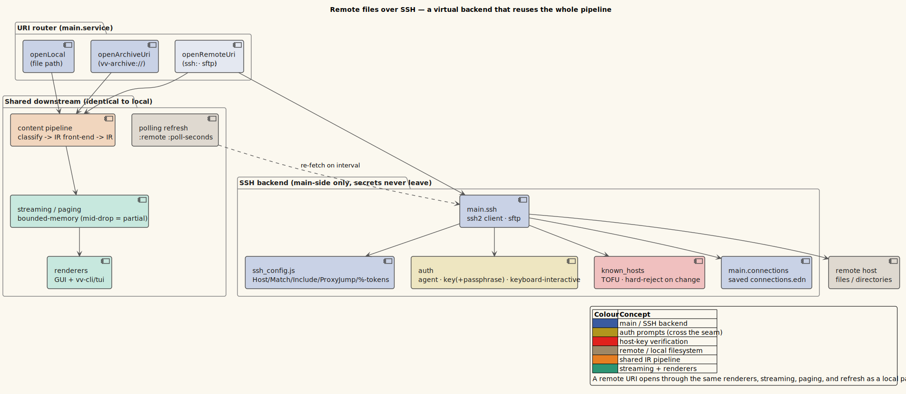
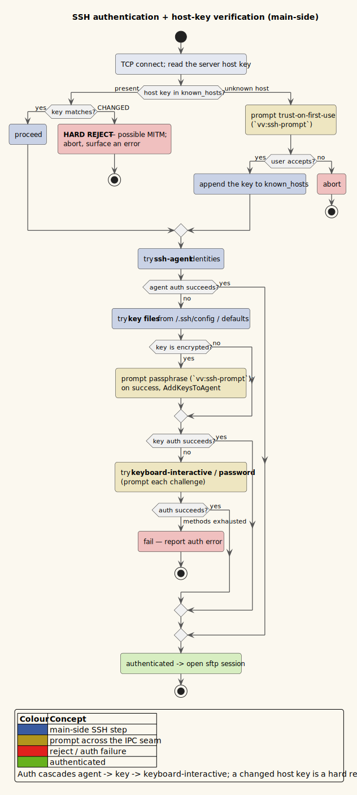

# 0027 — Opening remote files & directories over SSH (`ssh://` / `sftp://`)

- **Status:** Accepted
- **Date:** 2026-07-11
- **Deciders:** Vinary Tree (maintainer)

## Context

Vinary Viewer opened **local** paths, `http(s)://` URLs (the browserized web view), and the virtual
`vv-archive://` scheme (archive members). It had **no** way to open a file or browse a directory on a
remote host. This ADR adds first-class support for opening remote files **and** directories over SSH
via `ssh://[user@]host[:port]/path` and its `sftp://` alias — reusing every existing renderer, parser,
streaming, and directory-browser subsystem rather than rebuilding them.

There is no single IETF-standardized URI scheme purpose-built for SSH file access; `ssh://` (Git/GIO)
and `sftp://` (GVfs/KDE/WinSCP/libcurl) are the widely-supported de-facto schemes. We accept **both** as
equivalent aliases — both drive the SFTP subsystem for file operations; the scheme is retained only for
display.

The governing constraint, restated from [ADR-0017](0017-common-document-ir.md) /
[ADR-0020](0020-terminal-preview-layer.md) / [ADR-0025](0025-latex-rendering-via-unified-latex.md):
**reuse existing subsystems; do not rebuild.** Every capability below is layered onto machinery that
already exists — the `vv-archive://` virtual-URI backend is the exact template.

## Decision

### 1. Transport — `ssh2`, main-process only

The SSH/SFTP client is the **`ssh2`** npm library (MIT, © Brian White). Its crypto is **Node's built-in
`crypto`** — ssh2's optional native crypto addon (`sshcrypto.node`) is never built, so ssh2 imposes **no
hard native-build requirement** and stays portable; it degrades to pure-JS crypto wherever a native
accelerator is absent. Because `:node-script`/`:node-test` builds externalize npm packages as runtime
`require()`s (verified: `chokidar`/`yauzl`/`mammoth` are all external in `dist/main/main.js`), ssh2 is
never processed by the bundler and needs no build-config stub.

The transport runs **entirely in the trusted main process**, never the sandboxed renderer. The renderer
has `contextIsolation`, `nodeIntegration:false`, `fs`/`path`/`url` stubbed, and a CSP that blocks all
remote I/O; therefore **all** sockets, private keys, passphrases, and host-key checks live main-side, and
only non-secret metadata crosses the `window.vv` seam. This mirrors the password-bridge doctrine
([passwords.cljs](../../src/vinary/main/passwords.cljs)).

Two pure, node-testable JS modules plus two CLJS glue namespaces:

| File | Role |
|---|---|
| `src/vinary/main/ssh_config.js` | **pure**: URI parsing, `~/.ssh/config` (Host/Match/Include + %-tokens), `known_hosts` matching, SHA256 fingerprints. No fs/net. |
| `src/vinary/main/ssh_transport.js` | ssh2 `Client` **pool**, the auth chain, `hostVerifier`, ProxyJump, `~user` resolution, and the async SFTP API. Electron-free (injected prompt/error callbacks). |
| `src/vinary/main/ssh_agent.js` | the SSH-agent `ADD_IDENTITY` wire protocol (ssh2 has no client-side agent-add) for `AddKeysToAgent`, covering ed25519 / RSA / ECDSA. |
| `src/vinary/main/ssh.cljs` | wires the transport's prompts to a native host-key dialog + a renderer secret modal; owns the `vv:ssh-*` IPC channels. |
| `src/vinary/main/connections.cljs` | `connections.edn` — non-secret host metadata (a clone of `recent.cljs`). |

*Diagram source: [`../diagrams/component-remote-backend.puml`](../diagrams/component-remote-backend.puml).*

### 2. A remote URI is a virtual backend, exactly like `vv-archive://`

An `ssh://` URI is **addressed, never mirrored** to a temp dir (the same anti-path-traversal rationale as
archives). It flows through the *same* open pipeline as a local path:

- **Renderer** ([`uri.cljs`](../../src/vinary/app/uri.cljs)): `ssh?`/`sftp?`/`remote?` predicates; `file-path`
  **preserves** a remote URI (like `archive?`), and `http?` is false, so it renders as **document content**,
  not the web view. Authority-aware `display`/`basename`/`dirname`/`segments` keep the `user@host:port`
  authority intact, so breadcrumbs, tab labels, and Alt-Up parent-navigation work on a remote URI exactly
  as on a local path. A remote directory's listing entries carry **child `ssh://` URIs**, so `dir-view`
  and `:doc/open` reuse works with zero component change.
- **CLI arg** ([`startup.cljs`](../../src/vinary/main/startup.cljs) `doc-uris`): a remote URI is kept
  verbatim (never `resolve-abs`-mangled), like http/archive.
- **Classification** ([`file_kind.cljs`](../../src/vinary/main/file_kind.cljs)): a `remote-uri?` predicate;
  `kind-of` needs no new arm — it classifies off the basename extension, already correct on the ssh tail.

### 3. One remote reader — `openRemoteUri`, a single async seam

`service_util/route`'s `directory?` predicate is a **synchronous** `statSync`; a remote stat is a network
round-trip. So `content_service.js/openRemoteUri(uri, kind)` — a parallel of `openArchiveUri` — does the
`remoteStat` **internally** to decide list-vs-read and to fill `meta.size`, and
[`service.cljs`](../../src/vinary/main/service.cljs)'s remote arm is just an async `.then`/`.catch`
delegation (`send-remote-content!`). No async ever leaks into the pure router.

`openRemoteUri` produces the **identical payload contract** and reuses every existing parser — `bufferToPayload`
(image→dataUrl, pdf→bytes, office/table/log parsers, text sniff), plus the archive machinery. The
grammar-aware `kind` is threaded from CLJS so a remote `.rs` renders as highlighted source, not sniffed
text. Directory overrides `kind`.

> **`meta.size` is load-bearing, not decorative.** `stream-flag/enabled?` gates streaming on `(>= size
> threshold)`; a remote payload that omitted `meta.size` would make large remote logs/markdown **silently
> never stream** — the same class of bug the local `:text` route's `:meta {:size}` fixed (ADR-0018).

`open!` skips the git-tree sidebar and the chokidar watch for a remote URI (a remote path is not a local
repo and cannot be inotify-watched); `complete` gains an async remote-directory branch for URI-bar
completion; `vv:load-pdf-bytes` / `vv:load-diff-sources` gain remote branches (over SFTP).

### 4. Streaming, paging, and polling live-refresh

- **Streaming** (`streamOpen`): a remote source substitutes an SFTP read-stream for `fs.createReadStream` —
  a drop-in `Readable`, so the credit-1 pull cursor and the whole session are otherwise identical. Only the
  **transport engine** (log/text) needs this; the **progressive engine** (markdown/org/latex) re-parses the
  already-delivered `:doc/text` and opens no stream.
- **Mid-stream drop → partial, never silent truncation.** A dropped connection destroys in-flight streams
  **with an error**, so the read surfaces the drop rather than a clean EOF (which would look like a complete
  read and truncate content undetected). `streamPull` returns `{done, error, partial}`; the renderer
  ([`scheduler.cljs`](../../src/vinary/stream/scheduler.cljs)) keeps every committed block and shows a
  non-fatal `:doc/stream-note`. It **never** sets `:doc/error` (which `views.cljs` tests *before*
  `:doc/streaming?` and would blank the streamed DOM).
- **Paging** (`contentPage`): a remote arm reads only up to the requested window over SFTP; the LRU page
  cache keys on the `ssh://` URI verbatim.
- **Live-refresh via polling** (SFTP has no inotify): a per-doc poller re-stats the URI and, on a
  size/mtime change, re-sends it (a fresh `Date.now` stamp → the renderer remounts/re-streams — the refresh
  contract is already mtime-agnostic). **Opt-in** via `settings.edn` `:remote {:poll-seconds …}`;
  exponential backoff (to 60 s) + ±25 % jitter avoid hammering a downed host; directory listings poll slower
  or not at all. Lifecycle is tied to `unwatch-file!`, so closing a tab stops the poll — the same guarantee
  as watchers (ADR-0006).

### 5. Authentication, host-key trust, and `~/.ssh/config`

*Diagram source: [`../diagrams/activity-ssh-auth.puml`](../diagrams/activity-ssh-auth.puml).*

- **Auth chain** (ssh2's async `authHandler`, first success wins): a `none` probe, then **agent**, **key
  files** (config `IdentityFile` then `~/.ssh/id_ed25519|ecdsa|rsa|dsa`; an encrypted key lazily prompts a
  passphrase and, if `AddKeysToAgent` asks, is added to the running agent via the agent wire protocol),
  full multi-prompt **keyboard-interactive** (MFA), and **password** (up to 3 prompts).
- **`~/.ssh/config`**: a hand-rolled parser honoring `Host`/`HostName`/`User`/`Port`/`IdentityFile`/
  `IdentitiesOnly`/`ProxyJump`/`AddKeysToAgent`, `Match` (host/user/originalhost/exec/all/final/canonical),
  and `Include` (glob-expanded, recursive), with `%h`/`%p`/`%r`/`%n`/`%u` token expansion — resolved
  two-pass (OpenSSH-style), first-value-wins.
- **ProxyJump / multi-hop**: each hop is its own pooled connection; the chain is built with
  `client.forwardOut`, the resulting stream passed as the target's `sock`.
- **`~user` paths** are resolved with a `echo ~user` exec — with the username **validated to a strict POSIX
  pattern first**, so a document-supplied `ssh://…/~evil;cmd/…` can never smuggle a shell metacharacter into
  the remote command.
- **Host-key**: verified against `~/.ssh/known_hosts` (plain, `[host]:port`, and `|1|` hashed entries) with
  a **trust-on-first-use** prompt on an unknown key (a native async dialog in the GUI, a `yes/no` prompt in
  the terminal) and a **hard reject** of a changed key.

### 6. Remote assets, Document↔PDF, diffs, archives, and live HTML

Everything the local path does, a remote path now does:

- **Relative image assets** in a remote Markdown/Office doc → fetched over SFTP and inlined as `data:` URLs
  (`media/resolve-remote-media!`), for both the batch and the progressive-streamed render — neither the
  sandboxed renderer nor `file://` can reach the host.
- **Live-rendered remote HTML** via a privileged **`vv-remote://`** scheme registered on the web view's
  session: the whole ssh tree is remapped 1:1, so the page's relative CSS/JS/images resolve to
  `vv-remote://` URLs that main serves over SFTP — the SSH analog of loading an `http(s)` page.
- **Document↔PDF** siblings over remote (a remote `paper.tex` ↔ `paper.pdf`, both directions), the
  side-by-side **diff** view's on-disk enrichment (resolved over SFTP, walking ancestors), and **archive
  browsing** (a remote `.zip`/`.tar` read whole into a buffer, then the existing `source.buffer ? … :
  filePath` archive seam does the rest).
- **Terminal parity**: `vv-cli`/`vv-tui` route remote URIs through `openRemoteUri` too, with TTY-gated
  terminal auth prompts (non-interactive runs rely on the agent/keys).

### 7. Secrets and configuration

`connections.edn` (a `recent.cljs` clone) persists **non-secret** host metadata only. Passwords,
passphrases, private-key contents, and host-key material **never** touch it — they live in the transport's
main-process memory (for the connection lifetime) and in the user's existing `~/.ssh`. Accepted host keys
append to `~/.ssh/known_hosts` (the standard OpenSSH location), not to any app store. The only
secret-bearing IPC channel is `vv:ssh-prompt-reply` (renderer→main, one-shot, resolved into a
main-memory promise, never persisted or placed in app-db).

## Security

The threat model ([threat-model.md](../security/threat-model.md)) is amended: a remote host is a **new
untrusted input source** — SFTP bytes and directory listings are a trust boundary like the local parsers,
and remote streamed content rides the **same** per-block GitHub-allowlist sanitizer as local content. Key
protections: secrets stay main-side (no persistence); host-key **TOFU with change-rejection** (a first-
connect MITM window, closed thereafter); **URI authorities are validated at parse time** — a remote URI's
host and user are restricted to hostname/username-safe characters (and `~user` paths before any remote
`echo ~user`), so **no URI-derived value can reach a shell** (a `Match exec` `%h`/`%r` token → `cp.execSync`)
or any `~/.ssh/config` directive, even though a URI may be document-supplied; and `vv-remote://` serves only
file bytes over SFTP (no arbitrary command execution).

## Consequences

- Remote files and directories open through the **same** pipeline, renderers, streaming, and refresh as
  local files — a genuinely additive capability with almost no renderer changes.
- The main process gains a real network client and (optionally) a poller; the idle reaper closes pooled
  connections after 5 minutes idle, and the CLI closes them on exit so the process can terminate.
- `ssh2` is a new runtime dependency (MIT); its crypto is Node crypto, so no mandatory native build.

## Testing

Hermetic throughout — an **in-process `ssh2.Server`** SFTP fixture (`test/fixtures/ssh-server.js`) backs a
real SFTP endpoint on loopback over a temp directory, so no network and no external host:

- `test/ssh-config-smoke.js` — URI parse, ssh_config (Host/Match/Include/tokens), known_hosts, fingerprints.
- `test/ssh-transport-smoke.js` — auth (password/agent-add), host-key TOFU, `~user`, **ProxyJump** (two-hop),
  pooling, wrong-password → auth-failed, and `AddKeysToAgent` adding ed25519/RSA/ECDSA to a throwaway agent.
- `test/content-service-smoke.js` — `openRemoteUri` (markdown/dir/image-dataUrl/csv/tar-archive/source),
  Doc↔PDF siblings, diff enrichment, relative-asset data URLs, remote streaming/paging, and a deterministic
  **mid-stream-drop → partial** (never a silent EOF).
- `test/cli-smoke.js` — a remote `ssh://` render (passwordless fixture).
- `test/electron-smoke.js` — a remote markdown render, remote directory browse, and the SSH auth-prompt
  modal collecting a secret and replying to main; **zero CSP violations**.
- `test/vinary/app/uri_test.cljs` + `test/vinary/stream/transport_test.cljs` — the remote URI helpers and
  the `:error`/`:partial` drop surfacing.

## Alternatives considered

- **Shell out to the system `ssh`/`sftp` binaries** — inherits `~/.ssh/config`/agent/known_hosts for free,
  but requires OpenSSH installed and parses fragile CLI output for structured listings/streaming. Rejected
  in favor of ssh2's structured SFTP API, which maps directly onto the reader/stream/dir needs.
- **Mirror remote files to a temp dir** — simpler reads, but a mutable on-disk copy, cleanup burden, and a
  path-traversal surface. Rejected: the `vv-archive://` virtual-URI model is cleaner and already proven.
- **Render remote HTML as sanitized static content** instead of the `vv-remote://` web view — safer-seeming,
  but inconsistent with local HTML and loses CSS/JS fidelity; the web view already loads remote `http(s)`
  content, so `vv-remote://` is the consistent choice.
