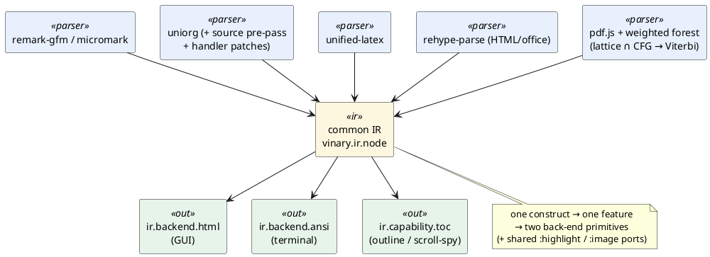

# 0029 — Mature parsers + a shared IR/feature layer (reversing the native recognizers)

- **Status:** Accepted
- **Date:** 2026-07-16
- **Deciders:** Vinary Tree (maintainer)
- **Supersedes:** [ADR-0028](0028-composable-rendering-features.md)

## Context

[ADR-0028](0028-composable-rendering-features.md) proposed replacing the monolithic third-party parsers
(`remark-gfm`, `uniorg`, `unified-latex`) with **hand-rolled, native, deterministic recognizers** on the
shared streaming spine — a full CommonMark/GFM and Org re-implementation (`vinary.ir.recognizer.*`,
`vinary.ir.feature.*`, `vinary.renderer.native`), gated behind the compile-time `native-markdown` flag.

Two things became clear once that work was under way:

1. **The recognizers were regex-heavy leaf matchers**, not the automata the plan implied — and re-implementing
   conformant CommonMark/Org is a large, permanent, edge-case-dense maintenance surface.
2. **The original goal was full-spec _functionality_, not hand-rolled parsers.** The valuable, defensible part
   of ADR-0028 — one common IR, composable features shared across formats, and dual (GUI + terminal) back-ends
   — lives entirely at the **IR/feature layer, which rides on _any_ parser's AST**. It never required owning
   the parse.

We then verified, empirically, whether the mature parsers already deliver the functionality:

| Parser | Spec coverage | Verdict |
|---|---|---|
| `remark-parse` + `remark-gfm` (**micromark 4.0.2**) | **FULL** — 100 % CommonMark 0.30 (spec-suite + reference-parser tested) + all 5 GFM extensions (tables, task lists, strikethrough, autolink literals, footnotes) | keep |
| `unified-latex` 1.8.4 | **Category error** — LaTeX is Turing-complete, has no finite grammar; functionally sufficient for the structural-preview + math goal, and fails safe (parse error → code block; low fidelity → collocated PDF) | keep |
| `uniorg` 3.2.2 | **PARTIAL** — a faithful `org-element.el` port; a stable, enumerable set of gaps (macros, inline src/babel, targets, drawer contents, custom `#+TODO:`, list counters, inlinetasks, source positions) | keep + patch |

None of the three *necessitates* a hand-rolled parser: GFM is complete, LaTeX's "full spec" is ill-posed, and
Org's gaps are all closable at the `uniorg-rehype` handler/normalize layer (the pattern the pipeline already
uses) or a small source pre-pass — far cheaper than reproducing `org-element.el` (~7 k lines).

## Decision

**Reverse the native recognizer subsystem. Render every format through its mature parser → the common IR →
one shared feature/back-end layer.** Invest the freed effort in the three governing goals:

1. **Full GFM + Org functionality** — every construct renders correctly.
2. **One shared rendering path per feature** — across all document types *and* both back-ends; duplicated
   rendering logic is the maintenance burden and bug source to eliminate.
3. **A consistent experience across every document type**, with a native visual surface only where the content
   needs it (PDF, source, HTML, image, web) — each *hybridized* so the shared navigation/find/TOC still work
   on top (ADR-0028's "composable-majority + sanctioned hybridization" tenet, retained).

### Surviving architecture

Recognition happens **once per format** in `vinary.ir.frontend.*`; every format converges on the one IR; two
back-ends and the shared capabilities read that IR. Nothing above the parser touches source text.



### What changed (this course-correction)

- **Removed** the hand-rolled recognizer engine, feature registry, native façade, and the `native-markdown`
  flag (dead behind an off-by-default flag — no user-facing change). The common IR + feature/back-end layer
  is untouched.
- **De-duplicated the one real GUI↔terminal divergence:** the ANSI back-end re-derived ordered-list ordinals
  as `(inc idx)`, ignoring `<ol start>` / `<li value>`; both back-ends now read the ordinal from the same node
  `:attrs`. A **backend-parity test** is now a hard gate: every feature must render through *both* back-ends
  off one IR, so nothing can silently become GUI- or terminal-only.
- **Closed Org's nine functionality gaps** at the shared `uniorg-rehype` seam (drawers, list counters, custom
  `#+TODO:`, inlinetasks via handlers/normalize; macros, inline src/babel, targets via an Emacs-faithful
  source pre-pass; source positions via a `patch-package` patch to `uniorg-rehype`'s `h()` + `trackPosition`).
  No gap widened the one sanitize schema.
- **Activated the weighted substrate for PDF reflow.** Block segmentation moved from a greedy `1.6×median-gap`
  threshold to a globally-optimal partition: a lattice of candidate blocks (Tropical-costed edges) ∩ the
  trivial grammar $S \to B^{+}$, solved by a new true packed-forest Viterbi (`ir.forest/viterbi-parse`). The
  per-block cost is

  ```math
  \mathrm{cost}([i,j)) \;=\; \sum_{k=i}^{j-2} \max\!\big(0,\; g_k - \tau\big) \;+\; \beta \cdot \mathrm{spread}_x([i,j)) \;+\; \lambda
  ```

  where `$g_k$` is the vertical gap between adjacent lines, `$\tau$` the median line gap, `$\mathrm{spread}_x$`
  the horizontal (column) spread, and `$\lambda = 0.6\,\tau$`. The additive vertical term reproduces the greedy
  threshold on single-column pages (which it thus subsumes); the non-additive `$\beta\cdot\mathrm{spread}_x$`
  term lets the global optimum separate columns a per-gap threshold cannot.
- **HTML consistency facet.** `.html` keeps rendering in the browser view, but its source also flows through
  the shared `office/html->ir` (rehype-raw + the one sanitize schema + rehype-slug) → `ir.capability.toc/toc-of`,
  so its Contents outline uses the same slug policy as every other format — the additive IR nav facet,
  parallel to how PDF contributes `outline`/`page-text`/`reflow` alongside its canvas.

### Consistency contract & specialization boundary

Shared behaviours (scroll-spy, outline/TOC, in-doc find, source⇄preview jump, theming, zoom, MathJax, code
highlighting, figures, links) are provided by the shared IR/feature layer for `md` / `org` / `tex` / `csv` /
`log` / `diff`. The **specialized visual surfaces** — `html` (browser view), `pdf` (pdf.js canvas), `source`
(CodeMirror), `image` (raster), `web` (live remote page) — are the deliberate minority; each still contributes
the IR facets it *can* (PDF → outline/reflow/text; source → code outline; HTML → outline/text), so navigation
stays uniform on top of the bespoke render. `image` (pure raster) and remote `web` (webview-internal only) are
the documented exceptions.

## Consequences

**Positive.** No re-implementation of CommonMark/Org to maintain; the mature parsers own correctness. One
rendering path per feature, enforced by the parity gate. Org reaches full functional coverage (nine gaps
closed) and gains the fine-grained source⇄preview jump it lacked. The weighted `lattice`/`earley`/`forest`
substrate is no longer dead code — it does globally-optimal PDF segmentation. HTML joins the shared-outline
world.

**Negative / follow-on.** `patch-package` is new build infra (a `postinstall` hook; the patch is pinned to
`uniorg-rehype` 2.2.0 and must be re-verified on upgrade). The **HTML GUI integration** — routing the `.html`
source into the renderer, the Source⇄Preview toggle, the `findInPage` bridge, and coordinating `web-preload`'s
heading ids onto the shared slug ids — is Electron-side and remains to be landed and verified in the Electron
environment; the IR facet it consumes is in place and unit-tested (`ir.frontend.html-test`). The weighted
reflow's `$\lambda$` / `$\beta$` warrant calibration on a labelled PDF corpus (single-column / two-column /
tables); they are conservative defaults today.

## References

- CommonMark Specification 0.30 — <https://spec.commonmark.org/0.30/>.
- GitHub Flavored Markdown Spec — <https://github.github.com/gfm/>.
- Org-mode Syntax — <https://orgmode.org/worg/org-syntax.html>.
- micromark (100 % CommonMark, reference-parser-tested) — <https://github.com/micromark/micromark>.
- unified-latex (scope: "LaTeX effectively has no grammar") — <https://github.com/siefkenj/unified-latex>.
- J. Goodman, *Semiring Parsing*, Computational Linguistics 25(4), 1999 — <https://aclanthology.org/J99-4004/>.
- M. Mohri, *Semiring Frameworks and Algorithms for Shortest-Distance Problems*, J. Automata, Languages and
  Combinatorics 7(3), 2002. DOI [10.25596/jalc-2002-321](https://doi.org/10.25596/jalc-2002-321).
- J. Earley, *An Efficient Context-Free Parsing Algorithm*, CACM 13(2), 1970. DOI
  [10.1145/362007.362035](https://doi.org/10.1145/362007.362035).
