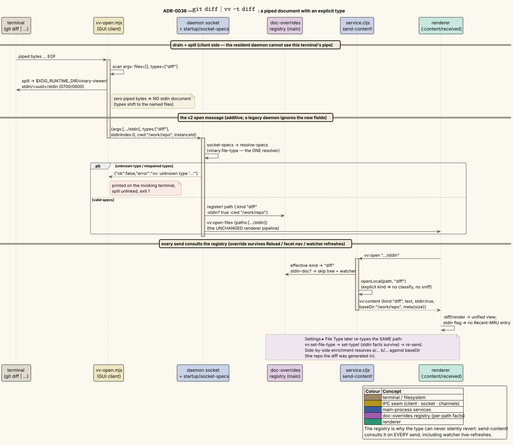

# 0036 — Piped-stdin documents and explicit file types (one resolver, a main-side override registry)

- **Status:** Accepted
- **Date:** 2026-08-04
- **Deciders:** vinary-viewer maintainers

## Context

Four gaps, one primary use case — `git diff | vv -t diff`:

1. **No stdin support.** There was no way to view piped text at all; `-` was actively dropped at four
   argument-handling layers (vv-open.mjs, `startup/doc-uris`, vv-cli, vv-tui), and the resident daemon
   architecture means the process that opens the window never sees the invoking terminal's pipe.
2. **No explicit file-type control.** A piped stream has no extension, and even on-disk files sometimes
   need an override (a `.log` that is really a diff). Types are re-derived from the filename on every
   send — including every watcher live-refresh — so a one-shot override would silently revert.
3. **No in-app re-typing.** Once open, a document could not be re-interpreted as another type.
4. **Plain text was delimiter-sniffed.** `openLocal`'s tail flipped prose with a stable comma/tab/pipe
   count into a column-aligned table. The CLI and TUI already bypassed the sniff deliberately; the GUI
   (and the archive/remote text tails) did not.

A standing constraint shaped every choice: **the three interfaces (GUI, `--cli`, `--tui`) share one
core and differ only in presentation.** No third copy of any classifier or parser.

## Decision

### One shared resolver + pairing core — `vinary.file-type`

`resolve-type-token` maps a token — a standard MIME type (`text/x-diff`, `application/pdf`,
parameter tails like `;charset=` stripped), a short alias (`diff`, `md`, `csv`), or a grammar language
(`python`, `rs` → `{:kind "source" :language <catalog id>}`) — to a type spec. Kind tokens beat
grammar names on collision (`markdown` means the *rendered* kind, exactly as the `.md` extension does).
`scan-open-args` recognises `-t V` / `--type[=V]` / `--file-type[=V]` and a lone `-`;
`resolve-specs` pairs the Nth type with the Nth file, inserts the stdin document first (or at `-`),
and rejects mispairings with a usage error. All three interfaces (via `startup/doc-specs`,
`startup/socket-specs`, cli, tui) and the Settings ▸ File Type menu consume these functions —
`-t` is uniform everywhere, which required dropping vv-cli's old `-t` short form of `--toc`
(user-approved breaking change; `--toc` is long-only now).

### Stdin = a real temp file, not a virtual URI scheme

The client that owns the terminal (vv-open.mjs for the GUI; the shared `vinary.terminal.stdin` for
cli/tui/main) drains stdin to EOF **binary-safe** and spills it to
`$XDG_RUNTIME_DIR/vinary-viewer/stdin/<uuid>/stdin` (0700/0600). Because the document is then an
ordinary file, *every* filesystem consumer works untouched — streaming, paging, the `:pdf`/`:image`
byte routes (`cat x.pdf | vv -t pdf` works), the warm cache — and the tab label is simply the
basename, `stdin`. Zero piped bytes means *no* stdin document (types shift to the named files).
The snapshot is immutable, so the sidebar tree and the file watcher are skipped, exactly as the
archive backend does. Lifecycle: unlinked when retention drops the document; a 10-minute age-gated
sweep at daemon boot collects spills of crashed invocations (the gate covers the one legitimate race —
the client spills *before* spawning the daemon that sweeps); the runtime dir is tmpfs, cleaned at
logout. cli/tui render straight from the drained Buffer and spill only where a real path is required
(the bounded stream engine, the image port, the table parser); the TUI reopens `/dev/tty` for keys
(the pipe carried the document), degrading to a view-only session when no controlling terminal exists.

### The main-side override registry — `vinary.main.doc-overrides`

`vv:open` carries only a path, and `send-content!` classifies on every send, so an explicit type must
live main-side, keyed by the exact path/uri: `path → {:kind :language :delimiter :stdin? :cwd}`.
Written by `open-window!` (CLI specs, before the window opens) and by `vv:set-file-type`
(Settings ▸ File Type — `set-type!` replaces kind/language/delimiter *as a unit* while the stdin facts
survive); consulted by `send-content!` on **every** send, so the override survives Reload, facet
navigation, history, and watcher live-refreshes; cleared in `unwatch-file!` when retention drops the
path ("close tab, reopen file" returns to extension deduction). The same entry carries the stdin
facts: `:stdin?` gates tree/watcher and the Recent-MRU, `:cwd` (the invoking directory) is what lets a
piped diff's side-by-side view resolve `a/… b/…` against the repo it was generated in, and what piped
markdown resolves relative images against (`:doc/base-dir`).

An explicit kind is **authoritative** in the content service: `openUri(uri, kind, opts)` threads it to
`openLocal`/`openArchiveUri`/`openRemoteUri` (the remote reader takes `opts.explicit`, since its kind
argument was always threaded), which skip `classifyName` and every content sniff, and treat an
explicit `table` as delimited-by-declaration (`opts.delimiter` rides `meta.delimiter`). A grammar
language reaches the renderer as the `language` payload key → `:doc/language` → the source view's
`grammar-for-doc` pick (and the ANSI highlighter in cli/tui).

### The socket protocol, extended additively with a rejection reply

The open message gains optional `types`, `stdinIndex`, `cwd`. Both skew directions stay well-formed: a
legacy daemon ignores the new fields (the spill opens untyped and the idle-retire self-heal converges),
a legacy client omits them (byte-identical behavior). The open path replies **only to reject**
(`{"ok":false,"error":"vv: …"}`) — the client's half-close still receives — so `vv -t diph x` prints
the daemon's error on the invoking terminal and exits 1, with **one** resolver and no client-side
token table. Direct-electron launches strict-validate their own argv *before* the single-instance
lock (a bad second invocation errors in its own terminal and never signals the primary); cli/tui
validate tokens before the stdin drain blocks on the producer's EOF.

### The plain-text fix — the smallest lever

`"text"` **stays** in `parser-kinds` (re-routing it would have dropped `sourceable` — killing View
Source on plain text — and the log sniff with it). Only the `sniffDelimited` arms are disabled
(commented out, never deleted, in `openLocal`'s tail and `bufferToPayload`, which also covers the
remote and archive text tails). The log sniff is deliberately kept: an extensionless syslog still
pages as a log, and a log view is not delimiter alignment. Explicitly *named* delimited files
(`.csv`/`.tsv`/…) classify as tables exactly as before; the sanctioned escape hatch for a headerless
CSV in a `.txt` is now `-t csv` or Settings ▸ File Type ▸ Delimited Table.

## Alternatives considered

- **A `vv-stdin://` virtual URI scheme** (the archive/remote precedent). Rejected: the scheme would
  need stripping at every filesystem consumer (`send-content!`, `openUri`, `streamOpen`,
  `contentPage`, diff-source loading, the renderer's uri arithmetic) — a much larger regression
  surface than one registry check — and the byte routes (pdf/image) would need special arms that the
  temp file gives for free.
- **Removing `"text"` from `parser-kinds`** to fix the sniff. Rejected after verification: the
  `:text` route sends no `sourceable`, so View Source on plain text would regress, and the
  extensionless-log sniff would die with it — repairing both would have re-created the parser tail in
  a second place.
- **Silent fallback-to-text for unknown type tokens.** Rejected: a typo (`-t dif`) would silently
  render wrong. The rejection reply keeps validation strict everywhere a terminal exists without
  duplicating the resolver into JavaScript.
- **Renderer-side type state.** Rejected: watcher live-refreshes are main-initiated and re-classify;
  a renderer-only override reverts on the next file save (the registry is the fix, not a cache).

## Consequences

- `git diff | vv` renders literal plain text; `git diff | vv -t diff` renders the diff, and its
  side-by-side view enriches from the invoking repo. The same grammar works in `--cli` and `--tui`.
- `tail -f x | vv` blocks until the producer closes stdin — a piped document is a snapshot at EOF, by
  design (cat semantics). `vv --no-daemon` bypasses vv-open.mjs and therefore does not read stdin
  (documented; `-t` on files still works there via `doc-specs`).
- Binary stdin without a type renders as mojibake literal text (no magic-byte sniffing, by design);
  `-t pdf` / `-t image` are the explicit routes. `-t office`/`-t archive` are refused for piped input
  (their parsers are extension-driven).
- A type on a directory is ignored (the directory route wins); on an `http(s)://` URL it is ignored
  (the web view never consults kinds); on `ssh://`/`sftp://` and archive-entry URIs it works (the
  registry keys by uri and the readers accept the override).
- Kind tokens shadow the `markdown`/`org`/`latex`/`html` grammar names; the highlighted form remains
  one View Source (or a language pick) away.
- Test surface: `file_type_test` + `doc_overrides_test` + `startup_test` (pure), content-service /
  cli / tui / daemon smokes (wiring, including a real piped open through vv-open.mjs), and the
  electron smoke drives Settings ▸ File Type end-to-end.
