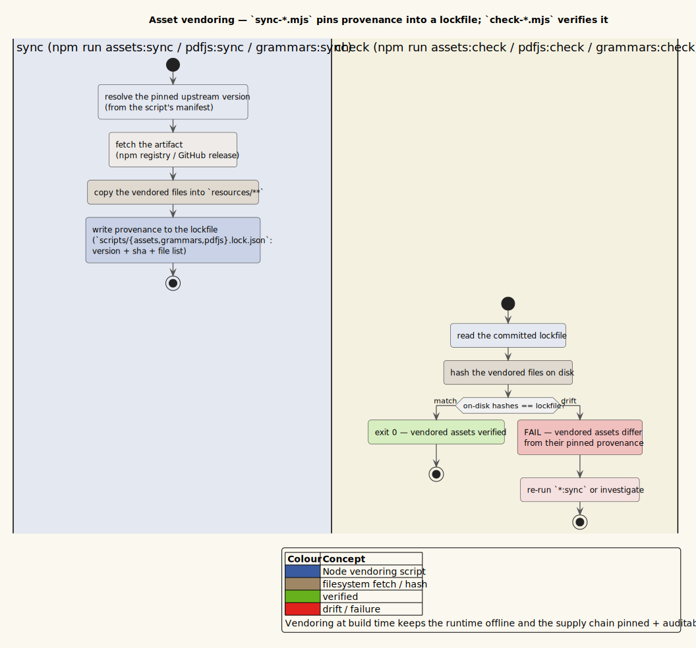

# Asset vendoring and lockfiles

vinary-viewer ships every runtime asset — icon fonts, UI fonts, tree-sitter
grammars, the pdf.js worker and its data tables, and a graphics WASM binary —
**from local disk**, copied out of `node_modules` at build time and recorded in a
lockfile. Nothing is fetched from a CDN at runtime. This page documents the
`sync-*.mjs` / `check-*.mjs` script pairs, the three `*.lock.json` provenance
models, and why vendoring happens at build time.

> **Audience.** Read this when adding or upgrading a vendored asset (a font, a
> grammar, a pdf.js bump), when a `*:check` fails in the test suite, or when
> diagnosing a missing-glyph / missing-worker runtime error.

---

## 1. Key terms

| Term | Definition |
|------|------------|
| **Vendoring** | Copying a dependency's files out of `node_modules` into the repository's own served tree (`resources/public/**`) so the app loads them by app-relative path, offline, with no network fetch. |
| **Sync script** | A `scripts/sync-*.mjs` that performs the copy and records what it copied. |
| **Check script** | A `scripts/check-*.mjs` that verifies the vendored tree matches its lockfile — used after a sync and intended for CI. |
| **Lockfile** | A `scripts/*.lock.json` recording provenance: for output manifests, the sha256 of every vendored byte; for the grammar manifest, the source each grammar is built from. |
| **sha256** | The 256-bit SHA-2 content hash used to detect drift between a vendored file and its lockfile record. Written as `$`h(\mathit{bytes})`$` below. |
| **Idempotent sync** | A sync that rewrites a destination *only* when its bytes differ from the source, so a warm re-run copies nothing and leaves `git status` clean. |

---

## 2. Why vendor at build time

Vendoring is a deliberate architectural choice with four payoffs, each of which a
runtime CDN fetch would forfeit:

1. **Offline and hermetic.** The app runs with no network. A user previewing a
   Markdown file on a plane still gets Font Awesome icons, syntax highlighting,
   and PDF rendering.
2. **CSP- and sandbox-friendly.** The renderer runs under a Content Security
   Policy and (for pdf.js) a sandboxed `file://` origin. Loading assets from the
   app's own origin avoids the `connect-src`/`script-src` exceptions a CDN would
   force, and keeps the pdf.js worker same-origin (see
   [security/threat-model.md](../security/threat-model.md)).
3. **Reproducible.** Because each vendored byte is pinned by sha256 (or, for
   grammars, by an upstream source revision), a build is reproducible and a review
   diff of a lockfile is a meaningful record of what changed.
4. **Upgrades are a dependency bump + rebuild.** To upgrade Font Awesome or
   pdf.js you bump the version in `package.json`, `npm install`, and re-run the
   sync; the lockfile diff shows exactly which bytes moved. There is no separate
   asset-management step.



*Diagram source: [`../diagrams/activity-asset-vendoring.puml`](../diagrams/activity-asset-vendoring.puml).*

---

## 3. The sync → check contract

Each vendored asset class follows the same two-step contract:

```math
\mathtt{sync} : \mathit{node\_modules} \longrightarrow (\mathit{resources/public}, \; \mathtt{lock.json})
\qquad
\mathtt{check} : (\mathit{resources/public}, \; \mathtt{lock.json}) \longrightarrow \{\mathtt{ok}, \mathtt{fail}\}
```

`sync` copies (idempotently) and records; `check` re-hashes the vendored tree and
fails non-zero on any missing file or sha256 mismatch. The idempotency test is the
same in every sync: compute `$`h(\mathit{source})`$`, and rewrite the destination
only if it is absent or `$`h(\mathit{dest}) \neq h(\mathit{source})`$. In
[`scripts/sync-assets.mjs`](../../scripts/sync-assets.mjs) that is:

```javascript
const buf = fs.readFileSync(src);
const hash = sha256(buf);
const dest = path.join(assetsRoot, item.to);
const fresh = fs.existsSync(dest) && sha256(fs.readFileSync(dest)) === hash;
if (fresh) { unchanged++; }
else { ensureDir(path.dirname(dest)); fs.writeFileSync(dest, buf); copied++; }
```

`check` in [`scripts/check-assets.mjs`](../../scripts/check-assets.mjs) is the
mirror image: for every file recorded in the lockfile, assert it exists and that
`$`h(\mathit{dest}) = \mathit{lock.sha256}`$`, then `process.exit(failures ? 1 : 0)`.

---

## 4. The three vendored classes and their lockfiles

There are three lockfiles, and they fall into **two provenance roles**. This
distinction is the single most important thing to understand about the mechanism.

| Lockfile | Role | Written by | Verified by | Vendored into |
|----------|------|-----------|-------------|----------------|
| [`scripts/assets.lock.json`](../../scripts/assets.lock.json) | **Output integrity manifest** — records the sha256 of each vendored file. | `sync-assets.mjs` | `check-assets.mjs` | `resources/public/assets/` |
| [`scripts/pdfjs.lock.json`](../../scripts/pdfjs.lock.json) | **Output integrity manifest** — records the sha256 of each vendored file. | `sync-pdfjs.mjs` | `check-pdfjs.mjs` | `resources/public/pdf/` |
| [`scripts/grammars.lock.json`](../../scripts/grammars.lock.json) | **Input source manifest** — records *where each grammar comes from*. | *(hand-maintained)* | `check-grammars.mjs` (by loading each built WASM) | `resources/public/grammars/` |

> **The asset and pdf.js lockfiles are *outputs*; the grammars lockfile is an
> *input*.** `sync-assets` and `sync-pdfjs` *write* their lockfiles as a record of
> what they just copied, and `check` re-hashes to confirm nothing drifted.
> `sync-grammars`, by contrast, *reads* `grammars.lock.json` as its instruction
> list — a hand-curated set of `{id, language, extensions, source}` entries naming
> each upstream grammar — and *produces* the built `grammar.wasm` + `highlights.scm`
> plus a `catalog.edn` and a per-grammar `source.json` pin.

### 4.1 Static UI assets — `sync-assets.mjs`

[`sync-assets.mjs`](../../scripts/sync-assets.mjs) vendors two icon-font faces and
two variable UI fonts out of their npm packages, driven by an explicit `MANIFEST`
array of `{pkg, from, to}` triples:

- **Font Awesome Free 7** — `fontawesome.min.css`, `solid.min.css`, and the
  `fa-solid-900.woff2` webfont → `resources/public/assets/fa/…`.
- **Noto Sans (variable)** — the UI/body face, Latin + Latin-Extended subsets →
  `assets/fonts/noto-sans/…`.
- **Fira Code (variable)** — the code/monospace face, Latin + Latin-Extended →
  `assets/fonts/fira-code/…`.

The written `assets.lock.json` records the resolved `packages` map (package →
installed version) and a `files` array of `{to, pkg, from, bytes, sha256}`.
`check-assets.mjs` additionally parses the hand-authored `assets/fonts/fonts.css`
and asserts that every `url(./…)` reference resolves to a vendored file, so a
missing font subset surfaces at check time rather than as an invisible glyph at
runtime. (This vendoring rides on
[ADR-0011](../design-decisions/0011-font-awesome-icons-self-hosted-fonts.md) —
self-hosted icons and fonts, no CSS framework.)

### 4.2 pdf.js — `sync-pdfjs.mjs`

[`sync-pdfjs.mjs`](../../scripts/sync-pdfjs.mjs) vendors the pdf.js runtime into
`resources/public/pdf/`: the **legacy** main module `pdf.min.mjs`, its byte-matched
worker `pdf.worker.min.mjs`, and four data directories — `cmaps`, `standard_fonts`,
`wasm`, `iccs`. Two of its guards are load-bearing:

1. **Worker-version guard.** pdf.js refuses a worker whose version differs from the
   main module, so the sync fails loudly if the *installed* `pdfjs-dist` version
   differs from the `package.json` pin:

   ```javascript
   if (installedVersion !== pinnedVersion) {
     console.error(`✗ pdfjs-dist version mismatch: installed ${installedVersion} != package.json pin ${pinnedVersion}`);
     process.exit(1);
   }
   ```

2. **Legacy build, not modern.** The *legacy* (ES5-friendly) build is vendored
   because the modern build's dynamic `import()` cannot be bundled by Closure
   `:simple`; the module is loaded at runtime via a native ESM `import()` (see
   `vinary.renderer.pdf`), so it never passes through Closure at all. This is a
   direct consequence of the `:simple` build invariant in
   [01-build-system.md](01-build-system.md#3-release-optimizations-simple--and-why-never-advanced).

`check-pdfjs.mjs` re-hashes every file in `pdfjs.lock.json` and reports drift; the
lockfile also records the resolved `version` (`5.4.149` at time of writing).

### 4.3 Tree-sitter grammars — `sync-grammars.mjs`

[`sync-grammars.mjs`](../../scripts/sync-grammars.mjs) is the most involved
sync, because grammars are *built*, not merely copied. For each enabled entry in
`grammars.lock.json` it resolves a source directory, compiles a WASM parser, and
copies the highlight query:

- **Source types.** An entry's `source.type` is one of `git` (clone `--depth 1`
  the upstream grammar repo into `.cache/tree-sitter-grammars/`, optionally at a
  `subdir`), `local` (a sibling checkout, e.g. `metta` ←
  `../MeTTa-Compiler/tree-sitter-metta`), or `existing` (a pre-built WASM already
  in `node_modules`, e.g. `rholang`).
- **Build.** For non-existing sources it runs `tree-sitter generate` (only if
  `src/parser.c` is absent) then `tree-sitter build --wasm`, writing
  `resources/public/grammars/<id>/grammar.wasm` and `highlights.scm`.
- **Outputs.** It writes `resources/grammars/catalog.edn` (the id → wasm/scm/
  extensions map the app reads) and a per-grammar `source.json` pin.

Two flags make re-installs fast and quiet:

| Flag (or env) | Effect |
|---------------|--------|
| `--skip-existing` (`GRAMMARS_SKIP_EXISTING=1`) | Leave an already-built grammar (both `grammar.wasm` and `highlights.scm` present) untouched — no fetch, no rebuild, no `source.json` re-pin. Makes warm re-installs idempotent. |
| `--verbose` (`GRAMMARS_VERBOSE=1`) | Print the per-command echo and child git/tree-sitter output. Off by default: the sync prints one concise line per built grammar and a summary. Failures are always surfaced (captured child stderr is re-attached to the thrown error). |

There is a subtle provenance rule worth calling out because it prevents a
"re-pin on every commit" churn treadmill: `sourceRev` is recorded **only** when a
grammar's source directory belongs to a *different* git repository than
vinary-viewer's own. For a grammar sourced from a plain subdirectory of *this*
repo (e.g. an in-tree `tree-sitter-bnfc`), `git rev-parse HEAD` would merely echo
vinary-viewer's own HEAD — a self-referential value that re-pins on every commit —
so the sync records `null` instead, keeping `source.json` stable. The relevant
check in the script:

```javascript
const top = run('git', ['rev-parse', '--show-toplevel'], { cwd: srcDir, capture: true }).trim();
if (fs.realpathSync(top) === fs.realpathSync(root)) return null;   // same repo → no meaningful rev
return run('git', ['rev-parse', 'HEAD'], { cwd: srcDir, capture: true }).trim();
```

`check-grammars.mjs` verifies grammars differently from the sha256 checks: it reads
`catalog.edn`, and for each entry it **actually loads** the `grammar.wasm` with
`web-tree-sitter` and compiles the `highlights.scm` query against it. A grammar
that copied but is subtly broken (an ABI mismatch, a malformed query) fails here,
where a hash check would have passed.

---

## 5. The fourth, lockfile-less asset — graphics WASM

[`sync-graphics-wasm.mjs`](../../scripts/sync-graphics-wasm.mjs) is a deliberately
simpler vendoring with **no lockfile and no check script**. It copies one binary —
`@resvg/resvg-wasm/index_bg.wasm` → `resources/public/js/resvg.wasm` — so the
headless terminal graphics layer (`vinary.terminal.graphics`) can rasterize SVGs
from disk at runtime, the same res-dir pattern `vinary.terminal.syntax` uses for
`tree-sitter.wasm`. It is run by `compile:cli` / `release:cli` /`compile:tui` /
`release:tui` (via the `graphics:sync` npm script) and uses a size comparison, not
a sha256, to decide whether to recopy:

```javascript
const changed = !fs.existsSync(dest) || fs.statSync(src).size !== fs.statSync(dest).size;
if (changed) fs.copyFileSync(src, dest);
```

It has no integrity manifest because it is a single binary with a single upstream
version already pinned in `package.json`; a full lockfile would add ceremony
without adding provenance the `package.json` pin does not already provide.

---

## 6. Where each sync is wired

| npm script | Runs | Producing |
|------------|------|-----------|
| `assets:sync` / `assets:check` | `sync-assets.mjs` / `check-assets.mjs` | `resources/public/assets/` + `assets.lock.json` |
| `pdfjs:sync` / `pdfjs:check` | `sync-pdfjs.mjs` / `check-pdfjs.mjs` | `resources/public/pdf/` + `pdfjs.lock.json` |
| `grammars:sync` / `grammars:check` | `sync-grammars.mjs` / `check-grammars.mjs` | `resources/public/grammars/` + `catalog.edn` |
| `graphics:sync` | `sync-graphics-wasm.mjs` | `resources/public/js/resvg.wasm` |

The GUI build scripts (`compile`, `release`) prepend `assets:sync` + `pdfjs:sync`;
the terminal build scripts (`compile:cli`, …) prepend `grammars:sync` +
`graphics:sync`; and [`install.sh`](../../install.sh) runs `grammars:sync
--skip-existing` + `graphics:sync` once up front for a whole install (see
[01-build-system.md §6](01-build-system.md#6-which-asset-syncs-each-build-command-runs)).
The `*:check` scripts are not wired into any build — they are integrity gates
intended for CI, which is exactly the gap [08-ci-and-validation-discipline.md](08-ci-and-validation-discipline.md)
recommends closing.

---

## 7. References and see also

- [`scripts/sync-assets.mjs`](../../scripts/sync-assets.mjs) ·
  [`check-assets.mjs`](../../scripts/check-assets.mjs) — the static-asset pair.
- [`scripts/sync-pdfjs.mjs`](../../scripts/sync-pdfjs.mjs) ·
  [`check-pdfjs.mjs`](../../scripts/check-pdfjs.mjs) — the pdf.js pair.
- [`scripts/sync-grammars.mjs`](../../scripts/sync-grammars.mjs) ·
  [`check-grammars.mjs`](../../scripts/check-grammars.mjs) — the grammar pair.
- [`scripts/sync-graphics-wasm.mjs`](../../scripts/sync-graphics-wasm.mjs) — the
  lockfile-less graphics binary sync.
- [ADR-0011 — Font Awesome icons + self-hosted fonts, vendored at build time](../design-decisions/0011-font-awesome-icons-self-hosted-fonts.md).
- [ADR-0013 — In-renderer pdf.js](../design-decisions/0013-in-renderer-pdfjs.md).
- [01-build-system.md](01-build-system.md) — which build runs which sync.
- [security/threat-model.md](../security/threat-model.md) — the CSP/sandbox posture
  the same-origin vendoring supports.
- pdf.js worker setup — <https://mozilla.github.io/pdf.js/> — the worker-version
  matching requirement §4.2's guard enforces.
