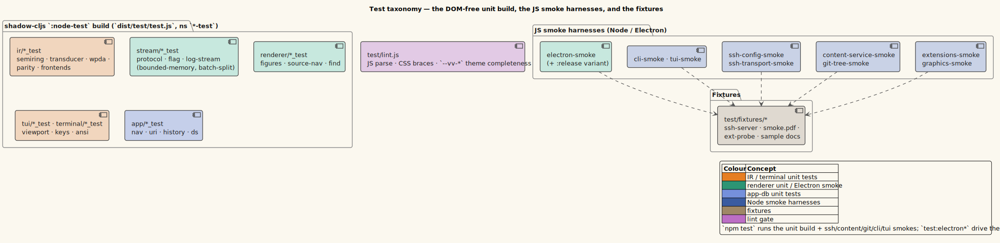

# Test strategy — the taxonomy

vinary-viewer's tests split into two layers by *what they can prove without a
host*: a **DOM-free ClojureScript unit build** that exercises the pure logic
(the IR, streaming, TUI, terminal, renderer-helper, and app subsystems), and a
set of **JavaScript smoke harnesses** that drive the wiring — real Electron, real
Node file IO, real SSH transport — that a unit test cannot reach. This page
documents that taxonomy, the fixtures the smokes stand on, and the dev-vs-release
Electron-smoke split.

> **Audience.** Read this when adding a test, deciding *which layer* a new test
> belongs in, or diagnosing why `npm test` passes but `npm run test:electron:release`
> fails (or vice versa).

---

## 1. The two layers, and the rule for choosing

| Layer | Host | Proves | Where |
|-------|------|--------|-------|
| **Unit** (`:node-test`) | Headless Node, no DOM | Pure, deterministic logic: algebra laws, segmentation, parse output, layout math, key handling. | `test/vinary/**/*_test.cljs` |
| **Smoke** (JavaScript) | Electron, or Node with real IO | The *wiring*: IPC, streaming pull-loops, terminal-capability degradation, SSH transport, archive extraction, extension loading. | `test/*-smoke.js` |

The rule the codebase follows, stated in the smoke harnesses themselves: **a
smoke exists for the value that lives in the wiring** — argv → content service →
IR front-ends → back-end → output, plus streaming and capability degradation —
"none of which a pure unit test exercises", while "the pure pieces … are
unit-tested separately" ([`test/cli-smoke.js`](../../test/cli-smoke.js) header).
If a behavior is a pure function of its inputs, it is a unit test; if its value is
that two real subsystems agree at a seam, it is a smoke.



*Diagram source: [`../diagrams/component-test-taxonomy.puml`](../diagrams/component-test-taxonomy.puml).*

---

## 2. The DOM-free unit build (`:node-test`)

The `test` build (`shadow-cljs.edn`) is `:target :node-test` with `:ns-regexp
"-test$"`, so it discovers every namespace ending in `-test` under `test/vinary/`,
compiles them to `dist/test/test.js`, and runs them with `node dist/test/test.js`.
The build is **DOM-free by construction**: it runs in bare Node, so nothing it
tests may touch the DOM, `window`, or Electron. That constraint is the point — it
forces the pure core to *be* pure, and it makes the whole unit suite runnable in a
CI container with no display.

The suite (39 namespaces at time of writing) covers these subsystems:

| Subsystem | Namespaces (`test/vinary/…`) | What is proven |
|-----------|------------------------------|----------------|
| **IR core** (`ir.*`) | `ir/semiring_test`, `ir/transducer_test`, `ir/wpda_test`, `ir/decode_test`, `ir/earley_test`, `ir/node_test`, `ir/meta_test`, `ir/parity_test` | Semiring laws across all algebras, weighted-transducer composition, the WPDA + streaming decoder, Earley-over-lattice parsing, node/metadata invariants, and batch-vs-stream **byte-parity**. |
| **IR back-ends** | `ir/backend/html_test`, `ir/backend/ansi_test` | Lowering one IR to HTML (renderer/GUI) and to ANSI (terminal) — the shared producer both hosts reuse. |
| **IR capabilities** | `ir/capability/toc_test` | Cross-cutting capabilities (the Contents outline) computed from the IR. |
| **IR front-ends** | `ir/frontend/{data,log_stream,office,org,pdf,source}_test` | Each format parsing into the IR: tables/CSV, streaming logs, docx/ODF, Org, PDF text-run reflow, tree-sitter source. |
| **Streaming** (`stream.*`) | `stream/flag_test`, `stream/transport_test` | The per-kind streaming gate (a `nil` size never streams) and the credit-1 double-buffered transport. |
| **Renderer helpers** | `renderer/{figures,latex,math,media,source_nav,toc}_test` | Pure renderer logic: SVG figure sizing, LaTeX normalization, MathJax handling, media-path rewriting, the source↔preview jump math, and the binary-search scroll-spy offset cache. |
| **App** (`app.*`) | `app/nav_test`, `app/uri_test` | Navigation history and URI parsing/classification. |
| **TUI** (`tui.*`) | `tui/{find,keys,state,toc,viewport}_test` | The pure keys→state→frame pipeline: find, key binding, viewport ring, TOC overlay. |
| **Terminal** (`terminal.*`) | `terminal/graphics_test` | The kitty/sixel graphics encoding logic. |
| **Main** (pure) | `main/file_kind_test`, `main/startup_test` | File-kind classification and startup argument handling — the pure slices of the main process. |
| **UI / misc** | `ui/icons_test`, `core_test`, `diff_test`, `grammar_catalog_test` | Icon mapping, the virtual-layout geometry helpers ([ADR-0023](../design-decisions/0023-streaming-scrollbar-and-pacing.md)), the diff parser, and the grammar-catalog reader. |

Two examples show why the unit layer is where invariants live:

- **Byte-parity** ([theory/08](../theory/08-common-document-ir.md)) is asserted in
  `ir/parity_test` — streaming a document must produce HTML byte-identical to
  rendering it whole.
- **Bounded memory** ([theory/09 §5](../theory/09-document-streaming-and-the-wpda.md#5--the-bounded-memory-property))
  is asserted in `ir/frontend/log_stream_test`, which feeds 500+ batches and
  checks the frontier stays a single WPDA config and only the last open record is
  retained.

The build is run as the first step of `npm test`:

```bash
shadow-cljs compile test && node dist/test/test.js
```

---

## 3. The JavaScript smoke harnesses

Nine JavaScript harnesses (`test/*-smoke.js`) drive the wiring. Each is a plain
Node or Electron script using the built-in `assert` module; there is no test
framework. They fall into three groups by host.

### 3.1 Electron smokes (need a display / Xvfb)

| Harness | Drives |
|---------|--------|
| [`electron-smoke.js`](../../test/electron-smoke.js) | The flagship. Boots the **real renderer** (`resources/public/index.html`) in Electron, wires `vv:stream-*` to the **real** `content_service.js` (genuine `createReadStream`/`readline` batching + the session registry), and asserts: streamed `innerHTML` is **byte-identical** to batch over a corpus; the mid-stream scrollbar spacer sizes the whole document ([ADR-0023](../design-decisions/0023-streaming-scrollbar-and-pacing.md)); the session registry returns to `0` after teardown (**no fd/session leak**); DevTools opens with no main-process crash; and re-frame-10x is hidden by default. |
| [`extensions-smoke.js`](../../test/extensions-smoke.js) | The Chrome-extension + ad-block runtime ([ADR-0015](../design-decisions/0015-scoped-extension-runtime-gpl-free.md)): `session.extensions.loadExtension` loads the unpacked MV3 fixture, its content script injects into a matched HTTP page, its action popup loads with native `chrome.*` (runtime/storage/action), and the native ad-blocker fetches filter lists (network-gated). |

### 3.2 Terminal smokes (Node, no display)

| Harness | Drives |
|---------|--------|
| [`cli-smoke.js`](../../test/cli-smoke.js) | `vv-cli` end-to-end **without Electron**: each format fixture lowers to structured ANSI (box-drawing tables, gutters, SGR colour); `NO_COLOR` emits **zero** escape bytes (the isatty/`NO_COLOR` degradation contract); `--toc` prints the outline; and a >5 MiB log streams through the WPDA log-stream parser with **bounded peak RSS** — memory does not scale with file size. |
| [`graphics-smoke.js`](../../test/graphics-smoke.js) | The terminal image pipeline through the built binary: a Markdown image encodes to a **kitty** (`ESC_G f=32`) or **sixel** (`ESC P`) escape under `--graphics kitty\|sixel`; `--no-graphics` and a piped (non-TTY) stdout degrade to a labelled placeholder with **zero** escapes; an SVG rasterizes at its intrinsic size; a tall image is followed by its row-footprint newlines; and webp/remote srcs degrade rather than crash. |
| [`tui-smoke.js`](../../test/tui-smoke.js) | The interactive TUI **without a pseudo-tty**, via the `--drive <keyfile>` seam: keys replay through the same keys→state→frame pipeline the live terminal uses, and the final frame is dumped deterministically. Asserts scroll, find (jump + reverse-video highlight), the TOC overlay + jump, and that a log larger than the viewport ring stays bounded. A small, skippable Python-`pty` check covers the one thing `--drive` cannot: alternate-screen teardown + cursor restore on `q`. |

### 3.3 Main-process / IO smokes (Node, no display)

| Harness | Drives |
|---------|--------|
| [`content-service-smoke.js`](../../test/content-service-smoke.js) | `content_service.js` — the main-process file reader — against real archives (`tar-stream`, `zlib`, `yauzl`) with a hand-rolled `crc32`, proving archive listing/extraction and content classification. |
| [`git-tree-smoke.js`](../../test/git-tree-smoke.js) | The v0.2 sidebar file-tree fix at its seam: `repo-tree` (in `service.cljs`) lists with `git ls-files --cached --others --exclude-standard`, so a newly-created, uncommitted, non-ignored file **appears** while `.gitignore`'d clutter does not. It exercises the exact git command against a throwaway repo and asserts `service.cljs` still issues it. |
| [`ssh-config-smoke.js`](../../test/ssh-config-smoke.js) | Hermetic unit tests for `ssh_config.js` (pure, no fs/net): `parseSshUri` for `ssh://` / `sftp://` authority, port, user, and home-relative path handling ([ADR-0027](../design-decisions/0027-remote-files-over-ssh.md)). |
| [`ssh-transport-smoke.js`](../../test/ssh-transport-smoke.js) | `ssh_transport.js` end-to-end against the **hermetic in-process ssh2 SFTP fixture** (no network, no external host); also asserts ssh2 runs **pure-JS** (no native crypto addon) and that `AddKeysToAgent` adds a key to a throwaway ssh-agent. |

### 3.4 What `npm test` actually runs

The default `npm test` is **Node-only** — it runs the unit build plus the six
Node smokes, and it deliberately excludes the two Electron smokes, which need a
display:

```bash
# npm test
shadow-cljs compile test && node dist/test/test.js \
  && node test/ssh-config-smoke.js && node test/ssh-transport-smoke.js \
  && node test/content-service-smoke.js && node test/git-tree-smoke.js \
  && npm run test:cli && npm run test:tui
# test:cli  → compile:cli + cli-smoke + graphics-smoke
# test:tui  → compile:tui + tui-smoke
```

The Electron smokes are separate scripts (`test:electron`, `test:electron:release`,
`test:extensions`, `test:extensions:sandbox`) because they require a running
Electron with a display — a proposed CI matrix runs them under Xvfb (see
[08-ci-and-validation-discipline.md](08-ci-and-validation-discipline.md)).

> **Note on `test/test-sidebar.js`.** This is the legacy v0.1.0 vmd-patch sidebar
> harness. It is parse-checked by [`test/lint.js`](../../test/lint.js) but is not
> part of `npm test`; the shipped 0.2/0.3 app does not load `src/sidebar.js`.

---

## 4. Fixtures

The smokes stand on a small set of committed fixtures under
[`test/fixtures/`](../../test/fixtures/):

| Fixture | Used by | Purpose |
|---------|---------|---------|
| `ext-probe/` (an unpacked MV3 extension: `manifest.json`, `background.js`, `content.js`, `popup.{html,js}`, `icon16.png`) | `extensions-smoke.js` | A minimal extension that exercises content-script injection and native `chrome.*` in the action popup. |
| `smoke.pdf` | PDF paths in the smokes / screenshots | A tiny real PDF for the pdf.js pipeline. |
| `ssh-server.js` (`startSftpServer`) | `ssh-transport-smoke.js`, `electron-smoke.js` | A hermetic **in-process** `ssh2.Server` SFTP server, so the SSH transport and the remote-streaming smoke run with no network and no external host. |

Most other fixtures are *generated* by the harness at run time (e.g.
`graphics-smoke.js` builds its PNG/JPEG/GIF images with `pngjs`/`jpeg-js`/`omggif`
so no binary assets are committed), which keeps the repository small and the
fixtures inspectable.

---

## 5. The dev-vs-release smoke split

`electron-smoke.js` runs against **both** build profiles, through two scripts:

```bash
npm run test:electron          # electron --no-sandbox test/electron-smoke.js         (DEV build)
npm run test:electron:release  # npm run release && VV_RELEASE=1 electron … electron-smoke.js  (RELEASE build)
```

The release variant exists because an entire class of bug is **release-only** —
Closure `:simple` still transforms the code enough that some test *drivers* behave
differently. Two adaptations make the one harness run correctly in both profiles:

1. **`re-frame-10x` presence is asserted by profile.** The dev build preloads
   re-frame-10x; the release build strips it (`goog.DEBUG` is false). The A4 check
   reads `process.env.VV_RELEASE`: when set, it asserts `View ▸ re-frame-10x` is
   **absent**; otherwise it asserts it is **present**. This is the direct
   regression gate for [ADR-0016](../design-decisions/0016-main-process-simple-optimization.md)'s
   crash class (the smoke also confirms DevTools opens with no `.Xc`-style rename
   crash).

2. **Some steps are dev-gated because `:simple` encapsulates the re-frame global.**
   The bidirectional source↔preview jump step drove `re_frame.core.dispatch_sync`
   *from the test*, but the release `:simple` build encapsulates that global, so
   the run died with `ReferenceError: re_frame is not defined` before any later
   assertion. Those jump steps — and the PDF-reflow toggle step, for the same
   reason — are now **dev-gated**; the release build covers the underlying pure
   jump math through the DOM-free `renderer/source_nav_test` unit tests instead
   (CHANGELOG, `[0.3.0-dev]`). The Org "View Source" step was rewritten to drive
   the real `View` menu item rather than the global, so it runs in **both** builds.

The general principle: **a step that can only be exercised through a dev-only
global is gated to the dev smoke, and its logic is re-proven in the DOM-free unit
layer, which runs identically under any optimization.** This keeps the release
smoke focused on what is genuinely release-specific — that the optimized artifact
boots, renders, and does not crash on renamed interop.

---

## 6. References and see also

- [`test/cli-smoke.js`](../../test/cli-smoke.js) et al. — the smoke harnesses whose
  headers this page paraphrases.
- [04-lint-and-conventions.md](04-lint-and-conventions.md) — the lint pass that
  parse-checks every JS harness.
- [05-terminal-build-and-launch.md](05-terminal-build-and-launch.md) — the `cli` /
  `tui` builds the terminal smokes exercise.
- [ADR-0016](../design-decisions/0016-main-process-simple-optimization.md) — the
  reason the release smoke exists.
- [ADR-0023](../design-decisions/0023-streaming-scrollbar-and-pacing.md) — the
  scrollbar-spacer behavior `electron-smoke.js` asserts.
- [theory/09](../theory/09-document-streaming-and-the-wpda.md) — the bounded-memory
  and byte-parity properties the unit layer pins.
- `AGENTS.md` (repository root) — the testing-guidelines section this page expands.
