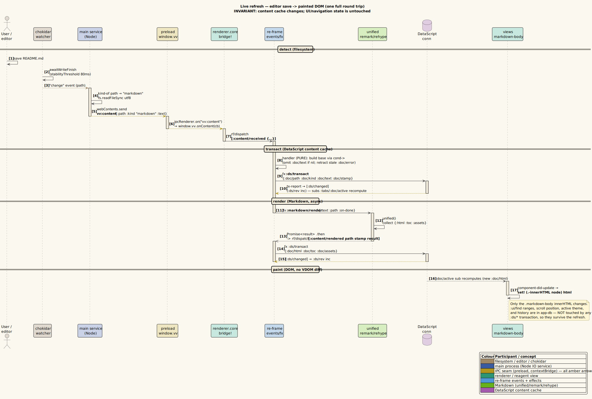

# Live refresh

**Status: Available now.**

Live refresh means a saved file update repaints the active preview without
discarding tab state, scroll state, find state, keybinding state, or sidebar
state. The main process owns filesystem watching; the renderer owns the reactive
UI; DataScript owns the bounded content cache.

---

## 1. User behavior

Open a local file:

```bash
vv README.md
```

Edit and save it in any editor. The preview updates in place. For Markdown,
rendered HTML, table-of-contents metadata, and embedded-asset metadata are
updated together; for PDFs, the main-owned PDF view reloads; for images and
source/text files, the content strategy refreshes from the retained path.

---

## 2. Retained file ownership

The live-refresh ownership set is not "every file ever opened" and not only
"the active tab". It is every local file still reachable from any open tab
history entry:

```clojure
(defn retained-file-paths [db]
  (->> (tabs db)
       (mapcat #(get-in % [:hist :stack]))
       (keep (comp uri/file-path :uri))
       distinct
       vec))
```

After tab/history changes, renderer events emit `[:vv/sync-retained-files
retained]`. The preload sends `vv:retained-files`; `vinary.main.service`
reconciles its watcher map to exactly that set.

This avoids two failure modes:

| Failure mode | Retained-path behavior |
|--------------|------------------------|
| Closing a tab kills a file still present in another tab's history. | The file stays watched until unreachable from all histories. |
| A long session keeps watchers and cached docs for abandoned files. | Unretained paths are closed and evicted. |

---

## 3. Main-process watcher flow

`vinary.main.service/open!` is idempotent. It sends current content and starts a
watcher only if the path is not already watched:

```clojure
(defn open! [wc path]
  (send-content! wc path)
  (send-tree! wc path)
  (start-watch! wc path))
```

The watcher uses `chokidar` with:

| Option or event | Purpose |
|-----------------|---------|
| `ignoreInitial true` | Avoids double-sending content immediately after opening. |
| `awaitWriteFinish {stabilityThreshold 80 pollInterval 20}` | Waits briefly for multi-write saves to settle. |
| `change` | Handles ordinary in-place saves. |
| `add` | Handles common atomic-save rename patterns. |

Image and PDF content is not read as UTF-8. Images are displayed from the local
file URL; PDFs are reloaded through the main-owned `WebContentsView`.

---

## 4. Renderer update flow

Incoming `vv:content` dispatches `[:content/received payload]`.

Current responsibilities:

| Step | Owner | Behavior |
|------|-------|----------|
| Classify/read/send | Main | Sends `{path, kind, text?, stamp}` or a read error. |
| Cache content | Renderer/DataScript | Upserts `:doc/kind`, `:doc/text`, `:doc/stamp`, and simple HTML for text. |
| Render Markdown | Renderer effect | Runs async Markdown render with the incoming stamp. |
| Commit render | Renderer/DataScript | Writes `:doc/html`, `:doc/toc`, and `:doc/assets` only if the stamp still matches. |
| Watch assets | Main | Watches embedded local assets referenced by Markdown. |
| Refresh view | Re-frame subscriptions | `:ds/rev` changes and the active document subscription recomputes. |

The stamp check prevents a slow older Markdown render from overwriting newer
content.

---

## 5. Why UI state survives

Tabs, active tab, per-tab history, saved scroll entries, keybinding UI state, and
settings live in re-frame `app-db`. Loaded document content lives in DataScript.
Main-process watchers live in `vinary.main.service`.

Live refresh changes content and render metadata; it does not replace the active
tab, reset history, or clear scroll. The view may repaint, but the user's UI
context remains in app-db.

---

## 6. Related diagrams and decisions

- [ADR-0010 bounded content retention and render metadata](../design-decisions/0010-bounded-content-retention-and-render-metadata.md)
- [Component diagram: bounded content retention](../diagrams/component-content-retention.puml)
- [Theory: live-refresh spine](../theory/03-live-refresh-spine.md)


## 7. One full round trip

The complete round trip from an editor save to a painted DOM. The invariant to watch: the content cache changes, while UI and navigation state are untouched.



*Diagram source: [`../diagrams/seq-live-refresh.puml`](../diagrams/seq-live-refresh.puml).*
