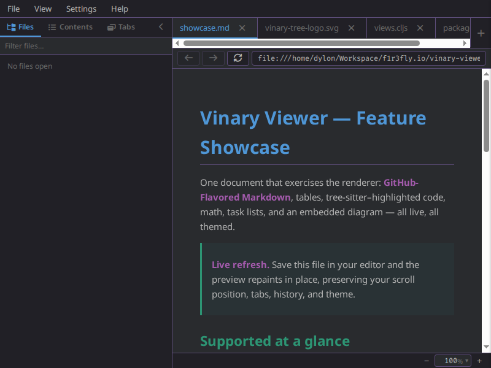
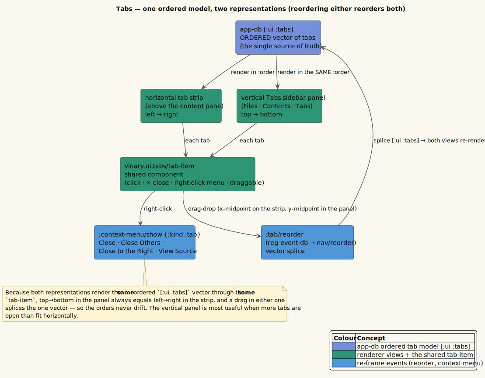
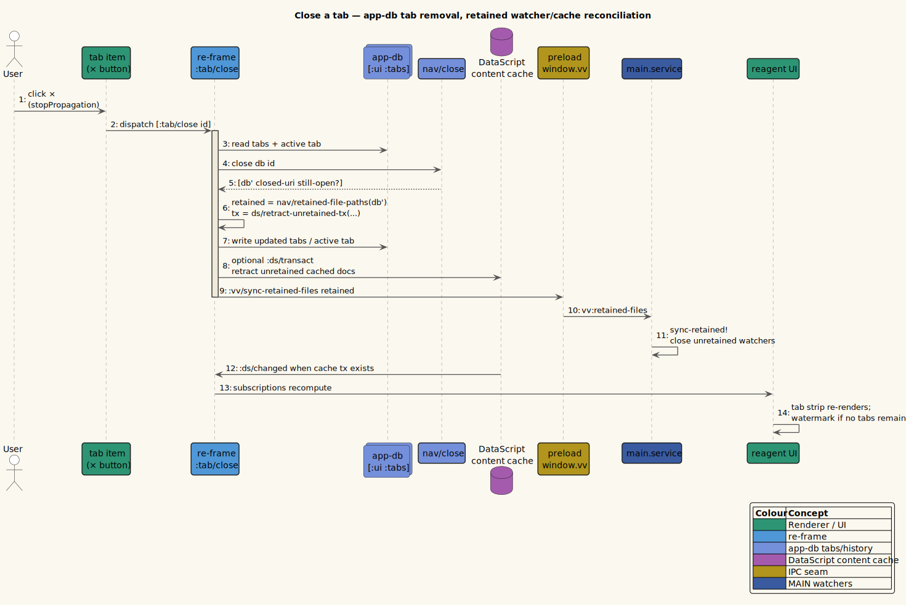
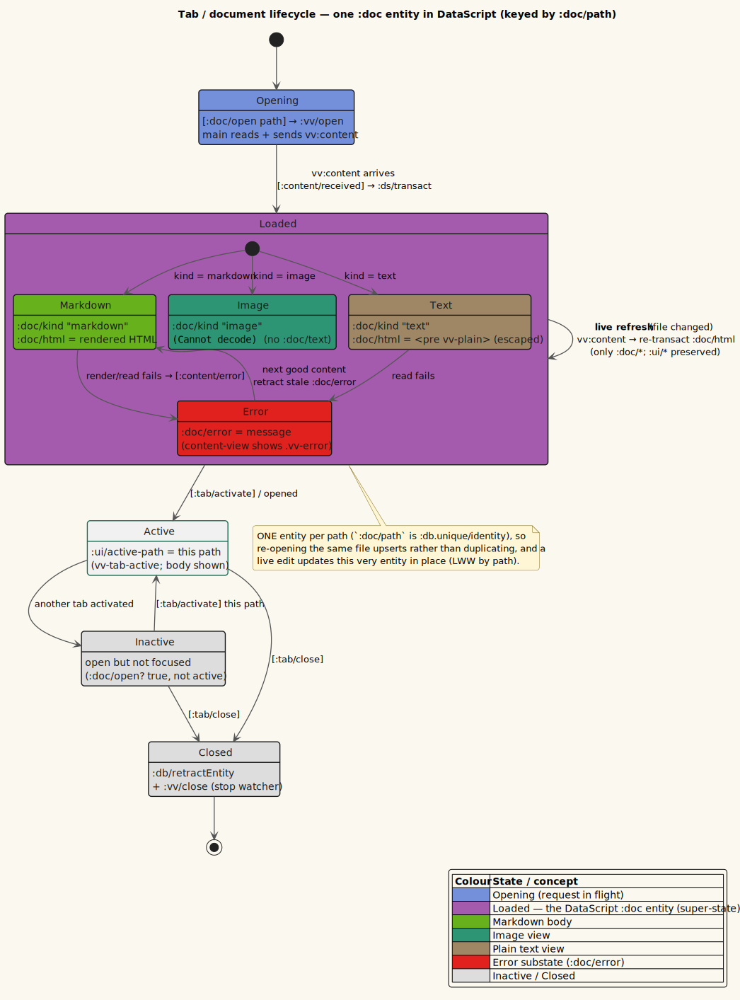

# Multi-tab previews



*Multiple documents open, one tab each.*

**Status: Available now.**

vinary-viewer uses browser-like tabs. A tab is a view over a URI plus its own
history stack; document content is cached separately in DataScript.

---

## 1. Current tab shape

Tabs live in re-frame `app-db` under `[:ui :tabs]`:

```clojure
{:id 4
 :uri "/abs/path/to/current.md"
 :hist {:stack [{:uri "/abs/path/to/a.md" :scroll 180}
                {:uri "/abs/path/to/current.md" :scroll 0}]
        :idx 1}
 :view-source? false}
```

The active tab id lives at `[:ui :active-tab]`.

DataScript stores content entities keyed by `:doc/path`, not tab identity. This
allows two useful properties:

| Property | Result |
|----------|--------|
| Tabs are cheap app-db views. | Reordering, activating, duplicating, and closing tabs are pure app-db transforms. |
| Content cache is shared. | If multiple histories reference the same local file, only one content entity is needed. |

---

## 2. User behavior

| Action | Behavior |
|--------|----------|
| Click a file in the Files panel | Opens or focuses that file in the active tab path. |
| `Ctrl+click` a Markdown link | Opens the target in a new tab. |
| Drag a tab | Reorders `[:ui :tabs]`; the sidebar Tabs panel mirrors the same order. |
| Right-click a tab | Opens tab actions such as Close, Close Others, Close to the Right, View Source, and copy actions. |
| Toggle View Source | Shows a Markdown tab's cached raw source in the same pane. |
| Close a tab | Removes the tab view and syncs retained files; cached content is evicted only if unreachable from all histories. |

Closing the active tab activates a neighbor when possible. Closing the last tab
returns the content area to the empty watermark.

---

## 3. Navigation transforms

`vinary.app.nav` is the pure navigation module.

| Function | Purpose |
|----------|---------|
| `add-tab` | Appends a tab and makes it active. |
| `activate` | Sets `[:ui :active-tab]`. |
| `save-scroll` | Captures the leaving tab's current scroll into its current history entry. |
| `nav-active` | Navigates the active tab to a URI and pushes a new history entry unless it is a repeat. |
| `step` | Moves back or forward in the active tab's history and returns the target scroll. |
| `reorder` | Splices one tab to a new insertion index. |
| `close` | Removes a tab and returns the closed URI plus whether another tab still points at it. |
| `retained-file-paths` | Returns all local paths reachable from all tab histories. |

Events in `vinary.app.events` combine these transforms with effects for loading
local files, restoring scroll, and syncing retained paths to main.

---

## 4. Content cache interaction

When the active tab points at a local path, subscriptions read the corresponding
DataScript entity:

```clojure
(rf/reg-sub
 :doc/active
 :<- [:ds/rev]
 :<- [:ui/active-path]
 (fn [[_ path] _]
   (when path (ds/active-doc (ds/snapshot) path))))
```

The active path is derived from the active tab. DataScript provides `:doc/html`,
`:doc/text`, `:doc/toc`, `:doc/assets`, `:doc/kind`, and `:doc/error`.

This separation keeps tab changes fast and makes content eviction explicit:
unretained docs are retracted from DataScript after the retained set changes.

---

## 5. Design trade-offs

| Choice | Rationale |
|--------|-----------|
| Tabs in app-db | Tabs are UI views and history state, so app-db is the natural owner. |
| Content in DataScript | Content entities benefit from identity, queries, and transaction-driven subscriptions. |
| Retained-path eviction | Prevents watcher/cache leaks without breaking back/forward history. |
| Single tab strip plus Tabs sidebar | Both render the same vector, so horizontal and vertical tab order cannot drift. |

See [ADR-0010](../design-decisions/0010-bounded-content-retention-and-render-metadata.md)
for the current retention model.

## 6. One model, two representations

The horizontal tab strip and the vertical **Tabs** sidebar panel are two views over the
*same* ordered `[:ui :tabs]` vector, rendered by the same `tab-item` component. Reordering
in either surface splices that one vector, which is why the two can never drift apart.



*Diagram source: [`../diagrams/component-tab-dual-representation.puml`](../diagrams/component-tab-dual-representation.puml).*

## 7. Closing a tab

Removing a tab from the ordered vector triggers retention reconciliation, which is what closes the now-unretained watchers.



*Diagram source: [`../diagrams/seq-tab-close.puml`](../diagrams/seq-tab-close.puml).*

## 8. Document lifecycle

Each open document is one `:doc` entity keyed by its path, moving through Opening, Loaded (by kind), and Error.



*Diagram source: [`../diagrams/state-tab-lifecycle.puml`](../diagrams/state-tab-lifecycle.puml).*
