# Watermark on empty tabs

**Status: Available now.**

---

## 1 · What it is

When no document is open — at launch with no file argument, or after you close the last tab —
the content area is not blank. It shows a **faint, theme-tinted silhouette of the Vinary Tree
shield**: a heraldic shield enclosing a tree-of-life and the wordmark *VINARY TREE*. The
watermark is deliberately low-contrast (7% opacity) so it reads as a quiet brand mark, not a
call to action, and it **re-tints automatically with the active theme** because it is drawn from
a single `--vv-*` color token rather than baked-in colors.

The clever part is *how* it is colored: the SVG asset is monochrome (`currentColor`), and the CSS
uses it only as a **mask** — a stencil — over a box filled with the theme's foreground color. The
SVG is never recolored; the box is, and the SVG just clips it to the shield shape. Switch theme
and the same emblem changes color with no asset change.

---

## 2 · How to use it

There is nothing to configure. The watermark appears whenever there are no open tabs:

1. Launch `vv` with no file argument, **or** close every open tab (each tab's `×`).
2. The content area centers the Vinary Tree shield watermark.
3. Switch theme from the toolbar ([feature 06](06-themes-and-live-switching.md)); the watermark
   re-tints to match (darker on light themes, lighter on dark themes), always at 7% opacity.

**Replacing the emblem.** The watermark asset is
`resources/public/assets/shield.svg`. It is a faithful *placeholder* for the full Vinary Tree
crest; drop a precise, monochrome (`currentColor`) SVG at that path to replace it — no code
change is needed, since the CSS references the file by name.

---

## 3 · How it works internally

### The content-view falls through to the watermark when there are no tabs

The content area is a Strategy keyed on the document, and its **first** branch is the empty case.
From `src/vinary/ui/views.cljs`:

```clojure
(defn content-view []
  (let [doc  @(rf/subscribe [:doc/active])
        tabs @(rf/subscribe [:tabs])]
    [:div.vv-content {:on-scroll (fn [^js e] (toc/spy! (.-currentTarget e)))}
     (cond
       (empty? tabs)               [watermark]
       (:doc/error doc)            [:div.vv-error "Error: " (:doc/error doc)]
       (= "image" (:doc/kind doc)) [:div.vv-image-view
                                    [:img {:src (str "file://" (:doc/path doc)) :alt (:doc/path doc)}]]
       (:doc/html doc)             [markdown-body (:doc/html doc)]
       :else                       [:div.vv-empty "Rendering…"])]))
```

The very first `cond` clause is `(empty? tabs) → [watermark]`. Because `:tabs` is a subscription
over the open documents ([feature 02](02-multi-tab-previews.md)), closing the last tab makes
`tabs` empty and the watermark appears reactively — no imperative "show the splash" call.

The watermark component itself is trivial:

```clojure
(defn watermark []
  [:div.vv-watermark [:div.vv-shield]])
```

It is two nested divs: an outer flexbox that centers, and an inner box that *is* the emblem via
CSS mask.

### The CSS mask turns one color into a themed emblem

From `resources/public/css/app.css`:

```css
/* watermark on empty tabs — a themed silhouette of the Vinary Tree emblem via CSS mask */
.vv-watermark { display: flex; align-items: center; justify-content: center; height: 100%; }
.vv-shield { width: 300px; height: 360px; background-color: var(--vv-fg); opacity: 0.07;
  -webkit-mask: url(../assets/shield.svg) center / contain no-repeat;
  mask: url(../assets/shield.svg) center / contain no-repeat; }
```

What each declaration does:

- **`background-color: var(--vv-fg)`** — fills the 300 × 360 px box with the **theme foreground
  color**. `--vv-fg` is defined per theme (e.g. `#b2b2b2` in spacemacs-dark, `#655370` in
  spacemacs-light). This is the color you actually see.
- **`mask: url(../assets/shield.svg) center / contain no-repeat`** — a
  [CSS mask](https://developer.mozilla.org/en-US/docs/Web/CSS/mask). A mask uses the referenced
  image's *alpha channel* as a stencil: the box's background shows **only where the SVG is
  opaque**. So the shield's strokes/fills clip the colored box into the emblem shape.
  `center` positions the mask, `contain` scales it to fit without distortion, `no-repeat`
  prevents tiling. The `-webkit-mask` twin is the vendor-prefixed form for Chromium.
- **`opacity: 0.07`** — fades the whole thing to 7%, making it a faint background mark.

Because the *color* comes from `--vv-fg` and the *shape* comes from the masked SVG, the SVG file
never needs per-theme variants: it is a pure stencil. Theme switching ([feature 06](06-themes-and-live-switching.md))
swaps the `<link>` to a stylesheet that redefines `--vv-fg`, and the watermark re-tints instantly.

### The SVG asset is a `currentColor` stencil

`resources/public/assets/shield.svg` (abbreviated):

```svg
<svg xmlns="http://www.w3.org/2000/svg" viewBox="0 0 240 290" fill="none"
     stroke="currentColor" color="currentColor" aria-label="Vinary Tree">
  <!-- shield --><path d="M40,32 Q40,21 51,21 L189,21 …Z" stroke-width="3" />
  <!-- sun --><circle cx="120" cy="138" r="24" stroke-width="1.5" opacity="0.5" />
  <!-- tree-of-life: trunk + 7 fanning branches ending in leaf-pods --> …
  <!-- wordmark -->
  <text x="120" y="232" text-anchor="middle" fill="currentColor" stroke="none"
        font-size="15" font-weight="700" letter-spacing="1.5">VINARY TREE</text>
</svg>
```

- **`stroke="currentColor"` / `fill="currentColor"`** — the SVG draws in a single color. When the
  SVG is used as a CSS *mask*, only its alpha (opaque vs. transparent) matters; the actual color
  is irrelevant because the visible color is supplied by the masked box's `background-color`. The
  `currentColor` choice also means the same asset can be used as an inline ``/icon elsewhere
  and inherit text color, but in the watermark it functions purely as a stencil.
- **`viewBox 0 0 240 290`** — the intrinsic aspect ratio that `mask-size: contain` preserves
  inside the 300 × 360 box.

The emblem is a placeholder for the full crest, as noted in the SVG's own comment.

---

## 4 · Design notes / trade-offs

- **Why a CSS mask instead of an inline SVG with `fill: var(--vv-fg)`?** Both can theme an SVG.
  The mask approach keeps the asset a *replaceable file* (drop in a new `shield.svg`, done) and
  keeps all theming concerns in CSS, so the component (`[:div.vv-shield]`) carries no color logic
  at all. An inline-SVG approach would either inline the markup into the view (coupling art to
  code) or require per-theme `fill` plumbing.
- **Why 7% opacity?** It is a brand watermark, not UI. Low contrast keeps it from competing with
  any content that might overlay it and reads as "empty, but ours".
- **Trade-off — fixed 300 × 360 size.** The emblem is a fixed size rather than viewport-relative.
  This is simple and looks correct at typical window sizes; a responsive size is a possible future
  refinement.

Recorded in [ADR-0007 CSS-mask themed watermark](../design-decisions/0007-css-mask-themed-watermark.md).
Theming mechanics are in [feature 06](06-themes-and-live-switching.md) and
[reference/css-variables.md](../reference/css-variables.md).

---

## 5 · Diagram

The emblem pipeline — *monochrome SVG → CSS mask → box filled with `var(--vv-fg)` at 7% → rendered
silhouette* — is illustrated by the object/component diagram owned by this pillar:
[`../diagrams/object-watermark.puml`](../diagrams/object-watermark.puml).



In the diagram, **tan** marks the filesystem SVG asset, **teal** the renderer CSS (paint-only, no
IPC), **purple** the theme palette token `--vv-fg`, and the final green box the rendered emblem —
the same color contract used across all vinary-viewer diagrams
([`../diagrams/_vv-theme.iuml`](../diagrams/_vv-theme.iuml)).
