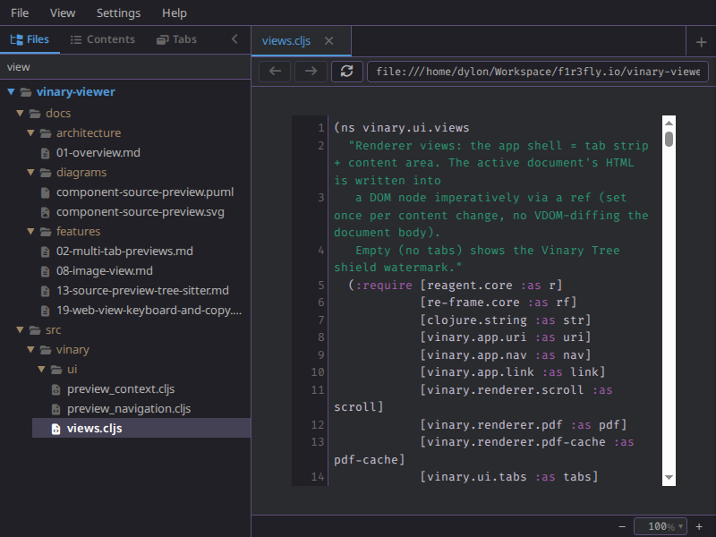
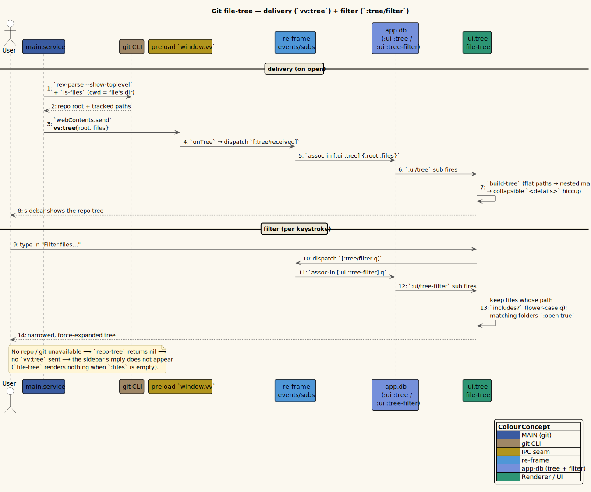

# Git file-tree and filter



*The sidebar git file tree, narrowed by a live filter.*

**Status: Available now.**

---

## 1 · What it is

When you open a file that lives inside a **git repository**, vinary-viewer shows a **sidebar
tree** of that repository's files. The tree is built from `git ls-files --cached --others
--exclude-standard`, so it shows everything in the repo **except** `.gitignore`d clutter — tracked
files **plus** untracked-but-not-ignored ones. A file you just created — including the one you
opened — shows up immediately, while build output and `node_modules` stay out. Folders are collapsible
(native HTML `<details>`), files are clickable to open in a tab, and a **filter box** at the top
narrows the tree to files whose path matches what you type (folders containing a match are
force-expanded so the matches are visible).

The tree is a convenience for navigating a docs/source repository without leaving the previewer:
open one file, then jump around its repository from the sidebar.

---

## 2 · How to use it

1. Open any file inside a git repo, e.g. `vv docs/README.md` from within a checked-out project.
2. The sidebar shows the repository (its top folder name as the header) as a collapsible tree.
3. **Open a file:** click its entry. It opens in a tab (or activates an existing tab).
4. **Collapse/expand a folder:** click the folder name (it is a native `<details>`/`<summary>`).
5. **Filter:** type in the *Filter files…* box. The tree shrinks to matching files, and every
   folder on the path to a match is expanded so you can see them.

**Example.** Open `vv src/vinary/main/core.cljs`. The sidebar shows the whole repo. Type `theme`
into the filter; the tree collapses to just the files whose path contains "theme" (e.g.
`resources/public/css/themes/spacemacs-dark.css`), with their parent folders opened. Clear the
box to restore the full tree.

> If the open file is **not** inside a git repository (or `git` is unavailable), no tree is sent
> and the sidebar simply does not appear.

---

## 3 · How it works internally

### MAIN process: ask git for the repo and its files

`src/vinary/main/service.cljs` shells out to `git` twice — once to find the repository root, once
to list its tracked **and untracked-but-not-ignored** files:

```clojure
(defn- git [args cwd]
  (try
    (str/trim (cp/execFileSync "git" (clj->js args)
                               (clj->js {:cwd cwd :encoding "utf8"
                                         :maxBuffer (* 64 1024 1024) :stdio ["ignore" "pipe" "ignore"]})))
    (catch :default _ nil)))

(defn- repo-tree [file-path]
  (let [dir  (path/dirname file-path)
        root (git ["rev-parse" "--show-toplevel"] dir)]
    (when (and root (not (str/blank? root)))
      (let [out   (git ["ls-files" "--cached" "--others" "--exclude-standard"] root)
            files (when out (vec (remove str/blank? (str/split out #"\n"))))]
        {:root root :files (or files [])}))))
```

Terms:

- **`execFileSync "git" …`** — runs `git` with an argument *array* (not a shell string), so paths
  with spaces/quotes are safe and there is no shell-injection surface. `:stdio ["ignore" "pipe"
  "ignore"]` ignores stdin/stderr and captures stdout. `:maxBuffer (* 64 1024 1024)` allows up to
  64 MiB of `ls-files` output (large monorepos). Any failure (`git` missing, not a repo) is caught
  and returns `nil`.
- **`git rev-parse --show-toplevel`** — prints the absolute path of the repository root that
  contains `dir` (the directory of the open file). This is how the tree is rooted at the repo, not
  at the file's folder.
- **`git ls-files --cached --others --exclude-standard`** — prints every file worth navigating, one
  per line, as **repo-relative** paths: `--cached` lists tracked files, `--others` lists untracked
  files, and `--exclude-standard` drops anything matched by `.gitignore` / `.git/info/exclude` / the
  global excludes. `--cached` and `--others` are disjoint, so there are no duplicates to remove. We
  split on newlines and drop blanks. The result `{:root <abs> :files [repo-relative…]}` is sent to
  the renderer:

  ```clojure
  (defn- send-tree! [^js wc file-path]
    (when-let [t (repo-tree file-path)]
      (.send wc "vv:tree" (clj->js t))))
  ```

`send-tree!` is called from `open!`, so the tree arrives alongside the document's content. The
`vv:tree` channel is part of the IPC contract ([reference/ipc-channels.md](../reference/ipc-channels.md)).

### RENDERER: store the tree

`src/vinary/renderer/core.cljs` routes `vv:tree` into a re-frame event, and the event stores it in
`app-db`:

```clojure
(rf/reg-event-db
 :tree/received
 (fn [db [_ {:keys [root files]}]] (assoc-in db [:ui :tree] {:root root :files (vec files)})))
```

The flat `:files` vector is kept as-is; the nesting is computed in the view (a derived shape), so
there is no second copy to maintain.

### RENDERER: fold flat paths into a nested tree

`src/vinary/ui/tree.cljs` turns the flat repo-relative paths into a nested map with one
`assoc-in` per file:

```clojure
(defn- build-tree [files]
  (reduce (fn [acc f]
            (let [parts (str/split f #"/")
                  ks    (concat (interpose :children parts) [:file])]
              (assoc-in acc ks f)))
          {} files))
```

How the key path is built, by example. For the file `src/vinary/main/core.cljs`:

- `parts` = `["src" "vinary" "main" "core.cljs"]`.
- `(interpose :children parts)` = `["src" :children "vinary" :children "main" :children "core.cljs"]`.
- `ks` = that, with `:file` appended:
  `["src" :children "vinary" :children "main" :children "core.cljs" :file]`.
- `(assoc-in acc ks f)` writes the **full path string** at that leaf under a `:file` key.

So a **folder node** is a map that has a `:children` sub-map, and a **file node** is a map that
has a `:file` string (the original full repo-relative path). Two files in the same folder merge
naturally because `assoc-in` shares the common prefix of the key path. The result is a tree like:

```
{"src" {:children
        {"vinary" {:children
                   {"main" {:children
                            {"core.cljs"    {:file "src/vinary/main/core.cljs"}
                             "service.cljs" {:file "src/vinary/main/service.cljs"}}}}}}}}
```

### RENDERER: render nodes to collapsible hiccup

`nodes->hiccup` walks the nested map and emits native `<details>` for folders and `<a>` for files:

```clojure
(defn- nodes->hiccup [children root active open?]
  (into [:<>]
        (for [[k v] (sort-by (fn [[k v]] [(if (:children v) 0 1) (str/lower-case k)]) children)]
          ^{:key k}
          (if (:children v)
            [:details.vv-dir (when open? {:open true})
             [:summary.vv-dir-name k]
             (nodes->hiccup (:children v) root active open?)]
            (let [full (str root "/" (:file v))]
              [:a.vv-file {:class    (when (= full active) "vv-file-active")
                           :title    full
                           :on-click #(rf/dispatch [:doc/open full])}
               k])))))
```

Details:

- **Sort key `[(if (:children v) 0 1) (str/lower-case k)]`** — folders (`0`) sort before files
  (`1`), then alphabetically (case-insensitively). This gives the familiar "folders first, then
  files, A→Z" ordering.
- **`[:details.vv-dir (when open? {:open true}) …]`** — a native collapsible disclosure. When
  `open?` is true (set during filtering, below) the folder renders expanded (`:open true`);
  otherwise it starts collapsed and the user toggles it. Using `<details>` means the
  collapse/expand state is handled by the browser — no extra re-frame state per folder.
- **`full` path** — the click target is reconstructed as `root + "/" + :file` (an absolute path),
  because MAIN's `open!`/`close!` and the `:doc/path` identity use absolute paths. Clicking
  dispatches `[:doc/open full]`, which sends `vv:open` to MAIN ([feature 02](02-multi-tab-previews.md)).
- **`.vv-file-active`** — highlights the entry for the currently active document.

### RENDERER: the filter

`file-tree` reads the tree, the active path, and the filter string, then narrows the flat file
list *before* building the nested tree:

```clojure
(defn file-tree []
  (let [tree   @(rf/subscribe [:ui/tree])
        active @(rf/subscribe [:ui/active-path])
        q      @(rf/subscribe [:ui/tree-filter])
        ql     (some-> q str/trim str/lower-case not-empty)
        files  (cond->> (:files tree)
                 ql (filter #(str/includes? (str/lower-case %) ql)))]
    (when (seq (:files tree))
      [:div.vv-tree
       [:div.vv-tree-header (last (str/split (:root tree) #"/"))]
       [:input.vv-tree-filter
        {:placeholder "Filter files…"
         :value       (or q "")
         :on-change   #(rf/dispatch [:tree/filter (.. % -target -value)])}]
       (nodes->hiccup (build-tree files) (:root tree) active (boolean ql))])))
```

- **`ql`** — the normalized query: trimmed, lower-cased, and `not-empty` (so a blank or
  whitespace-only filter becomes `nil`, i.e. "no filter"). Defined before use so the rest of the
  function can branch on it.
- **`files` via `cond->>`** — when `ql` is non-nil, keep only paths whose lower-cased form
  `str/includes?` the query. This is a plain case-insensitive substring match over the full
  repo-relative path, so typing `theme` matches `resources/public/css/themes/…`.
- **`(boolean ql)` as the `open?` argument** — when a filter is active, every folder is rendered
  expanded, so the matching files (which may be deep) are immediately visible. With no filter,
  folders start collapsed.
- **`(.. % -target -value)`** — reads the input's value on change and stores it via
  `:tree/filter` → `(assoc-in db [:ui :tree-filter] q)`.

Because filtering removes non-matching *files* from the flat list before `build-tree`, folders
that end up with no children simply do not appear — there is no separate "prune empty folders"
pass.

---

## 4 · Design notes / trade-offs

- **Why `git ls-files` rather than reading the directory?** With `--cached --others
  --exclude-standard` it gives precisely the files worth navigating — tracked **plus**
  untracked-but-not-ignored — while still ignoring build output, `node_modules`, and anything
  `.gitignore`d, for free by reusing git's own ignore engine. It is fast even on large repos; the
  working-tree walk that `--others` adds is bounded (the heavy ignored dirs are pruned first) and
  blocks the main process only briefly — the same synchronous-`execFileSync` trade-off noted below.
  The cost is a dependency on `git` being on `PATH`; if it is absent, the feature degrades
  gracefully (no tree).
- **Why `<details>`/`<summary>` for folders?** Native disclosure widgets keep the open/closed
  state in the DOM, so vinary-viewer does not have to track a per-folder expansion map in app-db.
  Less state, less to keep in sync.
- **Why filter the flat list, not the nested tree?** Filtering strings is trivial and unambiguous;
  pruning a nested tree would require a recursive walk that keeps ancestors of matches. Narrowing
  the flat list and rebuilding gets the same result with simpler code.
- **Trade-off — substring filter, not fuzzy.** The filter is a plain `includes?`, not a fuzzy
  matcher. It is predictable and cheap; a fuzzy/ranked filter is a possible enhancement.
- **`execFileSync` is synchronous.** Like the file reads in [feature 01](01-live-refresh.md),
  the git calls block the main process briefly. Acceptable for interactive open; recorded as a
  trade-off.

The relevant cross-process decision — that the renderer reaches `git` only through the main process
over the Mediator IPC seam — is recorded in
[ADR-0009 Mediator IPC over point-to-point](../design-decisions/0009-mediator-ipc-over-point-to-point.md).
See the [ADR index](../design-decisions/README.md) for the full list.

---

## 5 · Diagram

- **Sequence — building and rendering the tree:** [`../diagrams/seq-tree.puml`](../diagrams/seq-tree.puml)
  (written by the architecture pillar). Open file → MAIN `git rev-parse` + `git ls-files --cached --others --exclude-standard` →
  `vv:tree {:root :files}` → `:tree/received` (store flat) → `build-tree` (flat → nested) →
  `nodes->hiccup` (`<details>`/`<a>`), with the filter branch narrowing the flat list and
  force-expanding folders.



Palette: **slate** = MAIN/Node-IO (the `git` calls), **amber** = the IPC seam (`vv:tree`),
**blue-violet** = `app-db` (`:ui/tree`, `:ui/tree-filter`), **teal** = the renderer UI (the tree
view). See [`../diagrams/_vv-theme.iuml`](../diagrams/_vv-theme.iuml).
