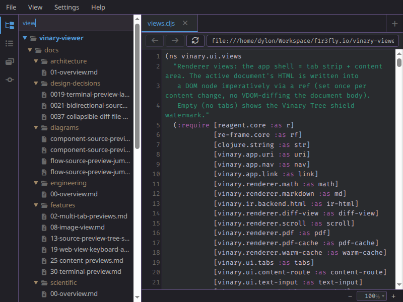
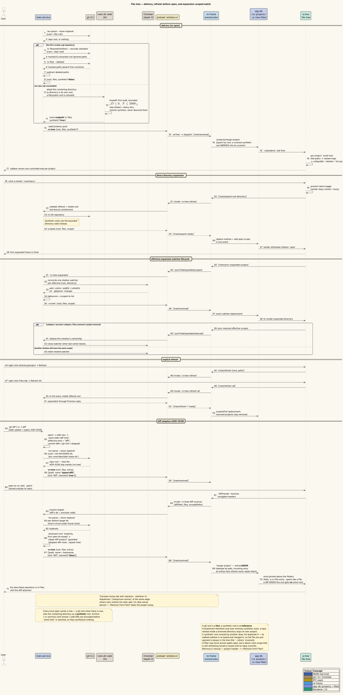

# File tree and filter



*The sidebar file tree, narrowed by a live filter.*

**Status: Available now.**

---

## 1 · What it is

When you open a file, vinary-viewer shows a **sidebar tree** of the project it belongs to — the Files
tab. A project is one of two things:

- a **git repository**, listed with `git ls-files --cached --others --exclude-standard`, so it shows
  everything in the repo **except** `.gitignore`d clutter — tracked files **plus**
  untracked-but-not-ignored ones, minus tracked paths deleted from the working tree. A file you just
  created, including the one you opened, shows up immediately, a deleted or unstaged-renamed path does
  not linger, and build output and `node_modules` stay out;
- for a file that belongs to **no** repository, its **containing directory**, walked directly. This is a
  *synthetic* root: an inference rather than a fact, which is why it behaves slightly differently when
  roots overlap (§4). Scratch notes in `/tmp`, a downloaded PDF, a standalone `.org` file — all are
  navigable.

A **diff document** can add a project by a third route: the repository it *describes*. Opening
`git diff | vv -t diff` or an on-disk patch stored outside its checkout puts that checkout into
Files with the diff attached as a pinned italic row that opens like any file — transient for piped
diffs, persistent for on-disk ones. See [feature 31](31-diff-project-adoption.md) and
[ADR-0038](../design-decisions/0038-diff-documents-adopt-described-project.md).

Several projects can be open at once: the sidebar keeps **one collapsible tree per project**, rooted at
the project directory's name. Folders are collapsible (native HTML `<details>`), files are clickable to
open in a tab, and a **filter box** at the top narrows **across all projects** to files whose path
matches what you type (folders containing a match are force-expanded so the matches are visible).

The tree is a convenience for navigating a docs/source repository — or a directory of notes — without
leaving the previewer: open one file, then jump around from the sidebar.

For an `ssh://` or `sftp://` open, a **compatible vinary-viewer daemon on the target** performs the same
git/synthetic-root query locally and returns the encoded remote project over an authenticated SSH-forwarded
event channel. Without that target channel the document still opens over SFTP, but no client-recursive tree is
invented. See [ADR-0035](../design-decisions/0035-authenticated-remote-daemon-events.md).

---

## 2 · How to use it

1. Open any file, e.g. `vv docs/README.md` from within a checked-out project, or `vv ~/notes/todo.md`
   from a directory that is not a repo.
2. The sidebar shows the project (its top folder name as the header) as a collapsible tree.
3. **Open a file:** click its entry. It opens in a tab (or activates an existing tab). Ctrl+click opens
   it in a new tab.
4. **Collapse/expand a folder:** click the folder name. Opening waits for a fresh directory listing,
   then reveals the directory and its new children together.
5. **Filter:** type in the *Filter files…* box. The tree shrinks to matching files across every open
   project, and every folder on the path to a match is expanded so you can see them.
6. **Refresh explicitly:** right-click a directory or project header → **Refresh**. Right-click the
   **Files** icon in the sidebar rail → **Refresh All** to re-list every project tree currently in
   Files.
7. **Remove a project:** right-click a project header → **Remove from Files**. It returns if you open a
   file under it again.

**Example.** Open `vv src/vinary/main/core.cljs`. The sidebar shows the whole repo. Type `theme` into
the filter; the tree collapses to just the files whose path contains "theme" (e.g.
`resources/public/css/themes/spacemacs-dark.css`), with their parent folders opened. Clear the box to
restore the full tree.

> If `git` is unavailable, a file inside a repository still gets a tree — it simply falls back to the
> directory walk, as a file outside a repository does.

---

## 3 · How it works internally

### MAIN process: find the project, list its files

`src/vinary/main/service.cljs` tries git first. It finds the repository root, lists tracked plus
untracked-but-not-ignored paths, and subtracts tracked paths deleted from the working tree:

```clojure
(defn- git [args cwd]
  (try
    (str/trim (cp/execFileSync "git" (clj->js args)
                               (clj->js {:cwd cwd :encoding "utf8"
                                         :maxBuffer (* 64 1024 1024) :stdio ["ignore" "pipe" "ignore"]})))
    (catch :default _ nil)))

(defn- repo-files [root]
  (when-let [out (git ["ls-files" "--cached" "--others" "--exclude-standard"] root)]
    (when-let [deleted-out (git ["ls-files" "--deleted"] root)]
      (let [deleted (into #{} (remove str/blank?) (str/split deleted-out #"\n"))]
        (into []
              (comp (remove str/blank?) (remove deleted))
              (str/split out #"\n"))))))

(defn- repo-tree [file-path]
  (let [dir  (if (directory? file-path) file-path (path/dirname file-path))
        root (git ["rev-parse" "--show-toplevel"] dir)]
    (when (and root (not (str/blank? root)))
      (when-let [files (repo-files root)]
        {:root root :files files :synthetic? false}))))
```

Terms:

- **`execFileSync "git" …`** — runs `git` with an argument *array* (not a shell string), so paths
  with spaces/quotes are safe and there is no shell-injection surface. `:stdio ["ignore" "pipe"
  "ignore"]` ignores stdin/stderr and captures stdout. `:maxBuffer (* 64 1024 1024)` allows up to
  64 MiB of `ls-files` output (large monorepos). Any failure (`git` missing, not a repo) is caught
  and returns `nil`.
- **`git rev-parse --show-toplevel`** — prints the absolute path of the repository root that
  contains `dir` (the directory of the open file). This is how the tree is rooted at the repo, not
  at the file's folder.
- **`git ls-files --cached --others --exclude-standard`** — prints every file worth navigating, one
  per line, as **repo-relative** paths: `--cached` lists tracked files, `--others` lists untracked
  files, and `--exclude-standard` drops anything matched by `.gitignore` / `.git/info/exclude` / the
  global excludes. `--cached` describes the index, so it can still name a tracked path deleted or
  renamed only in the working tree; `git ls-files --deleted` supplies the set `repo-files` subtracts.

When `repo-tree` returns `nil`, the **synthetic root** takes over
([ADR-0030](../design-decisions/0030-fallback-project-roots.md)):

```clojure
(defn- send-tree! [^js wc file-path]
  (when-let [t (or (repo-tree file-path) (dir-walk/dir-tree file-path (directory? file-path)))]
    (.send wc "vv:tree" (clj->js t))))
```

`dir-walk/dir-tree` adopts the file's containing directory — or, when a **directory** is what was
opened, that directory itself, since `path/dirname` of `/notes` is `/` and the filesystem root is never
a project. It then walks it (below) and marks the result `:synthetic? true`. The root is `realpathSync`ed:
`git rev-parse --show-toplevel` resolves symlinks and `path/dirname` does not, and since the renderer
dedupes roots by exact string equality, the same directory reached two ways would otherwise appear twice.

`send-tree!` is called from `open!`, so the tree arrives alongside the document's content. The `vv:tree`
channel is part of the IPC contract ([reference/ipc-channels.md](../reference/ipc-channels.md)).

### MAIN process: the synthetic root's walk

`src/vinary/main/dir-walk.cljs` is the non-git counterpart of `git ls-files`. A repository is
**self-delimiting** (its root bounds it) and **self-filtering** (`--exclude-standard` consults
`.gitignore`); a plain directory is neither, so the walk supplies both properties itself — bounded to
depth 6 and 5000 entries, skipping hidden directories (one rule covering `.git`, `.venv`, `.cache`,
`.next`, `.tox`) and the heavy ones (`node_modules`, `target`, `dist`, `build`, `out`, `__pycache__`).

It is **breadth-first**, which is the one non-obvious choice: when a cap is hit the user gets a useful
*shallow* tree rather than one arbitrarily deep branch. Hidden **files** are kept — `git ls-files
--exclude-standard` lists `.gitignore`, and parity is the goal. Symlinks are `stat`ed through to their
target and listed when that target is a file, but a symlinked **directory** is never descended into,
since a cycle (`ln -s . self`) would not terminate.

The namespace is deliberately **Electron-free** — `service.cljs` pulls in electron, chokidar, and the
content service and so cannot be required outside Electron, whereas `dir-walk` needs only `fs`/`path`.
That is what lets the `:node-test` build exercise the **real** walk against real temporary directories
in [`test/vinary/main/dir_walk_test.cljs`](../../test/vinary/main/dir_walk_test.cljs), rather than a
hand-copied mirror of it.

### MAIN process: watch only expanded directories

The renderer sends its *effective* expanded scopes through `syncTreeExpanded`. Main reconciles those
`[root directory]` scopes into shared Chokidar watchers with `depth 0`: an expanded directory watches
only its immediate children. Opening a child gives that child its own watcher; collapsing it, collapsing
an ancestor, hiding the sidebar, switching away from Files, removing the project, or destroying the
window releases its ownership.

The watchers listen for `add`, `unlink`, `addDir`, and `unlinkDir`, plus `.gitignore` changes. A normal
content save does not re-list the file tree — retained-document watchers remain responsible for preview
refresh. When a tree watcher fires, main returns a root-relative payload with `:scope`; the renderer
replaces only that subtree. Every new watcher also performs one ready-time reconciliation so a file
created between the expansion listing and Chokidar becoming ready cannot be missed. See
[ADR-0034](../design-decisions/0034-expansion-scoped-file-tree-watchers.md).

Remote projects send the identical visible-root/effective-expansion state to their authenticated target owner.
The target shares the same depth-0 Chokidar watchers, then maps scoped payloads back into the originating
`ssh://` or `sftp://` namespace; collapse, unmount, project/window removal, disconnect, and session death all
release ownership. Manual **Refresh** and **Refresh All** follow that same route.

### RENDERER: store the tree

`src/vinary/renderer/core.cljs` routes `vv:tree` into a re-frame event, and the event folds it into the
project list:

```clojure
(defn apply-tree-update [projects {:keys [root scope files] :as entry}]
  (if (nil? scope)
    (merge-project projects entry)
    (let [projects (vec projects)
          idx      (first (keep-indexed #(when (= (:root %2) root) %1) projects))
          prefix   (when-not (str/blank? scope) (str scope "/"))]
      (if (nil? idx)
        projects ; a late scoped reply cannot resurrect a removed project
        (let [old   (:files (nth projects idx))
              keep? (if prefix #(not (str/starts-with? % prefix)) (constantly false))]
          (assoc-in projects [idx :files]
                    (into (filterv keep? old) (vec files))))))))
```

`[:ui :projects]` is a **vector** of `{:root :files :synthetic?}`, one entry per open project. Each
project's flat `:files` vector is kept as-is; nesting is derived by `vinary.app.tree-model`, so there is
no second copy to maintain. Full payloads use the project merge rules in §4. Scoped watcher/manual
payloads keep the exact project identity and replace only files beneath their segment-bounded prefix.

### RENDERER: fold flat paths into a nested tree

`src/vinary/app/tree_model.cljs` turns each project's flat root-relative paths into a nested map with one
`assoc-in` per file:

```clojure
(defn- build-tree [files]
  (reduce (fn [acc f]
            (let [parts (str/split f #"/")
                  ks    (concat (interpose :children parts) [:file])]
              (assoc-in acc ks f)))
          {} files))
```

How the key path is built, by example. For the file `src/vinary/main/core.cljs`:

- `parts` = `["src" "vinary" "main" "core.cljs"]`.
- `(interpose :children parts)` = `["src" :children "vinary" :children "main" :children "core.cljs"]`.
- `ks` = that, with `:file` appended:
  `["src" :children "vinary" :children "main" :children "core.cljs" :file]`.
- `(assoc-in acc ks f)` writes the **full path string** at that leaf under a `:file` key.

So a **folder node** is a map that has a `:children` sub-map, and a **file node** is a map that
has a `:file` string (the original full root-relative path). Two files in the same folder merge
naturally because `assoc-in` shares the common prefix of the key path. The result is a tree like:

```
{"src" {:children
        {"vinary" {:children
                   {"main" {:children
                            {"core.cljs"    {:file "src/vinary/main/core.cljs"}
                             "service.cljs" {:file "src/vinary/main/service.cljs"}}}}}}}}
```

### RENDERER: render nodes to collapsible hiccup

`nodes->hiccup` walks the nested map and emits controlled native `<details>` for folders and `<a>` for
files (abridged):

```clojure
(defn- nodes->hiccup [children root active expanded expanding dir-prefix]
  (into [:<>]
        (for [[k v] (sort-by (fn [[k v]] [(if (:children v) 0 1) (str/lower-case k)]) children)]
          ^{:key k}
          (if (:children v)
            (let [dpath (str dir-prefix "/" k)
                  scope [root dpath]
                  open? (contains? expanded scope)]
              [:details.vv-dir {:open open?}
               [:summary.vv-dir-name
                {:aria-busy (contains? expanding scope)
                 :on-click (summary-click! root dpath open?)}
                (icons/folder-icon) k]
               (nodes->hiccup (:children v) root active expanded expanding dpath)])
            (let [full (projects/join-path root (:file v))]
              [:a.vv-file {:class    (when (= full active) "vv-file-active")
                           :title    full
                           :on-click #(rf/dispatch [:doc/open full])}
               (icons/file-icon k) k])))))
```

Details:

- **Sort key `[(if (:children v) 0 1) (str/lower-case k)]`** — folders (`0`) sort before files
  (`1`), then alphabetically (case-insensitively). This gives the familiar "folders first, then
  files, A→Z" ordering.
- **Controlled `:open`.** Persistent intent lives in `[:ui :tree-open]`; `tree-state/effective-expanded`
  removes scopes whose ancestors or Files view are closed and adds filter-forced paths. The rendered
  attribute is therefore also the exact watcher set sent to main.
- **Refresh before open.** `summary-click!` cancels the browser's immediate native toggle and dispatches
  `:tree/expand`. Its IPC reply updates the subtree and adds the open scope in one event. A failure clears
  the busy state and leaves the directory closed, so stale children never flash open.
- **`full` path** — the click target is reconstructed with `projects/join-path root :file` (an absolute
  path without a doubled POSIX/Windows root separator),
  because MAIN's `open!`/`close!` and the `:doc/path` identity use absolute paths. Clicking
  dispatches `[:doc/open full]`, which sends `vv:open` to MAIN ([feature 02](02-multi-tab-previews.md)).
- **`.vv-file-active`** — highlights the entry for the currently active document.

### RENDERER: one tree per project, and the filter

`file-tree` reads every project, the active path, and the filter string; `project-tree` renders one
project, narrowing its flat file list *before* building the nested tree:

```clojure
;; the MODEL — vinary.app.tree-model, pure and behind the :tree/filtered subscription
(defn filtered [projects q match-opts]
  (let [blank? (str/blank? q)
        m      (when-not blank? (match/matcher q match-opts))]
    (into []
          (keep (fn [{:keys [root files]}]
                  (let [shown (if blank? (vec files) (filterv #(some? (m %)) files))]
                    (when (seq shown)
                      {:root root :files shown :nodes (build-tree shown) :filtered? (not blank?)}))))
          projects)))

;; the VIEW — vinary.ui.tree renders the derived model and controlled expansion set
(defn file-tree []
  (let [shown     @(rf/subscribe [:tree/filtered])
        projects  @(rf/subscribe [:ui/projects])
        open      @(rf/subscribe [:ui/tree-open])
        expanding @(rf/subscribe [:ui/tree-expanding])
        expanded  (tree-state/effective-expanded projects shown open expanding)]
    [file-tree-view shown @(rf/subscribe [:ui/active-path]) projects
     @(rf/subscribe [:ui/tree-filter]) open expanding expanded]))
```

- **The narrowing and folding are a `reg-sub`, not render-time work.** They used to run inside
  `file-tree`'s render: every keystroke re-folded every path of every open project — thousands of
  `str/split`s and an `assoc-in` each — before React had begun reconciling. That is not merely wasteful;
  it is what let a re-render land *between* two keystrokes and commit a stale value back over the field,
  turning `views` into `vews` (ADR-0033, [scientific/10](../scientific/10-input-latency-experiments.md)).
  Layered, `:tree/filtered` recomputes only when the projects or the committed query actually change.
- **`async-input`, not a controlled `<input>`.** The field owns its own DOM value, so the ~90 ms filter
  debounce is invisible to the typist and no re-render can subtract a character.
- **Matching goes through `vinary.search.match`**, configured by `vinary.search.config`. The default
  reproduces the previous behaviour exactly — a case-insensitive substring match over the full
  root-relative path, so typing `theme` matches `resources/public/css/themes/…` — and switching the tree
  to fuzzy matching is now one keyword rather than a new matcher.
- **A project with no matches is omitted by the model**, so filtering naturally hides whole projects
  rather than leaving empty headers behind. The view renders what it is given.
- **`:filtered?` is carried out of the model** rather than recomputed in the view. It contributes the
  matching project's known directory scopes to `effective-expanded`, so deep matches remain visible;
  clearing the filter returns to persistent disclosure intent.
- **`:project` (not `:dir`) on the header** — the project header's context menu can **Remove from
  Files**, which a directory node's cannot; the distinct target kind is what selects that menu.
- **`:tree/reveal-active`** adds the active file's ancestor scopes declaratively (never collapsing
  others); the post-render `tree-reveal` helper now only scrolls the committed row into view. Command-line
  activation can still precede the asynchronous project payload, so project receipt dispatches the same
  reveal event.

Because filtering removes non-matching *files* from the flat list before `build-tree`, folders
that end up with no children simply do not appear — there is no separate "prune empty folders"
pass.

---

## 4 · Overlapping roots: why synthetic roots yield

Exact-root dedup is not enough once roots can be inferred. Opening `/notes/a.md` adopts `/notes`;
opening `/notes/sub/c.md` would then adopt `/notes/sub` — a second tree showing files the first already
shows. `vinary.app.projects/merge-project` resolves overlaps with three rules:

1. a root **already present** is replaced **in place**, so re-opening a file refreshes its tree without
   reordering the sidebar;
2. a synthetic root covered by a known **synthetic** root does not become a second tree; its freshly
   walked subtree is **merged into** that root, re-based onto it (`/notes/sub`'s `c.md` becomes
   `/notes`'s `sub/c.md`);
3. a synthetic root covered by a **git** root is **dropped** — the incoming git payload is already a
   complete repository listing;
4. otherwise it is appended, and any **synthetic** root it now covers is **absorbed** — the broader view
   wins, so `/notes/sub` followed by `/notes` leaves one tree rather than two overlapping ones.

Rule 2 **merges** rather than discards for a concrete reason: `git ls-files --others` guarantees that the
file you just opened is in the tree, and a synthetic root must not be staler than that. Dropping the
update meant a file created *after* its ancestor directory was walked never appeared. Because the
incoming walk is a complete listing of that subtree, the merge also removes files deleted since.

Containment only ever removes **synthetic** roots. The asymmetry is the whole point: **a git root is a
fact; a synthetic root is an inference.** A git repository nested inside a directory you happen to be
browsing is a project in its own right, and survives being enclosed.

Containment is compared on **segment boundaries**, so `/a/bc` is *not* under `/a/b` — a bare
`starts-with?` would silently merge sibling directories that share a prefix.

---

## 5 · Design notes / trade-offs

- **Why `git ls-files` rather than reading the directory, when there is a repo?** With `--cached
  --others --exclude-standard` it gives precisely the files worth navigating — tracked **plus**
  untracked-but-not-ignored — and `--deleted` removes stale working-tree paths, while still ignoring
  build output, `node_modules`, and anything `.gitignore`d by reusing git's own ignore engine. It is fast even on large repos; the
  working-tree walk that `--others` adds is bounded (the heavy ignored dirs are pruned first) and
  blocks the main process only briefly — the same synchronous-`execFileSync` trade-off noted below.
- **Why walk the directory at all, rather than showing nothing?** Because the failure was silent and
  ambiguous: the sidebar read "No files open" while a document was plainly open. Reusing the same
  sidebar for non-repo directories means the Files panel behaves the same way whether or not a folder
  happens to be a checkout. See [ADR-0030](../design-decisions/0030-fallback-project-roots.md) for the
  alternatives weighed (list only the opened file; immediate children only; exact-root dedup only).
- **Why controlled `<details>`/`<summary>`?** Native semantics and accessibility are retained, while
  app-db control makes refresh-before-open atomic and gives main an exact watcher-ownership set.
- **Why shallow expansion-scoped watchers?** They refresh the part of the tree being browsed without
  turning every project root into a recursive subscription. Collapsed and hidden branches reconcile
  lazily on their next expansion/restoration.
- **Why filter the flat list, not the nested tree?** Filtering strings is trivial and unambiguous;
  pruning a nested tree would require a recursive walk that keeps ancestors of matches. Narrowing
  the flat list and rebuilding gets the same result with simpler code.
- **Trade-off — substring filter, not fuzzy.** The filter is a plain `includes?`, not a fuzzy
  matcher. It is predictable and cheap; a fuzzy/ranked filter is a possible enhancement. (The command
  palette's file finder, which reads the same `[:ui :projects]`, is the fuzzy counterpart.)
- **Trade-off — the synthetic walk is capped.** Depth 6 and 5000 entries. A very large or very deep
  directory is truncated rather than listed in full; breadth-first ordering makes the truncation
  degrade gracefully. A repository has no such cap, because git bounds it for us.
- **Trade-off — projects accumulate.** Opening files from several projects keeps all of their trees in
  the sidebar for the session. **Remove from Files** on a project header is the way back; nothing is
  persisted either way.
- **`execFileSync` is synchronous.** Like the file reads in [feature 01](01-live-refresh.md),
  the git calls block the main process briefly. Acceptable for interactive open; recorded as a
  trade-off. The synthetic walk is likewise synchronous, and bounded for the same reason.

The relevant cross-process decision — that the renderer reaches `git` and the filesystem only through
the main process over the Mediator IPC seam — is recorded in
[ADR-0009 Mediator IPC over point-to-point](../design-decisions/0009-mediator-ipc-over-point-to-point.md).
See the [ADR index](../design-decisions/README.md) for the full list.

---

## 6 · Diagram

- **Sequence — building and rendering the tree:** [`../diagrams/seq-tree.puml`](../diagrams/seq-tree.puml)
  (written by the architecture pillar). Open file → MAIN `git rev-parse` + `git ls-files --cached --others
  --exclude-standard`, **or** the synthetic directory walk when there is no repo →
  `vv:tree {:root :files :synthetic? :scope?}` → `:tree/received` (full merge or scoped replacement) →
  `build-tree` (flat → nested) → controlled `nodes->hiccup` (`<details>`/`<a>`), with the filter branch
  narrowing the flat list and force-expanding matching paths.



Palette: **slate** = MAIN/Node-IO (the `git` calls and the directory walk), **amber** = the IPC seam
(`vv:tree`), **blue-violet** = `app-db` (`:ui/projects`, `:ui/tree-filter`), **teal** = the renderer UI
(the tree view). See [`../diagrams/_vv-theme.iuml`](../diagrams/_vv-theme.iuml).
