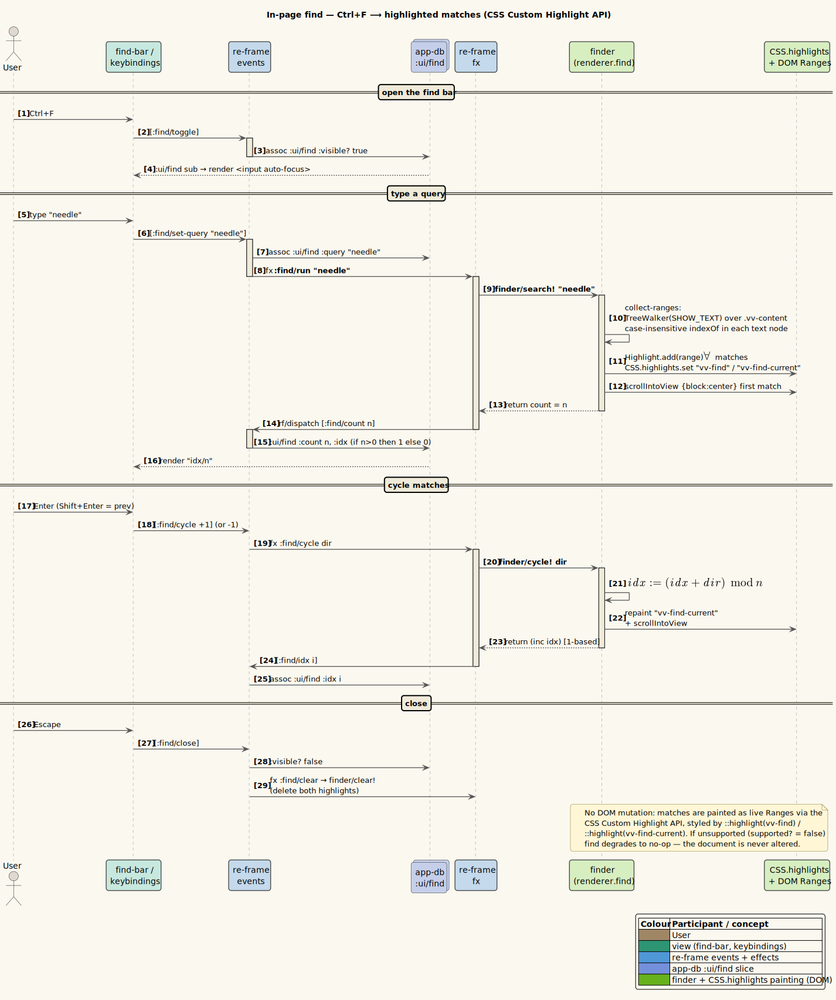
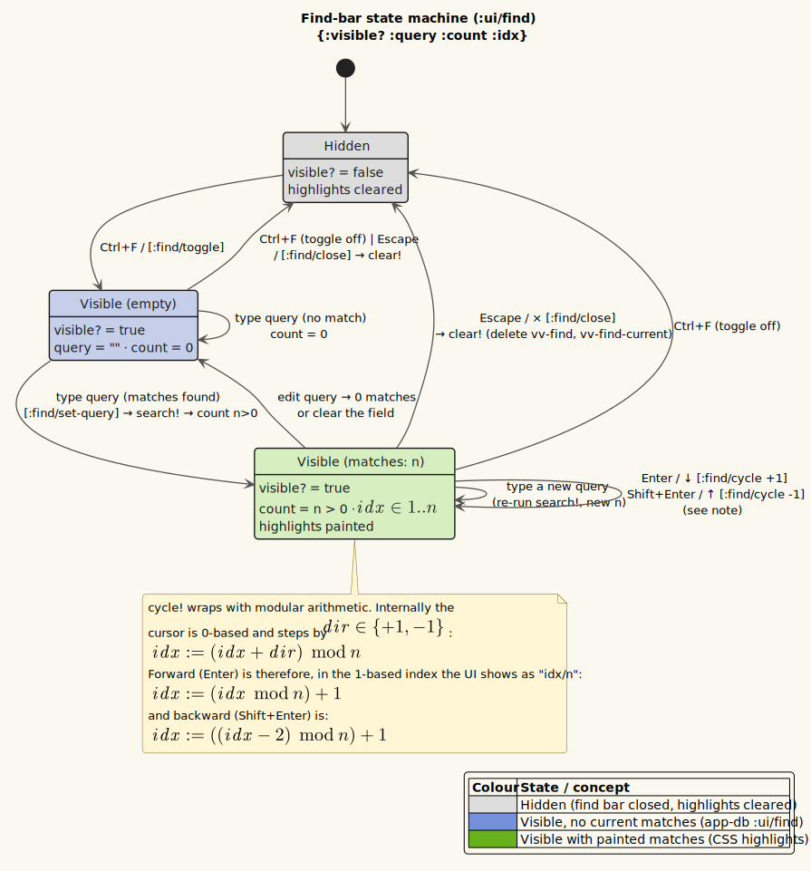

# In-page find

**Status: Available now.**

---

## 1 · What it is

A find bar (`Ctrl+F`) that **highlights every occurrence** of your query inside the rendered
document and lets you **cycle** between matches, scrolling each into view. The current match is
highlighted in a distinct color from the rest. Crucially, the highlighting is done with the
**CSS Custom Highlight API** — it paints over the text via `Range` objects **without mutating the
document's DOM**. That matters because vinary-viewer writes the document body imperatively as one
`innerHTML` blob ([feature 09](09-markdown-rendering.md)); a find implementation that wrapped
matches in `<mark>` tags would fight that blob on every content update. Painting over Ranges
composes cleanly: the document is untouched, and the highlights are a separate visual layer.

The conceptual model — why the CSS Custom Highlight API, what a `Highlight`/`::highlight()` is,
and how it sits beside the imperative body — is developed in
[theory/06-find-css-custom-highlight.md](../theory/06-find-css-custom-highlight.md). This page
walks the implementing code.

---

## 2 · How to use it

1. With a document open, press **`Ctrl+F`**. The find bar appears at the top-right of the content
   area and is auto-focused.
2. Type a query. All matches highlight as you type; the first match is focused and scrolled to
   center. The counter shows `current / total` (e.g. `1/7`).
3. **Next / previous match:** press **`Enter`** (next) or **`Shift+Enter`** (previous), or click
   the `↑` / `↓` buttons. Cycling wraps around the ends.
4. **Close:** press **`Esc`** or click `×`. The highlights clear.

**Example.** Open a long Markdown file, `Ctrl+F`, type `reactive`. Every occurrence highlights;
`Enter` walks you through them one by one, each scrolled to the middle of the viewport, with the
focused one shown in the brighter "current" color. The match is case-insensitive, so `Reactive`
and `reactive` both match.

---

## 3 · How it works internally

Find spans a small re-frame slice (the bar's visibility/query/counter) and an imperative renderer
module (`src/vinary/renderer/find.cljs`) that does the actual highlighting.

### The find bar view and its events

`find-bar` in `src/vinary/ui/views.cljs` reads the find slice and dispatches on input:

```clojure
(defn find-bar []
  (let [{:keys [visible? query count idx]} @(rf/subscribe [:ui/find])]
    (when visible?
      [:div.vv-find
       [:input.vv-find-input
        {:placeholder "Find" :value query :auto-focus true
         :on-change   #(rf/dispatch [:find/set-query (.. % -target -value)])
         :on-key-down (fn [^js e]
                        (case (.-key e)
                          "Enter"  (do (.preventDefault e) (rf/dispatch [:find/cycle (if (.-shiftKey e) -1 1)]))
                          "Escape" (rf/dispatch [:find/close])
                          nil))}]
       [:span.vv-find-count (if (pos? count) (str idx "/" count) "0/0")]
       [:button.vv-find-btn {:title "Previous (⇧⏎)" :on-click #(rf/dispatch [:find/cycle -1])} "↑"]
       [:button.vv-find-btn {:title "Next (⏎)" :on-click #(rf/dispatch [:find/cycle 1])} "↓"]
       [:button.vv-find-btn {:title "Close (Esc)" :on-click #(rf/dispatch [:find/close])} "×"]])))
```

- **`:ui/find`** — the app-db slice `{:visible? :query :count :idx}`. `idx` is the 1-based index of
  the focused match for display; `count` is the total.
- **`Enter` / `Shift+Enter`** — dispatch `[:find/cycle 1]` / `[:find/cycle -1]` (next / previous);
  `(if (.-shiftKey e) -1 1)` picks the direction. `Esc` closes.

`Ctrl+F` toggles the bar globally (it works even when the bar is not focused), from
`src/vinary/renderer/core.cljs`:

```clojure
(defn keybindings! []
  (.addEventListener js/window "keydown"
                     (fn [^js e]
                       (cond
                         (and (.-ctrlKey e) (= (.-key e) "f"))
                         (do (.preventDefault e) (rf/dispatch [:find/toggle]))
                         (.-altKey e)
                         (case (.-key e)
                           "ArrowLeft"  (do (.preventDefault e) (rf/dispatch [:history/back]))
                           "ArrowRight" (do (.preventDefault e) (rf/dispatch [:history/forward]))
                           nil)
                         :else nil))))
```

### The events: toggle, set-query, cycle, close

From `src/vinary/app/events.cljs`:

```clojure
(rf/reg-event-fx
 :find/toggle
 (fn [{:keys [db]} _]
   (let [vis (not (get-in db [:ui :find :visible?]))]
     (cond-> {:db (assoc-in db [:ui :find :visible?] vis)}
       (not vis) (assoc :fx [[:find/clear]])))))

(rf/reg-event-fx
 :find/set-query
 (fn [{:keys [db]} [_ q]]
   {:db (assoc-in db [:ui :find :query] q)
    :fx [[:find/run q]]}))

(rf/reg-event-db
 :find/count
 (fn [db [_ n]] (-> db (assoc-in [:ui :find :count] n)
                    (assoc-in [:ui :find :idx] (if (pos? n) 1 0)))))

(rf/reg-event-fx :find/cycle (fn [_ [_ dir]] {:fx [[:find/cycle dir]]}))

(rf/reg-event-fx
 :find/close
 (fn [{:keys [db]} _]
   {:db (assoc-in db [:ui :find :visible?] false)
    :fx [[:find/clear]]}))
```

The pattern: **events keep state pure; the DOM work is in effects.** `:find/set-query` stores the
query *and* requests the `:find/run` effect; `:find/count` records how many matches the effect
reported and resets the displayed index to `1` (or `0` if none). Toggling off, or closing, fires
`:find/clear` to remove the highlights.

The effects (in `src/vinary/app/fx.cljs`) are thin adapters to the `finder` module:

```clojure
(rf/reg-fx :find/run   (fn [q]   (rf/dispatch [:find/count (finder/search! q)])))
(rf/reg-fx :find/cycle (fn [dir] (rf/dispatch [:find/idx (finder/cycle! dir)])))
(rf/reg-fx :find/clear (fn [_]   (finder/clear!)))
```

Each effect calls the imperative finder and dispatches the *result* (the count, or the new index)
back into the loop, so the counter stays in sync without the finder knowing about re-frame.

### The finder: collect Ranges, paint Highlights

`src/vinary/renderer/find.cljs` holds the matches and the focused index in a private atom (this is
imperative DOM state, deliberately *outside* app-db):

```clojure
(defonce ^:private state (atom {:ranges [] :idx 0}))
(defn- content-root [] (.querySelector js/document ".vv-content"))
```

**Collecting matches** walks the text nodes under the content root and records a DOM `Range` for
each case-insensitive substring hit:

```clojure
(defn- collect-ranges [root query]
  (let [q (str/lower-case query)
        ql (count q)
        ranges (array)]
    (when (and root (pos? ql))
      (let [walker (.createTreeWalker js/document root js/NodeFilter.SHOW_TEXT nil)]
        (loop []
          (let [node (.nextNode walker)]
            (when node
              (let [text (str/lower-case (or (.-textContent node) ""))]
                (loop [from 0]
                  (let [i (.indexOf text q from)]
                    (when (>= i 0)
                      (let [r (.createRange js/document)]
                        (.setStart r node i)
                        (.setEnd r node (+ i ql))
                        (.push ranges r))
                      (recur (+ i ql))))))
              (recur))))))
    (vec ranges)))
```

Terms:

- **`TreeWalker(…, NodeFilter.SHOW_TEXT, nil)`** — a DOM iterator that visits only **text nodes**
  under `root`. We never look at element nodes, so markup is ignored; only rendered text is
  searched.
- **`indexOf` loop within a single text node** — each match is found by lower-cased `indexOf`,
  advancing `from` past each hit. A `Range` is created with `setStart`/`setEnd` at the match's
  character offsets. Matches are confined to a *single text node* (the walker yields one node at a
  time), so a query that spans a markup boundary is not matched — a deliberate simplicity.
- **`Range`** — a [DOM Range](https://developer.mozilla.org/en-US/docs/Web/API/Range) is a
  start/end pair of (node, offset). It is the unit the CSS Custom Highlight API paints.

**Painting** turns the Ranges into highlights via the CSS Custom Highlight API:

```clojure
(defn- supported? [] (and (exists? js/CSS) (.-highlights js/CSS) (exists? js/Highlight)))

(defn- paint! [ranges idx]
  (when (supported?)
    (let [all (js/Highlight.)
          cur (js/Highlight.)]
      (doseq [r ranges] (.add all r))
      (when (and (seq ranges) (< idx (count ranges))) (.add cur (nth ranges idx)))
      (.set (.-highlights js/CSS) "vv-find" all)
      (.set (.-highlights js/CSS) "vv-find-current" cur))))
```

- **`Highlight`** — a [`Highlight`](https://developer.mozilla.org/en-US/docs/Web/API/Highlight)
  is a set of `Range`s registered under a name in the global `CSS.highlights` registry. Here `all`
  holds every match; `cur` holds only the focused one.
- **`CSS.highlights.set("vv-find", all)`** and **`…set("vv-find-current", cur)`** — registers the
  two highlight sets under the names `vv-find` and `vv-find-current`.
- **`supported?`** — guards the whole feature behind feature-detection (`CSS.highlights` and the
  `Highlight` constructor). On an engine without the API, find degrades to a no-op rather than
  erroring. vinary-viewer runs on modern Electron/Chromium, where the API is present.

The styling lives in `resources/public/css/app.css` via the `::highlight()` pseudo-element:

```css
::highlight(vv-find)         { background-color: var(--vv-highlight); color: var(--vv-fg-strong); }
::highlight(vv-find-current) { background-color: var(--vv-head2);     color: var(--vv-bg1); }
```

So all matches get the theme's selection color, and the **current** match gets the head2 accent —
both themed via `--vv-*` like everything else ([feature 06](06-themes-and-live-switching.md)).

### Searching and cycling

`search!` recomputes matches, paints them, focuses and scrolls the first, and returns the count:

```clojure
(defn search! [query]
  (if (str/blank? query)
    (do (clear!) 0)
    (let [ranges (collect-ranges (content-root) query)]
      (reset! state {:ranges ranges :idx 0})
      (paint! ranges 0)
      (scroll-to! ranges 0)
      (count ranges))))
```

> **A naming note.** This function is `search!`, *renamed* from an earlier `run!` that shadowed
> `clojure.core/run!`. Avoiding the shadow keeps `run!` available with its standard meaning
> elsewhere in the namespace.

`cycle!` advances the focused index with wraparound and re-paints/re-scrolls:

```clojure
(defn cycle! [dir]
  (let [{:keys [ranges idx]} @state
        n (count ranges)]
    (if (pos? n)
      (let [idx' (mod (+ idx dir) n)]
        (swap! state assoc :idx idx')
        (paint! ranges idx')
        (scroll-to! ranges idx')
        (inc idx'))
      0)))
```

- **`idx' ≔ (mod (+ idx dir) n)`** — the wraparound: from the last match, `+1` wraps to `0`; from
  the first, `-1` wraps to `n-1` (Clojure's `mod` returns a non-negative result). Returns the
  **1-based** index `(inc idx')` for the counter display.

`scroll-to!` brings the focused match into view:

```clojure
(defn- scroll-to! [ranges idx]
  (when (and (seq ranges) (< idx (count ranges)))
    (when-let [el (.. ^js (nth ranges idx) -startContainer -parentElement)]
      (.scrollIntoView el #js {:block "center" :behavior "smooth"}))))
```

- **`-startContainer -parentElement`** — the element containing the match's start, scrolled to the
  **center** of the viewport (`:block "center"`) with a smooth animation.

`clear!` removes both highlight sets and resets the state:

```clojure
(defn clear! []
  (when (supported?)
    (.delete (.-highlights js/CSS) "vv-find")
    (.delete (.-highlights js/CSS) "vv-find-current"))
  (reset! state {:ranges [] :idx 0}))
```

---

## 4 · Design notes / trade-offs

- **Why the CSS Custom Highlight API instead of `<mark>` wrapping?** The document body is written
  as one imperative `innerHTML` blob that is replaced wholesale on content change. Wrapping matches
  in elements would (a) mutate that blob, fighting the next update, and (b) require careful
  un-wrapping. Painting over `Range`s leaves the DOM untouched, so find and live-refresh
  ([feature 01](01-live-refresh.md)) coexist with no interference. This is the central design
  decision; see [theory/06](../theory/06-find-css-custom-highlight.md).
- **Why hold match state in a module atom, not app-db?** The `Range`s are live DOM objects tied to
  the current document nodes — not serializable, not time-travel-friendly. Keeping them out of
  app-db respects the rule that app-db holds plain, replayable data; the finder owns its imperative
  state and only reports scalars (count, index) back.
- **Trade-off — single-text-node matches.** Matches cannot cross a markup boundary (e.g. a query
  straddling a `<code>` span). This keeps `collect-ranges` simple and fast; cross-node matching is
  a possible enhancement.
- **Graceful degradation.** `supported?` guards every DOM call, so on an engine lacking the API
  find quietly does nothing rather than throwing.

The enabling decision — writing the document body as one ref-managed `innerHTML` blob with no VDOM,
which is *why* find must paint over Ranges rather than wrap matches — is recorded in
[ADR-0003 ref-`innerHTML` body, no VDOM](../design-decisions/0003-ref-innerHTML-no-vdom-body.md).
The conceptual model is in [theory/06](../theory/06-find-css-custom-highlight.md); see the
[ADR index](../design-decisions/README.md) for the full list.

---

## 5 · Diagrams

- **Sequence — type a query, cycle, close:** [`../diagrams/seq-find.puml`](../diagrams/seq-find.puml)
  (written by the theory pillar). `Ctrl+F` → `:find/toggle`; keystroke → `:find/set-query` →
  `:find/run` → `finder/search!` (TreeWalker → Ranges → `Highlight` → `CSS.highlights.set`) →
  `:find/count`; `Enter` → `:find/cycle` → `finder/cycle!`; `Esc` → `:find/close` → `clear!`.
- **State — the find bar:** [`../diagrams/state-find.puml`](../diagrams/state-find.puml)
  (written by the theory pillar). States *Hidden → Visible(empty) → Matching(idx/total)*, with
  cycle self-loops and the close transition back to *Hidden* clearing highlights.





Palette: **blue-violet** = the `:ui/find` app-db slice, **blue** = re-frame events/effects,
**teal** = the renderer (the finder module + the painted highlights). See
[`../diagrams/_vv-theme.iuml`](../diagrams/_vv-theme.iuml).
