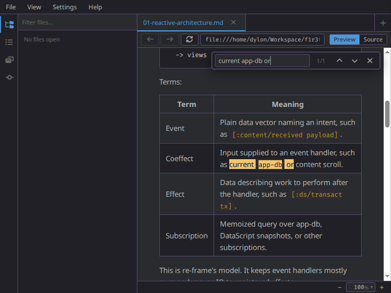
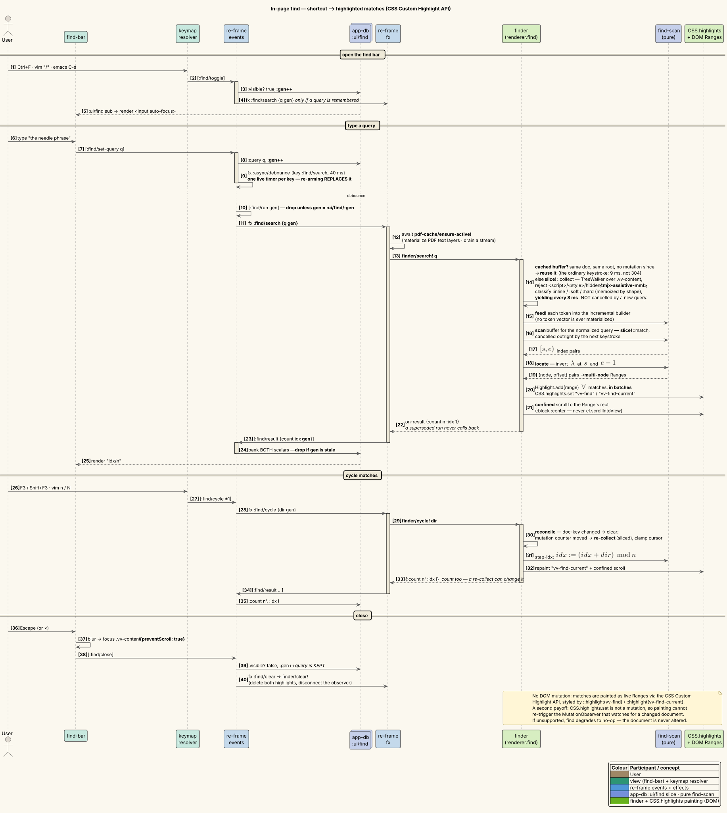
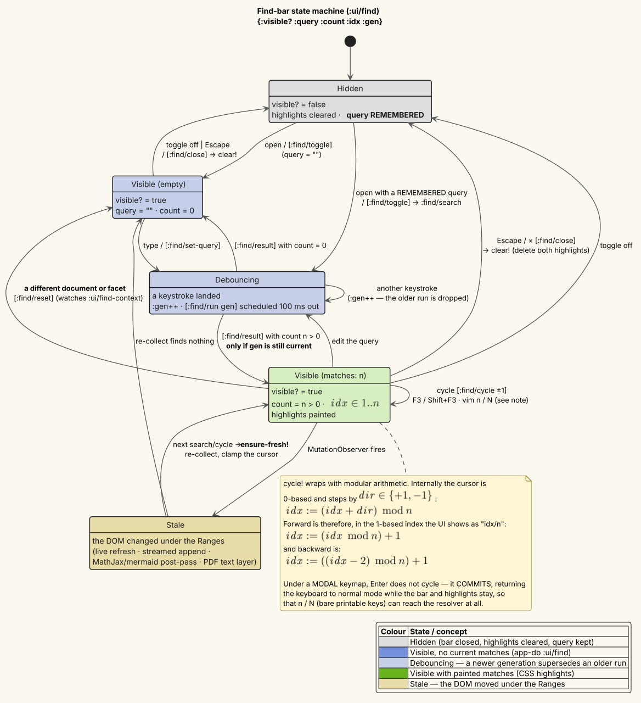
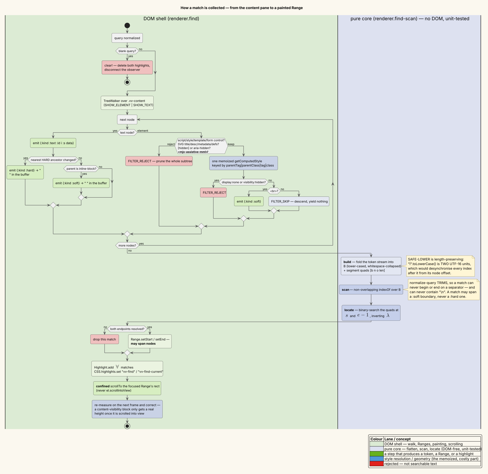

# In-page find



*In-page find with match highlighting and a match counter.*

**Status: Available now.**

---

## 1 · What it is

A find bar that **highlights every occurrence** of your query inside the rendered document and lets you
**cycle** between matches, scrolling each into view. The current match is highlighted in a distinct colour
from the rest.

Two properties shape the whole implementation:

- **It never touches the document's DOM.** Highlighting is done with the **CSS Custom Highlight API** —
  matches are painted over `Range` objects, so no `<mark>` element is spliced in. That matters because
  vinary-viewer writes the document body imperatively as one `innerHTML` blob
  ([feature 09](09-markdown-rendering.md)); a find implementation that wrapped matches in elements would
  fight that blob on every content update. See [ADR-0003](../design-decisions/0003-ref-innerHTML-no-vdom-body.md).
- **Matches may span markup.** Rendered text is broken at every inline element — `<code>`, `<a>`, `<em>`,
  syntax-highlight tokens — and pdf.js emits **one `<span>` per text run**, so a matcher confined to a
  single text node misses most multi-word queries and almost everything in a PDF. Find therefore flattens
  the visible text into one buffer, searches that, and maps matches back onto **multi-node** Ranges.

The conceptual model — why the CSS Custom Highlight API, and the flatten/scan/locate algorithms in literate
form with their cost analysis — is developed in
[theory/06-find-css-custom-highlight.md](../theory/06-find-css-custom-highlight.md). This page walks the
implementing code.

---

## 2 · How to use it

1. With a document open, press the find shortcut. It differs by keymap set
   ([feature 15](15-custom-keybindings.md)):

   | Keymap set | Open find | Next / previous match |
   |---|---|---|
   | **Standard** | `Ctrl+F` | `F3` / `Shift+F3`, or `Enter` / `Shift+Enter` in the box |
   | **Vim** | `/` (also `SPC s s`) | `n` / `N` |
   | **Emacs** | `C-s` (also `C-r`) | `F3` / `Shift+F3` |

   The bar appears at the top-right of the content area and is auto-focused.

2. Type a query. Matching is **case-insensitive**, and whitespace is normalized — so a phrase that the
   source wrapped across two lines still matches when you type it on one. The counter shows
   `current / total` (e.g. `1/7`). Searching is debounced, so a fast typist runs one search rather than one
   per keystroke.

3. **Next / previous match:** click the `↑` / `↓` buttons, or use the keys above. Cycling wraps around.

4. **Commit (modal keymaps).** Under **Vim**, `Enter` *commits* the search: the bar and the highlights
   stay, and the keyboard returns to normal mode so `n` / `N` work. This is not cosmetic — `n` and `N` are
   ordinary printable characters, so while the query box holds focus they are typed into it and can never
   reach the keymap. Under a non-modal set `Enter` keeps its browser meaning of "next match".

5. **Close:** press `Esc` or click `×`. The highlights clear, the query is remembered, and the keyboard
   returns to the document. Re-opening find re-runs the remembered query.

**Example.** Open a long Markdown file, press the find shortcut, and type `reactive`. Every occurrence
highlights in amber; the focused one is brighter. Cycling walks you through them one by one, each scrolled
to the middle of the content pane.

---

## 3 · How it works internally

Find spans four pieces:

| Piece | File | Responsibility |
|---|---|---|
| the bar | `src/vinary/ui/views.cljs` | render, focus, keyboard |
| the state slice | `src/vinary/app/events.cljs`, `subs.cljs` | query, counter, request generation |
| the pure core | `src/vinary/renderer/find_scan.cljs` | flatten, scan, locate — **no DOM** |
| the DOM shell | `src/vinary/renderer/find.cljs` | walk, build Ranges, paint, scroll, invalidate |

### 3.1 · The find bar

`find-bar` in `src/vinary/ui/views.cljs` is a form-3 component, for two reasons that both concern things
React does *not* do for you:

- **A stable prev-focus ref.** Focus is captured on mount and returned on unmount. Chromium fires no `blur`
  for an element that is *removed* while focused, so an unmount is exactly the case that needs handling
  explicitly. The same reference is why the Escape and `×` paths blur before dispatching.
- **A did-update hook watching `:ui/find-context`.** When a different document or facet comes on screen,
  find resets. Deriving that from one identity is deliberate: appending `[:find/reset]` to each of the
  seven navigation events that can change what is shown would leave a stale counter painted over the wrong
  document the first time one was missed.

```clojure
"Enter"  (do (.preventDefault e) (.stopPropagation e)
             (if modal?
               (release-find-keyboard!)                              ; commit — see §2.4
               (rf/dispatch [:find/cycle (if (.-shiftKey e) -1 1)])))
"Escape" (do (.preventDefault e) (.stopPropagation e)
             (release-find-keyboard!)
             (rf/dispatch [:find/close]))
```

`release-find-keyboard!` focuses `.vv-content` with `#js {:preventScroll true}`. Both halves matter: the
pane carries `tabindex="-1"` so it *can* take focus (a plain `<div>` cannot, which is why the
`:focus/content` command used to be a silent no-op), and `preventScroll` stops the focus itself from
scrolling the pane — otherwise closing find would move the reader's position.

### 3.2 · The state slice and the request generation

From `src/vinary/app/events.cljs`. Every request carries a **generation**:

```clojure
(rf/reg-event-fx
 :find/set-query
 (fn [{:keys [db]} [_ q]]
   (let [db' (-> db (assoc-in [:ui :find :query] q) bump-gen)
         gen (get-in db' [:ui :find :gen])]
     {:db db'
      :fx [[:dispatch-later {:ms find-debounce-ms :dispatch [:find/run gen]}]]})))

(rf/reg-event-fx                                    ; the debounce landing point
 :find/run
 (fn [{:keys [db]} [_ gen]]
   (when (= gen (get-in db [:ui :find :gen]))       ; superseded → drop
     {:fx [[:find/search {:q (get-in db [:ui :find :query]) :gen gen}]]})))

(rf/reg-event-db                                    ; banks BOTH scalars
 :find/result
 (fn [db [_ {:keys [gen count idx]}]]
   (if (or (nil? gen) (= gen (get-in db [:ui :find :gen])))
     (-> db (assoc-in [:ui :find :count] count) (assoc-in [:ui :find :idx] idx))
     db)))
```

Why a generation is necessary: a search is **asynchronous**. Before scanning, find materializes a PDF's
text layers or drains a streamed document to completion, so that it covers the whole document rather than
the part that happens to be rendered. Two searches can therefore be in flight, and the reply from an
earlier, shorter query can land last. The same counter collapses the debounce, so one mechanism serves both.

`:find/result` banks the count **and** the index together. Cycling can change the count — reconciling stale
Ranges against a changed document is part of cycling — which the earlier count-only / index-only event pair
could not express.

The effects, in `src/vinary/app/fx.cljs`:

```clojure
(rf/reg-fx :find/search
           (fn [{:keys [q gen]}]
             (-> (pdf-cache/ensure-active!)
                 (.then (fn [_] (rf/dispatch [:find/result (assoc (finder/search! q) :gen gen)]))))))
(rf/reg-fx :find/cycle (fn [{:keys [dir gen]}]
                         (rf/dispatch [:find/result (assoc (finder/cycle! dir) :gen gen)])))
(rf/reg-fx :find/clear (fn [_] (finder/clear!)))
```

### 3.3 · The pure core — flatten, scan, locate

`src/vinary/renderer/find_scan.cljs` has no DOM dependency, so it is unit-tested in the `:node-test` build
(`test/vinary/renderer/find_scan_test.cljs`). The DOM shell hands it a **token stream**:

```clojure
{:kind :text :id <int> :s <string>}   ; a text node's data; :id indexes the shell's node table
{:kind :soft}                         ; an inline-block / <br> boundary → one space
{:kind :hard}                         ; a block boundary → a newline
```

`build` folds that into `{:text <buffer> :segs <flat quads>}` — the buffer is lower-cased and
whitespace-collapsed, and `segs` is a flat `[b n o len …]` table mapping buffer indices `[b, b+len)` to
node `n` at offsets `[o, o+len)`. A quad is only started where contiguity breaks, so for ordinary prose the
table is about as long as the number of text nodes.

Two details are load-bearing:

- **`safe-lower` lower-cases per code unit.** `"İ".toLowerCase()` is *two* UTF-16 units in JavaScript;
  lower-casing a whole chunk would shift every index after such a character away from its node offset and
  silently mis-highlight the rest of the document.
- **Separators are what bound a match.** `normalize-query` trims, so a non-blank query never begins or ends
  with whitespace and can never contain a newline. A match may therefore span a `:soft` separator (a
  wrapped line, a pdf.js `<br>`) but never a `:hard` one (a paragraph, a table cell, a diff column).

`scan` returns non-overlapping `[start end)` pairs; `locate` binary-searches the quads to map a buffer
index back to `{:id :off}`; `match-endpoints` derives a Range's two ends, taking the **last character**
rather than the end index — `e` may sit on a synthetic separator or one past the buffer, neither of which
belongs to a node.

### 3.4 · The DOM shell — what is searched

`collect-tokens` walks the content pane with a `TreeWalker` over elements *and* text. Elements are `SKIP`ped
(descend without yielding) except `<br>`, which becomes a soft boundary, and rejected subtrees, which are
pruned outright.

**What is not searched, and why:**

| Excluded | Reason |
|---|---|
| `<script>`, `<style>`, `<noscript>`, `<template>` | not rendered text |
| `<select>`, `<option>`, `<textarea>` | form controls, not document content |
| SVG `<title>`, `<desc>`, `<metadata>`, `<defs>` | non-rendered content inside mermaid / MathJax / svgbob output |
| `[hidden]`, `[aria-hidden="true"]` | explicitly hidden by the author |
| `display: none`, `visibility: hidden` | not visible |
| **`<mjx-assistive-mml>`** | MathJax's screen-reader MathML **duplicate** of every equation |

The last row is the only content-specific entry in the subsystem, and it cannot be inferred: MathJax hides
that element with `clip`, not `display:none`, so it has real layout boxes and passes every generic
visibility test. Left in, every equation's text matched twice and cycling landed on an invisible node.
`renderer.core` already strips the same element from copied selections, for the same reason.

**Blocks that are merely off-screen ARE searched.** `content-visibility: auto` on a streamed document's
blocks is a rendering optimisation, not a statement about the document, so find covers the whole thing.

**Boundary classification** decides `:inline` / `:soft` / `:hard` from one computed-style resolution,
memoized by element *shape* (`parentTag|parentClass|tag|class`) rather than identity — so a 7 000-record log
or a 10 000-row split diff costs a handful of style resolutions, not thousands. It carries one escape hatch
for CSS **blockification**:

```clojure
;; an absolutely/fixed-positioned element computes to `display:block` whatever the author wrote.
;; Trust the tag instead — a positioned <span> is still a text run.
(and (contains? #{"absolute" "fixed"} p) (contains? inline-tags tag)) :inline
```

Two worked examples pin it down. **pdf.js text runs** are `position:absolute` `<span>`s: without the escape
hatch each would look like a block and multi-word phrases would stop matching in PDFs. **Split-diff cells**
are `<span>`s inside a `display:grid` row, blockified for the opposite reason — they *are* separate columns,
so a query must not run across the gutter.

### 3.5 · Painting and scrolling

`paint!` is unchanged in shape: build a `Highlight` of all Ranges under `"vv-find"` and one of the focused
Range under `"vv-find-current"`, and register both in `CSS.highlights`. The styling lives in
`resources/public/css/app.css`:

```css
::highlight(vv-find)         { background-color: var(--vv-find-hit-bg);    color: var(--vv-find-hit-fg); }
::highlight(vv-find-current) { background-color: var(--vv-find-active-bg); color: var(--vv-fg-inverse); }
```

These are the theme's **purpose-built find palette**, not `--vv-highlight` (the text-*selection* colour,
which on the dark theme is `#444155` against a `#292b2e` page — very nearly invisible). A PDF-scoped rule
drops the foreground colour: the pdf.js text layer is transparent text over the rendered canvas, so an
opaque highlight paints the glyphs a second time and any sub-pixel disagreement reads as ghosting.

Scrolling goes through the shared confined helper in `src/vinary/renderer/scroll.cljs` — **never**
`el.scrollIntoView`, which scrolls every scrollable ancestor including inner `<pre>` and table scrollers,
and which targets the match's parent *block* rather than the match. It is two-phase:

```clojure
(let [asked (scroll/scroll-rect-to! scroller rect {:block :center :behavior "auto"})]
  (js/requestAnimationFrame
   (fn [_]
     (when (and asked (< (js/Math.abs (- (.-scrollTop scroller) asked)) 1.5))   ; user hasn't scrolled
       …re-measure and correct…))))
```

The correction exists because scrolling a `content-visibility: auto` block into view is *what causes it to
be laid out for the first time*, replacing its `contain-intrinsic-size` estimate with a real height. The
guard skips the correction if the user scrolled in between — never fight them.

### 3.6 · Invalidation

The shell holds its Ranges in a module atom, stamped with the content pane's `data-doc-key`, and watches
the pane with a `MutationObserver`. Two situations get opposite responses:

| Situation | Response |
|---|---|
| the **doc-key changed** (a different document or facet) | the Ranges are meaningless — clear everything |
| the same document, but nodes changed (live refresh, streamed append, a MathJax/mermaid post-pass, a PDF text layer arriving) | the query still means something — **re-collect** and keep the cursor, clamped to the new count |

Without this, `cycle!` walked detached nodes: the counter advanced while the view sat still, which is
exactly what "navigating among matches does not work right" looked like.

`CSS.highlights.set` is not a DOM mutation, so painting cannot re-trigger the observer — a second, quieter
payoff of the no-DOM-mutation design.

---

## 4 · Design notes / trade-offs

- **Why the CSS Custom Highlight API instead of `<mark>` wrapping?** The document body is written as one
  imperative `innerHTML` blob that is replaced wholesale on content change. Wrapping matches in elements
  would mutate that blob, fight the next update, and require careful un-wrapping. This is the central design
  decision; see [ADR-0003](../design-decisions/0003-ref-innerHTML-no-vdom-body.md) and
  [theory/06](../theory/06-find-css-custom-highlight.md).
- **Why hold match state in a module atom, not app-db?** The `Range`s are live DOM objects tied to current
  nodes — not serializable, not time-travel-friendly. app-db holds plain, replayable data; the finder owns
  its imperative state and reports only scalars back.
- **Trade-off — `<br>` is a *soft* boundary.** That is what makes a phrase match across a pdf.js line wrap,
  at the cost of also matching across an authored `<br>` in Markdown. One global rule, no per-format
  branching.
- **Trade-off — the walk resolves computed style.** Memoization by shape keeps it `O(#distinct shapes)`, but
  it is a real cost that a single-text-node walk did not pay. Getting it wrong once pushed the Electron
  smoke past its timeout on a streamed log; see
  [scientific/09 §8.1](../scientific/09-in-page-find-and-scroll-experiments.md).
- **Limitation — the source (code) view.** CodeMirror virtualizes: only the lines near the viewport exist in
  the DOM, so find over a `:source` facet covers what is rendered, not the whole file. Use the preview facet,
  or the editor's own search.
- **Graceful degradation.** Every `CSS.highlights` call is guarded by a feature check, so on an engine
  lacking the API find quietly paints nothing rather than throwing — and still never mutates the document.

The full defect history, with the measurements that isolated each cause, is
[scientific/09](../scientific/09-in-page-find-and-scroll-experiments.md); the decisions that outlived it are
[ADR-0032](../design-decisions/0032-scroll-ownership-and-derived-input-focus.md).

---

## 5 · Diagrams

- **Sequence — type a query, cycle, close:** [`../diagrams/seq-find.puml`](../diagrams/seq-find.puml).
  Shortcut → `:find/toggle`; keystroke → `:find/set-query` → debounce → `:find/run` (generation guard) →
  `:find/search` → `ensure-active!` → `finder/search!` → `:find/result`; cycle → `ensure-fresh!` → possible
  re-collect → confined scroll; `Esc` → `:find/close` → `clear!`.
- **State — the find bar:** [`../diagrams/state-find.puml`](../diagrams/state-find.puml). *Hidden →
  Debouncing → Matching(idx/total)*, with a *Stale* state entered when the document changes underneath.
- **Activity — how a match is collected:**
  [`../diagrams/activity-find-collect.puml`](../diagrams/activity-find-collect.puml). TreeWalker → filter →
  token stream → buffer + segments → scan → locate → Ranges → `Highlight`, split into swimlanes at the
  pure/DOM boundary.







Palette: **blue-violet** = the `:ui/find` app-db slice, **blue** = re-frame events/effects, **teal** = the
renderer (the finder module + the painted highlights). See
[`../diagrams/_vv-theme.iuml`](../diagrams/_vv-theme.iuml).
