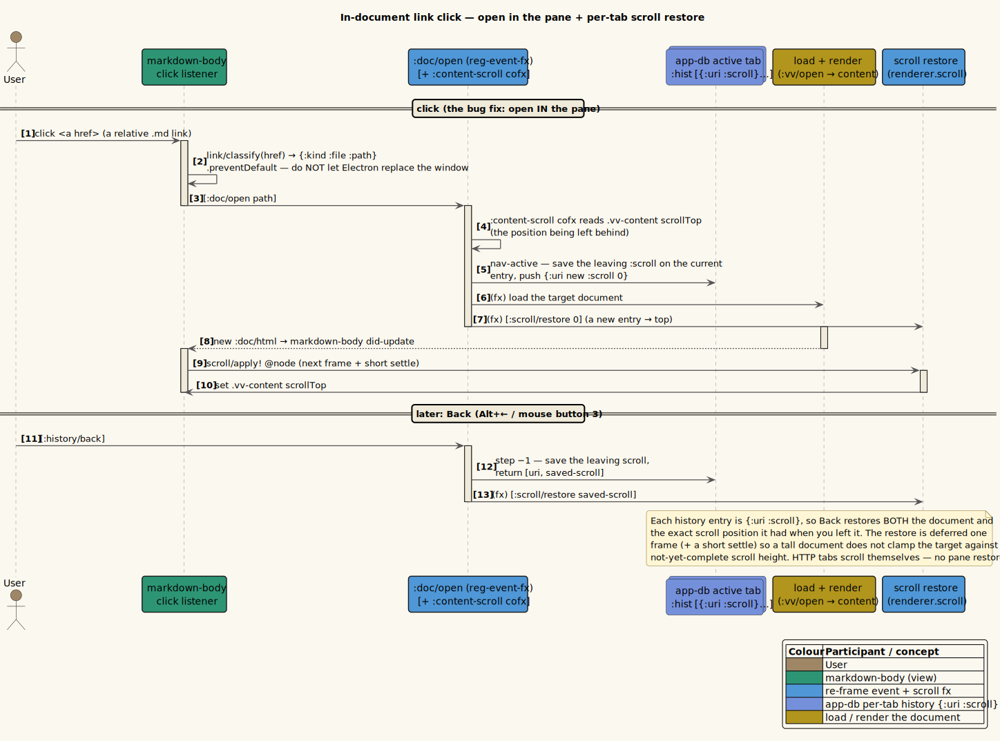

# Navigation history

**Status: Available now.**

Each tab owns its own browser-like history stack. Back/Forward act on the active
tab, restore the target URI, and restore the saved scroll position for that
history entry.

---

## 1. History entry shape

History entries are maps:

```clojure
{:uri "/abs/path/to/doc.md"
 :scroll 420}
```

A tab stores them as:

```clojure
{:hist {:stack [{:uri "/a.md" :scroll 0}
                {:uri "/b.md" :scroll 420}]
        :idx 1}}
```

`idx` identifies the current entry. Opening a new URI after stepping back
truncates entries after `idx`, just like a web browser.

---

## 2. User behavior

| Action | Input |
|--------|-------|
| Back | Toolbar Back, `Alt+Left`, or mouse back button. |
| Forward | Toolbar Forward, `Alt+Right`, or mouse forward button. |
| Open link in same tab | Left-click. |
| Open link in new tab | `Ctrl+click` or middle-click. |

Back/Forward are disabled when the active tab has no earlier/later entry.

---

## 3. Scroll capture and restore

Navigation events use a `:content-scroll` coeffect to read the current content
pane's `scrollTop` before leaving an entry. The target entry's saved scroll is
then restored after the destination content has rendered and figure sizing has
settled.

The important ordering is:

1. Save the leaving tab's current scroll.
2. Change the active tab/history entry.
3. Load local content if needed.
4. Apply scroll restore after layout, with a retry that skips if the user has
   already scrolled.

This keeps back/forward useful in long Markdown files with many embedded SVGs.

---

## 4. Event flow

| Event | Behavior |
|-------|----------|
| `:tab/navigate` | Navigate active tab to a URI and push a new `{uri, scroll}` entry. |
| `:tab/open` | Save current scroll, create a new active tab, and load its URI. |
| `:doc/open` | Focus an existing tab for the URI when possible, otherwise navigate active tab. |
| `:doc/open-new` | Focus an existing tab for the URI when possible, otherwise open a new tab. |
| `:history/back` | Step active tab history by `-1` and restore target scroll. |
| `:history/forward` | Step active tab history by `+1` and restore target scroll. |
| `:http/navigated` | Sync in-app HTTP view navigation into active tab history. |

Local-file destinations request `[:vv/open path]` and `[:scroll/restore n]`.
HTTP destinations are displayed in the main-owned web view and scroll themselves.

---

## 5. Retention effect

History affects file ownership. A local path in a background tab's back stack is
still retained, watched, and cached. After history or tab changes, the renderer
sends the complete retained local path set to main.

This is why Back can return to a prior local document without reviving a closed
watcher or reintroducing stale cache state.

---

## 6. Related diagram



*Diagram source: [`../diagrams/seq-link-click-scroll.puml`](../diagrams/seq-link-click-scroll.puml).*
