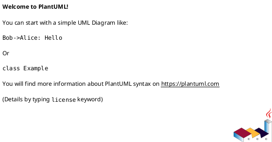

# Navigation history

**Status: Available now.**

---

## 1 · What it is

vinary-viewer keeps a **browser-style back/forward history** over the documents you visit. As you
open files and switch tabs, each navigation is recorded; the toolbar `←` / `→` buttons (and
`Alt+←` / `Alt+→`) walk you backward and forward through that trail. The semantics match a web
browser exactly, including the subtle rule that **navigating somewhere new after going Back
discards the forward branch** — you cannot "redo forward" to a path you abandoned by branching.

Conceptually this is the **Command pattern**: each navigation is a reified, replayable change to a
small history value `{:stack [...] :idx n}` in the re-frame app-db. Back/forward are just moves of
the index over a frozen stack; a new navigation appends (and truncates). The deeper rationale —
why navigation is modeled as commands over an explicit stack rather than, say, browser history —
is in [theory/07-command-history-model.md](../theory/07-command-history-model.md); this page walks
the code.

---

## 2 · How to use it

- **Go back:** click the toolbar **`←`** button, or press **`Alt+←`**.
- **Go forward:** click **`→`**, or press **`Alt+→`**.

The buttons are **disabled** when there is nowhere to go (you are at the start or end of the
trail).

**Example.** Open A, then open B, then open C (trail: A → B → C, you are on C). Press `Alt+←`
twice — you are back on A, with the forward branch B → C still available. Now open D: the trail
becomes A → D, and B → C are **gone** (the forward branch was truncated by the new navigation).
`→` is now disabled because D is the end of the trail.

---

## 3 · How it works internally

### The history value

The history lives in app-db (`src/vinary/app/db.cljs`):

```clojure
:history {:stack [] :idx -1}
```

- **`:stack`** — a vector of visited paths, oldest first.
- **`:idx`** — the index of the *current* entry within `:stack` (the path the active document
  corresponds to). It starts at `-1` (empty history, nothing current).

### Recording a navigation (with forward-branch truncation)

Every navigation goes through `record-nav` (`src/vinary/app/events.cljs`):

```clojure
(defn- record-nav
  "Push path onto the history if it differs from the current entry (truncating any forward branch)."
  [db path]
  (let [{:keys [stack idx]} (get-in db [:ui :history])]
    (if (= path (get stack idx))
      db
      (let [stack' (conj (vec (take (inc idx) stack)) path)]
        (assoc-in db [:ui :history] {:stack stack' :idx (dec (count stack'))})))))
```

Reading it carefully:

- **`(= path (get stack idx))` → `db`** — if you navigate to the path you are *already* on, nothing
  changes (no duplicate entry). `(get stack idx)` is the current entry; `(get stack -1)` is `nil`,
  so from an empty history any path is "new".
- **`stack' ≔ (conj (vec (take (inc idx) stack)) path)`** — the truncation. `(take (inc idx)
  stack)` keeps the stack up to and including the current entry, **dropping everything after it**
  (the forward branch). Then `path` is appended. This is exactly the browser rule: branching after
  Back forgets the abandoned future.
- **`:idx ≔ (dec (count stack'))`** — the new current index is the last element of the new stack
  (the path we just appended).

Worked example, matching the usage above. Start `{:stack [A B C] :idx 2}` (on C). Go back twice →
`{:stack [A B C] :idx 0}` (on A; **stack unchanged**, only `idx` moved — see below). Now navigate
to D: `idx` is `0`, so `(take 1 [A B C])` = `[A]`, then `(conj [A] D)` = `[A D]`, and `idx` becomes
`1`. Result `{:stack [A D] :idx 1}` — B and C are gone.

### Navigating *is* recording

The helper `nav-to` sets the active path and records, in one step:

```clojure
(defn- nav-to [db path]
  (-> db (assoc-in [:ui :active-path] path) (record-nav path)))
```

`nav-to` is called from the places that change which document is shown — receiving content
([feature 01](01-live-refresh.md)) and activating a tab ([feature 02](02-multi-tab-previews.md)):

```clojure
(rf/reg-event-db :tab/activate (fn [db [_ path]] (nav-to db path)))
;; …and inside :content/received: {:db (nav-to db path) …}
```

So opening a file or clicking a tab both feed the same history.

### Back and forward move the index over a frozen stack

```clojure
(rf/reg-event-db
 :history/back
 (fn [db _]
   (let [{:keys [stack idx]} (get-in db [:ui :history])]
     (if (and idx (pos? idx))
       (-> db (assoc-in [:ui :history :idx] (dec idx)) (assoc-in [:ui :active-path] (get stack (dec idx))))
       db))))

(rf/reg-event-db
 :history/forward
 (fn [db _]
   (let [{:keys [stack idx]} (get-in db [:ui :history])]
     (if (and idx (< idx (dec (count stack))))
       (-> db (assoc-in [:ui :history :idx] (inc idx)) (assoc-in [:ui :active-path] (get stack (inc idx))))
       db))))
```

- **Back** is allowed only when `(pos? idx)` (there is an earlier entry). It decrements `idx` and
  sets the active path to `(get stack (dec idx))`. The **stack is not modified** — going back is a
  pure index move, which is what *preserves* the forward branch until you branch.
- **Forward** is allowed only when `(< idx (dec (count stack)))` (there is a later entry). It
  increments `idx` and re-points the active path.

Because back/forward set `:ui/active-path`, the content view re-derives via `:doc/active`
([feature 02](02-multi-tab-previews.md)) and shows the document at the new index.

### The buttons reflect availability

`src/vinary/app/subs.cljs` exposes whether back/forward are possible:

```clojure
(rf/reg-sub :history/can-back?
            (fn [db _] (let [{:keys [idx]} (get-in db [:ui :history])] (boolean (and idx (pos? idx))))))
(rf/reg-sub :history/can-forward?
            (fn [db _] (let [{:keys [stack idx]} (get-in db [:ui :history])]
                         (boolean (and idx (< idx (dec (count stack))))))))
```

The toolbar disables each button accordingly (`src/vinary/ui/views.cljs`):

```clojure
(defn toolbar []
  (let [… back? @(rf/subscribe [:history/can-back?])
            fwd?  @(rf/subscribe [:history/can-forward?])]
    [:div.vv-toolbar
     [:button.vv-nav-btn {:disabled (not back?) :title "Back (Alt+←)"
                          :on-click #(rf/dispatch [:history/back])} "←"]
     [:button.vv-nav-btn {:disabled (not fwd?) :title "Forward (Alt+→)"
                          :on-click #(rf/dispatch [:history/forward])} "→"]
     …]))
```

And the global key handler maps `Alt+←` / `Alt+→` to the same events
(`src/vinary/renderer/core.cljs`, shown in [feature 05](05-in-page-find.md#the-find-bar-view-and-its-events)):

```clojure
(.-altKey e)
(case (.-key e)
  "ArrowLeft"  (do (.preventDefault e) (rf/dispatch [:history/back]))
  "ArrowRight" (do (.preventDefault e) (rf/dispatch [:history/forward]))
  nil)
```

---

## 4 · Design notes / trade-offs

- **Why an explicit stack in app-db rather than the browser's history API?** vinary-viewer's
  "navigation" is *document* navigation within a single renderer page, not URL navigation. An
  explicit `{:stack :idx}` value is simple, inspectable (visible in re-frame-10x/re-frisk), and
  replayable — the Command-pattern shape — and it does not entangle document history with
  Electron/Chromium page history. See [theory/07](../theory/07-command-history-model.md).
- **Why truncate the forward branch on a divergent navigation?** It matches the universally-learned
  browser model: after going Back and then going somewhere new, the old forward path is abandoned.
  Keeping it would create a tree the linear `←`/`→` buttons could not represent unambiguously.
- **Why dedupe consecutive same-path navigations?** Re-receiving content for the *current* document
  (a live-refresh re-send, [feature 01](01-live-refresh.md)) calls `nav-to` with the path you are
  already on; `record-nav` returns `db` unchanged, so live refresh does not spam the history with
  duplicates.
- **Trade-off — unbounded stack.** The stack grows with each distinct navigation for the session.
  For an interactive previewer this is negligible; a bounded ring-buffer is a possible refinement
  if very long sessions become a concern.

The history value is ephemeral `app-db` state (not DataScript), per
[ADR-0008 DataScript + app-db split](../design-decisions/0008-datascript-plus-app-db-split.md); the
Command-pattern model is developed in [theory/07](../theory/07-command-history-model.md). See the
[ADR index](../design-decisions/README.md) for the full list.

---

## 5 · Diagrams

- **Sequence — back / forward / branch:** [`../diagrams/seq-history.puml`](../diagrams/seq-history.puml)
  (written by the theory pillar). `nav-to` (append + truncate) · `:history/back` (idx−1) ·
  `:history/forward` (idx+1) · the disabled-button subscriptions.
- **Object — the stack evolving (A → B → C → back → D):**
  [`../diagrams/object-history-stack.puml`](../diagrams/object-history-stack.puml) (owned by this
  pillar). Snapshots of `{:stack :idx}` through each operation, showing the forward branch being
  truncated on the divergent navigation to D.



Palette: **blue-violet** = the app-db history snapshots, **purple** arrows = a forward navigation
(`record-nav` appends), **blue** arrows = a back/forward index move, **red** = the divergent
navigation that truncates. See [`../diagrams/_vv-theme.iuml`](../diagrams/_vv-theme.iuml).

---

## Per-tab history + scroll restore (new this round)

History is **per tab** (each tab in `nav.cljs` owns its own `{:stack :idx}`), and each stack entry is now
`{:uri :scroll}` rather than a bare URI — so back/forward restore **both the document and where you were
scrolled in it**. The leaving scroll position is captured at navigation time (a `:content-scroll` cofx
reads `.vv-content`'s `scrollTop`), and the destination's saved position is re-applied after the new
document lays out (one frame + a short settle, to avoid clamping against a not-yet-complete height).

Three related fixes ship alongside:

- **Clicking a link** in a rendered Markdown document now opens the target **in the preview pane** —
  in-page for `#anchors`, the same tab for files/URLs, a new tab on `Ctrl`/middle-click — instead of letting
  Electron replace the whole window with raw page source. This restores the per-tab history that
  `Alt+←/→` traverse. The hovered link's URL appears **bottom-left**, like a browser's status bar.
- **Mouse thumb buttons** — button 3 → Back, button 4 → Forward (a capture-phase `mousedown` listener that
  `preventDefault`s Chromium's own navigation).
- **A web (HTTP) tab** still scrolls itself; the content-pane restore is requested only for local files.

**Diagram — link click → in-pane open + scroll restore:**
[`../diagrams/seq-link-click-scroll.puml`](../diagrams/seq-link-click-scroll.puml). The click is intercepted
(`link/classify` + `.preventDefault`), the `:content-scroll` cofx captures the leaving `scrollTop`, the new
entry pushes `{:uri :scroll 0}`, and `scroll/apply!` restores the destination position after layout; Back
mirrors it by restoring the entry's saved scroll.

```plantuml
'' Source: docs/diagrams/seq-link-click-scroll.puml
'' Render to SVG with:  plantuml -tsvg docs/diagrams/seq-link-click-scroll.puml
```

Palette: **tan** = the User, **teal** = the `markdown-body` view, **blue** = the re-frame event + scroll fx,
**blue-violet** = the per-tab history entries `{:uri :scroll}`, **amber** = loading/rendering the document.
See [`../diagrams/_vv-theme.iuml`](../diagrams/_vv-theme.iuml).
