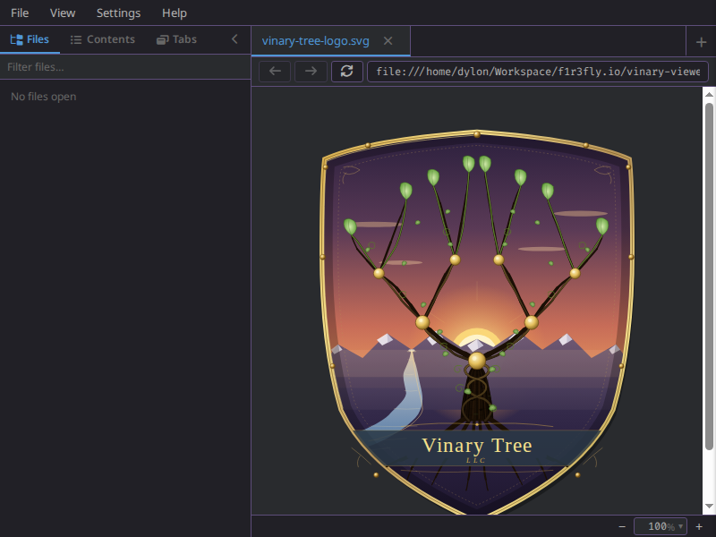
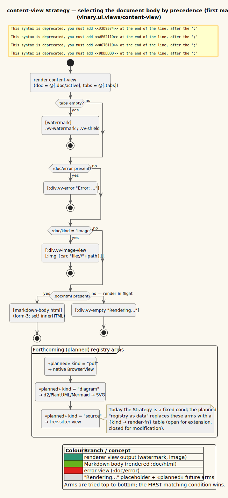

# Image view



*An image rendered directly in the preview pane.*

**Status: Available now.**

---

## 1 · What it is

vinary-viewer previews **image files** — PNG, JPEG, GIF, SVG, WebP, BMP, ICO, AVIF — by rendering
them directly with an `` element pointed at the file via a `file://` URL. Images take a
*different path* through the system than text documents: because an image is binary, the main
process does **not** read it as UTF-8 (which would corrupt it) and sends **no text** — only the
path and kind. The renderer recognizes the image kind and loads the bytes itself, straight from
disk, through the browser's native image loader. Image previews also live-refresh: edit the image
file and the preview updates ([feature 01](01-live-refresh.md)).

---

## 2 · How to use it

1. Open an image, e.g. `vv assets/diagram.png`, or click an image file in the
   [git file-tree sidebar](04-git-file-tree-and-filter.md).
2. The image is shown centered at the top of the content area, scaled down to fit the width if
   larger than the pane.
3. Edit and save the image in an external tool; the preview re-renders with the new content.

**Recognized extensions:** `.png`, `.jpg`/`.jpeg`, `.gif`, `.svg`, `.webp`, `.bmp`, `.ico`,
`.avif` (case-insensitive). Anything not matching the image or Markdown patterns is treated as
plain text instead ([feature 09](09-markdown-rendering.md) covers the text fallback).

---

## 3 · How it works internally

### MAIN: classify as image, send no text

The kind is decided from the extension in `src/vinary/main/service.cljs`:

```clojure
(defn- kind-of [^String path]
  (let [lower (str/lower-case path)]
    (cond
      (re-find #"\.(md|markdown|mdx)$" lower)                     "markdown"
      (re-find #"\.(png|jpe?g|gif|svg|webp|bmp|ico|avif)$" lower) "image"
      :else                                                      "text")))
```

`send-content!` then takes the **image branch**, which sends only `{:path :kind}` — *no* `:text`:

```clojure
(defn- send-content! [^js wc path]
  (let [kind (kind-of path)]
    (if (= kind "image")
      ;; images are binary — don't read as text; the renderer displays them by file:// path.
      (.send wc "vv:content" (clj->js {:path path :kind kind}))
      (try
        (let [text (.readFileSync fs path "utf8")]
          (.send wc "vv:content" (clj->js {:path path :kind kind :text text})))
        (catch :default e
          (.send wc "vv:error" (clj->js {:path path :message (.-message e)})))))))
```

Why no text: reading binary image bytes as a UTF-8 string would mangle them, and there is no need —
the renderer can load the file by path. So the image branch deliberately omits `:text`, and the
`else` branch (Markdown/text) is the only one that reads the file.

### RENDERER: store with nil-as-absence

The `:content/received` handler (walked fully in [feature 01](01-live-refresh.md)) only `assoc`es
`:doc/text` **when text is present**:

```clojure
base (cond-> {:doc/path path :doc/kind kind :doc/open? true :doc/order order}
       text (assoc :doc/text text))
```

For an image, `text` is `nil`, so `:doc/text` is simply not in the transaction. This is the
**nil-as-absence** convention (DataScript rejects `nil` attribute values, so "no value" is
expressed by *omitting the key*). The image's `:doc` therefore has `:doc/kind "image"` and a
`:doc/path`, but **no `:doc/text` and no `:doc/html`** — and that absence is exactly what the
content-view Strategy keys on.

Also note: there is **no** `:markdown/render` effect for images. In `:content/received`, the render
effect is added only for `markdown` (and a `<pre>` transact only for `text`):

```clojure
:fx (cond-> [[:ds/transact tx]]
      (= kind "markdown") (conj [:markdown/render …])
      (= kind "text")     (conj [:ds/transact [{:doc/path path :doc/html (plain-html text)}]]))
```

So an image doc never gains a `:doc/html`. It reaches the view as a doc with `:doc/kind "image"`
and no HTML.

### RENDERER: the Strategy's image branch

The content view (`src/vinary/ui/views.cljs`) is a `cond` Strategy keyed on the document; the image
branch fires when the kind is `"image"`:

```clojure
(defn content-view []
  (let [doc  @(rf/subscribe [:doc/active])
        tabs @(rf/subscribe [:tabs])]
    [:div.vv-content {:on-scroll (fn [^js e] (toc/spy! (.-currentTarget e)))}
     (cond
       (empty? tabs)               [watermark]
       (:doc/error doc)            [:div.vv-error "Error: " (:doc/error doc)]
       (= "image" (:doc/kind doc)) [:div.vv-image-view
                                    [:img {:src (str "file://" (:doc/path doc)) :alt (:doc/path doc)}]]
       (:doc/html doc)             [markdown-body (:doc/html doc)]
       :else                       [:div.vv-empty "Rendering…"])]))
```

The image branch builds `[:img {:src (str "file://" (:doc/path doc)) …}]`:

- **`(str "file://" (:doc/path doc))`** — a `file://` URL to the absolute path. The browser's image
  loader fetches the bytes from disk directly; vinary-viewer does not read or base64-encode the
  image itself. The `:alt` is the path, for accessibility and as a fallback if the image fails to
  load.
- **Branch order matters.** `(:doc/error doc)` is checked *before* the image branch, so a failed
  load surfaces as an error view rather than a broken image. The image branch is checked *before*
  `(:doc/html doc)`, so an image (which has no HTML) is never mistaken for a rendered document.

The styling centers the image and scales it to the pane (`resources/public/css/app.css`):

```css
.vv-image-view { display: flex; justify-content: center; align-items: flex-start; }
.vv-image-view img { max-width: 100%; height: auto; }
```

`max-width: 100%` caps the image at the pane width; `height: auto` preserves aspect ratio.

### Live refresh for images

The same watcher spine applies. MAIN watches the image path; on `change`/`add` it calls
`send-content!`, which re-sends `{:path :kind "image"}`. The `:content/received` upsert re-touches
the same `:doc` (identity by `:doc/path`), the `:doc/active` sub recomputes, and the ``'s
`:src` is the same `file://` URL — the browser reloads the changed bytes. (For cache-busting edge
cases where the URL is byte-identical, the browser typically reloads on the underlying file change;
a future enhancement could append a cache-busting query if needed — noted as a possible refinement.)

---

## 4 · Design notes / trade-offs

- **Why `file://` instead of reading + data-URI?** Loading by `file://` lets the browser's native,
  optimized image pipeline handle decoding and scaling, keeps large images out of the IPC channel
  and out of DataScript, and keeps MAIN from reading binary it does not need. The renderer has
  filesystem read access for `file://` resources within the Electron window.
- **Why send no `:text` for images?** It is both *correct* (binary must not be read as UTF-8) and
  *cheaper* (no file read, no large string crossing IPC). The nil-as-absence convention then makes
  "image" a doc that is recognizable purely by the *absence* of text/HTML plus `:doc/kind`.
- **Why is the error branch before the image branch?** So a missing/unreadable image shows a clear
  error rather than a silently broken ``.
- **Trade-off — `file://` security posture.** Loading local files by `file://` in the renderer is
  acceptable for a local previewer but is part of the broader security model (contextIsolation, no
  nodeIntegration, recommended CSP). See [security/threat-model.md](../security/threat-model.md).

Recorded in [ADR-0005 DataScript nil-as-absence](../design-decisions/0005-datascript-nil-as-absence.md)
(an image is recognized by the *absence* of `:doc/text`/`:doc/html`) and
[ADR-0009 Mediator IPC over point-to-point](../design-decisions/0009-mediator-ipc-over-point-to-point.md)
(images cross the seam with no `:text`). See the [ADR index](../design-decisions/README.md) for the
full list.

---

## 5 · Diagram

- **Activity — content strategy (image branch):** [`../diagrams/activity-content-strategy.puml`](../diagrams/activity-content-strategy.puml)
  (written by the architecture pillar). The decision flow `empty? → error? → image? → html? → else`,
  following the **image** path: classify image → no text read → store doc without `:doc/text` →
  Strategy picks ``.



Palette: **slate** = MAIN (classification, no read), **amber** = the IPC seam (`vv:content`
without `:text`), **purple** = DataScript (the textless `:doc`), **teal** = the renderer (the
``). See [`../diagrams/_vv-theme.iuml`](../diagrams/_vv-theme.iuml).
