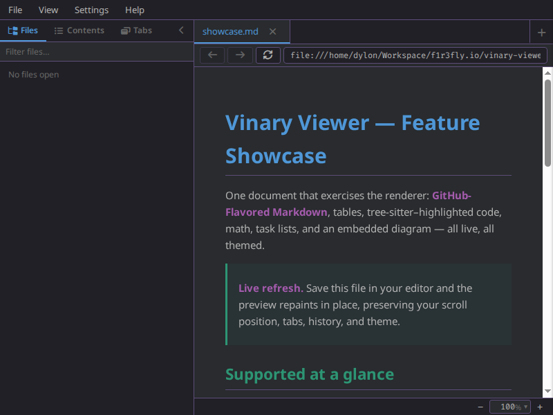
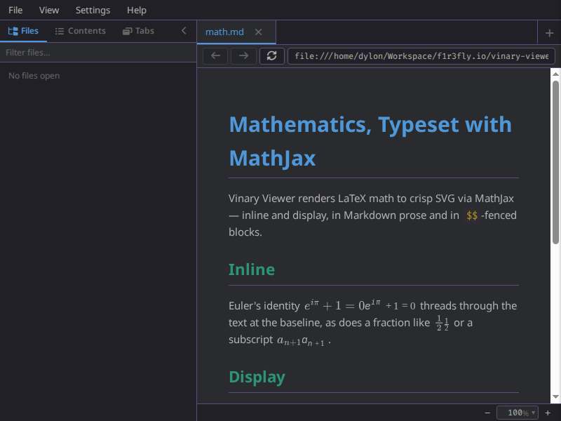
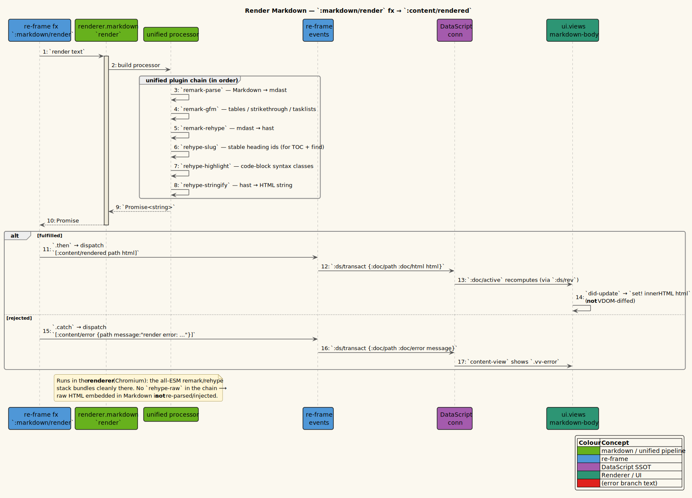

# Markdown rendering



*GitHub-Flavored Markdown: tables, highlighted code, math, and figures.*



*MathJax-typeset inline and display math.*

**Status: Available now.**

---

## 1 · What it is

vinary-viewer renders **GitHub-Flavored Markdown** to HTML using the
[unified](https://unifiedjs.com/) / [remark](https://github.com/remarkjs/remark) /
[rehype](https://github.com/rehypejs/rehype) ecosystem: tables, task lists, and strikethrough
(GFM); stable `id`s on every heading (so the [scroll-spy TOC](10-scroll-spy-toc.md) and in-document
links work); syntax highlighting on fenced code blocks; GitHub-compatible math rendered to MathJax
SVG; and Mermaid diagrams rendered inline from fenced code blocks. The rendered HTML is themed entirely
through CSS variables, so Markdown re-colors with the active theme
([feature 06](06-themes-and-live-switching.md)) — including code, which is highlighted with
highlight.js token classes that map onto the `--vv-*` palette.

Rendering runs **asynchronously in the renderer** (the all-ESM remark stack bundles cleanly for the
browser target) and is wired as a re-frame effect, so it composes with the live-refresh spine: a
file change re-renders and the new HTML flows back into the document.

---

## 2 · How to use it

1. Open a Markdown file: `vv README.md` (extensions `.md`, `.markdown`, `.mdx`).
2. The rendered document appears in the content area; headings, tables, lists, blockquotes, links,
   inline code, and fenced code blocks are all styled by the active theme.
3. Fenced code blocks with a language hint (e.g. ```` ```clojure ````) are syntax-highlighted.
4. Write inline math with `$x^2$`, display math with `$$...$$`, fenced math with
   ```` ```math ```` blocks, or GitHub's backtick-dollar escape form such as ``$`x^2`$``.
5. Write Mermaid diagrams with ```` ```mermaid ```` fenced blocks.
6. Edit and save; the preview re-renders in place ([feature 01](01-live-refresh.md)).

**Example.** A code block like:

````markdown
```clojure
(defn greet [name] (str "Hello, " name))
```
````

renders as a highlighted `<pre><code class="hljs language-clojure">…</code></pre>`, with keywords,
strings, and symbols colored from the theme palette.

Math renders before the HTML is inserted into the preview body:

```markdown
Euler's identity: $e^{i\pi} + 1 = 0$

$$
\frac{a}{b}
$$
```

The renderer converts each expression to an SVG `<mjx-container>` through MathJax and keeps a bounded
cache keyed by display mode and TeX source. This avoids a post-DOM "typeset after insertion" pass.

Mermaid diagrams render from Markdown fences:

````markdown

````

The generated SVG replaces the original fenced block before `markdown-body` receives the final HTML.
If a diagram cannot parse, the preview shows an inline error block with the original diagram source.

Badge rows follow GitHub's paragraph behavior. A paragraph containing several linked or unlinked
badge images keeps them inline; a paragraph containing one standalone image still centers it as a
figure.

> **Raw embedded HTML is rendered — sanitized.** The pipeline runs `rehype-raw` + `rehype-sanitize`
> (GitHub's `hast-util-sanitize` allowlist), so literal HTML in a Markdown file renders like GitHub —
> ``, tables, `<details>`/`<summary>`, `<sub>`/`<sup>`, etc. — while `<script>`, `on*` handlers,
> `javascript:` URLs, `<iframe>`, and `<style>` are stripped. See Design notes and
> [security/threat-model.md](../security/threat-model.md).

---

## 3 · How it works internally

### The unified pipeline

`src/vinary/renderer/markdown.cljs` builds the pipeline and returns a
`Promise<{:html string :toc vector :assets vector}>`:

```clojure
(ns vinary.renderer.markdown
  (:require ["unified" :refer [unified]]
            ["remark-parse$default"     :as remark-parse]
            ["remark-gfm$default"       :as remark-gfm]
            ["remark-math$default"      :as remark-math]
            ["remark-rehype$default"    :as remark-rehype]
            ["rehype-slug$default"      :as rehype-slug]
            ["rehype-highlight$default" :as rehype-highlight]
            ["rehype-stringify$default" :as rehype-stringify]
            [vinary.renderer.math :as math]
            [vinary.renderer.mermaid :as mermaid]
            [vinary.renderer.syntax :as syntax]))

(defn render [^String md]
  (-> (unified)
      (.use remark-parse)
      (.use remark-gfm)
      (.use remark-math)
      (.use remark-rehype)
      (.use rehype-slug)
      (.use rehype-highlight)
      (.use rehype-stringify)
      (.process (math/normalize-github-math-escapes md))
      (.then (fn [file] (math/render-html-math (str file))))
      (.then mermaid/render-html-diagrams)
      (.then syntax/highlight-html-code-blocks)))
```

The plugins run in this **exact order**, each doing one job:

1. **`remark-parse`** — parses the Markdown source string into an **mdast** (Markdown Abstract
   Syntax Tree). *mdast* is the remark AST: a tree of nodes like headings, paragraphs, lists, code.
2. **`remark-gfm`** — adds **GitHub-Flavored Markdown** extensions to the mdast: tables, task-list
   checkboxes, strikethrough, autolinks, and footnotes.
3. **`remark-math`** — adds math nodes for inline `$...$`, display `$$...$$`, and fenced `math`
   blocks. GitHub's backtick-dollar escape form is normalized before parsing.
4. **`remark-rehype`** — transforms the Markdown tree (mdast) into an HTML tree (**hast**, the
   HTML Abstract Syntax Tree). This is the bridge from "Markdown structure" to "HTML structure".
5. **`rehype-slug`** — walks the hast and gives every heading (`h1`–`h6`) a stable, URL-safe `id`
   derived from its text. These ids are what the [TOC](10-scroll-spy-toc.md) targets and what
   in-document anchor links point to.
6. **`rehype-highlight`** — applies [highlight.js](https://highlightjs.org/) to fenced code blocks,
   wrapping tokens in `hljs-*` classes (e.g. `hljs-keyword`, `hljs-string`). It adds classes only;
   the *colors* come from CSS (below).
7. **`rehype-stringify`** — serializes the hast back into an HTML **string**.
8. **MathJax postprocess** — replaces `remark-math` placeholders with cached MathJax SVG.
9. **Mermaid postprocess** — replaces Mermaid fenced-code blocks with SVG diagrams.
10. **Tree-sitter fenced-code postprocess** — replaces known fenced code with the shared source
    grammar highlighter where a tree-sitter grammar is registered.

`.process md` runs the chain asynchronously and yields a vfile; `(.then (fn [file] (str file)))`
extracts the HTML string. The `$default` interop suffix (`"remark-parse$default"`) imports each
package's ESM default export under shadow-cljs.

The math and Mermaid postprocessors parse the generated HTML with `DOMParser`, replace only the
specific placeholder nodes they own, and serialize the body back to a string. The final preview still
arrives at `markdown-body` as one HTML string.

### Wired as an async effect

The render is invoked as a re-frame effect from `src/vinary/app/fx.cljs`, so the async work happens
at the edge and the result is dispatched back into the loop:

```clojure
(rf/reg-fx
 :markdown/render
 (fn [{:keys [text path stamp on-done]}]
   (-> (md/render text (md/dir-of path) stamp)
       (.then (fn [result] (rf/dispatch (conj on-done result))))
       (.catch (fn [e] (rf/dispatch [:content/error {:path path :message (str "render error: " (.-message e))}]))))))
```

- **`.then` → `(conj on-done result)`** — on success, dispatch the `on-done` event vector with the
  render result appended. In `:content/received`, `on-done` is `[:content/rendered path stamp]`, so
  the dispatch becomes `[:content/rendered path stamp {:html ... :toc ... :assets ...}]`.
- **`.catch` → `[:content/error …]`** — a render failure becomes a recoverable error state (shown
  by the content-view's error branch), not a crash.

This effect is added only for the `markdown` kind in `:content/received`
([feature 01](01-live-refresh.md)):

```clojure
:fx (cond-> [[:ds/transact tx]]
      (= kind "markdown") (conj [:markdown/render {:text text
                                                   :path path
                                                   :stamp stamp
                                                   :on-done [:content/rendered path stamp]}]))
```

### The HTML is transacted onto the document

`:content/rendered` writes the HTML, TOC metadata, and embedded asset list onto the cached document,
but only when the completed render's stamp still matches the current document stamp:

```clojure
(rf/reg-event-fx
 :content/rendered
 (fn [_ [_ path stamp {:keys [html toc assets]}]]
   (let [snap (ds/snapshot)]
     (when-let [eid (ds/eid-for-path snap path)]
       (when (= stamp (ds/doc-attr snap path :doc/stamp))
         {:fx [[:ds/transact [[:db/add eid :doc/html html]
                               [:db/add eid :doc/toc (vec toc)]
                               [:db/add eid :doc/assets (vec assets)]]]
               [:vv/watch-assets {:doc-path path :paths assets}]]})))))
```

That transaction bumps `:ds/rev`, the `:doc/active` subscription recomputes, and the content view
shows the new HTML.

### The body is written imperatively (not VDOM-diffed)

The content-view's `(:doc/html doc)` branch renders `markdown-body`, a reagent **form-3** component
whose single DOM node's `innerHTML` tracks the HTML, set via a ref on mount and update
(`src/vinary/ui/views.cljs`):

```clojure
(defn- set-inner! [^js node html]
  (when node (set! (.-innerHTML node) (or html ""))))

(defn markdown-body [_html]
  (let [node (atom nil)]
    (r/create-class
     {:display-name "vv-markdown-body"
      :component-did-mount  (fn [this] (set-inner! @node (second (r/argv this))))
      :component-did-update (fn [this] (set-inner! @node (second (r/argv this))))
      :reagent-render       (fn [_html] [:div.markdown-body {:ref (fn [el] (reset! node el))}])})))
```

Terms:

- **reagent form-3 / `create-class`** — a component with explicit React lifecycle methods. We need
  `did-mount`/`did-update` to imperatively set `innerHTML`.
- **`(second (r/argv this))`** — `r/argv` is the component's current argument vector; the second
  element is the `html` argument. Reading it in the lifecycle methods gets the latest HTML.
- **`set! (.-innerHTML node) html`** — assigns the HTML string into the node in one operation.
  **The document body is not reconciled by React**; it is a single managed node. This is what makes
  rendering cheap (no VDOM diff of a large document) and is also why [in-page find](05-in-page-find.md)
  paints over Ranges instead of mutating the body.

### Code highlighting is themed by CSS, not by the pipeline

`rehype-highlight` only assigns `hljs-*` classes; the actual colors are mapped to the `--vv-*`
palette in `resources/public/css/app.css`:

```css
.markdown-body { color: var(--vv-fg); line-height: 1.6; max-width: 980px; }
.markdown-body h1 { color: var(--vv-head1); }
.markdown-body h2 { color: var(--vv-head2); }
/* … */
.markdown-body code { background: var(--vv-bg-code); color: var(--vv-head4); … }

/* highlight.js classes (rehype-highlight), Spacemacs palette */
.hljs { color: var(--vv-code); background: transparent; }
.hljs-comment, .hljs-quote { color: var(--vv-comment); font-style: italic; }
.hljs-keyword, .hljs-selector-tag, .hljs-tag { color: var(--vv-head1); }
.hljs-string, .hljs-doctag, .hljs-regexp { color: var(--vv-head2); }
.hljs-number, .hljs-literal, .hljs-symbol, .hljs-bullet { color: var(--vv-const); }
.hljs-variable, .hljs-template-variable, .hljs-type, .hljs-params { color: var(--vv-var); }
/* … */
```

So each highlight.js token class points at a theme token: keywords → `--vv-head1`, strings →
`--vv-head2`, numbers/literals → `--vv-const`, comments → `--vv-comment`, and so on. Switching
theme re-colors code along with everything else.

### The text fallback

A non-Markdown, non-image file (kind `"text"`) is not run through the pipeline; instead its content
is escaped and wrapped in a `<pre>` directly (`src/vinary/app/events.cljs`):

```clojure
(defn- plain-html [text]
  (str "<pre class=\"vv-plain\">" (gstr/htmlEscape (or text "")) "</pre>"))
```

- **`gstr/htmlEscape`** — `goog.string/htmlEscape`, which escapes `&`, `<`, `>`, `"` so the file's
  text is shown *as text*, never interpreted as HTML. This is the same store (`:doc/html`) the
  Markdown branch writes to, so the content-view renders both through `markdown-body`; `.vv-plain`
  styles the `<pre>` with `white-space: pre-wrap`.

---

## 4 · Design notes / trade-offs

- **Why unified/remark in the renderer?** The remark/rehype stack is all-ESM and browser-friendly,
  so it bundles cleanly into the `:browser` shadow-cljs build and runs where the result is needed
  (the renderer). It is also the same family of public libraries the previewer's predecessor used,
  so behavior is familiar. Running it in the renderer keeps MAIN a thin IO service.
- **Why `rehype-raw` + `rehype-sanitize`?** Raw HTML embedded in a Markdown file is parsed by
  `rehype-raw` and then sanitized by `rehype-sanitize` against GitHub's own allowlist
  (`hast-util-sanitize`'s `defaultSchema`), so hand-authored inline HTML renders like GitHub —
  ``, tables, `<details>`/`<summary>`, etc. — while `<script>`, `on*` handlers, `javascript:`
  URLs, `<iframe>`, and `<style>` are stripped. Sanitize runs right after `rehype-raw` and before the
  app's own trusted hast plugins, so its `file://`/`data-vv-*`/`id` additions survive; documented in the
  [threat model](../security/threat-model.md).
- **Why imperative `innerHTML` instead of hiccup/VDOM?** The pipeline already produces a complete
  HTML string; re-parsing it into hiccup to let React diff it would be wasteful for large documents
  and would complicate find. One managed node with `innerHTML` is simpler and faster, at the cost of
  opting that subtree out of React reconciliation (acceptable: the body is a leaf view).
- **Why highlight token classes → CSS variables?** It keeps *all* color in the theme layer, so code
  highlighting participates in live theme switching with zero pipeline involvement.

Recorded in [ADR-0002 render Markdown in the renderer](../design-decisions/0002-render-markdown-in-renderer.md)
and [ADR-0003 ref-`innerHTML` body, no VDOM](../design-decisions/0003-ref-innerHTML-no-vdom-body.md).
See the [ADR index](../design-decisions/README.md) for the full list.

---

## 5 · Diagram

- **Sequence — render a Markdown file:** [`../diagrams/seq-markdown-render.puml`](../diagrams/seq-markdown-render.puml)
  (written by the architecture pillar). `:content/received` (markdown) → `:markdown/render` fx →
  `unified → parse → gfm → math → rehype → slug → highlight → stringify → MathJax → Mermaid` →
  `Promise<{:html :toc :assets}>` → `:content/rendered` →
  `[:ds/transact {:doc/html … :doc/toc … :doc/assets …}]` → `:doc/active` recompute →
  `markdown-body` `innerHTML`, with the `.catch → :content/error` branch shown.



Palette: **green** = the Markdown/unified pipeline, **blue** = the re-frame effect/events,
**purple** = DataScript (`:doc/html`), **teal** = the renderer body. See
[`../diagrams/_vv-theme.iuml`](../diagrams/_vv-theme.iuml).
