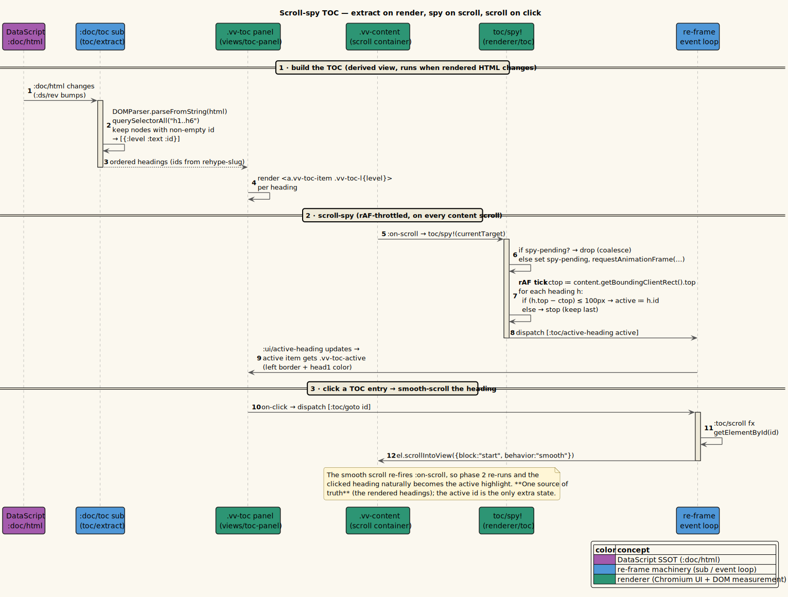

# Scroll-spy table of contents

**Status: Available now.**

---

## 1 · What it is

For a Markdown document with headings, vinary-viewer shows a **table of contents (TOC)** in a
right-hand panel and runs a **scroll-spy**: as you scroll, the TOC highlights the heading currently
at the top of the viewport, and clicking a TOC entry smooth-scrolls that heading to the top. The
TOC is a **derived view** — it is extracted from the *already-rendered* HTML (using the stable
heading ids that [Markdown rendering](09-markdown-rendering.md) added via `rehype-slug`) rather than
from a separate parse — so there is no second source of truth to keep in sync. The only extra state
is which heading is currently active.

---

## 2 · How to use it

1. Open a Markdown file containing headings. A **Contents** panel appears on the right, listing the
   headings, indented by level.
2. **Scroll** the document; the TOC entry for the heading at the top of the viewport highlights and
   updates as you go.
3. **Click** a TOC entry to smooth-scroll that heading to the top of the content area.

**Example.** Open this document. The right panel lists *Scroll-spy table of contents · 1 · What it
is · 2 · How to use it · …*, with sub-headings indented. As you scroll down to "3 · How it works
internally", that entry lights up; click "5 · Diagram" to jump there.

The panel only appears when the document actually has headings; image and plain-text documents have
none, so no panel shows.

---

## 3 · How it works internally

The TOC is two cooperating pieces: an **extract** (rendered HTML → list of headings) and a
**spy** (scroll → active heading), plus a click-to-scroll effect.

### Extract: parse headings out of the rendered HTML

`src/vinary/renderer/toc.cljs` parses the rendered HTML string into an ordered list of headings:

```clojure
(defn extract
  "Parse rendered HTML → ordered [{:level :text :id}] for h1–h6 (ids from rehype-slug)."
  [html]
  (when (and html (exists? js/DOMParser))
    (let [doc (.parseFromString (js/DOMParser.) html "text/html")
          hs  (.querySelectorAll doc "h1,h2,h3,h4,h5,h6")]
      (vec (for [i (range (.-length hs))
                 :let [h (aget hs i)]
                 :when (not= "" (.-id h))]
             {:level (js/parseInt (subs (.-tagName h) 1))
              :text  (.-textContent h)
              :id    (.-id h)})))))
```

Terms:

- **`DOMParser.parseFromString(html, "text/html")`** — builds a *detached* DOM document from the
  HTML string, **without** inserting it into the page. We can query it like any DOM, but it is a
  scratch parse used only to read structure — it never affects what is displayed.
- **`querySelectorAll "h1,h2,h3,h4,h5,h6"`** — all heading elements, in document order.
- **`:when (not= "" (.-id h))`** — keep only headings that have an `id`. Those ids were placed by
  `rehype-slug` during rendering ([feature 09](09-markdown-rendering.md)); they are the anchors the
  spy and the click-scroll target. A heading with no id (unusual) is skipped because it cannot be
  scrolled to.
- Each entry is `{:level :text :id}` where `:level` is the numeric heading level
  (`(js/parseInt (subs tagName 1))` turns `"H2"` into `2`).

`extract` is wrapped in a subscription, so the TOC is **derived from the active document's HTML**
(`src/vinary/app/subs.cljs`):

```clojure
(rf/reg-sub
 :doc/toc
 :<- [:doc/active]
 (fn [doc _] (toc/extract (:doc/html doc))))
```

Because `:doc/toc` depends on `:doc/active`, the TOC recomputes whenever the rendered HTML changes —
including a live-refresh re-render ([feature 01](01-live-refresh.md)). One source (`:doc/html`); the
TOC is a pure function of it.

### The TOC panel view

`toc-panel` in `src/vinary/ui/views.cljs` renders the headings, highlighting the active one:

```clojure
(defn toc-panel []
  (let [headings @(rf/subscribe [:doc/toc])
        active   @(rf/subscribe [:ui/active-heading])]
    (when (seq headings)
      [:div.vv-toc
       [:div.vv-toc-header "Contents"]
       [:div.vv-toc-list
        (for [{:keys [level text id]} headings]
          ^{:key id}
          [:a.vv-toc-item {:class    (str "vv-toc-l" level (when (= id active) " vv-toc-active"))
                           :on-click #(rf/dispatch [:toc/goto id])}
           text])]])))
```

- **`(when (seq headings) …)`** — no panel when there are no headings.
- **`vv-toc-l{level}`** — a per-level class that controls indentation (`.vv-toc-l1 … .vv-toc-l6`
  add increasing `padding-left` in `app.css`), so the TOC visually nests by heading depth.
- **`vv-toc-active`** — added to the entry whose `id` equals `:ui/active-heading`; it gets the head1
  color and a left border (see [reference/css-variables.md](../reference/css-variables.md)).
- **`:on-click → [:toc/goto id]`** — clicking an entry requests a scroll to that id.

### Spy: highlight the heading at the top of the viewport

The content scroll container fires the spy on scroll (`src/vinary/ui/views.cljs`):

```clojure
[:div.vv-content {:on-scroll (fn [^js e] (toc/spy! (.-currentTarget e)))} …]
```

`spy!` (`src/vinary/renderer/toc.cljs`) is **throttled with `requestAnimationFrame`** and finds the
last heading whose top is within `100 px` of the content area's top:

```clojure
(defonce ^:private spy-pending (atom false))

(defn spy! [^js content]
  (when-not @spy-pending
    (reset! spy-pending true)
    (js/requestAnimationFrame
     (fn []
       (reset! spy-pending false)
       (when-let [body (.querySelector content ".markdown-body")]
         (let [hs   (.querySelectorAll body "h1,h2,h3,h4,h5,h6")
               ctop (.. content getBoundingClientRect -top)
               active (loop [i 0 last-id nil]
                        (if (< i (.-length hs))
                          (let [h (aget hs i)]
                            (if (<= (- (.. h getBoundingClientRect -top) ctop) 100)
                              (recur (inc i) (.-id h))
                              last-id))
                          last-id))]
           (rf/dispatch [:toc/active-heading active])))))))
```

How it works:

- **rAF throttle.** `spy-pending` ensures at most one computation per animation frame: a burst of
  scroll events coalesces into a single `requestAnimationFrame` callback. **`requestAnimationFrame`**
  schedules work for just before the next repaint, so the spy never runs more often than the screen
  updates — keeping fast scrolling smooth.
- **`getBoundingClientRect().top`** — the viewport-relative top coordinate of an element. `ctop` is
  the content container's top; each heading's `top` is compared against it.
- **The scan.** Walking headings in order, while a heading's top is `≤ ctop + 100px` (i.e. it has
  scrolled to within 100 px of the content top, or above it), we remember it as `last-id`; the first
  heading that is *below* that line stops the scan. The result `active` is therefore the **last
  heading at or above the 100 px line** — exactly the section you are currently reading. The `100 px`
  offset is a small comfort margin so the active section flips slightly before a heading reaches the
  very top.
- **`dispatch [:toc/active-heading active]`** — records the active id, which re-renders the TOC with
  the new highlight.

The event simply stores it (`src/vinary/app/events.cljs`):

```clojure
(rf/reg-event-db
 :toc/active-heading
 (fn [db [_ id]] (assoc-in db [:ui :active-heading] id)))
```

### Click-to-scroll

Clicking a TOC entry dispatches `:toc/goto`, which fires the `:toc/scroll` effect:

```clojure
(rf/reg-event-fx
 :toc/goto
 (fn [_ [_ id]] {:fx [[:toc/scroll id]]}))
```

```clojure
(rf/reg-fx
 :toc/scroll
 (fn [id]
   (when-let [^js el (.getElementById js/document id)]
     (.scrollIntoView el #js {:block "start" :behavior "smooth"}))))
```

- **`getElementById id`** — finds the heading in the *live* document (the displayed body, not the
  detached extract parse) by the same rehype-slug id.
- **`scrollIntoView {block:"start", behavior:"smooth"}`** — smooth-scrolls it to the top of the
  content. That scroll re-fires `:on-scroll`, so the spy re-runs and the clicked heading naturally
  becomes the highlighted entry — the two halves close the loop without any extra coordination.

---

## 4 · Design notes / trade-offs

- **Why extract from rendered HTML instead of a separate Markdown parse?** The headings (and their
  ids) already exist in the rendered output; re-parsing the Markdown would duplicate work and risk
  the TOC's ids drifting from the body's ids. Deriving the TOC from `:doc/html` guarantees the TOC
  anchors and the body anchors are the *same* ids. This is single-source-of-truth applied to
  navigation within a document.
- **Why a detached `DOMParser` document for extraction?** It lets us read heading structure with
  ordinary DOM queries without mutating or measuring the live page. Measurement (for the spy) uses
  the *live* body via `getBoundingClientRect`; structure (for the list) uses the detached parse.
- **Why rAF-throttle the spy?** Scroll events fire far more often than the screen repaints.
  Coalescing to one computation per frame avoids redundant `getBoundingClientRect` reads (which can
  force layout) and keeps scrolling smooth. It is a deliberate performance choice.
- **Why the 100 px offset?** A small margin makes the active section switch feel natural (the next
  section becomes "current" as its heading approaches the top, not only once it is flush).
- **Trade-off — recompute the spy over all headings per frame.** For typical documents the number of
  headings is small and the per-frame scan is cheap; for an extremely heading-dense document an
  index/binary-search refinement is possible. Noted as a future optimization.

Recorded in [ADR-0008 DataScript + app-db split](../design-decisions/0008-datascript-plus-app-db-split.md)
(the active-heading is ephemeral `app-db` state; the TOC is a derived view over `:doc/html`). See the
[ADR index](../design-decisions/README.md) for the full list.

---

## 5 · Diagram

The full TOC flow — extract on render, spy on scroll, scroll on click — is illustrated by the
sequence diagram owned by this pillar: [`../diagrams/seq-toc.puml`](../diagrams/seq-toc.puml).



Palette: **purple** = DataScript (`:doc/html` the TOC derives from), **blue** = re-frame
sub/event loop, **teal** = the renderer (the panel, the DOM measurement, and the scroll). See
[`../diagrams/_vv-theme.iuml`](../diagrams/_vv-theme.iuml).
