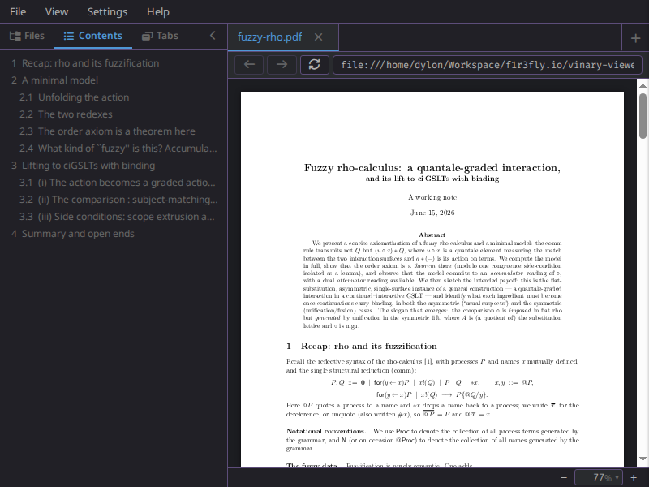

# PDF preview (in-renderer)

*A PDF rendered in-renderer via pdf.js, with its bookmarked outline.*

**Status: Available now.** *(Supersedes the original native-PDF view — see [ADR-0013](../design-decisions/0013-in-renderer-pdfjs.md).)*

---

## 1 · What it is

PDFs render **in the renderer DOM via [pdf.js](https://mozilla.github.io/pdf.js/)**, exactly like the
Markdown and source previews — not in a separate native viewer. Each page is drawn to a `<canvas>` with a
transparent **text layer** and a **link layer** overlaid, all inside the `.vv-content` scroller. Because
the document lives in the app's own DOM, a PDF behaves like every other document:

- **App keymap + smooth scrolling** — bare arrows, `j`/`k`, Space/PageDown, `g g`/`G`, etc.
- **In-page find** (`Ctrl+F`) across the whole document (text is materialized on demand).
- **Text selection + Copy** — select with the mouse, `Ctrl+C`, or right-click → **Copy** (the themed menu).
- **Zoom, fit & dark-invert** — the bottom **zoom bar** and the **View ▸ Fit** submenu (Fit Width / Fit
  Page / Actual Size) drive the pdf.js scale; see [feature 22](22-zoom-and-fit.md). **Bookmarks** are in
  the Contents tab.
- **Themes** — the page letterbox follows the active palette.
- **Progress + error feedback** — a heavy page (lots of vector/shading content) rasterizes on the main
  thread and can take a while; it shows a **"rendering…"** chip instead of looking frozen, and a page that
  fails to render shows a **click-to-retry** chip (and logs to the console) rather than a silent blank.

**Layout.** Unlike the Markdown reading gutter, a PDF renders **edge-to-edge** — the `.vv-content-pdf-flush`
class drops the L/R/bottom padding so pages fill the pane (no overflow off the right/bottom). A fit-mode
PDF (**Fit Width** / **Fit Page**) also **re-fits when the window resizes**, so the page size tracks the
window instead of staying frozen at its open-time size.

## 2 · How you use it

Open a `.pdf` file (CLI `vv report.pdf`, the file tree, or a link). Then:

| Action | Keys / UI |
|---|---|
| Scroll | arrows, `j`/`k`, Space / `Shift`+Space, Page keys, `Home`/`End` |
| Zoom in / out / reset | `Ctrl` `+` / `-` / `0`, or the bottom **zoom bar** (context-aware: zooms the PDF — [feature 22](22-zoom-and-fit.md)) |
| Fit width / page / actual size | **View ▸ Fit** (radio-marks the active mode); re-fits on window resize |
| Invert (dark PDF) | **View ▸ Invert PDF** (canvas only; text/selection stay normal) |
| Find | `Ctrl+F` |
| Copy selection | `Ctrl+C` or right-click ▸ Copy |
| Jump to a bookmark | **Contents** sidebar tab |

Fit-mode and invert persist across sessions (`settings.edn`). Editing a PDF on disk live-refreshes it.

## 3 · Internals

| Piece | Where |
|---|---|
| Bytes → renderer (over `vv:content`, `:kind "pdf" :bytes …`) | `vinary.main.service/send-content!` |
| Byte cache (keyed by `:doc/path`, **not** DataScript) + find hook | `vinary.renderer.pdf-cache` |
| Render engine (worker bootstrap, canvas/text/link layers, virtualization, zoom, outline) | `vinary.renderer.pdf` |
| Pure geometry/zoom/outline helpers (DOM-free, unit-tested) | `vinary.renderer.pdf-layout` |
| `pdf-view` Reagent component (mounts inside `.vv-content`) | `vinary.ui.views/pdf-view` |
| Edge-to-edge layout (`.vv-content-pdf-flush` drops the `.vv-content` gutter, keeping the scroller) | `vinary.ui.views/content-view` + `resources/public/css/app.css` |
| Window-resize re-fit (`ResizeObserver` on the scroller → debounced `refit!`; fit-mode PDFs only) | `vinary.renderer.pdf/observe-resize!` |
| Per-mount byte clone (no blank PDF after switching tabs away and back) | `vinary.renderer.pdf/mount!` (`(.slice bytes 0)`) |
| Per-page status chip ("rendering…" while a `RenderTask` is in flight; click-to-retry on a real render error, distinguished from a cancellation) | `vinary.renderer.pdf/render-page!` (`show-status!`/`clear-status!`) + `.vv-pdf-status*` in `app.css` |
| CPU-backed page canvas (`willReadFrequently`) + `backgroundThrottling false` — avoids a blank/stale GPU canvas that only paints on a forced repaint | `vinary.renderer.pdf/render-page!` + `vinary.main.core` renderer `webPreferences` |
| Generation epoch + deterministic visible-page re-render on resize/rescale (not reliant on an IntersectionObserver re-fire) | `vinary.renderer.pdf` (`:gen` guards, `render-visible!` via `pdf-layout/visible-range`) |
| pdf.js `isEvalSupported true` — JIT-compile a PDF's PostScript/Type-4 shading functions (large speedup on shaded/mesh figures) | `vinary.renderer.pdf/get-document` |
| Vendored worker + cmaps/fonts/wasm/iccs | `scripts/sync-pdfjs.mjs` → `resources/public/pdf/` |

The pdf.js module + worker are **vendored** (the legacy ES5 build) and loaded at runtime via a blob-URL
ESM `import()` — Closure `:simple` cannot bundle pdf.js's internal dynamic `import()`. Pages are
**preallocated** to exact heights (no scroll jank), rendered lazily by an `IntersectionObserver`, and
offscreen canvases are released to bound memory. See [ADR-0013](../design-decisions/0013-in-renderer-pdfjs.md)
for the full rationale, and the smoke coverage in `test/electron-smoke.js` (canvas + aligned text layer +
copy + find).

**Robustness — surviving a tab switch.** pdf.js *transfers* (detaches) the input byte buffer to its
worker on first load, which empties the renderer's copy. So re-mounting the same PDF — e.g. after
switching to another tab and back — handed the engine an empty buffer and rendered nothing (a blank
page). `mount!` now passes a fresh copy each time (`(.slice bytes 0)`), keeping the path-keyed cached
original pristine for every re-mount; the byte cache itself is untouched.

**Performance — heavy pages.** pdf.js parses on a worker but **rasterizes the page on the main thread**, so a
figure-dense page (mesh/Coons shadings, transparency groups, tens of thousands of path fills — common in
technical papers) can block for a while. `isEvalSupported true` lets pdf.js JIT-compile the PDF's
shading-color functions (a large constant-factor speedup over interpreting them — the renderer already
permits `unsafe-eval` and is sandboxed, see [ADR-0013](../design-decisions/0013-in-renderer-pdfjs.md) and the
[threat model](../security/threat-model.md)). While a page rasterizes it shows a **"rendering…"** chip
(deferred ~400 ms so a fast page never flashes it); a render that genuinely errors (as opposed to being
cancelled by a scroll-away or a re-fit) shows a **click-to-retry** chip and a `console.error`, so a slow or
failed page is never a silent blank.
