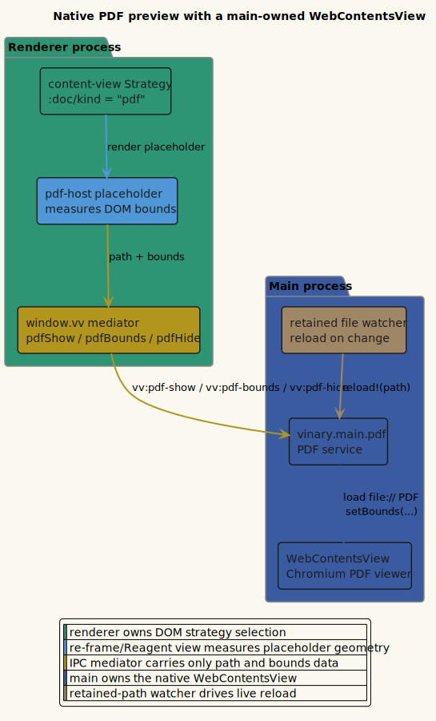

# Native PDF

**Status: Available now.**

---

## 1 · What it is

vinary-viewer previews **Portable Document Format (PDF)** files with Chromium's
built-in PDF viewer. The PDF surface is an Electron **`WebContentsView`** owned
by the main process and positioned over a renderer-owned placeholder element.

This is intentionally different from Markdown, image, and source previews:
those render inside the renderer's Document Object Model (DOM), while a PDF is a
native sibling surface. The renderer therefore measures where the PDF should sit
and sends those bounds to main over the `window.vv` mediator.

## 2 · How to use it

1. Open a `.pdf` file with `vv report.pdf`, `File > Open`, or the git file tree.
2. The PDF appears in the content area using Chromium's native viewer.
3. Edit or replace the PDF on disk; live-refresh reloads the native PDF view.

The PDF viewer is hidden when the active document is no longer a PDF.

## 3 · How it works internally

The file classifier maps `.pdf` to `:doc/kind = "pdf"` in
`vinary.main.file-kind/kind-of`. Main sends a `vv:content` message with the path,
kind, and stamp without reading the binary file as text.

```clojure
{:path "/abs/report.pdf"
 :kind "pdf"
 :stamp 1710000000000}
```

The renderer's Strategy branch in `vinary.ui.views/content-view` renders
`pdf-host`, a placeholder `div`. On mount and resize, `pdf-host` computes
`getBoundingClientRect()` and calls:

```text
window.vv.pdfShow(path, bounds)
window.vv.pdfBounds(bounds)
window.vv.pdfHide()
```

The preload mediator forwards those calls to main. `vinary.main.pdf` creates one
`WebContentsView`, attaches it to the window's `contentView`, loads
`file://<path>`, and keeps the native view bounds synchronized with the
placeholder.

Live refresh reuses the retained-file watcher model from
[live refresh](01-live-refresh.md). When main receives a file watcher event for
the PDF path, `vinary.main.pdf/reload!` reloads the view if that PDF is the one
currently shown.

## 4 · Design notes / trade-offs

- **Native quality.** Chromium's built-in PDF viewer handles rendering, zoom,
  selection, and PDF-specific behavior without a JavaScript PDF renderer.
- **Main owns the native view.** Keeping the native surface in the main process
  preserves the renderer's no-filesystem-access boundary.
- **Bounds synchronization is required.** Because `WebContentsView` is not a DOM
  node, the renderer must report placeholder bounds on mount and resize.
- **Retained-file lifetime.** The PDF path stays watched while it is reachable
  from any open tab history, and its watcher is released when it is no longer
  retained.

## 5 · Diagram

Source:
[`../diagrams/component-native-pdf.puml`](../diagrams/component-native-pdf.puml).


