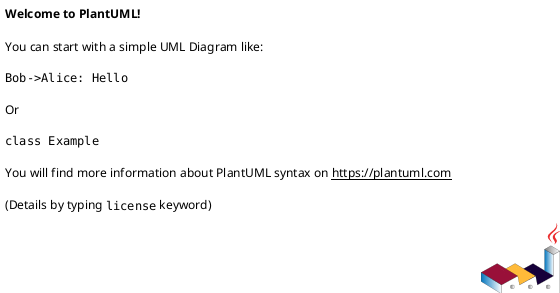

# Native PDF

**Status: «planned» (Forthcoming — designed, not yet built).**

> Nothing in this page is implemented yet. It documents the planned design so it can be built
> as specified and so the feature matrix is complete. Wherever it describes behavior, read it as
> *intended* behavior. The «planned» component diagram uses dashed-grey styling for every
> not-yet-built part.

---

## 1 · What it is

vinary-viewer will preview **PDF files natively**, using Chromium's built-in PDF viewer rather
than a JavaScript PDF library. The mechanism is an Electron **`BrowserView`**: a separate native
web surface, owned by the main process, navigated to the PDF's `file://` URL, and **positioned
precisely over the active tab's content area**. Because it is the real Chromium PDF viewer, it
brings native quality, zoom, search, and printing for free. Like every other document kind, the
PDF preview will **live-refresh**: editing the PDF on disk reloads the view.

This kind is *different* from Markdown/image/text in one structural way: those render *inside* the
renderer's DOM, but a `BrowserView` is a sibling native surface layered over the window. The
renderer therefore tells the main process where the PDF should sit (the bounds of a placeholder
element), and the main process keeps the native view aligned to it.

---

## 2 · How to use it (planned)

1. (Forthcoming) Open a `.pdf` file: `vv report.pdf`, or click a PDF in the
   [git file-tree](04-git-file-tree-and-filter.md).
2. The PDF renders in the content area using Chromium's native viewer (scroll, zoom, find,
   print).
3. Editing the PDF on disk reloads it in place.

`kind-of` in `src/vinary/main/service.cljs` will gain a `pdf` branch
(e.g. `(re-find #"\.pdf$" lower) → "pdf"`), and the renderer's content-view Strategy will gain a
`pdf` arm that renders a measured placeholder.

---

## 3 · How it will work internally (planned)

The mechanism follows directly from the existing architecture; only the pieces marked «planned»
are new.

### A placeholder in the renderer reports its bounds

The content-view Strategy ([feature 08](08-image-view.md) shows the existing `cond`) will gain a
`(= "pdf" (:doc/kind doc))` arm that renders an empty, sized placeholder div. On layout (mount,
resize, tab switch, scroll), it will measure itself with `getBoundingClientRect` and send those
bounds over the IPC seam — analogous to how the existing renderer talks to main only through
`window.vv` ([reference/ipc-channels.md](../reference/ipc-channels.md)).

### Main owns and positions the BrowserView

A new `PdfService` in the main process will:

1. Create a `BrowserView`, attach it to the `BrowserWindow`, and `loadURL` the PDF's `file://`.
2. On each bounds message from the renderer, call `setBounds({x, y, w, h})` so the native view
   tracks the placeholder exactly.
3. Watch the PDF file with the **same chokidar-per-path mechanism** as
   [live refresh](01-live-refresh.md); on change, `reload()` the view's `webContents`.
4. Tear the view down when the PDF tab closes (mirroring `service/close!`'s watcher release).

The new IPC additions (all «planned»): renderer→main `vv:pdf-bounds {x y w h}` and a
main→renderer `vv:pdf-reload` notification (or equivalent `window.vv.pdfBounds` /
`window.vv.onPdfReload` bridge methods). These will be specified in the IPC reference when built.

### Why a BrowserView rather than an `<embed>`/`<iframe>` in the renderer

A `BrowserView` is the natively-recommended way to host a top-level PDF in modern Electron (native
since Electron 9), with full viewer features. Hosting the PDF as a sibling surface keeps the
renderer's DOM (and its `innerHTML`-managed body, [feature 09](09-markdown-rendering.md)) simple;
the trade-off is the bounds-synchronization dance, which the placeholder + IPC bounds messages
handle.

---

## 4 · Design notes / trade-offs (planned)

- **Reuses the live-refresh spine.** The watcher-per-open-path model is unchanged; only the
  *action* on change differs (reload the BrowserView instead of re-rendering Markdown). No new
  watching machinery is needed.
- **Bounds synchronization is the cost.** Because the native view is not in the DOM flow, it must
  be repositioned whenever the placeholder moves (scroll/resize/tab change). This is the principal
  added complexity and the reason for the placeholder + `vv:pdf-bounds` channel.
- **Security.** The PDF is loaded from a local `file://` into a native viewer; this fits the
  existing posture (contextIsolation, no nodeIntegration) but the BrowserView's `webPreferences`
  must be locked down equivalently. To be detailed in [security/threat-model.md](../security/threat-model.md)
  when implemented.

Will be recorded in the ADR for content kinds / native surfaces; see the
[ADR index](../design-decisions/README.md).

---

## 5 · Forthcoming

This entire feature is forthcoming. Build order, when scheduled: `kind-of` pdf branch → renderer
placeholder + bounds reporting → `PdfService` (create/position/reload/teardown) → IPC channels →
live-refresh wiring → verification (headless render check). Tracked as project task **P3 — Native
PDF + diagrams**.

---

## 6 · Diagram

- **Component — BrowserView over the active tab («planned»):**
  [`../diagrams/component-native-pdf-planned.puml`](../diagrams/component-native-pdf-planned.puml)
  (owned by this pillar). Existing process frames are solid; the new `PdfService`, `BrowserView`,
  placeholder, and IPC bridge methods are dashed-grey «planned».

Palette: **slate** = MAIN (owns the BrowserView), **amber** = the IPC seam (bounds + reload),
**teal** = the renderer (the placeholder), **tan** = the reused file watcher, **dashed grey** =
«planned». See [`../diagrams/_vv-theme.iuml`](../diagrams/_vv-theme.iuml).
