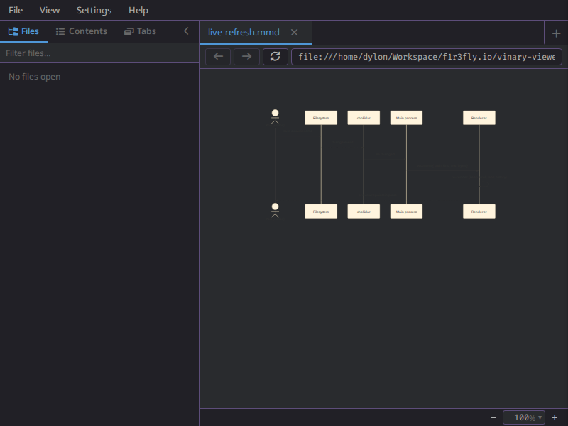

# Diagram rendering



*A Mermaid diagram rendered to inline SVG.*

**Status: Available now for Mermaid.**

Mermaid diagrams render inline from Markdown fences and from direct `.mmd` /
`.mermaid` files. Other diagram-as-code formats such as D2, PlantUML, and
Graphviz still open as source previews; generated SVGs from those tools can be
embedded in Markdown and are sized by the figure pipeline.

---

## 1 · What it is

vinary-viewer renders [Mermaid](https://mermaid.js.org/) source to **SVG** in
the Chromium renderer. Mermaid is available in two places:

- Markdown fenced code blocks with the `mermaid` language.
- Direct `.mmd` and `.mermaid` files classified as document kind `"mermaid"`.

This slots into the existing **Strategy renderer registry**
([theory/05-strategy-renderer-registry.md](../theory/05-strategy-renderer-registry.md)):
Markdown diagrams are a Markdown postprocess, while direct Mermaid files use a
dedicated content-view strategy.

---

## 2 · How to use it

In Markdown:

````markdown

````

As a direct file:

```text
flowchart LR
  A[Start] --> B[Done]
```

Save it as `flow.mmd` or `flow.mermaid`, then open it with `vv flow.mmd`.
The rendered SVG appears in the content pane and live refresh re-renders it when
the file changes.

---

## 3 · How it works internally

### Markdown fenced Mermaid

`vinary.renderer.markdown/render` runs the unified pipeline, stringifies the
HTML, then calls `vinary.renderer.mermaid/render-html-diagrams`. That
postprocessor finds `pre > code.language-mermaid` and
`pre > code.lang-mermaid`, calls Mermaid's browser renderer, and replaces the
whole fenced block with:

```html
<div class="vv-mermaid">...</div>
```

The diagram is therefore committed to `markdown-body` as part of the final HTML
string, not as a later DOM-side enhancement.

### Direct Mermaid files

`vinary.main.file-kind/kind-of` classifies `.mmd` and `.mermaid` as kind
`"mermaid"`. Main reads the file as text and sends it over `vv:content`. The
renderer's `content-view` mounts `vinary.ui.views/mermaid-view`, which calls
`vinary.renderer.mermaid/render-source` and writes the returned SVG into a
scrollable `.vv-mermaid-view` host.

### Live refresh

Mermaid files use the same **chokidar-per-path** mechanism as every open file
([feature 01](01-live-refresh.md)). On change, main re-sends the source text and
the Mermaid view renders a fresh SVG. Markdown files with Mermaid fences use the
normal Markdown render effect on each content update.

### Caching and errors

`vinary.renderer.mermaid` initializes Mermaid once and keeps a bounded cache from
diagram source to SVG. Parse/render failures become inline `.vv-mermaid-error`
blocks containing the error message and escaped source text.

---

## 4 · Design notes / trade-offs

- **Renderer-side Mermaid.** Mermaid ships a browser renderer, so it can run in
  the Chromium process without adding a new privileged IPC operation.
- **SVG output.** Rendering to SVG keeps diagrams crisp at any zoom and lets
  Mermaid choose its own accessible SVG structure.
- **Bounded cache.** Repeated views of the same source reuse SVG strings; the
  cache is bounded so long preview sessions do not grow without limit.
- **Scoped engine support.** This feature implements Mermaid. D2, PlantUML, and
  Graphviz source files remain source previews unless the user embeds generated
  SVGs in Markdown.
