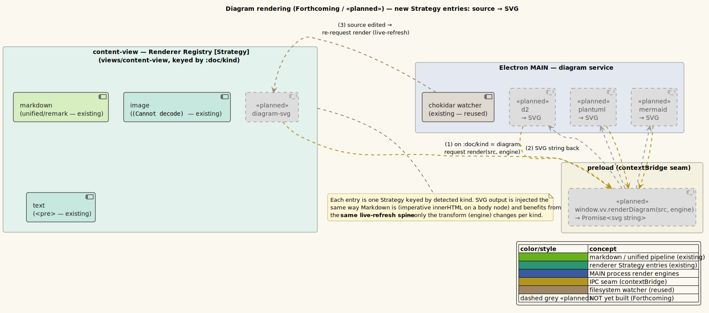

# Diagram rendering

**Status: «planned» (Forthcoming — designed, not yet built).**

> Nothing in this page is implemented yet. It documents the planned design so it can be built as
> specified and so the feature matrix is complete. Read described behavior as *intended*. The
> «planned» component diagram uses dashed-grey styling for every not-yet-built part.

---

## 1 · What it is

vinary-viewer will preview **diagram-as-code** files — [d2](https://d2lang.com/),
[PlantUML](https://plantuml.com/), and [Mermaid](https://mermaid.js.org/) — by rendering their
source to **SVG** and displaying the SVG in the content area. This slots into the existing
**Strategy renderer registry** ([theory/05-strategy-renderer-registry.md](../theory/05-strategy-renderer-registry.md))
as new entries keyed by diagram kind, and it inherits the **live-refresh spine**
([feature 01](01-live-refresh.md)): edit a diagram source and the rendered SVG updates in place.

The design parallels Markdown rendering ([feature 09](09-markdown-rendering.md)): a source string
becomes display markup (there, HTML; here, SVG), which is written into the content body — the only
difference is which engine performs the transform and that it runs in the main process.

---

## 2 · How to use it (planned)

1. (Forthcoming) Open a diagram source file (e.g. `architecture.d2`, `flow.puml`, `seq.mmd`).
2. The diagram renders as an SVG in the content area.
3. Edit and save the source; the SVG re-renders in place.

`kind-of` in `src/vinary/main/service.cljs` will gain a `diagram` classification (by extension,
with the engine recorded), and the content-view Strategy will gain a `diagram` arm.

---

## 3 · How it will work internally (planned)

### A new Strategy entry: `diagram` → SVG

The content-view `cond` ([feature 08](08-image-view.md) shows the current arms) will gain a branch
for the diagram kind that renders the produced SVG via the same imperative `innerHTML` body used
for Markdown ([feature 09](09-markdown-rendering.md)). The SVG is markup, so it composes with the
existing body model and with [in-page find](05-in-page-find.md) (which paints over Ranges and does
not mutate the body).

### Main renders source → SVG

Unlike Markdown (rendered in the renderer), diagram engines are best invoked in the **main**
process (they may shell out to `d2`/PlantUML or run a Node renderer). A new diagram service will
expose, over the IPC seam, something like
`window.vv.renderDiagram(source, engine) → Promise<svg-string>`. The renderer requests a render
for the active diagram doc; main returns the SVG string; the renderer transacts it onto `:doc/html`
(reusing the existing `:content/rendered`-style path) and the body displays it.

### Live refresh

The diagram source is watched with the **same chokidar-per-path** mechanism as every open file
([feature 01](01-live-refresh.md)); on change, the render is re-requested and the SVG updates.
Only the transform differs from Markdown; the spine is identical.

### Engine selection

The detected kind carries which engine to use (d2 / plantuml / mermaid), chosen by file extension.
Each is one entry in the diagram Strategy, so adding an engine is additive.

---

## 4 · Design notes / trade-offs (planned)

- **Reuses the renderer body + live-refresh.** SVG is injected exactly like rendered Markdown HTML,
  so no new display mechanism is needed; the live-refresh watcher is reused with a different action.
- **Engines run in main.** Diagram toolchains (especially d2/PlantUML) are not browser-native;
  running them in main keeps heavy/native rendering off the UI thread and out of the renderer
  bundle. The cost is an async IPC round-trip per render, mirroring the async Markdown fx.
- **SVG, not raster.** Rendering to SVG keeps diagrams crisp at any zoom and themeable in principle.
- **Security.** SVG can carry script; the rendered output should be sanitized (or the engine
  configured to emit script-free SVG) before injection. To be detailed in
  [security/threat-model.md](../security/threat-model.md) when implemented. This mirrors the
  no-`rehype-raw` stance for Markdown ([feature 09](09-markdown-rendering.md)).

Will be recorded in the renderer-registry / content-kinds ADR; see the
[ADR index](../design-decisions/README.md).

---

## 5 · Forthcoming

This entire feature is forthcoming. Build order, when scheduled: `kind-of` diagram branch (+ engine)
→ main diagram service (d2/plantuml/mermaid → SVG) → IPC `renderDiagram` channel → renderer Strategy
arm + transact SVG → live-refresh wiring → sanitization → verification. Tracked as project task
**P3 — Native PDF + diagrams**.

---

## 6 · Diagram

- **Component — diagram Strategy entries («planned»):**
  [`../diagrams/component-diagram-rendering-planned.puml`](../diagrams/component-diagram-rendering-planned.puml)
  (owned by this pillar). Existing Strategy entries (markdown/image/text) are solid; the new
  `diagram-svg` arm, the main-process engines, and the IPC bridge are dashed-grey «planned».

Palette: **green** = the existing Markdown/unified pipeline (alongside which the diagram arm sits),
**teal** = renderer Strategy entries, **slate** = MAIN engines, **amber** = IPC seam, **tan** =
reused watcher, **dashed grey** = «planned». See [`../diagrams/_vv-theme.iuml`](../diagrams/_vv-theme.iuml).
