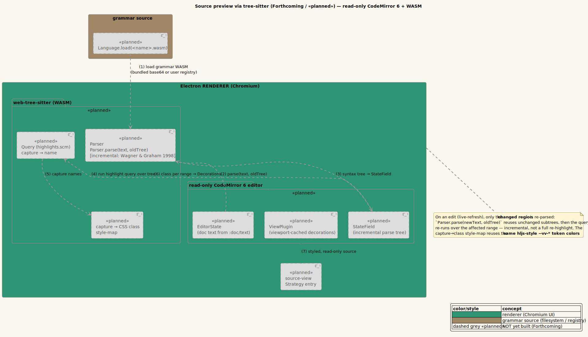

# Source preview (tree-sitter)

**Status: «planned» (Forthcoming — designed, not yet built).**

> Nothing in this page is implemented yet. It documents the planned design so it can be built as
> specified. Read described behavior as *intended*. The «planned» component diagram uses
> dashed-grey styling for every not-yet-built part.

---

## 1 · What it is

vinary-viewer will preview **source code** with proper, grammar-aware syntax highlighting, using a
read-only [CodeMirror 6](https://codemirror.net/) editor driven by
[web-tree-sitter](https://github.com/tree-sitter/tree-sitter/tree/master/lib/binding_web) (the
WebAssembly build of [tree-sitter](https://tree-sitter.github.io/tree-sitter/)). Unlike the
regex-based highlight.js coloring used for fenced code blocks in Markdown
([feature 09](09-markdown-rendering.md)), tree-sitter builds a real **parse tree** of the source and
highlights from it, giving accurate, structure-aware coloring — and it does so **incrementally**:
on an edit, only the changed region is re-parsed, reusing the rest of the tree.

The incremental-parsing approach is the classic technique of Wagner and Graham: reuse the unchanged
portions of a syntax tree across edits so re-parsing cost is proportional to the *change*, not the
file size [[Wagner & Graham 1998]](https://doi.org/10.1145/276393.276394). This is what makes
live-refresh highlighting of large source files cheap.

The implementation will adapt the proven CodeMirror-6 + web-tree-sitter integration from
**LightningBug** (`lib/editor/syntax.cljs`), the f1r3fly ClojureScript reference application.

---

## 2 · How to use it (planned)

1. (Forthcoming) Open a source file in a registered language (e.g. `core.cljs`, `service.rs`, a
   `.rho` Rholang file once its grammar is registered).
2. The source renders, read-only, with grammar-aware syntax highlighting.
3. Edit and save; only the changed region is re-parsed and re-highlighted
   ([feature 01](01-live-refresh.md)).

Which languages are available is governed by the [grammar registry](14-grammar-registry.md) —
bundled grammars plus any the user has dropped into `~/.config/vinary-viewer/grammars/`.

---

## 3 · How it will work internally (planned)

A new `source-view` Strategy entry will render a read-only CodeMirror 6 editor wired to
web-tree-sitter, adapting LightningBug's `lib/editor/syntax.cljs`. The pieces, defined:

- **`Language.load(<name>.wasm)`** — web-tree-sitter loads a compiled grammar from a `.wasm` file. A
  *grammar* is a tree-sitter parser for one language; the `.wasm` is its portable, sandboxed build
  that runs in the renderer (Chromium supports WASM-SIMD, which tree-sitter benefits from). The
  `.wasm` comes from the [grammar registry](14-grammar-registry.md).
- **Incremental parse via a `StateField`** — a CodeMirror
  [`StateField`](https://codemirror.net/docs/ref/#state.StateField) holds the current tree-sitter
  parse tree as part of editor state. On each change, the field calls
  `Parser.parse(newText, oldTree)`: tree-sitter reuses unchanged subtrees and re-parses only the
  edited span — the Wagner-Graham incrementality [[Wagner & Graham 1998]](https://doi.org/10.1145/276393.276394).
- **`Query` (`highlights.scm`) → capture names** — a tree-sitter
  [query](https://tree-sitter.github.io/tree-sitter/using-parsers#query-syntax) (the language's
  `highlights.scm`) matches tree nodes and assigns each a **capture name** (e.g. `@keyword`,
  `@string`, `@function`). Running the query over the (re-parsed) tree yields, for each source
  range, a capture name.
- **capture → CSS `style-map`** — a map from capture names to CSS classes/colors. Reusing the
  existing palette, captures map onto the same `--vv-*` tokens the highlight.js classes use
  ([feature 09](09-markdown-rendering.md)) — so source highlighting is themed and re-colors with the
  active theme ([feature 06](06-themes-and-live-switching.md)).
- **Viewport-cached `ViewPlugin`** — a CodeMirror
  [`ViewPlugin`](https://codemirror.net/docs/ref/#view.ViewPlugin) computes decorations
  (the styled ranges) for the **visible viewport** and caches them, so highlighting cost scales with
  what is on screen, not the whole file.
- **`Compartment`** — a CodeMirror
  [`Compartment`](https://codemirror.net/docs/ref/#state.Compartment) lets the active language
  configuration be swapped at runtime (e.g. when a different file kind is shown) without rebuilding
  the editor.

Live refresh feeds the editor's document from `:doc/text` (which MAIN already sends for text-kind
files, [feature 01](01-live-refresh.md)); on a file change the new text is applied as a CodeMirror
change, the `StateField` does the incremental re-parse, and the `ViewPlugin` re-decorates the
viewport.

---

## 4 · Design notes / trade-offs (planned)

- **Why tree-sitter over regex highlighting?** Regex highlighters (highlight.js) are approximate and
  language-by-language brittle; a tree-sitter parse tree gives accurate, nestable, structure-aware
  highlighting and the same grammar can later power folding, outline, and selection. The cost is
  shipping/loading a `.wasm` grammar per language — addressed by the [registry](14-grammar-registry.md).
- **Why incremental parsing?** So live-refresh highlighting of a large file re-parses only the edit,
  not the whole buffer — the Wagner-Graham result [[Wagner & Graham 1998]](https://doi.org/10.1145/276393.276394).
- **Why read-only CodeMirror?** vinary-viewer is a *previewer*; the editor provides accurate
  highlighting, selection, and find affordances without being a text editor. Read-only keeps scope
  tight and avoids any accidental edit path.
- **Why adapt LightningBug's `syntax.cljs`?** It is an already-built, working CLJS integration of
  exactly this stack in the same ecosystem, de-risking the renderer WASM path.
- **Trade-off — WASM grammar size/load.** Each grammar is a `.wasm` payload to load; bundling common
  ones (base64-embedded) and lazy-loading the rest keeps startup light. See the
  [grammar registry](14-grammar-registry.md).

Will be recorded in the source-preview / grammar-registry ADR; see the
[ADR index](../design-decisions/README.md).

---

## 5 · Forthcoming

This entire feature is forthcoming. Build order, when scheduled: `kind-of` source classification →
adapt LightningBug `syntax.cljs` (CodeMirror 6 + web-tree-sitter) → `StateField` incremental parse →
`highlights.scm` query → capture→`--vv-*` style-map → viewport `ViewPlugin` → live-refresh re-parse
→ verification. Depends on the [grammar registry](14-grammar-registry.md). Tracked as project task
**P4 — Tree-sitter source preview + grammar registry**.

---

## 6 · Diagram

- **Component — tree-sitter source pipeline («planned»):**
  [`../diagrams/component-tree-sitter-planned.puml`](../diagrams/component-tree-sitter-planned.puml)
  (owned by this pillar). Every box is dashed-grey «planned»: `Language.load(.wasm)` →
  `Parser.parse(text, oldTree)` (incremental) → `StateField` → `Query`/`highlights.scm` →
  capture→style-map → `ViewPlugin` decorations → styled read-only source.

Palette: **teal** = the renderer (CodeMirror + WASM run here), **tan** = the grammar source,
**dashed grey** = «planned». See [`../diagrams/_vv-theme.iuml`](../diagrams/_vv-theme.iuml).

---

## References

- Tim A. Wagner and Susan L. Graham. *Efficient and flexible incremental parsing.* ACM Transactions
  on Programming Languages and Systems (TOPLAS), 20(2):980–1013, 1998.
  DOI: [10.1145/276393.276394](https://doi.org/10.1145/276393.276394).
- tree-sitter — <https://tree-sitter.github.io/tree-sitter/>; web-tree-sitter (WASM binding).
- CodeMirror 6 — <https://codemirror.net/docs/ref/>.
- LightningBug `lib/editor/syntax.cljs` — the adapted f1r3fly CLJS reference integration.
