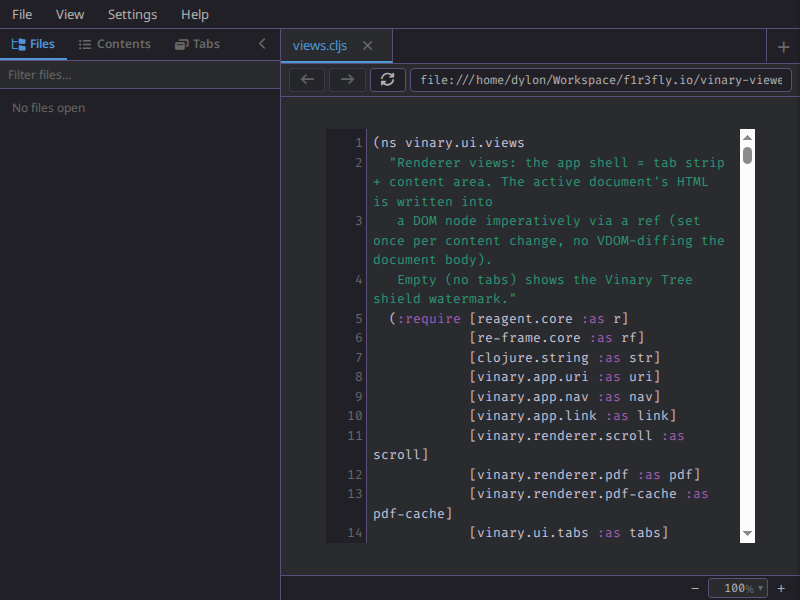
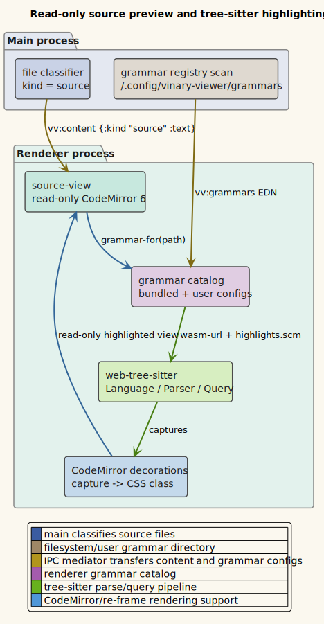

# Source preview (tree-sitter)



*Read-only CodeMirror with tree-sitter syntax highlighting.*

**Status: Available now.**

---

## 1 · What it is

vinary-viewer previews source files in a read-only
[CodeMirror 6](https://codemirror.net/) view. When a tree-sitter grammar is
available for the file extension or a configured filename/pattern mapping, the renderer uses
[web-tree-sitter](https://tree-sitter.github.io/tree-sitter/using-parsers) to
parse the text, run the language's `highlights.scm` query, and convert captures
such as `@keyword`, `@string`, and `@function` into themed CodeMirror
decorations.

This is a preview surface, not an editor. Live refresh replaces the source view
with the latest file contents after main re-sends `vv:content`.

## 2 · How to use it

1. Open a source file whose extension is known to the bundled grammar catalog or
   the user grammar registry.
2. The file appears in a read-only CodeMirror view.
3. Edit and save the file in your normal editor; vinary-viewer reloads the text
   and rebuilds the read-only view.

Files without a matching tree-sitter grammar still open in the read-only source
view, but without grammar-aware syntax decorations.

Selections copy through the application clipboard path. `Ctrl+C` and
`Ctrl+Shift+C` copy selected text from the source view, and the right-click menu
offers `Copy`, `Copy source location`, `Copy file path`, and `Copy file name`.
The source location uses compiler-style `path:line:column` formatting.

**Go to source / Go to preview** — the same per-node source positions also drive
bidirectional *jump* navigation (not just copy). Right-click an object in the
preview → **Go to source** opens the source view and scrolls to that line;
right-click a line in the source → **Go to preview** opens the preview and scrolls
to the matching object. Both are also command-palette commands ("Go to source" /
"Go to preview") that derive the current line with no click target. Because the two
views toggle within one pane, a jump that switches views defers its scroll until the
destination view remounts. This is Markdown-only for now (Org preview nodes carry no
source positions — see [feature 26](26-org-mode.md)). Full design:
[ADR-0021](../design-decisions/0021-bidirectional-source-preview-jump.md).

## 3 · How it works internally

Main classifies source files with `vinary.main.file-kind/kind-of`, using
`vinary.main.grammars/source?` for bundled grammars, user grammars, filetype
mappings, and known plain-source extensions. For a source file, main sends:

```clojure
{:path "/abs/src/core.cljs"
 :kind "source"
 :text "(ns example.core)\n"
 :stamp 1710000000000}
```

The renderer branch in `vinary.ui.views/content-view` mounts
`vinary.ui.views/source-view`. That component creates a read-only CodeMirror
`EditorView` through `vinary.renderer.syntax/create-source-view`.

The highlighting pipeline is:

1. Resolve a grammar with `vinary.renderer.syntax/grammar-for`, which checks
   user filename/pattern mappings, built-in filename mappings such as
   `Cargo.lock` → `toml`, then normal extensions.
2. Load the grammar `.wasm` and `highlights.scm` once, caching promises by URL.
3. Parse the whole source text with `web-tree-sitter`.
4. Run the highlight query over the parse tree.
5. Map capture names to CodeMirror CSS classes backed by the `--vv-*` theme
   variables.
6. Reconfigure the CodeMirror decoration extension when the async grammar work
   finishes.

Markdown fenced code blocks reuse the same grammar-loading path when a fenced
language is known, so source-preview grammars also improve Markdown code blocks.

## 4 · Design notes / trade-offs

- **Read-only by design.** vinary-viewer stays a previewer; source files are
  edited in the user's editor and refreshed into the preview.
- **Whole-view rebuild on live refresh.** The current implementation destroys
  and recreates the read-only CodeMirror view when file text changes. That keeps
  correctness straightforward for external edits and avoids maintaining an edit
  model inside vinary-viewer.
- **Asynchronous grammar loading.** Source text appears promptly; grammar-aware
  decorations arrive after the `.wasm` and query finish loading.
- **Shared theming.** Tree-sitter captures map to the same CSS classes and
  palette used by Markdown code highlighting.
- **Clipboard interception is scoped.** The global copy listener handles only
  selected text inside `.vv-source` or `.markdown-body`; focused inputs keep
  normal browser copy behavior.

## 5 · Diagram

Source:
[`../diagrams/component-source-preview.puml`](../diagrams/component-source-preview.puml).


