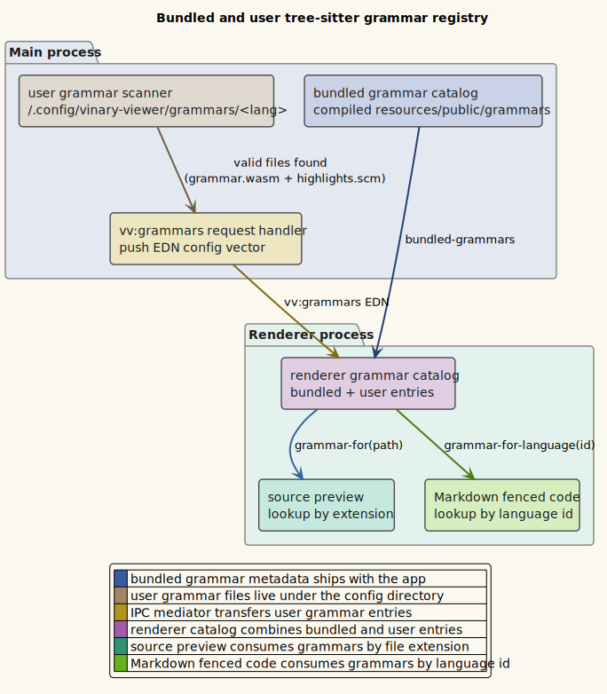

# Grammar registry

**Status: Available now.**

---

## 1 · What it is

The **grammar registry** maps source-file extensions, configured filenames,
configured glob patterns, and fenced-code language names to tree-sitter runtime
assets:

- `grammar.wasm`: the compiled tree-sitter parser.
- `highlights.scm`: the tree-sitter query that names syntax captures.

The registry has two sources:

- **Bundled grammars** compiled into the app's runtime resources and catalog.
- **User grammars** discovered under `~/.config/vinary-viewer/grammars/<lang>/`.
- **Filetype mappings** from `~/.config/vinary-viewer/filetypes.edn`, plus
  built-in mappings such as `Cargo.lock` to the `toml` grammar.

The renderer consumes the combined registry for read-only source previews and
for Markdown fenced code blocks.

## 2 · How to use it

Bundled grammars work without configuration. Open a file with a bundled
extension or a built-in filename mapping and the source preview loads its
grammar. For example, `Cargo.lock` opens as TOML even though it has no `.toml`
extension.

To add a user grammar, create this directory shape:

```text
~/.config/vinary-viewer/grammars/<lang>/
  grammar.wasm
  highlights.scm
  config.edn          # optional
```

If `config.edn` is absent, the extension defaults to `.<lang>`. If it is
present, vinary-viewer reads `:extensions` from it:

```clojure
{:extensions [".rho" ".rholang"]}
```

Restart vinary-viewer or request grammars again from the renderer bootstrap path
so main rescans and pushes the user grammar list.

To map filenames or patterns to existing grammar ids, create
`~/.config/vinary-viewer/filetypes.edn`:

```clojure
{:filenames {"Cargo.lock" "toml"
             "tool.lock" "toml"}
 :patterns {"*.service" "toml"
            "config/*.lock" "json"}}
```

Terms:

- **Filename mapping** means an exact basename match. `Cargo.lock` matches
  `/repo/Cargo.lock` but not `/repo/cargo.lock`.
- **Pattern mapping** means a simple glob. `*` matches inside one path segment,
  `?` matches one character, and `**` can match across directories. A pattern
  containing `/` is matched against the normalized path; a pattern without `/`
  is matched against the basename.
- **Filetype id** means a grammar id, language name, alias, or extension known
  to the combined bundled/user grammar registry.

Lookup precedence is user filename, user pattern, built-in filename, built-in
pattern, then extension. A mapping whose filetype cannot resolve to a grammar is
ignored, so a typo in `filetypes.edn` does not force an unrelated source view.

## 3 · How it works internally

Main owns filesystem discovery in `vinary.main.grammars`:

1. Resolve the grammar directory from `XDG_CONFIG_HOME` or `~/.config`.
2. Scan each child directory.
3. Accept entries that contain both `grammar.wasm` and `highlights.scm`.
4. Read optional `config.edn` and use its `:extensions` vector when present.
5. Read `filetypes.edn` when present and normalize valid `:filenames` and
   `:patterns` entries.
6. Send the resulting registry map to the renderer as EDN text over
   `vv:grammars`.

An accepted user entry has this shape:

```clojure
{:language "rholang"
 :extensions [".rho"]
 :wasm-url "file:///home/user/.config/vinary-viewer/grammars/rholang/grammar.wasm"
 :scm-url "file:///home/user/.config/vinary-viewer/grammars/rholang/highlights.scm"}
```

The renderer stores user entries in `vinary.renderer.syntax/user-grammars` and
filetype entries in `vinary.renderer.syntax/user-filetypes`, then combines them
with `vinary.grammar-catalog/bundled-grammars`. Lookup happens by:

- filename/pattern filetype mapping or file path extension for source previews;
  and
- language id for Markdown fenced code blocks.

Loaded languages and grammar/query pairs are cached by URL, so repeated previews
reuse the same asynchronous load promises.

## 4 · Design notes / trade-offs

- **Main scans; renderer consumes.** Filesystem access stays behind the IPC
  boundary, while parsing and highlighting stay in the renderer.
- **Minimal config.** A user grammar needs only two required files. `config.edn`
  is optional and currently only customizes extensions.
- **Filename support without fake extensions.** `filetypes.edn` lets exact
  filenames and repository-specific patterns reuse existing grammars without
  renaming files or installing duplicate grammar entries.
- **Fail closed.** Missing required files are ignored. Malformed optional config
  is caught and treated as absent. Filetype mappings that do not resolve to a
  grammar are ignored.
- **Shared registry.** The same catalog feeds source previews and Markdown
  fenced-code highlighting, so adding a grammar improves both surfaces.

## 5 · Diagram

Source:
[`../diagrams/component-grammar-registry.puml`](../diagrams/component-grammar-registry.puml).


