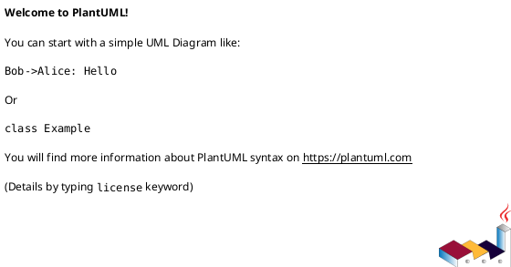

# Grammar registry

**Status: «planned» (Forthcoming — designed, not yet built).**

> Nothing in this page is implemented yet. It documents the planned design so it can be built as
> specified. Read described behavior as *intended*. The «planned» component diagram uses
> dashed-grey styling for every not-yet-built part.

---

## 1 · What it is

The **grammar registry** is the extensibility mechanism behind [source preview](13-source-preview-tree-sitter.md):
a single place that knows, for every supported language, *which tree-sitter grammar `.wasm` to
load, which highlight query (`highlights.scm`) to run, and which file extensions it covers*. It
will ship with **bundled** grammars (compiled in at build time) and also load **user-supplied**
grammars dropped into `~/.config/vinary-viewer/grammars/` — so a user can teach vinary-viewer a new
language (e.g. Rholang, MeTTa) **without rebuilding the app**. Each grammar's configuration is
validated by [clojure.spec](https://clojure.org/guides/spec) before it is admitted, so a malformed
entry is rejected rather than silently corrupting highlighting.

This is the **Strategy / Interpreter**-flavored configuration layer for tree-sitter: the registry
maps a detected language to a grammar "interpreter" (parser + query), and the source-view consumes
it. The design adapts LightningBug's grammar-registry approach (config maps + `clojure.spec` +
registry atom + per-workspace resource cache + compile-time base64 embedding), extended with the
user directory.

---

## 2 · How to use it (planned)

**Use a bundled grammar (Forthcoming).** Open a file in a bundled language; it just highlights —
nothing to configure.

**Register your own grammar (Forthcoming).** Drop three things into
`~/.config/vinary-viewer/grammars/<language>/`:

1. `<language>.wasm` — the compiled tree-sitter grammar.
2. `highlights.scm` — the tree-sitter highlight query for it.
3. a config map (`.edn`) describing the language: its name, file extensions, the `.wasm` and query
   filenames, and (optionally) a highlight scope.

Restart vinary-viewer (or trigger a re-scan). The registry validates the config; if valid, the
language becomes available and files with its extensions highlight via tree-sitter.

**Example config (planned shape).**

```clojure
{:grammar/name  "rholang"
 :grammar/extensions ["rho"]
 :grammar/wasm  "rholang.wasm"
 :grammar/highlights "highlights.scm"
 :grammar/scope "source.rholang"}
```

---

## 3 · How it will work internally (planned)

### A validated registry atom

The registry is an atom mapping language name → validated grammar config:

```
;; planned shape
(def registry (atom {}))   ; "rholang" -> {:grammar/name … :wasm … :highlights … :extensions […]}
```

Every candidate config — bundled or user — is checked against a `clojure.spec` schema before it is
`swap!`ed in. **`clojure.spec`** is Clojure's data-specification library: a spec describes the
required keys and value shapes of the config map, and `s/valid?` / `s/explain` accept or reject a
candidate with a precise reason. Rejecting invalid configs at registration time keeps the registry
trustworthy: the source-view can assume any entry it reads is well-formed.

### Two sources feed the registry

1. **Bundled grammars (compile-time).** Common grammars are embedded into the build with
   **`embed-base64`** — a build-time macro that inlines a binary asset (the `.wasm` and its
   `highlights.scm`) as a base64 string in the compiled output. This means bundled grammars need no
   filesystem access at runtime and ship inside the app. They register at startup.
2. **User grammars (runtime).** At startup, the main process scans
   `~/.config/vinary-viewer/grammars/`, reads each language's `.wasm` / `highlights.scm` / config,
   and sends the configs to the renderer over the IPC seam, which validates and registers them. This
   is the no-rebuild extension path.

A per-workspace **resource cache** avoids re-reading/re-decoding the same grammar repeatedly.

### Lookup by file extension

When a source file is opened, the source-view resolves a grammar by matching the file's extension
against each registered config's `:grammar/extensions`, then loads that grammar's `.wasm`
(`Language.load`) and runs its `highlights.scm` — see [source preview](13-source-preview-tree-sitter.md)
for the parse/highlight pipeline.

---

## 4 · Design notes / trade-offs (planned)

- **Why a registry + spec rather than hard-coded languages?** It makes language support *data*, not
  code: bundled languages are entries; user languages are entries. `clojure.spec` validation makes
  the data trustworthy. This is the single-source-of-truth/Strategy principle applied to grammars,
  and it is exactly how a user adds Rholang/MeTTa highlighting without touching the app.
- **Why bundle via `embed-base64`?** Bundled grammars then have zero runtime filesystem dependency
  and travel with the binary; the trade-off is larger build output, mitigated by bundling only
  common grammars and leaving the long tail to the user directory.
- **Why a user directory?** It is the lowest-friction extension surface — drop three files, restart —
  and it mirrors how editors load community grammars. The cost is trusting user-supplied `.wasm`;
  tree-sitter grammars run sandboxed in WASM, which bounds that risk (to be covered in the
  [threat model](../security/threat-model.md)).
- **Trade-off — restart/rescan to pick up new user grammars.** v1 of the registry registers user
  grammars at startup (or on an explicit rescan); hot-reloading a newly-dropped grammar mid-session
  is a possible refinement.

Will be recorded in the grammar-registry ADR; see the [ADR index](../design-decisions/README.md).

---

## 5 · Forthcoming

This entire feature is forthcoming. Build order, when scheduled: `clojure.spec` config schema →
registry atom + validation → bundled grammar embedding (`embed-base64`) → user-directory scan
(main → IPC → renderer register) → resource cache → extension lookup wired to
[source preview](13-source-preview-tree-sitter.md) → verification. Tracked as project task
**P4 — Tree-sitter source preview + grammar registry**.

---

## 6 · Diagram

- **Component — bundled + user grammars feeding the registry («planned»):**
  [`../diagrams/component-grammar-registry-planned.puml`](../diagrams/component-grammar-registry-planned.puml)
  (owned by this pillar). Every part is dashed-grey «planned»: `embed-base64` bundled grammars and
  the user `~/.config/vinary-viewer/grammars/` directory both feed a `clojure.spec`-validated
  registry atom, which the source-view consumes by extension lookup.



Palette: **tan** = grammar sources (bundled asset + user config dir), **purple** = the registry as a
single stateful owner (the atom), **teal** = the renderer consumer (source-view), **dashed grey** =
«planned». See [`../diagrams/_vv-theme.iuml`](../diagrams/_vv-theme.iuml).
