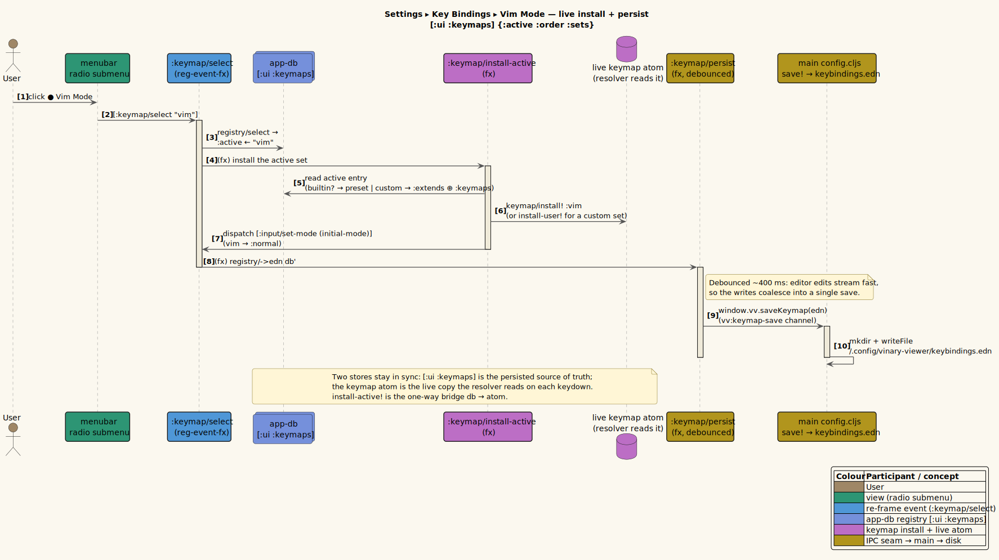
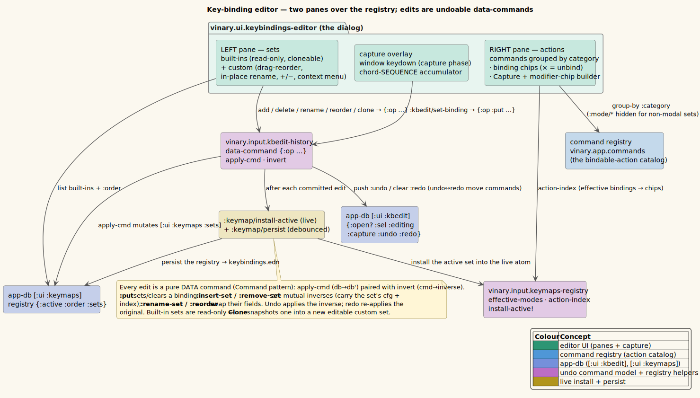
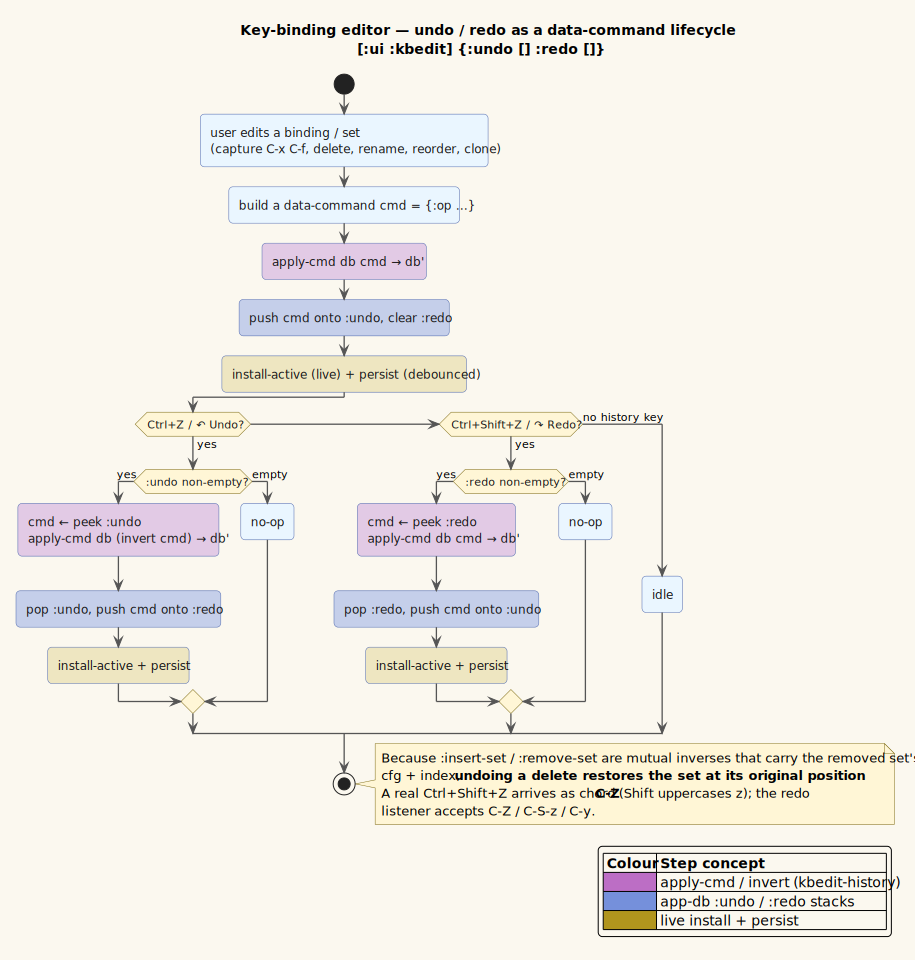
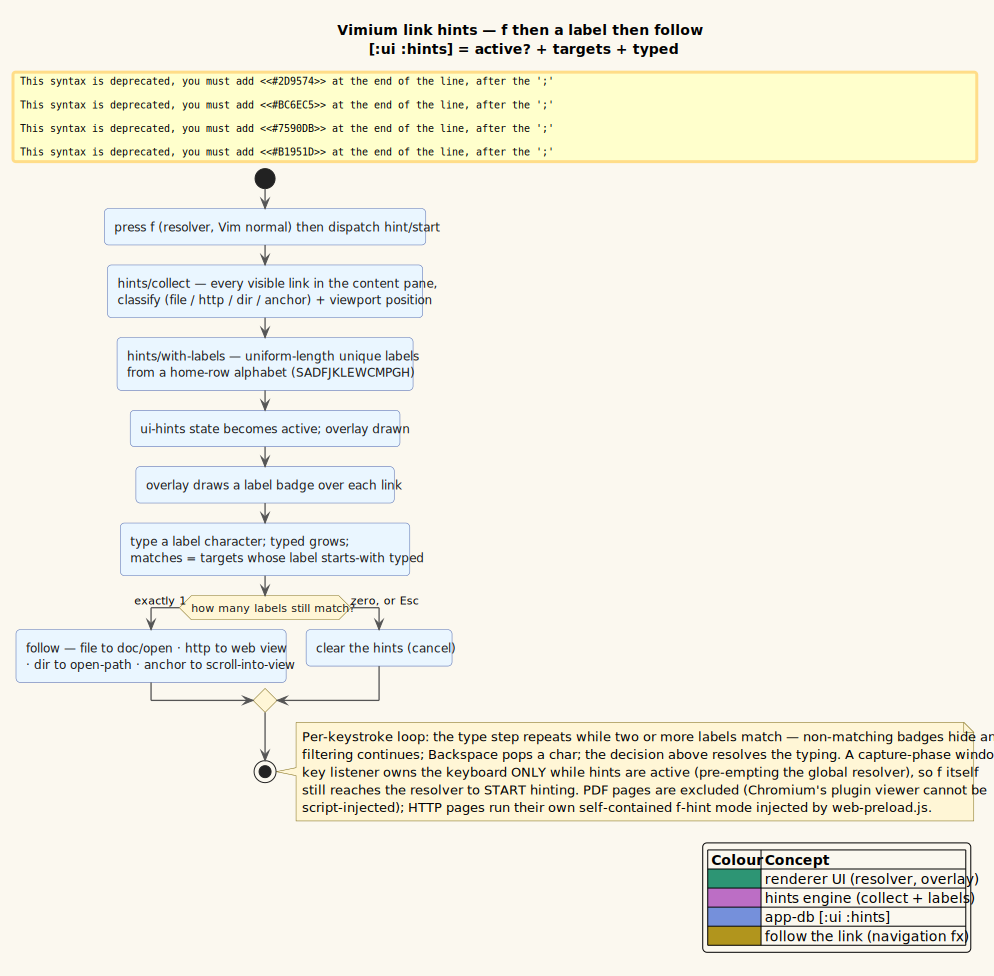

# Custom Keybindings (vim / emacs / default + a visual editor) — *Available now*

> **Status:** Available now. A full, user-customizable keybinding system with preset **default**,
> **vim**, and **emacs** keymaps, a named **command registry**, a modal/chord/leader **resolver**, a
> **command palette / fuzzy finder**, and a live-reloaded **`~/.config/vinary-viewer/keybindings.edn`**.
>
> **New this round:** runtime **keymap-set switching** from a **Settings ▸ Key Bindings** radio submenu;
> a two-pane visual **key-binding editor** (`Customize…`) with key capture, emacs-style modifier chips,
> drag-reorder, in-place rename, clone, and full **undo/redo** (`Ctrl+Z` / `Ctrl+Shift+Z`); and
> **Vimium-style** vim — `h`/`l` horizontal scroll, `f` link hints, `/` find. See §6.

## 1. What it is

vinary-viewer resolves every keystroke through a small, data-driven keybinding engine. Keys map to
**named commands** (e.g. `:tab/next`, `:file/open-in-new-tab`, `:search/start`) drawn from a single
**command registry** — the "API". Three bundled **keymaps** bind those commands in different styles:

- **`default`** — a non-modal keymap that reproduces and extends the original shortcuts
  (`Ctrl+F` find, `Alt+←/→` history, plus `Ctrl+Tab`/`Ctrl+PageUp`/`Ctrl+PageDown`/`Ctrl+W`/`Ctrl+P`/`Ctrl+T`…).
- **`vim`** — modal (`normal`/`insert`/`visual`), with `j`/`k` scrolling, `g g`/`G`, tab verbs
  (`g t`/`g T`), a `Space` **leader** (`SPC f f` → open file, `SPC b b` → buffer switcher…), `:` ex
  command line, and `/` search.
- **`emacs`** — chord prefixes (`C-x C-f` → open file, `C-x k` → close tab), `M-x` command palette,
  `C-s`/`C-r` search, `C-c ←/→` history.

A user file `~/.config/vinary-viewer/keybindings.edn` selects a preset (`:extends`) and overrides or
removes individual bindings; editing it **re-binds live** (no restart).

## 2. How to use it

**Pick a keymap.** Create `~/.config/vinary-viewer/keybindings.edn`:

```clojure
{:extends :vim}            ; or :emacs, or :default (the implicit default if no file exists)
```

Save it and the running app rebinds immediately. With `:extends :vim`, the app starts in `normal`
mode; `j`/`k` scroll, `g g`/`G` jump to top/bottom, `g t` cycles tabs, `Space f f` opens a file, `:`
opens the command line, `i` enters insert, `Esc` returns to normal. The mode-line at the bottom-right
shows the current mode and any pending key-sequence (e.g. `NORMAL  SPC f`).

**Customize.** The user file is deep-merged over the chosen preset. A value of `:unbind` removes an
inherited binding; nested maps express sequences; `"SPC"` is the leader token:

```clojure
{:extends :vim
 :leader "SPC"
 :timeout-ms 800
 :keymaps {:normal {"H"   :history/back              ; add bindings
                    "L"   :history/forward
                    "C-p" :palette/files
                    "SPC" {"w" {"q" :tab/close}}      ; SPC w q → close tab
                    "g"   {"t" :unbind}}              ; remove an inherited binding
           :all    {"C-M-t" :theme/cycle}}}           ; applies in every mode
```

**Command palette.** `default` `Ctrl+Shift+P`, emacs `M-x`, vim `SPC SPC` (or `:`) open the **command
palette**; `default` `Ctrl+P` / emacs `C-x C-f` / vim `SPC f f` open the **fuzzy file finder**. Type to
filter, `↑`/`↓` to move, `Enter` to run, `Esc` to close.

## 3. How it works internally

The engine is six small namespaces plus three EDN keymaps, sitting in the re-frame + DataScript model
exactly like the rest of the app (keybinding/modal/sequence state is *ephemeral UI* → app-db; the
keymap itself is a static atom in `keymap.cljs`).

### 3.1 Command registry — the API (`src/vinary/app/commands.cljs`)

Every command is reified data (Command pattern):

```clojure
:tab/next  {:id :tab/next :title "Next tab" :category "Tabs" :dispatch [:tab/next] :when :has-tabs}
:tab/close {:id :tab/close :title "Close tab" :category "Tabs" :when :has-tabs
            :handler (fn [ctx] (when-let [p (:active-path ctx)] [:tab/close p]))}
```

`commands/run` resolves a command id against a **resolution context** `ctx` (tabs, active path, history
availability, find/palette visibility, `:in-input?`) and dispatches its `:dispatch` event (optionally
with `:arg`/runtime args) or calls its `:handler`. A command's optional `:when` predicate gates it: if
the predicate fails the key **passes through** (so e.g. `:history/back` doesn't swallow `Alt+←` with no
history — matching the disabled toolbar button). The registry currently holds **31 commands** across
Tabs, File, Navigation, Search, View, and Mode categories; it is also the candidate set for the
command palette (`commands/all-visible ctx`).

### 3.2 Key normalization (`src/vinary/input/keys.cljs`)

`event->chord` turns a `KeyboardEvent` into a canonical token: modifiers in fixed order
`C- M- S-`, where `C-` folds Ctrl **or** ⌘-on-macOS, `M-` is Alt/Option, and `S-` is emitted only for
named keys (for printables, Shift is already in the character — `Shift+/` → `"?"`, not `"S-/"`). Named
keys map to short tokens (`ArrowLeft`→`"left"`, `Escape`→`"escape"`, `" "`→`"space"`). Modifier-only /
IME events return `nil` and are ignored.

### 3.3 Keymaps + merge (`src/vinary/input/keymap.cljs`, `resources/keymaps/*.edn`)

Each keymap is `{:name :initial-mode :timeout-ms :leader :modes}`. A **mode-map** maps a chord token to
either a command (leaf) or a nested map (a **prefix/sequence** — the trie the resolver walks):
`{"C-x" {"C-f" :file/open}}` is `C-x C-f`. The three bundled presets are read from
`resources/keymaps/{default,vim,emacs}.edn` **at compile time** and inlined as data — the renderer build
stubs `fs`, so presets cannot be read at runtime. They are inlined via **`shadow.resource/inline`** (in
`keymap.cljs`), which — unlike a plain compile-time `slurp` — **tracks each EDN file as a build
dependency**, so editing a keymap EDN triggers a recompile (a bare `slurp` would leave the bundled
keymaps stale until a cache-clearing rebuild). `merge-user` (pure) deep-merges the user delta over the
`:extends` preset (`:unbind` removes; `deep-merge` keeps the preset where the user supplies no value),
strips `:unbind` leaves, and normalizes the keys (`"SPC"`→`"space"`); `install-user!` stores the result
in the live atom, and the editor reads `merge-user` directly to show a set's *effective* bindings without
installing it.

### 3.4 The resolver (`src/vinary/input/resolver.cljs`)

A single `keydown` listener on `window` (installed by `install!`, replacing the old hand-rolled
listener). The pure core `step` builds the active map as `(merge (:all modes) (mode modes))`, looks up
`(get-in root (conj sequence token))`, and returns a decision:

- **leaf** → `:dispatch` the command;
- **nested map** → `:prefix` (more keys expected);
- **miss mid-sequence** → `:retry` the token fresh;
- **miss at start** → `:consume` (vim swallows stray `normal`/`visual` keys) or `:pass` (let it reach
  inputs / the browser).

The **pending sequence and the chord timer live in resolver-local atoms**, updated *synchronously* —
re-frame dispatch is asynchronous, so two keydowns in one JS task would otherwise desync; the sequence
is mirrored to app-db (`:input/set-sequence`) only to drive the mode-line. A half-typed prefix
(`C-x` …) resets after `timeout-ms`. The palette owns all keys while open, and a **bare printable key
always reaches a focused input** (so typing a find query or a vim `/`-search works even in `normal`
mode); inputs report focus via `:on-focus`/`:on-blur` → `:input/set-in-input`.

### 3.5 Command palette (`src/vinary/ui/palette.cljs`)

One overlay widget, three sources: `:command` (all visible commands), `:file` (the git tree, fuzzy),
`:theme`. A subsequence fuzzy matcher filters as you type; `Enter` runs the selection (`:doc/open` for a
file, `:theme/set` for a theme, `commands/run` for a command).

### 3.6 Config loader (`src/vinary/main/config.cljs`)

The Electron **main** process reads `~/.config/vinary-viewer/keybindings.edn` (honoring
`XDG_CONFIG_HOME`), watches it with chokidar, and pushes it to the renderer over the `vv:keymap`
channel. **The config crosses the IPC seam as raw EDN *text*** (not `clj->js`): `clj->js` would flatten
the keyword command-ids (`:file/open`) to strings, so the renderer parses the text with `cljs.reader`,
preserving keywords. The renderer pulls once on boot (`requestKeymap`) to avoid a startup race, and
re-installs on every file change — *live keybinding reload*.

Since this round the file is the **registry envelope** (see §6.1) rather than a single delta; the editor
and the radio submenu **write it back** over a new `vv:keymap-save` channel (`config.cljs` `save!`,
mirroring `settings.cljs`). `normalize-config` is **idempotent** and back-compatible: a legacy
single-delta file (`{:extends :keymaps}`) is wrapped as one custom set, and the chokidar watcher's
re-push after a save is a no-op round-trip.

## 4. Design notes

- **Patterns:** Command (the registry), Strategy (keymap-per-mode + preset selection), Interpreter
  (`step` walking the trie), State (the modal FSM), Mediator (config over `window.vv`), Observer (the
  mode-line/palette subs). Effects (DOM scroll/focus, the timer) are re-frame fx at the edge.
- **Why a synchronous local sequence atom** rather than app-db: correctness under fast multi-key input
  (see §3.4).
- **Why EDN text over IPC** rather than a `clj->js` map: to preserve keyword command-ids (see §3.6).

## 5. Diagram

See [`component-keybindings-inprogress.puml`](../diagrams/component-keybindings-inprogress.puml) for the
component layout: the `keydown` → resolver → command-registry → re-frame flow, the keymap atom + presets
macro, and the main→renderer config seam.

> **Doc reconciliation note:** an earlier draft of this page (and the diagram filename's
> `-inprogress` suffix) tagged the feature "now available" because the documentation was generated
> while the `src/vinary/input/*` modules were mid-landing. The system is now complete and verified
> end-to-end (default `Ctrl+F`/`Alt+←→`/`C-t`; vim `j`/`g g`/`SPC` leader/modal; emacs `C-x C-f` chord +
> timeout reset; config auto-load via `XDG_CONFIG_HOME`; palette filter + run).

## 6. Keymap-set switching, the visual editor, and Vimium hints

This round adds three user-facing surfaces on top of the engine above, plus the persistence to back them.

### 6.1 The keymap-set registry (`src/vinary/input/keymaps_registry.cljs`)

Where the engine knew only *one* active keymap (one preset ⊕ one optional user delta), it now manages a
**registry of named sets** over the app-db slice `[:ui :keymaps] = {:active :order :sets}` — mirroring the
browser-tab model in `nav.cljs` (pure reads + transforms over app-db, plus one side-effecting bridge):

- three read-only **built-ins** — `default` → *Standard Mode*, `vim` → *Vim Mode*, `emacs` → *Emacs Mode*;
- any number of user **custom sets**, each a `{:extends <preset> :keymaps <modes-delta>}` entry, ordered
  by `:order` (that order is also the submenu order);
- transforms `select` / `add-custom` / `delete-custom` / `rename-custom` / `reorder` / `clone-set`, plus
  `effective-modes` / `action-index` / `conflict` (read the merged bindings), `normalize-config` /`->edn`
  (the on-disk envelope), and `install-active!` (→ `keymap/install!` for a built-in, `install-user!` for a
  custom set). The on-disk file is exactly this envelope:

```clojure
{:active "My Vim"
 :order  ["My Vim"]
 :sets   {"My Vim" {:extends :vim :keymaps {:normal {"C-x" {"C-f" :file/open}}}}}}
```

Selecting a set (event `:keymap/select`) installs it live (fx `:keymap/install-active`, which also sets
the modal `:initial-mode`) **and** persists the registry (fx `:vv/save-keymap`).

### 6.2 Settings ▸ Key Bindings (and Theme) radio submenus (`src/vinary/ui/menubar.cljs`)

The menu bar grew a generic **radio-submenu** item `{:submenu "…" :radio :sub/<src>}` that flies out to
the right and marks the active choice with a `●`/`○` dot. Two are wired: **Theme** (the two themes) and
**Key Bindings** — `Standard Mode` / `Vim Mode` / `Emacs Mode` + every custom set (in `:order`), the active
one selected, then a separator and **`Customize…`** which opens the editor. (A CSS `z-index` fix —
`.vv-menu`/`.vv-menu-label` above the click-away overlay — also restored hover-to-switch between top-level
menus.)

### 6.3 The key-binding editor (`src/vinary/ui/keybindings_editor.cljs`)

`Customize…` opens a two-pane modal:

- **Left — the sets.** Built-ins first (a `built-in` badge, read-only but **cloneable**), then custom sets
  (draggable to reorder — which *is* the submenu order). Header `+`/`−` add a fresh custom set (begins an
  in-place rename) / delete the selected one; double-click a custom name to **rename in place**;
  right-click for a **`Clone` / `Rename` / `Delete`** context menu. Clone (any set) snapshots its config to
  a new serial-named set, appended and focused.
- **Right — the actions.** The command registry grouped by category (`:mode/*` hidden for non-modal sets).
  Each action shows its current binding **chips** (`registry/action-index`; each chip's `×` writes an
  `:unbind`) plus a **`⌨ Capture`** button. A built-in shows a read-only banner + `Clone`.
- **Key capture** (overlay). `Capture` (or a manual **modifier-chip builder** — toggle `Ctrl`/`Alt`/`Shift`
  chips, which are reorderable/removable, + a base key) accumulates a **chord *sequence*** (e.g. `C-x C-f`);
  a capture-phase `window` keydown listener routes keys to the capture (Esc cancels, `Done` confirms),
  pre-empting the global resolver. **Modifiers use emacs set-semantics** — the chip order is cosmetic and
  canonicalizes to `C- M- S-` on build; `Shift`+printable folds to the shifted glyph.
- **Undo/redo.** Every edit is a **data command** (`src/vinary/input/kbedit_history.cljs`) with a pure
  `apply-cmd` and a pure `invert` carrying enough captured state (previous binding value; a removed set's
  config + index) to be perfectly reversible. Ops: `:put` (set/clear a binding), `:insert-set`/`:remove-set`
  (mutual inverses), `:rename-set`, `:reorder`. The header `↶`/`↷` buttons and `Ctrl+Z` / `Ctrl+Shift+Z`
  walk `[:ui :kbedit :undo]`/`[:ui :kbedit :redo]`; *undoing a delete restores the set at its position*.
  Each committed edit live-applies (`:keymap/install-active`) and persists **debounced**
  (`:keymap/persist`, ~400 ms).

> A real `Ctrl+Shift+Z` arrives as the chord **`C-Z`** (Shift uppercases the printable `z`), not `C-S-z` —
> the editor's redo accepts `C-Z` / `C-S-z` / `C-y`. This is the same fold the chip builder applies.

### 6.4 Vimium-style vim (`src/vinary/renderer/hints.cljs`, `resources/web-preload.js`)

The `vim` keymap now mirrors Vimium for Chrome:

- **`h` / `l`** scroll the content pane horizontally (`:nav/scroll-left`/`-right` → the `:dom/scroll` fx,
  which gained a `:dx` axis); `H`/`L` remain history back/forward.
- **`f`** overlays short **alphabetic hint labels** on every link visible in the content viewport
  (`hints/collect` finds + classifies each `a[href]`, `hints/labels` assigns uniform-length, unique labels);
  typing a label activates that link (file → open in pane, http → web view, dir → file manager, `#anchor` →
  scroll), `Backspace` pops a char, `Esc` cancels. A capture-phase key listener owns the keyboard only
  while hints are active, so `f` itself still reaches the resolver to *start* hinting. **HTTP pages** get
  their own self-contained `f`-hint mode injected by `web-preload.js` (the web view is a separate page).
- **`/`** opens the in-page find bar (already bound).

**The hint-label algorithm (literate).** Let `Σ` be the home-row alphabet (`Σ = "SADFJKLEWCMPGH"`, so
`|Σ| = 14`) and let `n` be the number of links visible in the viewport. Labels are kept **uniform length**
so that no label is a prefix of another — the typing sub-mode is then unambiguous (a label is recognized
the instant its full length is typed, with no disambiguation timeout):

```text
⟨assign n hint labels⟩ ≡
    if n = 0          : labels ← [ ]
    else if n ≤ |Σ|   : labels ← the first n single characters of Σ          ⟨1-char labels⟩
    else              : labels ← the first n strings of the product Σ × Σ     ⟨2-char labels⟩
```

Two characters suffice for any realistic page because `|Σ|² = 196 ≥ n` once `n > |Σ| = 14`. The trade-off
versus Vimium (which mixes 1- and 2-char labels and disambiguates with a short delay) is a few extra
keystrokes on dense pages in exchange for **zero ambiguity** and no timing dependence — e.g. `f` then `s`
then `a` follows the link labelled `SA` immediately.

### 6.5 Diagrams

Four diagrams (PlantUML, sharing the app's per-concept palette via
[`../diagrams/_vv-theme.iuml`](../diagrams/_vv-theme.iuml) — magenta `#BC6EC5` = the keymap/editor/hints
concept, matching the running app's hint-label colour):

- **Sequence — selecting a keymap set:**
  [`../diagrams/seq-keymap-select.puml`](../diagrams/seq-keymap-select.puml). The `:keymap/select` event
  installs the set into the live atom **and** writes the registry back to disk (debounced).
- **Component — the editor:**
  [`../diagrams/component-keybinding-editor.puml`](../diagrams/component-keybinding-editor.puml). The two
  panes over the registry, the command catalog, the undo command model, and the commit bridge.
- **Activity — undo / redo:**
  [`../diagrams/activity-kbedit-undo.puml`](../diagrams/activity-kbedit-undo.puml). The do / undo / redo
  control flow over the `:undo` / `:redo` stacks via `apply-cmd` ⟷ `invert`.
- **Activity — Vimium link hints:**
  [`../diagrams/activity-link-hints.puml`](../diagrams/activity-link-hints.puml). `f` → collect + classify
  → label → type-to-filter → follow / cancel.









Palette (all four): **teal** = renderer/editor UI · **blue** = re-frame events / command registry ·
**blue-violet** = app-db (`[:ui :keymaps]`, `[:ui :kbedit]`, `[:ui :hints]`) · **magenta** = the keymap
install + undo-command + hints engine · **amber** = the IPC seam / persist / navigation fx.

## 7. Limitations & notes

- **PDF hints are excluded.** Chromium's built-in PDF viewer renders in an isolated plugin process that
  cannot be script-injected, so `f` link hints are unavailable on PDF pages (a genuine platform limit, not
  a deferral). Markdown / source / diagram (renderer-local) and HTTP pages are all covered.
- **Editing a keymap EDN** (`resources/keymaps/*.edn`) now triggers a recompile during `watch`/`release`
  because the files are inlined via `shadow.resource/inline` (§3.3) — no cache-clearing rebuild needed.
- **`h`/`l` only move a pane that actually overflows horizontally.** A normal Markdown document fits the
  pane width (a wide `<pre>` carries its own scroller), so there `h`/`l` are correctly inert.

## 8. References

The design vocabulary used throughout this page is drawn from two well-known sources (neither carries a
DOI — a 1994 textbook and an open-source project — so the canonical ISBN / repository is given):

1. E. Gamma, R. Helm, R. Johnson, J. Vlissides ("the Gang of Four"). *Design Patterns: Elements of Reusable
   Object-Oriented Software.* Addison-Wesley, 1994. ISBN 0-201-63361-2. — the **Command** pattern reifies
   each editor edit as data (`kbedit_history`) and each bindable action (`commands.cljs`); the engine also
   uses **Strategy** (keymap-per-mode), **Interpreter** (the trie-walking resolver), **State** (the modal
   FSM), **Mediator** (the `window.vv` IPC seam), and **Observer** (the re-frame subscriptions).
2. P. Crowther et al. *Vimium — The Hacker's Browser.* Open-source browser extension.
   <https://github.com/philc/vimium> — the model for the `f` **link-hint** interaction and the `h`/`j`/`k`/`l`
   + `/` keys mirrored by the `vim` keymap.
