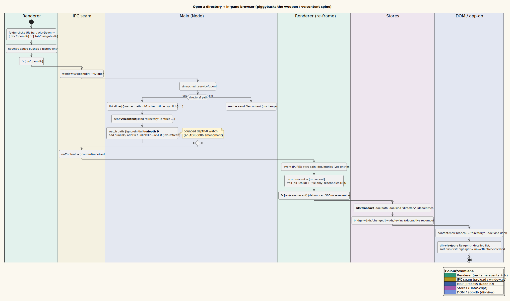

# In-pane directory browser

**Status: Available now.**

Opening a **directory** (a `file://` path that is a folder, not a file) renders a
listing of its immediate children **inside the preview pane** — the same pane that
shows Markdown, images, PDFs, and source. Folders are first-class navigation
targets: they open *in-tab*, take part in the per-tab back/forward history, and
participate in the breadcrumb and `Alt+Up`/`Alt+Down` navigation described in
[17-breadcrumb-and-up-down-navigation.md](17-breadcrumb-and-up-down-navigation.md).

> **Definition — in-pane vs. shelled-out.** Previously a directory link handed the
> path to the OS via `[:shell/open-path …]`, which popped the system file manager
> (Nautilus / Finder / Explorer) *outside* the app. "In-pane" means vinary-viewer
> now lists the directory itself, in the content area, so you can browse without
> leaving the previewer. Opening the OS file manager is still available, but it is
> now an explicit secondary action (see §6).

---

## 1. What it is

A directory tab is a content document like any other, distinguished by
`:doc/kind = "directory"`. Where a Markdown document carries `:doc/html` and a
source document carries `:doc/text`, a directory document carries a vector of
**entries** under the DataScript attribute `:doc/entries`. Each entry is a plain
map describing one immediate child:

```clojure
{:name    "report.md"          ; basename (string)
 :path    "/home/me/docs/report.md" ; absolute child path (string)
 :dir?    false                ; true when the child is itself a directory
 :size    8421                 ; bytes, or nil for a directory
 :mtime   1780000000000        ; last-modified epoch-ms, or nil
 :symlink false}               ; true when the child is a symbolic link
```

The renderer presents these entries through the `vinary.ui.views/dir-view`
component, which the content-view Strategy selects whenever the active document's
kind is `"directory"`.

---

## 2. How to use it

| You want to… | Do this |
|--------------|---------|
| Browse a folder | Open a directory path: `vv ~/docs`, type a folder path in the URI bar, click a folder in the git file-tree, or follow a directory link in a rendered document. |
| Open an entry | **Single-click on Linux, double-click on Windows/macOS** (the OS convention); or highlight it and press `Enter` / `Alt+Down`. |
| Open an entry in a new tab | `Ctrl+click` the entry (any OS). |
| Highlight an entry | Single-click it — the highlight is the `Enter` / `Alt+Down` target. |
| Scroll the listing | `↑` / `↓` / `←` / `→` (bare arrow keys smoothly scroll the pane). |
| Open the folder in the OS file manager | Right-click a folder → **Open in file manager**. |
| Go up to the parent folder | `Alt+Up` (see [feature 17](17-breadcrumb-and-up-down-navigation.md)). |

A folder opened in-tab behaves exactly like opening a document: it pushes a
history entry, so toolbar **Back** returns to wherever you came from, and its path
appears in the breadcrumb URI bar.

---

## 3. How a directory opens (the data path)

No new IPC channel was added — directories reuse the existing
`vv:content` / `vv:open` plumbing that already carries every other document kind.

1. The renderer dispatches a normal open event (`:doc/open`, `:doc/open-new`, or
   `:tab/navigate`) with the folder's path, which emits `[:vv/open path]`.
2. The main process (`vinary.main.service`) inspects the path. The pure predicate
   `directory?` calls `fs.statSync(path).isDirectory()`.
3. For a directory, `send-content!` builds the listing with `list-dir` and sends:

   ```clojure
   {:path    "/home/me/docs"
    :kind    "directory"
    :entries [ … entry maps … ]
    :stamp   1780000000000}
   ```

   over `vv:content` — the same channel as `"markdown"`, `"image"`, `"pdf"`, etc.
4. `list-dir` reads the children with
   `fs.readdirSync(dir, {withFileTypes: true})` and maps each `Dirent` through
   `entry->map`. The list is sent **unsorted**; the renderer owns ordering (§4) so
   the on-screen order and the derived highlight always agree.
5. `entry->map` resolves each child's metadata. It `lstatSync`s the child to detect
   a **symbolic link** (`:symlink true`), then — if it is a link — `statSync`s
   through to the *target* so `:dir?`, `:size`, and `:mtime` describe what the link
   points at (a link to a folder sorts and opens as a folder).
6. The renderer receives `vv:content`, and `:content/received` stores the entries
   on the document entity: `(= kind "directory") (assoc :doc/entries (vec entries))`.
   `:doc/entries` is part of the `vinary.app.ds/active-doc` pull, so the
   `:doc/active` subscription delivers them to `dir-view`.

---

## 4. List layout

The browser renders a single **detailed list** — a four-column table of
icon · name · size · modified — under a sticky header showing the folder name and a
live item count (e.g. `docs  ·  12 items`). There is no grid layout and no layout
toggle; the markup classes are `.vv-fb` (container), `.vv-fb-head` (header),
`.vv-fb-head-row` (column titles), and `.vv-fb-row` / `.vv-fb-sel` (a row / the
selected row).

Entries are ordered by `vinary.app.nav/sort-entries`: **directories first**, then
**case-insensitive by name**. The same ordering backs the highlight fallback (§5),
so the first row the highlight can land on is the first row you see.

```clojure
(defn sort-entries [entries]
  (sort-by (juxt #(if (:dir? %) 0 1)            ; dirs (0) before files (1)
                 #(str/lower-case (or (:name %) "")))
           entries))
```

A folder with no children renders a centered `Empty directory` placeholder
(`.vv-fb-empty`).

---

## 5. Selection and the Open Recent relationship

A directory listing has exactly one **highlighted** entry at a time. The highlight
is computed (not just stored) by `vinary.app.nav/effective-selected`, which picks,
in order:

1. the **explicit selection** `[:ui :dir-selected]` if it is still a current child
   (you clicked it);
2. otherwise the **remembered trail child** for this directory — the last child you
   opened from here, recalled from the persisted `[:ui :recent :trail]` map (this is
   what makes `Alt+Up` then `Alt+Down` return you to where you were — see
   [feature 17](17-breadcrumb-and-up-down-navigation.md));
3. otherwise the **first entry** in sorted order (or `nil` for an empty folder).

```clojure
(defn effective-selected [dir entries dir-selected trail]
  (let [child-paths (into #{} (map :path) entries)]
    (or (when (contains? child-paths dir-selected) dir-selected)
        (let [t (get trail dir)] (when (contains? child-paths t) t))
        (:path (first (sort-entries entries))))))
```

Because the highlight falls back to the trail, the browser feels "sticky": leave a
folder and come back and the cursor is already on the child you last visited.

---

## 6. Entry interactions

**Opening is OS-dependent**, matching each platform's file-manager convention
(`vinary.ui.platform/single-click-open?`): a **single click opens on Linux**, a
**double click opens on Windows/macOS**. The same rule governs the git file tree, so
both browsers feel native.

| Gesture | Event | Result |
|---------|-------|--------|
| Single-click an entry | `[:dir/select path]` (+ `[:doc/open path]` on Linux) | Highlight it; on Linux this *also* opens it. |
| Double-click an entry | `[:doc/open path]` (Windows/macOS) | Open it in the active tab (a folder descends; a file shows its preview). |
| `Ctrl+click` an entry | `[:doc/open-new path]` | Open it in a **new** tab (any OS). |
| `Enter` (listing focused) | `[:nav/open-target]` | Open the highlighted entry. |
| `Alt+Down` / Vim `J` | `[:nav/open-target]` | Open the highlighted entry (works app-wide, every keymap). |
| `↑` `↓` `←` `→` | `[:nav/scroll …]` | Smoothly scroll the pane — they do **not** move the highlight. |
| Right-click an entry | `[:context-menu/show …]` | Context menu (see below). |

The listing element is focusable (`tabindex 0`) and grabs focus on mount, so `Enter`
works the moment a directory opens. The highlight is set by clicking and by the
persisted trail (§5), not by the arrow keys.

**Context menu.** Right-clicking offers different actions for folders and files,
because the `:dir` link kind was rerouted away from `[:shell/open-path …]` and into
in-tab navigation across `vinary.renderer.preview-navigation`, `vinary.app.fx`
(link hints), and `vinary.ui.context-menu`:

| Target | Menu items |
|--------|------------|
| Folder (`:dir`) | **Open** · **Open in new tab** · **Open in file manager** |
| File | **Open** · **Open in new tab** (no "Open in file manager" — a file opens its filetype preview, never the OS manager) |

"Open in file manager" (`[:shell/open-path path]`) is the *only* place a directory
still shells out to the OS, and it is offered as a clearly secondary, folder-only
action.

---

## 7. Live refresh

A directory tab refreshes itself as its contents change on disk, exactly as a file
preview does. When `vinary.main.service/open!` watches a directory it uses a
**depth-0** chokidar watcher (`{:ignoreInitial true :depth 0}`) — immediate children
only, never a recursive whole-tree watch (which
[ADR-0006](../design-decisions/0006-multi-watcher-live-refresh.md) rejects as
unbounded). It re-lists the folder on any of `add`, `unlink`, `addDir`,
`unlinkDir`, or `change`:

```clojure
(if dir?
  (doseq [ev ["add" "unlink" "addDir" "unlinkDir" "change"]]
    (.on w ev (fn [_] (send-open-content! path))))
  …)  ; a file watches only "change" / "add"
```

So creating, deleting, renaming, or resizing a child re-sends the listing and the
pane updates in place, preserving your scroll position (the component restores
per-history scroll on mount/update, like the image view).

---

## 8. Icons

Entries reuse the shared icon helpers in `vinary.ui.icons`. A folder shows
`(icons/icon :folder)`; a file shows `(icons/file-icon name)`, the same
extension-driven icon resolver the git file-tree uses, so a `.md`, `.pdf`, `.png`,
or `.rs` child carries the icon you already recognize from the sidebar.

---

## 9. Design notes

- **Pattern:** the directory browser is one more **Strategy** in the content-view
  registry (`:doc/kind = "directory"`), not a separate window or mode. See
  [theory/05-strategy-renderer-registry.md](../theory/05-strategy-renderer-registry.md).
- **No new IPC:** directories ride the existing `vv:content`/`vv:open` channels;
  the only additions are the `"directory"` content kind and the `:doc/entries`
  attribute. See [architecture/03-ipc-protocol.md](../architecture/03-ipc-protocol.md).
- **Renderer owns ordering:** main sends entries unsorted; `sort-entries` is shared
  by the rendered list and the highlight fallback (`effective-selected`) so they
  always agree.
- **History-first:** a folder is a navigation target, so Back/Forward, the
  breadcrumb, and `Alt+Up`/`Alt+Down` all flow through the unified per-tab history
  in `vinary.app.nav` (see [feature 07](07-navigation-history.md)).

---

## 10. Diagram



*Diagram source: [`../diagrams/activity-directory-open.puml`](../diagrams/activity-directory-open.puml).*
