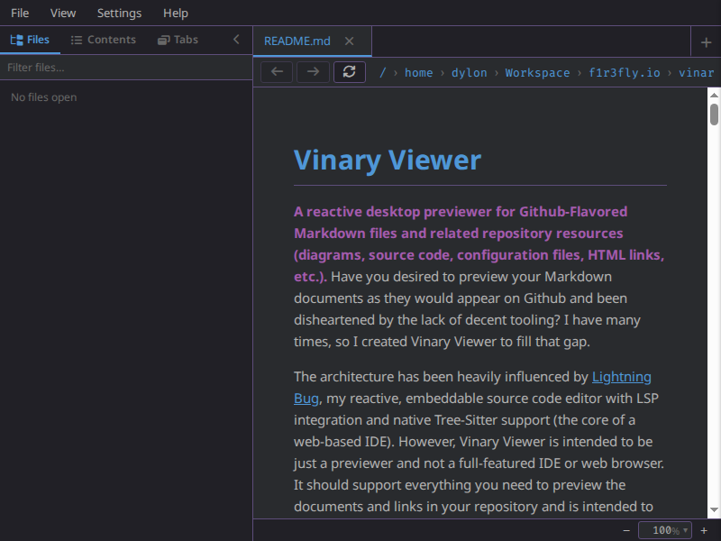
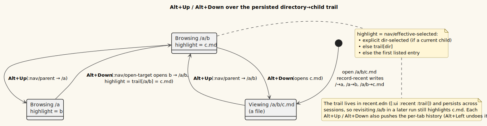

# Breadcrumb and up/down navigation



*The Ctrl-hover breadcrumb URI bar.*

**Status: Available now.**

Three small, related capabilities make folder traversal fast and reversible:

1. a **Ctrl-hover breadcrumb** that turns the URI bar into clickable path segments;
2. **`Alt+Up`** to ascend to the parent folder and **`Alt+Down`** to open the
   highlighted entry; and
3. a **persisted trail memory** so that `Alt+Up` followed by `Alt+Down` returns you
   to the exact file you came from — even after a restart.

All three build on the **unified per-tab history** principle: filesystem navigation
is history. Folders open in-tab (see
[16-directory-browser.md](16-directory-browser.md)), so every move funnels through
the one history mechanism in `vinary.app.nav` and the breadcrumb, Back/Forward, and
`Alt+Up`/`Alt+Down` all act on the active tab.

---

## 1. The breadcrumb URI bar (Ctrl-hover)

> **Definition — breadcrumb.** A horizontal trail of the current path's folders,
> from filesystem **root → leaf**, each one a button you can click to jump there.

By default the URI bar shows the active tab's address as editable text. **Hold
`Ctrl` while the pointer is over the bar** and the address turns into clickable
folder segments:

```text
/  ›  home  ›  me  ›  docs  ›  report.md
▲                          ▲
root                       click any folder to open it in this pane
```

- **Clicking a segment** dispatches `[:tab/navigate path]`, navigating the active
  tab to that folder (which opens the directory browser) or, for the leaf file, to
  the file itself.
- **Hovering a segment** dispatches `[:ui/hover-link path]`, so the full target path
  previews in the status bar before you commit.

The segments come from the pure helper `vinary.app.uri/segments`, which splits a
local path into cumulative `{:name :path}` maps, root → leaf, with the filesystem
root included as `{:name "/" :path "/"}`. It returns `nil` for `http(s)` URLs, so the
breadcrumb only appears for local paths:

```clojure
(uri/segments "/home/me/docs")
;; => [{:name "/" :path "/"} {:name "home" :path "/home"}
;;     {:name "me" :path "/home/me"} {:name "docs" :path "/home/me/docs"}]
```

**Why Ctrl-hover, not always-on.** The breadcrumb only renders when
`(and ctrl-held? hovering? active-local-path)` is true, so the editable address bar
remains the default and the breadcrumb is a momentary overlay you summon on demand.
The `[:ui :ctrl-held?]` flag is maintained by **capture-phase** `keydown`/`keyup`
listeners installed in `vinary.renderer.core`; each event reads its own `ctrlKey`,
so a `keyup` missed while the window was unfocused **self-heals** on the next key
event rather than leaving the breadcrumb stuck on.

---

## 2. `Alt+Up` — go to the parent folder

`Alt+Up` runs the command `:nav/parent`. It navigates the active tab to the
**parent directory** of the current `file://` URI:

- It computes the parent with `vinary.app.uri/dirname` (which ignores a trailing
  slash, so a directory URI yields *its* parent).
- It is a **no-op** for `http(s)` pages and at the filesystem root (`dirname`
  returns `nil`).
- Crucially, it **pre-highlights the child you came from** by setting
  `[:ui :dir-selected]` to the current path. So after ascending, the folder you just
  left is already the highlighted entry in the parent's listing.

```clojure
(rf/reg-event-fx :nav/parent
  [(rf/inject-cofx :content-scroll)]
  (fn [{:keys [db content-scroll]} _]
    (let [cur (nav/active-uri db)]
      (if-let [parent (uri/dirname cur)]
        (let [db' (-> (nav/nav-active db parent content-scroll)
                      (assoc-in [:ui :dir-selected] (uri/file-path cur)))]  ; came-from child
          (nav-result db' parent 0))
        {}))))
```

---

## 3. `Alt+Down` — open the highlighted target

`Alt+Down` runs the command `:nav/open-target`. It opens whatever entry is currently
highlighted in the active directory listing (a file → its preview; a subfolder →
descend into it). It is **inert** unless a directory is showing, so the key is safe
to press anywhere:

```clojure
(rf/reg-event-fx :nav/open-target
  (fn [{:keys [db]} _]
    (let [dir (nav/active-path db)
          doc (when dir (ds/active-doc (ds/snapshot) dir))]
      (if (= "directory" (:doc/kind doc))
        (if-let [sel (nav/effective-selected dir (:doc/entries doc)
                                             (get-in db [:ui :dir-selected])
                                             (get-in db [:ui :recent :trail]))]
          {:fx [[:dispatch [:doc/open sel]]]}
          {})
        {}))))
```

Inside the listing, `Enter` is bound to the same command. Bare arrow keys are not
consumed by the listing — they smoothly scroll the pane; the highlight is set by
clicking and by the persisted trail (§4).

---

## 4. Persisted trail memory — the round-trip

The signature behavior is: **`Alt+Up` then `Alt+Down` returns you to the
most-recently-opened full path.** Two cooperating mechanisms make this hold both
immediately and durably.

> **Definition — the trail.** A map `dir → last-opened-child`, i.e. for every folder
> you have descended *through*, which child you went into. It is the app-db slice
> `[:ui :recent :trail]`, persisted to `recent.edn`.

**1 — The immediate round-trip (`:dir-selected`).** `Alt+Up` records the came-from
child in `[:ui :dir-selected]` (§2). When you then press `Alt+Down`,
`effective-selected` returns that explicit selection first, so you re-open exactly
the file you ascended from.

**2 — The durable round-trip (the trail).** Every *forward* navigation to a local
path records a `dir → child` entry for **every ancestor step** along the path, via
`record-recent`. So opening `/home/me/docs/report.md` writes
`{"/home/me/docs" "/home/me/docs/report.md", "/home/me" "/home/me/docs", …}`. Later,
ascending to `/home/me/docs` from *anywhere* and pressing `Alt+Down` still re-opens
`report.md`, because `effective-selected` falls back to `trail["/home/me/docs"]`
even after the explicit `:dir-selected` is gone (a new session, or after browsing
elsewhere). The highlight-resolution order is exactly:

```text
explicit :dir-selected   →   trail[dir]   →   first sorted entry
   (if a current child)      (if a current child)
```

`record-recent` is invoked from `:content/received` **only for the active tab's
path** — a real forward navigation or revisit — never for a background
live-refresh, so the trail tracks where you actually went. The trail is bounded to
the 200 most recent directories.

---

## 5. `recent.edn` persistence

The trail (and the Open Recent MRU — see
[feature 16](16-directory-browser.md) and File ▸ Open Recent) live in a new config
file, mirroring how `settings.edn` works:

```text
~/.config/vinary-viewer/recent.edn     (honors $XDG_CONFIG_HOME)
```

```clojure
{:trail        {"/home/me/docs" "/home/me/docs/report.md"
                "/home/me"      "/home/me/docs"
                "/"             "/home"}
 :recent-files ["/home/me/docs/report.md" "/home/me/notes.md"]}
```

| Direction | Channel | Preload method | Purpose |
|-----------|---------|----------------|---------|
| renderer → main | `vv:recent-request` | `requestRecent()` | Pull the persisted `recent.edn` on boot. |
| renderer → main | `vv:recent-save` | `saveRecent(edn)` | Write the EDN back (debounced 300 ms). |
| main → renderer | `vv:recent` | `onRecent(cb)` | Deliver the EDN text (initial push + on external edit). |

The new main namespace `vinary.main.recent` reads, writes, and chokidar-watches the
file and crosses the IPC seam as **raw EDN text** (the renderer parses it with
`cljs.reader`, preserving keywords), exactly like `vinary.main.settings`. On the
renderer side: `:recent/received` loads it into `[:ui :recent]`, `:recent/clear`
empties the MRU, and the fx `:vv/save-recent` debounces the write so rapid
navigation does not thrash the disk.

---

## 6. Keymap independence

`Alt+Left` / `Alt+Right` (history back/forward) and the new `Alt+Up` / `Alt+Down`
are bound in the **`:all` block** of all three keymaps —
`resources/keymaps/{default,vim,emacs}.edn` — so they work under every keymap and in
every mode:

| Key | Command | Action |
|-----|---------|--------|
| `Alt+Left` | `:history/back` | Back in the active tab's history. |
| `Alt+Right` | `:history/forward` | Forward in the active tab's history. |
| `Alt+Up` | `:nav/parent` | Go to the parent folder. |
| `Alt+Down` | `:nav/open-target` | Open the highlighted entry. |

In addition, the **Vim** keymap binds the same two folder commands in `:normal` mode:
`K` → `:nav/parent` (up to the parent, like `Alt+Up`) and `J` → `:nav/open-target`
(open the highlighted entry, like `Alt+Down`).

> **Why this matters (a fixed regression).** Previously only `default.edn` bound
> `Alt+Left`/`Alt+Right`, and it bound them in the non-modal default. Vim and Emacs
> users — whose active keymap persists in `keybindings.edn` — silently lost Alt
> history navigation, and Vim's `:normal` mode even **consumed** the keys. Placing
> all four bindings in `:all` (not `:normal`) makes them keymap- and
> mode-independent, so they are never swallowed.

The embedded web view participates too: a `vv:history-nav` message from the web
surface routes into `:history/back` / `:history/forward` through the renderer's
`dispatch-history-nav!`, so Back/Forward behave the same whether you are on a local
document or an in-app web page.

---

## 7. Design notes

- **Pattern:** all navigation is one **Command/Memento** history model
  (`vinary.app.nav` — `step` for Back/Forward, `nav-active` for push), with
  directories as ordinary history entries. See
  [theory/07-command-history-model.md](../theory/07-command-history-model.md).
- **Pure where possible:** `uri/segments`, `uri/dirname`, `nav/effective-selected`,
  and `record-recent` are pure transforms; the side effects (persisting, scrolling)
  are re-frame effects at the edge.
- **Self-healing modifier state:** the capture-phase Ctrl tracking reads each
  event's `ctrlKey`, so the breadcrumb cannot get stuck if a `keyup` is missed.

---

## 8. Diagram



*Diagram source: [`../diagrams/state-dir-trail-memory.puml`](../diagrams/state-dir-trail-memory.puml).*
