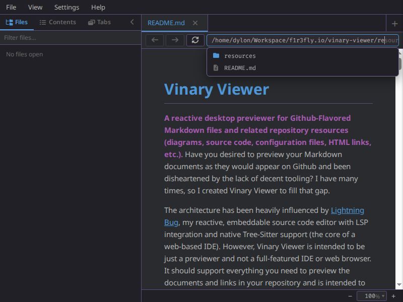

# Address-bar completion

*Fish-style address-bar completion with a match dropdown.*

**Status: Available now.**

---

## 1 · What it is

The URI bar auto-completes as you type, **Fish-shell style**:

- **Local paths** complete from the filesystem: an inline **ghost** shows the most-likely completion, and
  a dropdown of matching children appears **only when the completion is ambiguous** (more than one match).
- **Web URLs** (`http(s)://…`) complete from your **browser history** (visited pages, globe-iconed), with
  the same ghost + dropdown UI.

It is non-intrusive — a no-match `Enter` shows a small inline error, **never a dialog**.

## 2 · How you use it

Focus the address bar (`Ctrl+L`) and start typing a path or URL:

| Key | Action |
|---|---|
| `Tab` | Complete to the matches' common prefix (accept outright if only one remains) |
| `→` / `End` | Accept the inline ghost suggestion |
| `↑` / `↓` | Move through the dropdown; the ghost follows the highlight |
| `Enter` | Open the selected match, the exact path, or the most-likely prefix match |
| `Esc` | Close the dropdown, then revert the edit |

`/` (or `\` on Windows) delimits path segments; entering a directory lists its children.

## 3 · Internals

| Piece | Where |
|---|---|
| Pure helpers (`complete-split`, `matches-prefix?`, `common-prefix`, `web-matches`) | `vinary.app.uri` (unit-tested) |
| Main-process path completion (`vv:complete-path`) | `vinary.main.service` |
| Browser-history MRU (`:web-history` in `recent.edn`) | `vinary.app.events/record-web-history` |
| Address-bar component (ghost overlay, dropdown, keys) | `vinary.ui.views/uri-bar` |
| State + events | `[:ui :uri-complete]` · `:uri-complete/*` |

Runtime coverage: a dedicated probe exercises ghost/dropdown/Tab/→/↑↓/Enter for both filesystem and
history completion.
