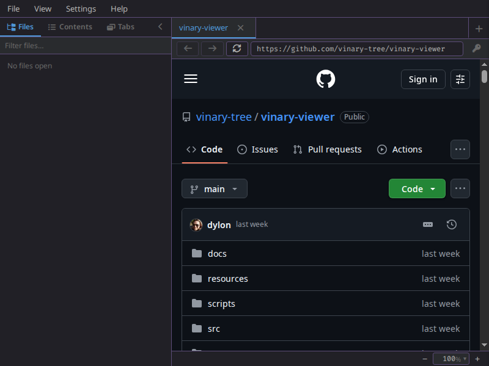
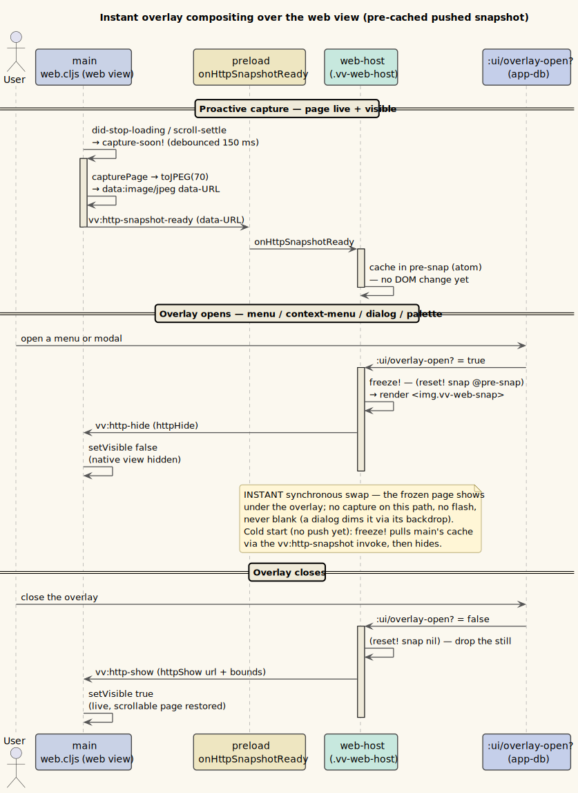

# Web-view keyboard, Copy & cookies

*The in-app web view following an HTTP link.*

**Status: Available now.**

---

## 1 · What it is

When you follow an `http(s)` link, the page opens in Vinary's in-app web view (a main-owned, isolated
`WebContentsView`). It is tuned for **reading parity** with the document previews:

- **Vim/standard scroll keys** — `j`/`k` (line), `Ctrl+d`/`Ctrl+u` (half page), Space / `Shift`+Space
  (page), `g g` / `G` (top/bottom), arrows, Page keys, `Home`/`End`.
- **`f` link hints** — press `f` to label every visible link and jump by typing its label (Vimium-style).
- **History** — `Alt+←` / `Alt+→` (and the toolbar buttons / mouse back-forward) move through history.
- **App shortcuts work here too** — global `Ctrl`/`Cmd` chords (`Ctrl+O`, `Ctrl+Shift+O`, `Ctrl+L`,
  `Ctrl+F`, zoom, …) are forwarded from the web view to the app's keymap, so they do exactly what they do
  over a document. Page editing/clipboard chords (`Ctrl+C` / `V` / `X` / `A` / `Z`) stay with the page.
- **Right-click → Copy** — a native context menu offering **Copy**, **Copy Link Address** (on a link),
  and **Select All**.
- **Text selection** works natively.
- **Persistent cookies** — the web view uses a dedicated persistent session (`persist:vinary-web`), so
  **logins to documentation sites survive restarts** (useful for paywalled/authenticated docs).
- **Edge-to-edge** — the web view fills the content pane with no document reading gutter (unlike the
  Markdown reading gutter), so pages render flush like a real browser.
- **Local HTML opens here** — a local `.html` / `.htm` / `.xhtml` file (a `file://` page) renders as a
  **live page** in this same web view — edge-to-edge, with the [ad-blocker](20-ad-blocking.md) and
  [extensions](21-browser-extensions.md) applied — not as escaped source. Its scripts run in the
  sandboxed web session (see **Security** below).
- **Page zoom** — the bottom **zoom bar** (and `Ctrl` `+` / `-` / `0`) zooms the **web page itself** (the
  native view's `webContents`), context-aware; see [feature 22](22-zoom-and-fit.md).
- **Overlays float over the page — instant & unified** — opening **any** overlay (a menu-bar dropdown, a
  right-click menu, *or* a modal dialog / command palette) no longer blanks the page. Because the native
  view always paints above the DOM, Vinary freezes a **still snapshot** of the page, shows the overlay
  over it, and restores the live, scrollable view on close. The snapshot is **pre-captured and pushed**
  from main (`vv:http-snapshot-ready`, after load + on scroll-settle), so opening an overlay is a
  synchronous DOM swap — **instant**, with no behind-then-front flash and never blank. Dialogs now freeze
  the **dimmed** page too, instead of going blank. The native view's hide is **deferred one paint** (a double
  `requestAnimationFrame`) until the snapshot is on-screen, so even the one-frame blink at the swap is gone —
  the handoff is seamless.

**Security.** A local `.html` runs its own scripts — so it carries the trust posture of *remote* content,
not that of a first-party document. It is loaded in the **same** isolated web session as remote pages
(`persist:vinary-web`, `contextIsolation: true`, `nodeIntegration: false`, no `window.vv`), behind the
ad-blocker, with extensions applied. See [threat model §6.5](../security/threat-model.md).

## 2 · How you use it

Just open a web link. Scroll with the keys above, `f` to hint-click, right-click to Copy, and log in to
sites once — your session persists. Open a local `.html` / `.htm` / `.xhtml` the same way you open any
file (CLI arg, file tree, or a link) — it loads as a live page here. Zoom the page with the bottom zoom
bar or `Ctrl` `+` / `-` / `0` ([feature 22](22-zoom-and-fit.md)). The same web session hosts the optional
[ad-blocker](20-ad-blocking.md) and [extensions](21-browser-extensions.md).

## 3 · Internals

| Piece | Where |
|---|---|
| Scroll keys + `f` hints (self-contained, in the page context) | `resources/web-preload.js` |
| `Alt`-arrow history forwarding | `vinary.main.web` (`before-input-event`) |
| App `Ctrl`/`Cmd` chord forwarding (`vv:web-key` → synthetic `window` keydown → resolver) | `vinary.main.web` (`before-input-event` → `web-app-chord`) → `resources/preload.js` (`onWebKey`) → `vinary.renderer.core` (`replay-web-key!`) |
| Page navigation recorded onto its **owner** tab (not the active tab — a slow page that finishes loading after you switch tabs updates its own tab, never the one you moved to) | `vinary.main.web` (`:owner-tab` via `vv:http-show`, relay `{:url :tab}`) → `:http/navigated` → `vinary.app.nav/nav-tab` |
| Right-click Copy menu (native) | `vinary.main.web` (`context-menu` handler) |
| Persistent session | `vinary.main.web` (`webPreferences {:partition "persist:vinary-web"}`) |
| Edge-to-edge layout (web + local HTML) | `.vv-content-web` (drops the gutter) in `resources/public/css/app.css` |
| Local HTML kind (`.html`/`.htm`/`.xhtml` → live web page) | `vinary.main.file-kind/kind-of` (`"html"`) → `content-view` web branch |
| Web-page zoom (the native view's `webContents`) | `vinary.main.web` (`vv:http-zoom` / `vv:http-zoom-set` → `setZoomFactor`); [feature 22](22-zoom-and-fit.md) |
| Instant overlay freeze (pre-cached pushed raster) | `vinary.ui.views/web-host` (`pre-snap` → `snap` / `.vv-web-snap`) ← `vv:http-snapshot-ready` (`vinary.main.web` proactive `capturePage`→`toJPEG`); cold-start fallback `vv:http-snapshot` |

Because the web view is a separate native context, scroll/hint keys are handled locally in its preload
(no round-trip), and the Copy menu is a native Electron menu (the view paints over the DOM). That same
always-on-top compositing is why a DOM overlay can't simply draw over the page — so `web-host` freezes it
instead: it keeps the **latest pushed raster** (`vv:http-snapshot-ready`, captured proactively by main
after load and on scroll-settle) in an atom, and when `:ui/overlay-open?` turns true for **any** overlay —
menu, context menu, dialog, or palette — it synchronously swaps that image into the DOM (`.vv-web-snap`)
and hides the native view; closing every overlay restores the live view. There is no capture on the open
path, so the swap is instant and a dialog now shows the **dimmed** page rather than blanking it. (If no
push has arrived yet, `freeze!` pulls main's cache once via the `vv:http-snapshot` invoke.)
Verified by a dedicated scroll-parity probe.

*Diagram source: [`../diagrams/seq-instant-overlay-snapshot.puml`](../diagrams/seq-instant-overlay-snapshot.puml).*
