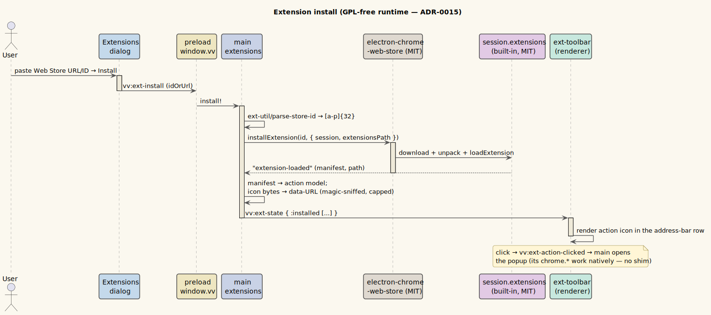

# Browser extensions

**Status: Available now.** *(See [ADR-0015](../design-decisions/0015-scoped-extension-runtime-gpl-free.md).)*

---

## 1 · What it is

You can install a **scoped set of Chrome extensions** — primarily **ad-blocker-class** and lightweight
web extensions — from the Chrome Web Store, install runs on the in-app web view's session. The runtime is
**fully GPL-free** (Apache-2.0 + MIT + MPL): it uses Electron's *built-in* extension support (which on
Electron 42 already provides `chrome.runtime`/`storage`/`action`/`tabs`/`i18n`, MV3 service workers, and
content scripts natively), `electron-chrome-web-store` (MIT) for install + periodic auto-update, and a
small first-party **toolbar + popup** surface (Electron renders none of its own).

Each installed extension's action icon appears in a toolbar at the end of the address bar (for `http(s)`
tabs); clicking it opens the extension's popup just below.

**chrome.* polyfill for popups and extension pages.** Electron 42 ships many extension APIs but
not all — it lacks `chrome.windows`, `webNavigation`, `cookies`, `notifications`, `contextMenus`, and
`privacy`. So one **self-contained** session preload (`resources/ext-chrome-polyfill.js`), registered for
the `frame` type and retained for the limited service-worker probe path, injects inert, correctly-shaped
**stubs** for those into extension pages. That is enough to stop many popup/options pages from crashing
when they read missing APIs. It is **not** enough for real/heavy MV3 password-manager service workers such
as LastPass, whose background worker reads `chrome.windows.onFocusChanged` before Vinary can patch that
worker's execution realm.

## 2 · How you use it

Open **Settings ▸ Extensions**:

- **Enable browser extensions** — the master toggle.
- **Install** — paste a Chrome Web Store URL (or a 32-char extension ID) and click **Install**.
- For each installed extension: an on/off toggle and a **Remove** button.
- **Check for updates** — extensions also auto-update in the background (startup + ~5 h).

Prefs persist in `~/.config/vinary-viewer/extensions.edn`; extensions install under
`<userData>/Extensions/`. Provenance is **Web-Store-only** — in-page "Add to Chrome" is denied; install
goes through this dialog.

## 3 · Honest limitations

Electron is not Chrome. Documented in [ADR-0015](../design-decisions/0015-scoped-extension-runtime-gpl-free.md):

- **Native-messaging password managers** (1Password, KeePassXC, Bitwarden-desktop) — **not supported** by
  Electron extensions. Use the native password-manager bridge instead.
- **Dynamic action badges/icons** are not displayed (Electron has no toolbar to render them; the toolbar
  shows the static manifest icon).
- **LastPass-class MV3 password-manager workers do not work reliably in Electron 42.** The frame preload
  protects extension pages, but real third-party background workers can evaluate in a separate V8 realm
  whose native `chrome` object still lacks `windows`/`cookies`/etc. Patching extension files on disk remains
  rejected because it would modify third-party password-manager code and break integrity/auto-update
  assumptions.
- A few MV3 background surfaces are still absent (`offscreen`, `nativeMessaging`, `sidePanel`); the polyfill
  stubs are **inert** (correct shape, no real behavior) — enough to prevent startup crashes, but they do not
  *implement* those APIs.

## 4 · Internals

| Piece | Where |
|---|---|
| Web-Store install/load/reconcile + manifest→toolbar model + state push | `vinary.main.extensions` |
| chrome.* polyfill preload (one self-contained file, registered for frame and the limited service-worker probe path) | `resources/ext-chrome-polyfill.js` — inlines its polyfill (no relative require) and self-installs via `contextBridge.executeInMainWorld`; registered via `session.registerPreloadScript` in `vinary.main.extensions` |
| Popup `WebContentsView` host (origin-locked, content-sized) | `vinary.main.ext-popup` |
| Pure helpers (id parse, reconcile, action model, popup geometry) | `vinary.main.ext-util` (unit-tested) |
| Persisted prefs | `vinary.main.ext-config` ↔ `extensions.edn` |
| Toolbar (manifest icons as data-URLs) | `vinary.ui.ext-toolbar` |
| Management dialog | `vinary.ui.extensions` |
| Runtime smoke (loadExtension + content-script + popup + a limited background-worker `chrome.windows` probe) | `test/extensions-smoke.js` — run sandbox-on via `npm run test:extensions:sandbox` to exercise the probe path |

Security: extensions execute on the isolated `persist:vinary-web` session and **cannot reach `window.vv`
or Node** — see [the threat model §6.5](../security/threat-model.md).

## 5 · Installing an extension

The install path stays inside the GPL-free runtime described by
[ADR-0015](../design-decisions/0015-scoped-extension-runtime-gpl-free.md): the MIT
`electron-chrome-web-store` fetches the CRX, and Electron's own built-in `session.extensions`
loads it into the isolated web session.

*Diagram source: [`../diagrams/seq-extension-install.puml`](../diagrams/seq-extension-install.puml).*
