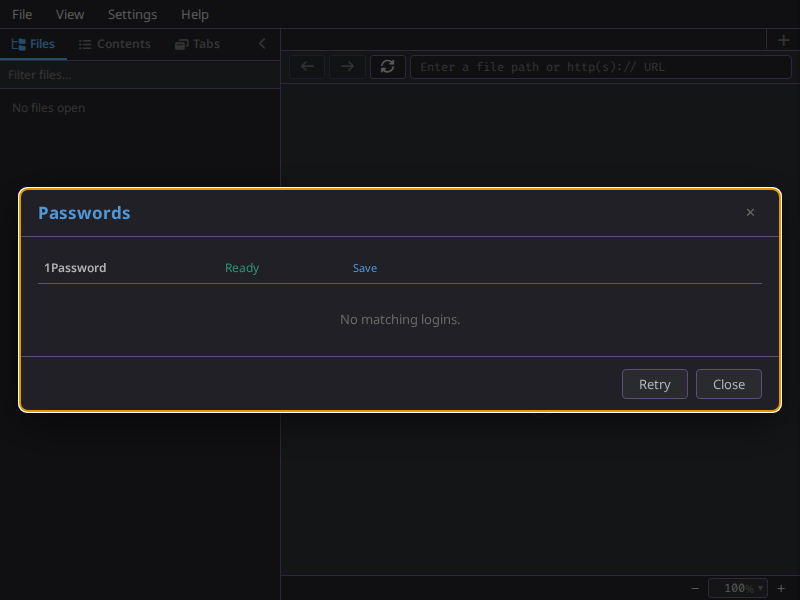
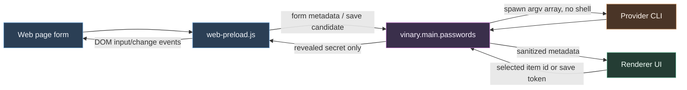

# Native password-manager bridge



*The Passwords dialog listing a provider.*

**Status: Available now.**

---

## 1 - What it is

The native password-manager bridge adds manual **Fill** and **Save** support for the in-app web view
without relying on Chrome password-manager extensions. It uses provider CLIs from the Electron main
process:

| Provider | Executable | Fill | Save | Notes |
|---|---:|---:|---:|---|
| 1Password | `op` | yes | yes | Save uses the CLI's JSON-template stdin path so secrets are not placed in argv. |
| LastPass | `lpass` | yes | yes | Fill searches through LastPass CLI JSON in main memory, then sends only metadata to the renderer. |
| Bitwarden | `bw` | yes when installed | no | If the client is missing or incompatible with local Node.js, Vinary reports it as unavailable. |
| Proton Pass | `pass-cli` | yes when installed | no | If the client is missing or incompatible with local Node.js, Vinary reports it as unavailable. |
| Custom JSON adapter | configured command | yes | yes, with stdin JSON | Commands are executed with argv arrays, never through a shell. |

The bridge is deliberately **external-unlock**: Vinary does not collect or store master passwords. If a
provider requires a password, multi-factor authentication (MFA), a hardware/security key, SSO, or an
extra provider-specific authorization such as LastPass' periodic password check, the provider CLI/app
owns that flow. Vinary pauses the action, surfaces the provider state, and retries after the provider
reports a usable session.

Provider CLI references:

- Bitwarden CLI: <https://bitwarden.com/help/cli/>
- 1Password CLI reference: <https://www.1password.dev/cli/reference>
- LastPass CLI manual: <https://lastpass.github.io/lastpass-cli/lpass.1.html>
- Proton Pass CLI: <https://protonpass.github.io/pass-cli/>

## 2 - How to use it

Open an `http(s)` page in the in-app web view. The key icon appears at the end of the URI bar. Click it
to open the chooser:

1. Vinary refreshes provider status.
2. Vinary searches ready providers for logins matching the current origin.
3. You select a login row.
4. Main reveals the selected item from the provider and sends the username/password directly to the
   isolated web-view preload.

When a page submits a login form, the web-view preload reports a save candidate to main memory. The
renderer sees only a short-lived token, origin, username, and save-capable provider list. Choosing
**Save** asks main to write the item through the selected provider; **Dismiss** deletes the token.

## 3 - Configuration

The optional config file is:

```clojure
~/.config/vinary-viewer/passwords.edn
```

Built-in providers are enabled by default. Override executable names or disable unavailable providers
with EDN:

```clojure
{:enabled? true
 :disabled-provider-ids #{"bitwarden" "proton-pass"}
 :builtins {"onepassword" {:bin "op"}
            "lastpass"    {:bin "lpass"}
            "bitwarden"   {:bin "bw"}
            "proton-pass" {:bin "pass-cli"}}}
```

A restricted custom JSON adapter can provide arbitrary backend integration without arbitrary shell
execution. Each command is an executable plus argv vector. Placeholders are expanded inside argv strings:
`{url}`, `{origin}`, `{host}`, and `{id}`.

```clojure
{:providers
 [{:id "company-vault"
   :label "Company Vault"
   :kind :json-command
   :commands
   {:status {:cmd "/opt/company-pass/bin/vv-pass"
             :args ["status"]}
    :search {:cmd "/opt/company-pass/bin/vv-pass"
             :args ["search" "--origin" "{origin}"]}
    :reveal {:cmd "/opt/company-pass/bin/vv-pass"
             :args ["reveal" "{id}"]}
    :save   {:cmd "/opt/company-pass/bin/vv-pass"
             :args ["save"]
             :stdin-json? true}}}]}
```

Custom command contracts:

```json
[
  {"id":"item-id","title":"Example","username":"me@example.com","url":"https://example.com/login"}
]
```

```json
{"username":"me@example.com","password":"secret","url":"https://example.com/login"}
```

Save receives JSON on stdin:

```json
{"url":"https://example.com/login","username":"me@example.com","password":"secret","title":"Login for example.com"}
```

## 4 - Security flow



The invariant is:

`provider secret -> main process -> web-view preload -> DOM field`

The renderer app-db never stores passwords. Vinary also avoids writing secrets to configuration files,
recent history, logs, screenshots, or generated build output.

## 5 - Internals

| Piece | Where |
|---|---|
| Main orchestration, IPC, save-token memory | `vinary.main.passwords` |
| Provider command adapters | `vinary.main.password-adapters` |
| Pure origin matching and redaction helpers | `vinary.main.password-util` |
| Optional config loading | `vinary.main.password-config` |
| Web form detection/fill/save candidate capture | `resources/web-preload.js` |
| Renderer bridge methods | `resources/preload.js` |
| Re-frame state/effects/events/subscriptions | `vinary.app.db`, `vinary.app.fx`, `vinary.app.events`, `vinary.app.subs` |
| Key icon, chooser, save prompt | `vinary.ui.passwords` |

## 6 - Design notes

The native bridge is separate from Chrome-extension support because Electron 42 does not provide enough
extension API coverage for LastPass-class MV3 background workers. A page/popup polyfill can protect some
extension pages, but it cannot reliably install missing `chrome.*` APIs into a real third-party service
worker's execution realm before that worker evaluates. The native bridge avoids that path entirely and
uses each password manager's supported local automation interface instead.
