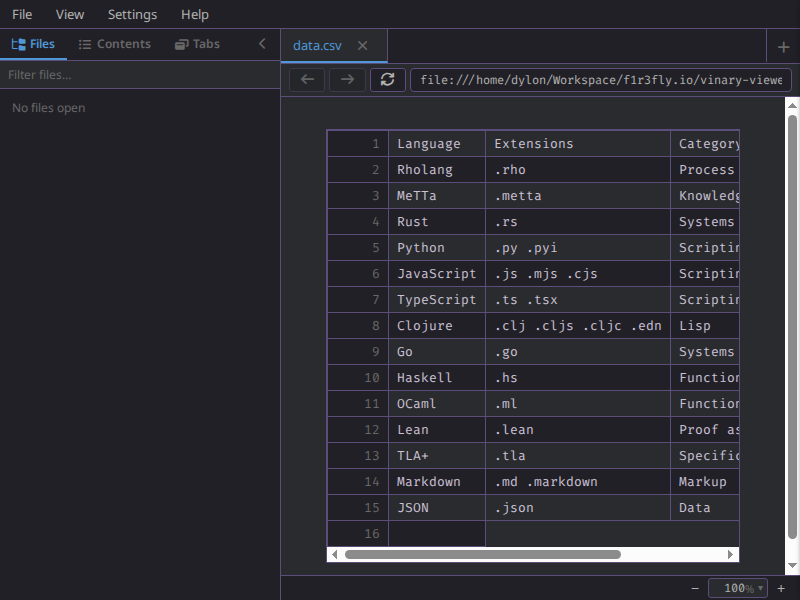
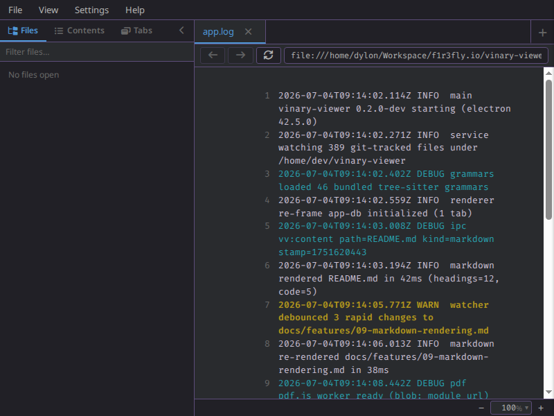
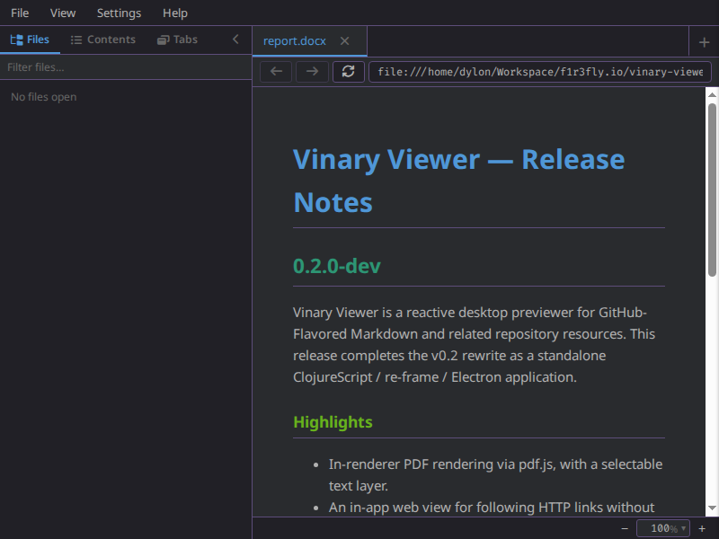
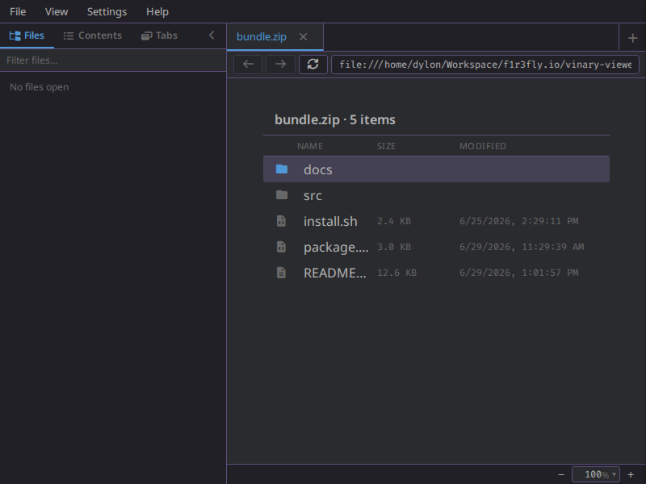

# Content previews — office, tables, logs, and archives

**Status: Available now.**

Beyond Markdown, source, images, and PDFs, vinary-viewer previews four more
families of repository content **in the preview pane**, each with a purpose-built
renderer. Large inputs are read in bounded, paged windows so a huge log or a
million-row CSV never blocks the UI.



*Spreadsheets and delimited text (`.xlsx`, `.csv`, …) render as a table with row numbers.*



*Logs (`.log`, …) render with per-line severity tinting and line numbers.*



*Office documents (`.docx`, `.odt`, …) render as sanitized, themed HTML.*



*Archives (`.zip`, `.tar`, …) are browsed in-pane as a directory listing.*

---

## 1. What it is

Four content **kinds**, classified by extension (and, for extensionless files,
sniffed from a 64 KB prefix) and rendered by a dedicated preview component:

| Kind | Extensions | Renders as | Engine |
|------|------------|------------|--------|
| **office** | `.docx` · `.odt` · `.odp` · `.odf` | themed HTML in the Markdown body | [`mammoth`](https://github.com/mwilliamson/mammoth.js) (docx) · OpenDocument XML ([`fast-xml-parser`](https://github.com/NaturalIntelligence/fast-xml-parser)) |
| **table** | `.xlsx` · `.xlsm` · `.ods` · `.fods` · `.csv` · `.tsv` · `.tab` · `.psv` · `.dsv` | a scrollable `<table>` with row numbers and, for multi-sheet workbooks, sheet tabs | [`papaparse`](https://www.papaparse.com/) (delimited) · SpreadsheetML / OpenDocument |
| **log** | `.log` · `.out` · `.err` · `.trace` (plus `syslog`, `messages`, `auth.log`, `*.log.N`, `*.log.gz`, …) | a `<pre>` with severity-tinted lines and line numbers | tolerant timestamp / severity heuristics |
| **archive** | `.zip` · `.jar` · `.war` · `.ear` · `.epub` · `.tar` · `.tgz` · `.tar.gz` | an in-pane directory listing you can descend into | [`yauzl`](https://github.com/thejoshwolfe/yauzl) (zip) · [`tar-stream`](https://github.com/mafintosh/tar-stream) (tar) |

All four render in the **content pane** — the same pane that shows Markdown,
images, PDFs, and source — so they inherit the app keymap, smooth scroll, themed
context menu, and the per-tab history and live refresh.

## 2. How to use it

Open the file the way you open any document — a command-line argument
(`vv report.docx`), a file-tree click, an `Open` dialog, or a link:

- **Spreadsheets / CSV.** Open a `.xlsx` / `.csv`; a multi-sheet workbook shows a
  **sheet-tab** row; a large delimited file paginates with **Previous / Next**.
- **Logs.** Open a `.log`; each line is tinted by its detected severity
  (`trace` · `debug` · `info` · `warn` · `error` · `fatal`) and numbered; large
  logs paginate.
- **Office documents.** Open a `.docx` / `.odt`; the document is converted to
  sanitized HTML and rendered like Markdown.
- **Archives.** Open a `.zip` / `.tar`; its top level is listed like a directory.
  Open a folder to descend, or a nested archive to go one layer deeper (bounded
  to three layers). Open a leaf entry to preview it.

## 3. How it works internally

```
                 Electron MAIN (Node)                             Electron RENDERER
  ┌───────────────────────────────────────────────┐        ┌──────────────────────────────┐
  file ─▶ file-kind/kind-of ─▶ service.cljs route │        │  :content/received            │
        │   (directory? · archive? · kind)         │        │      │                        │
        │                                           │        │      ▼   content-view by kind │
        ├─ parsed ─▶ content_service.openUri(path) ─┼─ vv:content ─▶ table-view / log-view / │
        │             (mammoth · papaparse · yauzl  │        │        markdown-body (office) │
        │              · tar-stream · fast-xml)     │        │        / dir-view (archive)   │
        └─ paged  ◀─ content_service.contentPage ◀──┼─ vv:content-page ◀─ Previous / Next    │
  └───────────────────────────────────────────────┘        └──────────────────────────────┘
```

- **Classification.** `src/vinary/main/content_service.js` `classifyName` maps the
  extension (and `sniffLog` / `sniffDelimited` for extensionless files) to a kind.
  `src/vinary/main/service.cljs` `send-content!` routes *parsed* kinds through
  `send-parsed-content!` → `content-service/openUri`, which returns the bounded
  preview payload sent as `vv:content`.
- **office.** `officeBufferPayload` runs `mammoth.convertToHtml` for `.docx`
  (with `mammoth.extractRawText` for find/copy text) and an OpenDocument
  `content.xml` → heading/paragraph pass for `.odt`/`.odp`; the HTML is passed
  through `sanitizeHtml` (scripts, event handlers, and `javascript:` URLs are
  stripped) and rendered by `markdown-body`.
- **table.** `delimitedTextPayload` parses with `papaparse` into
  `{:doc/sheets [{:name :rows :truncated}]}`; `.xlsx` is parsed from SpreadsheetML
  (`xl/workbook.xml` + `sharedStrings.xml` + per-sheet XML) and `.ods` from
  `content.xml`. `table-view` (`src/vinary/ui/views.cljs`) renders the sheet
  matrix with a `.vv-table-rownum` per row and a `.vv-sheet-tabs` selector for
  multi-sheet workbooks.
- **log.** `logTextPayload` (small) or a streamed `parseLogPage` (large) yields
  lines; `log-view` tints each line via a `\b(trace|debug|info|warn|error|fatal)\b`
  match into a `.vv-log-<level>` class and numbers it.
- **archive.** `archiveListingPayload` lists immediate entries with `yauzl`
  (zip) / `tar-stream` (tar); `dir-view` renders the listing. Entries carry a
  `vv-archive://open?chain=…` URI so descending into folders and nested archives
  is ordinary in-tab navigation.
- **Bounds (ADR-0010, applied at the edge).** Delimited files over 2 MB and logs
  over 5 MB stream in **pages** (`TABLE_PAGE_ROWS` = 500, `LOG_PAGE_LINES` = 2000)
  fetched on demand through the `vv:content-page` IPC (`content_service.contentPage`)
  and driven by the `.vv-pagebar` **Previous / Next** controls; rows/cols/cells are
  capped (`TABLE_COLS` = 100, 4000 chars/cell) and archives are bounded to 50 000
  entries and three nesting layers. Nothing reads an unbounded blob into the
  renderer.

## 4. Design notes

- **Parse in MAIN, render in the RENDERER.** The heavyweight parsers
  (`mammoth`, `papaparse`, `yauzl`, `tar-stream`, `fast-xml-parser`) are Node
  libraries and run in the main process; the renderer receives only bounded,
  plain-data payloads over the `window.vv` seam — consistent with the hexagonal
  IPC-mediator boundary and the "renderer gets no filesystem" rule.
- **Strategy renderer registry.** Each kind is one more branch of the
  `content-view` `:doc/kind` dispatch (see
  [../theory/05-strategy-renderer-registry.md](../theory/05-strategy-renderer-registry.md)),
  so a new preview kind is additive.
- **Bounded content retention.** Paging + caps implement
  [ADR-0010](../design-decisions/0010-bounded-content-retention-and-render-metadata.md)
  for potentially huge inputs.

## 5. Sources

- Classifier + parsers: [`src/vinary/main/content_service.js`](../../src/vinary/main/content_service.js)
- Routing + directory listing: [`src/vinary/main/service.cljs`](../../src/vinary/main/service.cljs),
  [`src/vinary/main/file_kind.cljs`](../../src/vinary/main/file_kind.cljs)
- Preview components (`table-view`, `log-view`, `dir-view`, `page-controls`):
  [`src/vinary/ui/views.cljs`](../../src/vinary/ui/views.cljs)
