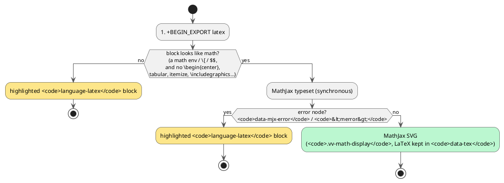

# 26 — Org-mode (.org) documents

vinary-viewer renders Emacs **Org-mode** files the way GitHub renders Markdown — as a formatted document — and,
because Org is a *literate* format, it syntax-highlights the code inside every `#+begin_src <lang>` block.

## What you get

| Capability | Behaviour |
|---|---|
| **Preview** | `.org` opens rendered (headings, lists, tables, links, inline `*bold*` / `/italic/` / `=verbatim=` / `~code~`, images, blockquotes). GFM-like, like the Markdown preview. |
| **Front matter** | `#+TITLE:` renders as the document's leading heading (and joins the Contents outline); `#+AUTHOR:` and `#+DATE:` render beneath it. Matches Emacs' `ox-html`, which also emits a title. |
| **Contents outline** | The sidebar Contents panel lists the Org headings (slugged, with scroll-spy) — click to jump; the outline tracks your scroll position. |
| **Nested code highlighting** | Each `#+begin_src python` / `clojure` / `emacs-lisp` / … block is highlighted in its own language (web-tree-sitter, with a highlight.js fallback). `emacs-lisp` and `el` map to the bundled Elisp grammar. |
| **Math** | `$…$` / `\(…\)` inline and `\begin{align}…\end{align}` display math typeset through the same MathJax engine as Markdown. |
| **Task lists** | `- [ ]` / `- [X]` render as GFM checkboxes in the preview, and as `☐` / `☑` in the terminal. |
| **Export blocks** | `#+BEGIN_EXPORT html` passes through as real markup. Every other backend renders as a highlighted code block — `latex` is first *attempted* as math (see below). |
| **Footnotes** | `[fn:1]` references and definitions render under a `Footnotes` **h2** (not an `h1`, so they cannot outrank a real heading in the outline). |
| **TODO keywords** | `* TODO item` / `* DONE item` keep a `todo` / `done` class and are colourised. (uniorg recognizes only `TODO` and `DONE` — see *Known limitations*.) |
| **Streaming** | `.org` documents at or above 256 KiB render as a bounded, progressive paint on the same engine Markdown uses ([ADR-0018](../design-decisions/0018-document-streaming-pipeline.md)). |
| **View Source** | Toggle to the raw `.org`, syntax-highlighted by a bundled tree-sitter-org grammar (headings, directives, `#+begin_src` block names, tags, comments, timestamps, markup). |
| **Terminal** | `vv --cli x.org` and `vv --tui x.org` render Org through the same frontend, lowered to ANSI. |
| **Live refresh** | Editing the `.org` on disk re-renders it in place (like Markdown), preserving the Contents outline and scroll position. |
| **Figures** | Embedded images are pre-sized like everywhere else ([feature 12](12-diagram-rendering.md) / [ADR-0022](../design-decisions/0022-pre-dom-figure-sizing.md)) — no post-insert re-scale. |

## How it works

Org is an **input frontend** over the [common document IR](../theory/08-common-document-ir.md), not a separate
engine. A `.org` file is parsed to HTML-AST by **uniorg** (`uniorg-parse` → `uniorg-rehype`), *normalized* into
the shapes the shared passes expect, then run through the **exact same** post-parse pipeline as Markdown
(sanitize → slug → highlight → URL-rewrite → image-wrap → source positions → metadata) and the **same**
`hast → IR`. Everything downstream — the heading TOC, figure pre-sizing, scroll-spy, MathJax, nested-language
highlighting, ANSI lowering, and progressive streaming — is inherited unchanged. See
[ADR-0020](../design-decisions/0020-org-mode-via-uniorg.md) and
[ADR-0024](../design-decisions/0024-org-export-blocks-front-matter-and-math.md) for the full design.

```plantuml
@startuml
skinparam defaultTextAlignment center
skinparam ArrowColor #555555
rectangle ".org file" as F #FDE68A
rectangle "uniorg-parse →\nuniorg-rehype\n(Org → HTML-AST)" as U #FDE68A
rectangle "Org normalization\n(front matter · export blocks ·\ntask lists · footnotes · math)" as N #FEF3C7
rectangle "shared app suffix\n(sanitize / slug / highlight /\nsource-positions / metadata)" as S #DCFCE7
rectangle "common IR\n(headings, code-blocks,\ntables, images…)" as IR #E0F2FE
rectangle "preview HTML\n+ Contents outline\n+ MathJax + highlighting" as OUT #BBF7D0
F -> U -> N -> S -> IR -> OUT
@enduml
```

### Why normalization is needed

Org is a **semantic** superset of GFM — its node set contains GFM's — which is why *everything* after parsing is
shared. But a shared pipeline is not a shared *selector*: several post-passes match a specific HTML-AST shape,
and uniorg emits a different one. The normalization step rewrites Org's output into the GFM shape the shared
passes already understand, so Org gains those features without a single Org-specific renderer.

| Feature | GFM shape (what the shared pass matches) | uniorg's shape | Normalization |
|---|---|---|---|
| Inline math | `code.math-inline` | `span.math.math-inline` | rewrite to `code` |
| Display math | `pre > code.math-display` | `div.math.math-display` | rewrite to `pre > code` |
| Task lists | `li.task-list-item > input[type=checkbox]` | `li` (checkbox dropped) | emit the GFM shape |
| Footnotes | `h2` section heading | bare `h1` | emit `h2` |
| TODO keywords | *(none)* | `span.todo-keyword TODO` — the second class is the keyword itself | collapse to `span.todo` / `span.done` |

The TODO keyword's own class is *unbounded* — it is whatever keyword uniorg was configured with — so no allowlist
could enumerate it, and GitHub's schema strips `className` from `span` outright. Collapsing it to a stable
`todo` / `done` state class is what lets a two-entry allowlist cover every keyword.

The math and TODO classes survive sanitization because the single
[sanitize schema](../../src/vinary/ir/backend/sanitize.cljs) extends GitHub's allowlist with those **class names
only** — no new tags, attributes, or protocols. The task-list shape needs no extension at all: GitHub's allowlist
already permits `ul.contains-task-list`, `li.task-list-item`, and `input[type=checkbox][disabled]`.

## `#+BEGIN_EXPORT` blocks

`uniorg-rehype` emits raw markup for `#+BEGIN_EXPORT html` and **drops every other backend** — correct for an
*exporter* targeting HTML, wrong for a *viewer*, which must never silently swallow a document's body. (An Org
invoice whose entire body is a `#+BEGIN_EXPORT latex` block used to render as a completely blank pane.)

So a non-`html` export block renders as a fenced code block in that backend's language. For `latex` specifically
the block is first **attempted as math**:



Two gates, because MathJax fails in two different ways:

1. **It does not throw.** The engine loads the `noerrors` and `noundefined` TeX packages, so bad input renders an
   *error node* rather than raising. `data-mjx-error` (not `try`/`catch`) is therefore the failure signal —
   `\begin{center}` yields `Unknown environment 'center'`.
2. **It can succeed and still be wrong.** LaTeX prose built only from math-legal macros — `\textbf{Hi} \\ World`
   — typesets "successfully" into garbage that no error check can catch. The pre-check screens those out by
   requiring a positive math signal *and* the absence of document-structure macros.

Because the SVG is injected **after** sanitization (`<svg>` is not in the allowlist), this pass runs on the
serialized HTML, keyed off a `vv-tex-attempt` marker class the frontend stamps and the schema preserves. There is
no DOM in `:node-test`, `vv --cli`, or `vv --tui`, so the block simply stays a highlighted code block there —
which is exactly the fallback.

## Nothing renders? The empty-document notice

A frontend can legitimately render *nothing*. Because `""` is **truthy** in ClojureScript, a naive
`(:doc/html doc)` guard would mount an empty body and show a silent blank pane. The preview instead tests
`ir.backend.html/blank?` and shows an explicit *"Nothing to preview"* notice pointing you at View Source. This
guard is format-agnostic — Markdown and office documents get it too.

## Known limitations

Both are upstream (uniorg) gaps, not design choices.

**No source⇄preview jump.** Right-click **"Go to source" / "Go to preview"**
([feature 13](13-source-preview-tree-sitter.md)) is **Markdown-only**: `uniorg-rehype` does not carry source
positions onto its HTML-AST, so Org preview nodes have no per-element line map. Org navigates by **heading**
through the Contents outline instead. If uniorg gains position support the jump lights up for Org with a one-line
change.

**Only `TODO` and `DONE` are recognized as keywords.** `uniorg-parse` matches exactly the keywords it is
*configured* with (its default is `["TODO", "DONE"]`); it never reads a document's `#+TODO:` / `#+SEQ_TODO:` /
`#+TYP_TODO:` sequence. So in a document declaring `#+TODO: TODO NEXT | DONE CANCELLED`, a `* NEXT ship it`
headline renders with the literal title *"NEXT ship it"* rather than a `NEXT` keyword. Supplying the sequence
through uniorg's `todoKeywords` option would work, but the option's values are interpolated straight into
`new RegExp('^' + keywords.join('|'))` with no word boundary, so a custom keyword would also match a headline that
merely *starts with* it (`* NEXTGEN plan`). Fixing that belongs upstream.
